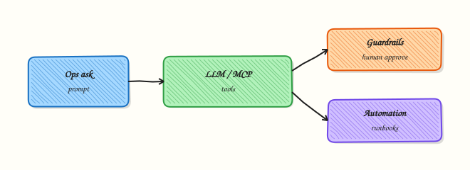

# AI for DevOps — OpenAI, MCP, and LangChain

## Overview

Large Language Models (LLMs) can help DevOps work — summarise logs, draft runbook steps, or suggest next checks — but they must not silently change production. **AI for DevOps** means using models as **assistants** with clear guardrails: human approval before mutating actions, secrets kept out of prompts, and an **offline-first** design so learning never depends on a paid Application Programming Interface (API).

In this tutorial you will build a small runbook helper that uses a **mock LLM client** by default. If `OPENAI_API_KEY` is set in the environment, the same interface can call a real OpenAI-compatible chat API. The lab never requires a paid key. You will also see a **prompt template** that injects incident text without embedding credentials, and a short note on Model Context Protocol (MCP) clients and LangChain-style tool calling.

On real platforms, teams wire assistants into chat or ticketing. The dangerous pattern is giving the model long-lived cloud keys and letting it run `kubectl delete` or Terraform apply without a human gate. Good design: the model proposes; your code and your people dispose.

This is **Tutorial 26** in **Module 26: AI for DevOps** of the REBASH Academy **Python for Cloud & DevOps Engineers** series. It is written for DevOps, platform, and SRE engineers. By the end you will have an offline-first assistant under `~/rebash-python/lab26`.

## Prerequisites

- [Security for DevOps Python](security-for-devops-python.md)
- [REST APIs — requests, Auth, and Resilience](rest-apis-requests-auth-and-resilience.md) (helpful)
- Python 3.10+
- Optional: `OPENAI_API_KEY` in the environment (lab works without it)
- Do **not** paste production secrets into prompts

## Learning Objectives

By the end of this tutorial, you will be able to:

- [ ] Explain why DevOps AI tools must be offline-first and human-approved for mutations
- [ ] Implement a mock LLM client that returns runbook suggestions
- [ ] Use a prompt template that includes incident text but never hard-coded secrets
- [ ] Optionally call a real chat API only when `OPENAI_API_KEY` is set
- [ ] Describe MCP clients and LangChain-style tool calling at a high level

## Architecture

The CLI builds a prompt from a template and incident input, then calls an LLM client interface. The default client is a local mock. An optional OpenAI client activates only when a key exists. Tool ideas (MCP / LangChain) stay behind a human approval boundary.



## Theory

### What it is

An **LLM client** sends a prompt (system + user messages) and receives text. A **prompt template** is a fixed string with placeholders for safe fields (service name, error snippet) — not for API keys. **MCP (Model Context Protocol)** is a way for assistants to discover and call tools through a controlled client. **LangChain** (and similar frameworks) help chain prompts, tools, and memory; the important idea for ops is **tool calling with policy**, not the brand name.

```python
TEMPLATE = """You are a DevOps assistant. Suggest read-only checks only.
Service: {service}
Symptom: {symptom}
"""
prompt = TEMPLATE.format(service="payments-api", symptom="high latency")
```

### Why it matters

Engineers drown in logs during incidents. An assistant that drafts “check disk, check recent deploy, check dependency latency” saves minutes. An assistant that auto-runs destructive tools can delete the wrong namespace. Offline-first design lets students, air-gapped networks, and CI unit tests run without buying tokens. Security review will ask: where does the key live, what is logged, and who approves side effects?

### How it works

1. **Interface** — one function `complete(prompt: str) -> str` used by the CLI.  
2. **Mock client** — pattern-match on keywords and return canned runbook steps (no network).  
3. **Optional real client** — if `os.environ.get("OPENAI_API_KEY")`, call the HTTP API with timeout; else never try.  
4. **Guardrails** — system text forbids secrets and mutating actions; print `APPROVAL_REQUIRED` for any tool idea.  
5. **MCP / LangChain sketch** — tools are declared; the host decides whether to execute after human approval.

```python
import os

def select_client():
    if os.environ.get("OPENAI_API_KEY"):
        return OpenAIClient()  # optional path
    return MockLLMClient()
```

You do not need LangChain installed for this lab. Understand the flow: prompt → model → optional tool request → **human/policy gate** → result.

### Key concepts and comparisons

| Mode | When to use | Cost / dependency |
|------|-------------|-------------------|
| Mock LLM | Labs, CI, demos, air-gap | Free, deterministic |
| Real API | Optional enrichment when key present | Paid / networked |
| MCP tools | Controlled tool discovery | Host must enforce policy |
| LangChain-style chain | Multi-step retrieve → reason → act | Extra dependency; still need gates |

| Guardrail | Meaning |
|-----------|---------|
| No secrets in prompts | Keys stay in env/vault; never interpolated into templates |
| Read-only suggestions default | Mutating tools require explicit approval |
| Timeouts | HTTP calls must not hang CI |
| Logging redaction | Do not log full prompts if they may contain customer data |

### Common pitfalls

- Requiring an API key to import the module or run tests.  
- Putting `OPENAI_API_KEY` into the prompt “so the model can call tools”.  
- Auto-executing shell commands suggested by the model.  
- Logging entire prompts that contain personal or customer data.  
- Treating model output as ground truth without checking production state.

## Hands-on Lab

### Objective

Build an offline-first runbook assistant under `~/rebash-python/lab26` with a mock LLM, a safe prompt template, and an optional real client gated on `OPENAI_API_KEY`. Prove both paths with evidence.

### Prerequisites

- Python 3.10+ (stdlib + optional `urllib` for real API)
- No paid account required
- Unset `OPENAI_API_KEY` for the default path (or leave it unset)

### Lab environment

Workspace: `~/rebash-python/lab26`

```bash
mkdir -p ~/rebash-python/lab26 && cd ~/rebash-python/lab26
set -euo pipefail
python3 --version | tee python-version.txt
# Record whether a key is present without printing the secret
if [ -n "${OPENAI_API_KEY:-}" ]; then
  echo "OPENAI_API_KEY=present" | tee key-status.txt
else
  echo "OPENAI_API_KEY=absent" | tee key-status.txt
fi
```

**Expected output:** `key-status.txt` says `present` or `absent` — never prints the key value.

### Real-world scenario

Your SRE team wants a CLI that turns a short incident blurb into suggested runbook checks. Legal and security require that training and CI work without calling a vendor. Production may optionally use OpenAI when a vault-injected key exists. Mutating actions must print `APPROVAL_REQUIRED` and stop.

### Step-by-step tasks

#### Task 1 – Mock LLM client and prompt template

```bash
cd ~/rebash-python/lab26
set -euo pipefail

cat > ai_runbook.py << 'EOF'
"""Offline-first AI runbook helper for DevOps (mock LLM + optional OpenAI)."""
from __future__ import annotations

import argparse
import json
import os
import sys
import urllib.error
import urllib.request
from dataclasses import dataclass

PROMPT_TEMPLATE = """You are a DevOps assistant for REBASH Academy labs.
Rules:
- Suggest read-only diagnostic checks only.
- Never ask for or repeat API keys, passwords, or tokens.
- If a mutating action is needed, say APPROVAL_REQUIRED.

Service: {service}
Environment: {environment}
Symptom: {symptom}
Recent change: {recent_change}
"""


@dataclass
class LLMResult:
    provider: str
    text: str


class MockLLMClient:
    """Deterministic offline client — no network."""

    def complete(self, prompt: str) -> LLMResult:
        lower = prompt.lower()
        steps = [
            "1. Check recent deploys and config changes for the service.",
            "2. Inspect golden signals: latency, errors, saturation, traffic.",
            "3. Verify dependency health (DB, cache, upstream API) with read-only probes.",
        ]
        if "latency" in lower or "slow" in lower:
            steps.append("4. Compare p95 latency to the previous deploy baseline.")
        if "oom" in lower or "memory" in lower:
            steps.append("4. Check container/memory limits and recent RSS growth.")
        if "disk" in lower:
            steps.append("4. Run df/inode checks on the affected nodes (read-only).")
        steps.append("Mutating remediation: APPROVAL_REQUIRED before restart or scale.")
        return LLMResult(provider="mock", text="\n".join(steps))


class OpenAIClient:
    """Optional real client — used only when OPENAI_API_KEY is set."""

    def __init__(self, api_key: str, model: str = "gpt-4o-mini") -> None:
        self.api_key = api_key
        self.model = model
        self.url = "https://api.openai.com/v1/chat/completions"

    def complete(self, prompt: str) -> LLMResult:
        body = {
            "model": self.model,
            "messages": [
                {"role": "system", "content": "You are a careful DevOps assistant."},
                {"role": "user", "content": prompt},
            ],
            "temperature": 0.2,
        }
        data = json.dumps(body).encode("utf-8")
        req = urllib.request.Request(
            self.url,
            data=data,
            headers={
                "Authorization": f"Bearer {self.api_key}",
                "Content-Type": "application/json",
            },
            method="POST",
        )
        try:
            with urllib.request.urlopen(req, timeout=30) as resp:
                payload = json.loads(resp.read().decode("utf-8"))
            text = payload["choices"][0]["message"]["content"].strip()
            return LLMResult(provider="openai", text=text)
        except (urllib.error.URLError, urllib.error.HTTPError, KeyError, IndexError, TimeoutError) as exc:
            # Fall back to mock so labs never hard-fail on network/billing
            mock = MockLLMClient().complete(prompt)
            mock.text = (
                f"[openai_error={type(exc).__name__}; fell back to mock]\n" + mock.text
            )
            return LLMResult(provider="openai_fallback_mock", text=mock.text)


def build_prompt(service: str, environment: str, symptom: str, recent_change: str) -> str:
    return PROMPT_TEMPLATE.format(
        service=service,
        environment=environment,
        symptom=symptom,
        recent_change=recent_change,
    )


def select_client() -> MockLLMClient | OpenAIClient:
    key = os.environ.get("OPENAI_API_KEY", "").strip()
    if key:
        return OpenAIClient(api_key=key)
    return MockLLMClient()


def main(argv: list[str] | None = None) -> int:
    parser = argparse.ArgumentParser(description="REBASH lab26 AI runbook helper")
    parser.add_argument("--service", required=True)
    parser.add_argument("--environment", default="lab")
    parser.add_argument("--symptom", required=True)
    parser.add_argument("--recent-change", default="none")
    parser.add_argument("--force-mock", action="store_true", help="Ignore OPENAI_API_KEY")
    args = parser.parse_args(argv)

    prompt = build_prompt(
        args.service, args.environment, args.symptom, args.recent_change
    )
    # Guard: refuse if someone pasted a key-looking string into symptom
    if "OPENAI_API_KEY=" in prompt or "AKIA" in prompt:
        print("RESULT=fail error=secret_like_input_blocked", file=sys.stderr)
        return 2

    client: MockLLMClient | OpenAIClient
    if args.force_mock:
        client = MockLLMClient()
    else:
        client = select_client()

    result = client.complete(prompt)
    print(f"provider={result.provider}")
    print("--- suggestion ---")
    print(result.text)
    print("--- end ---")
    if "APPROVAL_REQUIRED" in result.text:
        print("gate=human_approval_required_for_mutations")
    print("RESULT=ok")
    return 0


if __name__ == "__main__":
    raise SystemExit(main())
EOF

python3 -m py_compile ai_runbook.py
```

**Expected output:** `py_compile` succeeds.

#### Task 2 – Offline run (force mock) and secret-like input block

```bash
cd ~/rebash-python/lab26
set -euo pipefail

python3 ai_runbook.py --force-mock \
  --service payments-api \
  --symptom "high latency after deploy" \
  --recent-change "version 1.8.2" \
  | tee run-mock.stdout

grep -F 'provider=mock' run-mock.stdout
grep -F 'APPROVAL_REQUIRED' run-mock.stdout
grep -F 'RESULT=ok' run-mock.stdout
grep -F 'OPENAI_API_KEY' ai_runbook.py | head -n 5
# Prompt template must not embed a literal secret value
! grep -E 'sk-[A-Za-z0-9]{10,}' ai_runbook.py

set +e
python3 ai_runbook.py --force-mock \
  --service payments-api \
  --symptom "OPENAI_API_KEY=sk-should-block" \
  >run-blocked.stdout 2>run-blocked.stderr
rc=$?
set -e
test "$rc" -eq 2
grep -F 'secret_like_input_blocked' run-blocked.stderr
```

**Expected output:** mock run prints suggestions and `RESULT=ok`; secret-like symptom exits 2.

#### Task 3 – Optional real API path and evidence pack

```bash
cd ~/rebash-python/lab26
set -euo pipefail

# Optional path: only attempts OpenAI when key is present (still safe if call fails)
python3 ai_runbook.py \
  --service payments-api \
  --symptom "high latency after deploy" \
  --recent-change "version 1.8.2" \
  | tee run-auto.stdout

grep -E 'provider=(mock|openai|openai_fallback_mock)' run-auto.stdout
grep -F 'RESULT=ok' run-auto.stdout

# Save a redacted prompt sample (no secrets)
python3 - << 'EOF' | tee prompt-sample.txt
from ai_runbook import build_prompt
print(build_prompt("payments-api", "lab", "high latency", "version 1.8.2"))
EOF
grep -F 'Never ask for or repeat API keys' prompt-sample.txt
! grep -E 'sk-[A-Za-z0-9]{10,}' prompt-sample.txt

tar -czf lab26-evidence.tgz \
  python-version.txt key-status.txt ai_runbook.py \
  run-mock.stdout run-blocked.stderr run-auto.stdout prompt-sample.txt
ls -l lab26-evidence.tgz | tee evidence-ls.txt
```

**Expected output:** auto path still ends with `RESULT=ok`; prompt sample has guardrail text and no `sk-` secret; evidence archive exists.

### Validation steps

- [ ] `ai_runbook.py` compiles
- [ ] `--force-mock` run shows `provider=mock` and `APPROVAL_REQUIRED`
- [ ] Secret-like symptom is blocked with exit code 2
- [ ] Auto client path prints a known `provider=` value and `RESULT=ok`
- [ ] `lab26-evidence.tgz` exists under `~/rebash-python/lab26`

### Common errors and fixes

| Error | Cause | Fix |
|-------|-------|-----|
| Accidental paid call in CI | Key injected in CI secrets | Use `--force-mock` in CI unit jobs |
| `openai` HTTP error | Network/billing/model | Lab falls back to mock; check `provider=openai_fallback_mock` |
| Key printed in logs | Echoed env | Never `echo "$OPENAI_API_KEY"`; use present/absent only |
| Model suggests `kubectl delete` | Weak system rules | Keep APPROVAL_REQUIRED gate; do not auto-run tools |
| Import fails without key | Bad design | `select_client()` must default to mock |

### Challenge exercise

Add a `--tools-demo` flag that prints a fake MCP/LangChain-style tool request JSON (for example `{"tool": "kubectl_get", "args": {"resource": "pods"}}`) and then prints `APPROVAL_REQUIRED` without executing anything. Save `tools-demo.stdout` showing both the JSON and the gate line.

### Learning outcomes

- Offline-first mock LLM for runbook suggestions  
- Prompt template without secrets  
- Optional OpenAI path gated on env  
- Human approval boundary for mutating ideas  

### Cleanup

```bash
cd ~/rebash-python/lab26
set -euo pipefail
rm -rf __pycache__
# Do not write API keys into files; if you exported a key in this shell, unset it when done:
# unset OPENAI_API_KEY
```

## Validation

- [ ] Lab finished under `~/rebash-python/lab26/` with evidence archive
- [ ] You can explain mock vs optional real client without requiring payment
- [ ] You can describe MCP/LangChain tool calling plus a human gate
- [ ] You know why secrets must not appear in prompts or prompt templates

## Code Walkthrough

AI-assisted ops tools usually follow this order:

1. **Default offline** — tests and training never require a vendor  
2. **Template prompts** — only safe fields; block secret-like input  
3. **One client interface** — swap mock/real behind the same method  
4. **Timeouts and fallback** — network failure must not strand the operator  
5. **Approve before act** — model output is advice until a human or policy allows a tool  

## Security Considerations

- Store `OPENAI_API_KEY` in a vault or CI secret store — never in Git  
- Redact prompts in logs when they may contain customer data  
- Do not grant the model direct cloud credentials for mutating APIs  
- Prefer read-only tools first; separate roles for break-glass actions (emergency admin)  
- Review prompt injection risk when incident text comes from untrusted tickets  

## Common Mistakes

!!! warning "Making the paid API mandatory"
    Students and CI then cannot run the suite. **Fix:** mock by default; real client only when a key exists.

!!! warning "Interpolating secrets into the prompt"
    Keys appear in vendor logs and your debug output. **Fix:** tools that need auth use env/IAM outside the prompt.

!!! warning "Auto-running shell from model output"
    Prompt injection becomes remote command execution. **Fix:** parse tool requests; require explicit approval.

!!! warning "Trusting the model as the source of truth"
    Hallucinated kubectl flags cause outages. **Fix:** verify against live state and runbooks.

## Best Practices

- Keep a deterministic mock for CI snapshots  
- Version prompt templates like code; review changes in pull requests  
- Separate “suggest” and “execute” permissions  
- Document data retention for any vendor API you enable  
- Measure usefulness (time saved) before expanding tool rights  

## Troubleshooting

| Symptom | Likely cause | Fix |
|---------|--------------|-----|
| Always `provider=mock` with key set | Typo in env name / empty value | Check `key-status.txt` logic; export correct name |
| Hang on real call | No timeout | Keep `urlopen(..., timeout=30)` |
| Fallback every time | Firewall or invalid key | Expected in locked-down labs; use mock |
| Secret blocked unexpectedly | Symptom contained `AKIA` | Rephrase symptom; keep blocker |
| Empty suggestions | Mock bug | Ensure `complete()` returns steps |

## Summary

AI for DevOps works best as an **offline-first assistant**: mock clients for labs and CI, optional real APIs when keys exist, prompt templates without secrets, and **human approval** before any mutating tool. Next, close the track with [Troubleshooting Python Automation](troubleshooting-python-automation.md).

## Interview Questions

**1. Why should an AI ops CLI work without `OPENAI_API_KEY`?**

??? success "Reveal answer"
    Training, Continuous Integration (CI), and air-gapped networks cannot depend on a paid vendor. Offline mocks keep tests deterministic and free. Production can still enable a real client when a vault injects a key. Interviewers look for this split: **capability optional, core path local**.

**2. What belongs in a prompt template, and what must never be interpolated?**

??? success "Reveal answer"
    Safe fields: service name, environment label, redacted symptom text, change ID. Never interpolate API keys, passwords, session cookies, or private keys. Authentication for tools belongs in the **runtime environment**, not in the prompt text.

**3. How do MCP clients and LangChain-style tool calling fit into a safe design?**

??? success "Reveal answer"
    They help the model **request** tools (list pods, fetch a dashboard URL). The **host application** must decide whether to run the tool, under which credentials, and whether a human must approve. The protocol or framework does not remove the need for policy.

**4. A model suggests `kubectl delete namespace prod`. What should your tool do?**

??? success "Reveal answer"
    Print the suggestion, mark **`APPROVAL_REQUIRED`**, and **not execute**. Prefer deny-by-default for destructive verbs. Require a second person or a change ticket for production mutations. Log who approved.

**5. How do you prevent prompt injection from a malicious ticket description?**

??? success "Reveal answer"
    Treat ticket text as **untrusted data**: constrain templates, strip obvious secret patterns, do not let the model freely choose shell commands, and keep a human/policy gate before tools run. Avoid putting raw untrusted text into system instructions.

**6. What do you log when calling a real LLM API during an incident?**

??? success "Reveal answer"
    Log provider, model name, latency, and maybe a hash or truncated prompt ID — not full prompts if they may contain personal or customer data, and never the API key. Redact aggressively; follow your organisation’s data policy.

**7. When is a mock LLM better than a real model even in production paths?**

??? success "Reveal answer"
    Unit tests, contract tests, demos, disaster-recovery drills without vendor dependency, and fallbacks when the vendor is down. Some teams also use mocks for “golden” suggestion fixtures reviewed by humans.

## Related Tutorials

- [Python for Cloud & DevOps – Overview](index.md)
- [Security for DevOps Python](security-for-devops-python.md) *(previous)*
- [Troubleshooting Python Automation](troubleshooting-python-automation.md) *(next)*
- [CLI Applications — argparse, Click, and Typer](cli-applications-argparse-click-typer.md)
- [Production Engineering Patterns](production-engineering-patterns.md)

## References

- [OpenAI API reference](https://platform.openai.com/docs/api-reference) — optional real client  
- [Model Context Protocol](https://modelcontextprotocol.io/) — MCP overview  
- [LangChain documentation](https://python.langchain.com/) — tool/chain concepts  
- [urllib.request](https://docs.python.org/3/library/urllib.request.html) — Python stdlib HTTP  
- Track index: [Python for Cloud & DevOps Engineers](index.md)
