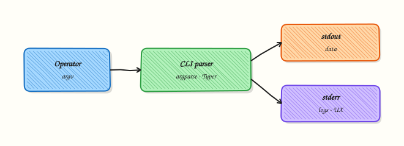

# CLI Applications — argparse, Click, and Typer

## Overview

DevOps tools are Command-Line Interfaces (CLIs) first. A good ops CLI has clear **`--help`**, **subcommands** for different jobs, honest **exit codes** for Continuous Integration (CI), and a habit of sending human messages to stderr while keeping stdout free for data.

**argparse** is in the Python standard library and is enough for many wrappers. **Click** and **Typer** reduce boilerplate for larger command trees and type-driven help. Rich can add tables and progress bars when you need them — keep it optional so thin environments still work.

This is **Tutorial 12** in **Module 12: CLI Applications** of the REBASH Academy **Python for Cloud & DevOps Engineers** series. It is written for DevOps, Cloud, Platform, and Site Reliability Engineering (SRE) engineers. By the end, you will ship a small inventory CLI with `check` and `list` under `~/rebash-python/lab12`.

## Prerequisites

- [Configuration Management and Secrets](configuration-management-and-secrets.md)
- Python 3.12+ with a project virtual environment (venv)

## Learning Objectives

By the end of this tutorial, you will be able to:

- [ ] Build a CLI with argparse (flags and subcommands)
- [ ] Contrast argparse vs Click vs Typer for ops tools
- [ ] Implement `--help`, `check`, and `list` behaviours
- [ ] Return meaningful exit codes from `main`
- [ ] Keep stdout/stderr roles clear for CI pipelines

## Architecture

The user invokes a command. The CLI parser selects a subcommand. Business logic runs. Exit codes and streams tell CI and operators what happened.



## Theory

### What it is

A **CLI** parses `sys.argv`, runs a function, and exits with a status code.

**argparse** example shape:

```python
import argparse

parser = argparse.ArgumentParser(prog="inv")
sub = parser.add_subparsers(dest="command", required=True)
sub.add_parser("list", help="list hosts")
p_check = sub.add_parser("check", help="check inventory file")
p_check.add_argument("--path", required=True)
args = parser.parse_args()
```

**Click** uses decorators for commands and options. **Typer** builds on type hints and feels natural with modern Python. All three should expose `--help` and support subcommands.

**Exit codes:** `0` success; non-zero for usage errors, missing files, or failed checks. Document them.

**Streams:** stdout for machine-readable output; stderr for logs and errors. Add `--dry-run` when a command would change systems.

### Why it matters

CI calls your tool non-interactively. If `--help` is broken, onboarding fails. If every failure exits `0`, pipelines stay green. If logs go to stdout, `tool | jq` breaks.

### How it works

1. **Define the parser** — program name, description, subcommands.  
2. **Parse args** — fail with usage on bad input (usually exit `2` for argparse).  
3. **Dispatch** — call `list_cmd` / `check_cmd`.  
4. **Return int** from `main` and `raise SystemExit(main())`.  
5. **Grow** — move to Click/Typer when the command tree hurts in argparse.  

| Library | Pros | Cons |
|---------|------|------|
| argparse | Stdlib, no deps | Verbose for large trees |
| Click | Mature, many plugins | Extra dependency |
| Typer | Type hints, fast to write | Extra dependency; teach the team |

### Key concepts and comparisons

| Feature | Why operators care |
|---------|--------------------|
| `--help` | Discover flags without reading source |
| Subcommands | `check` vs `list` vs `apply` |
| Exit codes | CI pass/fail |
| `--dry-run` | Safe preview of changes |
| Rich (optional) | Readable tables; keep optional |

### Common pitfalls

- Forgetting `required=True` on subparsers (Python 3.7+ supports it).
- Printing errors to stdout.
- Catching all exceptions and exiting 0.
- Building Click/Typer apps that cannot run without Rich in minimal images.
- Hiding the real failure behind a generic “error” with no path or host name.

## Hands-on Lab

### Objective

Build an inventory CLI (`invcli.py`) with argparse: `--help`, subcommands `list` and `check`, and distinct exit codes. Prove help text and both subcommands. Workspace: `~/rebash-python/lab12`.

### Prerequisites

- Python 3.12+ (argparse is standard library)
- Write access under your home directory

### Lab environment

Workspace: `~/rebash-python/lab12`

```bash
mkdir -p ~/rebash-python/lab12 && cd ~/rebash-python/lab12
set -euo pipefail
python3 -m venv .venv
source .venv/bin/activate
python -c "import argparse; print('ok')"
```

**Expected output:** `ok`

### Real-world scenario

Your team wants a tiny inventory helper for CI: `list` prints host names from a CSV, and `check` validates that the file exists and has at least one data row. The pipeline must fail with a non-zero exit when the file is missing or empty.

### Step-by-step tasks

#### Task 1 – Sample inventory and CLI skeleton

```bash
cd ~/rebash-python/lab12
set -euo pipefail
source .venv/bin/activate

mkdir -p data
```

Create `data/hosts.csv`:

```text
name,env,ip
web-01,prod,10.0.1.11
web-02,prod,10.0.1.12
db-01,prod,10.0.2.11
```

Create `invcli.py`:

```python
from __future__ import annotations

import argparse
import csv
import sys
from pathlib import Path


def cmd_list(path: Path) -> int:
    if not path.is_file():
        print(f"missing inventory: {path}", file=sys.stderr)
        return 2
    with path.open(encoding="utf-8", newline="") as fh:
        rows = list(csv.DictReader(fh))
    for row in rows:
        print(row["name"])
    return 0


def cmd_check(path: Path) -> int:
    if not path.is_file():
        print(f"missing inventory: {path}", file=sys.stderr)
        return 2
    with path.open(encoding="utf-8", newline="") as fh:
        rows = list(csv.DictReader(fh))
    if not rows:
        print(f"empty inventory: {path}", file=sys.stderr)
        return 3
    required = {"name", "env", "ip"}
    missing = required - set(rows[0].keys())
    if missing:
        print(f"missing columns: {sorted(missing)}", file=sys.stderr)
        return 3
    print(f"ok hosts={len(rows)}", file=sys.stderr)
    return 0


def build_parser() -> argparse.ArgumentParser:
    parser = argparse.ArgumentParser(
        prog="invcli",
        description="Small inventory CLI for REBASH lab12",
    )
    sub = parser.add_subparsers(dest="command", required=True)

    p_list = sub.add_parser("list", help="list host names")
    p_list.add_argument(
        "--path",
        type=Path,
        default=Path("data/hosts.csv"),
        help="path to inventory CSV",
    )

    p_check = sub.add_parser("check", help="validate inventory CSV")
    p_check.add_argument(
        "--path",
        type=Path,
        default=Path("data/hosts.csv"),
        help="path to inventory CSV",
    )
    return parser


def main(argv: list[str] | None = None) -> int:
    parser = build_parser()
    args = parser.parse_args(argv)
    path: Path = args.path
    if args.command == "list":
        return cmd_list(path)
    if args.command == "check":
        return cmd_check(path)
    print("unknown command", file=sys.stderr)
    return 1


if __name__ == "__main__":
    raise SystemExit(main())
```

Run:

```bash
test -f data/hosts.csv
test -f invcli.py
```

**Expected output:** `data/hosts.csv` and `invcli.py` exist.

#### Task 2 – Prove --help and happy-path subcommands

```bash
cd ~/rebash-python/lab12
set -euo pipefail
source .venv/bin/activate

python invcli.py --help | tee help-main.txt
grep -E 'list|check' help-main.txt

python invcli.py list --help | tee help-list.txt
grep -F '--path' help-list.txt

python invcli.py check --help | tee help-check.txt
grep -F '--path' help-check.txt

python invcli.py list --path data/hosts.csv | tee list-out.txt
test "$(wc -l < list-out.txt | tr -d ' ')" -eq 3

python invcli.py check --path data/hosts.csv 2>check-ok.txt
test "$(python invcli.py check --path data/hosts.csv >/dev/null; echo $?)" -eq 0
grep -F 'ok hosts=3' check-ok.txt
```

**Expected output:** Help mentions `list` and `check`; list prints three names; check exits 0 with `ok hosts=3` on stderr.

#### Task 3 – Prove failure exit codes

```bash
cd ~/rebash-python/lab12
set -euo pipefail
source .venv/bin/activate

set +e
python invcli.py check --path data/missing.csv 2>check-missing.err
code_missing=$?
set -e
test "$code_missing" -eq 2
grep -F 'missing inventory' check-missing.err

: > data/empty.csv
printf 'name,env,ip\n' > data/empty.csv
set +e
python invcli.py check --path data/empty.csv 2>check-empty.err
code_empty=$?
set -e
test "$code_empty" -eq 3
grep -F 'empty inventory' check-empty.err

echo "exit-codes missing=$code_missing empty=$code_empty" | tee task3-ok.txt
```

**Expected output:** Missing file → exit 2; header-only CSV → exit 3; `task3-ok.txt` records both codes.

### Validation steps

- [ ] `python invcli.py --help` shows `list` and `check`
- [ ] `list` prints three host names to stdout
- [ ] `check` succeeds (exit 0) on `data/hosts.csv`
- [ ] Missing file exits 2; empty inventory exits 3

### Common errors and fixes

| Error | Cause | Fix |
|-------|-------|-----|
| `the following arguments are required: command` | No subcommand | Pass `list` or `check` |
| Exit 0 on failure | Forgot `return` / `SystemExit` | Return non-zero from `main` |
| Names mixed with logs | Printed status on stdout | Use stderr for status (`check`) |
| Wrong default path | Ran outside lab dir | Pass `--path` explicitly |

### Challenge exercise

Add a Typer (or Click) alternative `invcli_typer.py` with the same `list` and `check` subcommands and the same exit codes. Prove `python invcli_typer.py --help` works after `pip install typer`. Keep argparse `invcli.py` as the primary lab artefact.

Example install:

```bash
python -m pip install 'typer>=0.12'
```

### Learning outcomes

- Built argparse subcommands with `--help`
- Separated stdout data from stderr status
- Proved CI-friendly exit codes for missing and empty inventory

### Cleanup

```bash
cd ~/rebash-python/lab12
set -euo pipefail
# rm -rf .venv __pycache__ data *.py *.txt *.err
deactivate 2>/dev/null || true
```

## Validation

- [ ] Lab finished under `~/rebash-python/lab12/`
- [ ] You can explain argparse vs Typer trade-offs
- [ ] You document exit codes for operators
- [ ] You know why `--dry-run` matters for mutating commands

## Code Walkthrough

Production habits for CLIs:

1. **Help first** — every subcommand usable from `--help` alone  
2. **Subcommands by verb** — `check`, `list`, `apply`  
3. **Exit codes** — stable numbers documented in README  
4. **stderr vs stdout** — never break pipes  
5. **Grow dependencies carefully** — argparse until Click/Typer pays for itself  

## Security Considerations

- Prefer env for secrets (argv is visible in `ps`)
- Validate `--path` under an allowed directory when the tool is privileged
- Avoid interactive prompts in CI
- Avoid `shell=True` wrappers behind CLI args
- Prefer `--dry-run` for destructive commands when practical

## Common Mistakes

!!! warning "One giant script with no subcommands"
    Flags collide and help becomes hard to read. **Fix:** subcommands per verb.

!!! warning "Exiting 0 after printing an error"
    CI stays green. **Fix:** `return 2` / `raise SystemExit(code)`.

!!! warning "Required Rich for basic --help"
    Thin images fail. **Fix:** optional pretty output; core path stdlib-only when possible.

!!! warning "Secrets as CLI flags"
    Visible in process lists and shell history. **Fix:** environment variables (Module 11).

## Best Practices

- `prog` name matches the console script you will ship later  
- Prefer keyword flags (`--path`) over many positionals  
- Add `--dry-run` before any mutate/apply command  
- Smoke-test that `--help` exits 0  
- Package with `pyproject.toml` entry points when the tool stabilises  

## Troubleshooting

| Symptom | Likely cause | Fix |
|---------|--------------|-----|
| Help missing subcommands | Parser misbuilt | Use `add_subparsers` |
| Argparse exits 2 on bad args | Expected for usage errors | Document; do not hide |
| `list` empty | Wrong CSV path / cwd | Pass absolute `--path` |
| Typer not found | Dep not installed | `pip install typer` in venv |
| CI cannot parse output | Logs on stdout | Move status to stderr |

## Summary

Operator-friendly CLIs need discoverable help, clear subcommands, and honest exit codes. Start with argparse; move to Click or Typer when the command tree grows. Next, drive Linux tools safely in [Linux Automation — subprocess and psutil](linux-automation-subprocess-and-psutil.md).

## Interview Questions

**1. When do you choose argparse over Typer or Click?**

??? success "Reveal answer"
    Choose **argparse** when you want zero third-party dependencies and a small command surface. Choose **Typer/Click** when you have many subcommands, want type-driven options, or faster iteration. Explain the trade-off: stdlib stability vs developer speed.

**2. Why do exit codes matter for a DevOps CLI?**

??? success "Reveal answer"
    CI and shell scripts use the process exit status to decide pass/fail. Exit `0` means success. Non-zero must mean failure modes you document (missing file, validation error). Tools that print errors but exit 0 cause false greens.

**3. How should stdout and stderr be used in an ops tool?**

??? success "Reveal answer"
    **stdout** for data that may be piped (`list` of names, JSON). **stderr** for human status, logs, and errors. That way `invcli list | wc -l` stays reliable.

**4. What belongs in `--help` for a production CLI?**

??? success "Reveal answer"
    Short description, subcommands, important flags, and examples of safe usage. Operators should not need to open the source. Mention exit codes in README or extended help when they are part of the contract.

**5. How do you add a destructive `apply` command safely?**

??? success "Reveal answer"
    Require an explicit subcommand, support `--dry-run` (prefer dry-run default or confirmation for high risk), log what would change, and keep secrets out of argv. Test the dry-run path in CI.

**6. Argparse gives exit code 2 on bad usage. How do you handle that in tests?**

??? success "Reveal answer"
    Treat usage errors as expected failures. In unit tests, call `main([...])` and assert the return code, or use `pytest.raises(SystemExit)` carefully. Do not wrap `parse_args` in a bare except that forces exit 0.

**7. How would you evolve this lab CLI toward a packaged tool?**

??? success "Reveal answer"
    Keep `main()` importable, add tests for help/list/check, then declare a console script entry point in `pyproject.toml`. Stable exit codes and `--help` become part of the public interface.

## Related Tutorials

- [Python for Cloud & DevOps – Overview](index.md)
- [Configuration Management and Secrets](configuration-management-and-secrets.md) *(previous)*
- [Linux Automation — subprocess and psutil](linux-automation-subprocess-and-psutil.md) *(next)*
- [Functions — Parameters and Scope](functions-parameters-and-scope.md)
- [Packaging — pyproject.toml and Wheels](packaging-pyproject-and-wheels.md)

## References

- [argparse — Parser for command-line options](https://docs.python.org/3/library/argparse.html) — Python docs  
- [Typer documentation](https://typer.tiangolo.com/) — Typer  
- [Click documentation](https://click.palletsprojects.com/) — Click  
- Track index: [Python for Cloud & DevOps Engineers](index.md)
