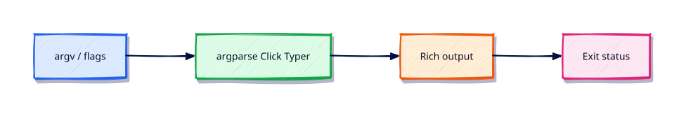

# CLI Applications — argparse, Click, and Typer

## Overview

Ops tools are CLIs first. Clear flags, dry-run defaults, and readable output beat clever frameworks.

This is **Tutorial 12** in **Module 12: CLI Applications** of the REBASH Academy **Python for DevOps Engineers** series — written for DevOps engineers, SREs, platform engineers, and cloud engineers who automate infrastructure with production-quality Python.

## Prerequisites

- Configuration Management and Secrets
- Python 3.12+ on Linux (WSL2/VM/cloud)

## Learning Objectives

By the end of this tutorial, you will be able to:

- [ ] Apply the core ideas of “CLI Applications — argparse, Click, and Typer” in real ops automation
- [ ] Use a project venv and avoid relying on system site-packages
- [ ] Produce clear stderr diagnostics and meaningful exit codes
- [ ] Prefer safe patterns (pathlib, subprocess list args, dry-run)
- [ ] Relate this topic to day-to-day DevOps and platform work

## Architecture

Ops Python sits between operators/CI and platforms (files, APIs, CLIs, and cloud control planes). This topic’s control points are shown below.



## Theory

### argparse

Stdlib CLI parser — zero dependencies. Use subparsers for verbs (`check`, `apply`). Default mutating actions to dry-run / require `--apply`.

### Click

Decorator-based CLIs with nice help text and option types. Common in older ops tools. Still excellent for nested command groups.

### Typer

Built on Click with type-hint driven options — modern default for new internal CLIs. Generates help from annotations.

### Rich

Pretty tables, panels, and colour for human terminals. Detect non-TTY (CI) and fall back to plain text.

### Progress Bars

Use Rich/tqdm for long inventories — disable or simplify when stdout is piped. Never mix progress paint with machine-readable JSON on the same stream.

### Interactive CLI Applications

Prompts are fine for human installers; disable them in CI with flags/`CI=true`. Never require interactive confirmation for scheduled jobs — use explicit `--apply`.

## Hands-on Lab

Create a workspace for this tutorial.

```bash
mkdir -p ~/rebash-python/lab12 && cd ~/rebash-python/lab12
```

**Focus:** argparse subcommands with --apply; optional Typer/Rich table if installed

### Step 1 – Skeleton

```bash
cat > lab.py << 'EOF'
#!/usr/bin/env python3
print("lab12 cli-applications-argparse-click-typer")
EOF
chmod +x lab.py
python3 lab.py
```

### Step 2 – argparse CLI

```bash
cat > cli.py << 'EOF'
#!/usr/bin/env python3
import argparse

def main() -> int:
    p = argparse.ArgumentParser(prog="ops")
    sub = p.add_subparsers(dest="cmd", required=True)
    c = sub.add_parser("check")
    c.add_argument("host")
    a = sub.add_parser("apply")
    a.add_argument("host")
    a.add_argument("--apply", action="store_true")
    args = p.parse_args()
    if args.cmd == "check":
        print(f"CHECK {args.host}")
        return 0
    if not args.apply:
        print(f"WOULD_APPLY {args.host}")
        return 0
    print(f"APPLY {args.host}")
    return 0

if __name__ == "__main__":
    raise SystemExit(main())
EOF
python3 cli.py check web01
python3 cli.py apply web01
python3 cli.py apply web01 --apply
```

### Final step – Cleanup note

```bash
python3 lab.py
# keep ~/rebash-python for later labs
```

## Validation

- [ ] Lab commands run under `~/rebash-python/lab12/`
- [ ] You can explain each Theory heading in your own words
- [ ] Failure path exits non-zero and prints diagnostics to stderr (where applicable)
- [ ] Dry-run / fixture behaviour is clear for any mutating or cloud action
- [ ] You can relate this topic to a real DevOps or platform task

## Code Walkthrough

Production Python for **CLI Applications — argparse, Click, and Typer** always combines:

1. A clear entry point (`main()` + `if __name__ == "__main__"`)
2. A project virtual environment and pinned dependencies when third-party libs are used
3. Explicit error handling and logging (no silent `except Exception: pass`)
4. Safe I/O: `pathlib`, timeouts on HTTP, `subprocess.run([...])` without `shell=True`
5. Documented exit codes and dry-run defaults for mutating actions

Keep modules short enough to review in a single merge request. Prefer stdlib first; add httpx/requests, Typer, pytest, and platform SDKs when the job needs them.

## Security Considerations

- Treat all external input (args, files, env, API payloads) as untrusted until validated
- Never log secrets or `Authorization` headers; prefer masked CI variables and secret stores
- Prefer least privilege tokens and read-only / dry-run modes by default
- Avoid `shell=True`, unvalidated path deletes, and committing `.env` files
- Pin dependencies; review transitive packages for automation that runs in CI

## Common Mistakes

!!! warning "Using system Python without a venv"
    Global packages drift between laptops and CI. **Fix:** `python3 -m venv .venv` per project and pin dependencies.

!!! warning "Calling subprocess with shell=True"
    Untrusted strings become remote code execution. **Fix:** pass a list of arguments; never build a shell string for the happy path.

!!! warning "Mutating without dry-run"
    Cleanup and apply tools destroy shared environments. **Fix:** default to dry-run; require `--apply` for side effects.

## Best Practices

- One purpose per command; share helpers in a small library package
- Log to stderr; reserve stdout for data or RESULT lines
- Idempotent behaviour where schedulers and CI may retry
- Fixture / mock paths for GitHub, Docker, Kubernetes, Terraform, and cloud SDKs in CI
- Pair every new tool with at least one failing-path test you actually run

## Troubleshooting

| Symptom | Likely cause | Fix |
|---------|--------------|-----|
| `ModuleNotFoundError` in CI | Missing venv / pins | Recreate venv; install from lock/requirements |
| Works locally, fails in pipeline | Different Python or env | Pin `requires-python`; fingerprint env in the job |
| Hang on HTTP call | No timeout | Set `timeout=` on requests/httpx clients |
| Secrets in logs | Debug printing headers | Redact; never log tokens |
| Accidental prune/delete | No dry-run default | Default dry-run; label lab resources |

## Summary

**CLI Applications — argparse, Click, and Typer** is a core skill for DevOps engineers automating real hosts, APIs, and pipelines with Python. Practise the lab until the failure path and dry-run path are as familiar as the happy path, then continue the track.

## Interview Questions

1. When would you choose Python over Bash for this kind of ops task?
2. What failure mode appears if you skip a venv, pinning, or dry-run here?
3. How would you test this behaviour in CI without live cloud credentials?
4. Where could secrets leak in a naive implementation of this topic?
5. What exit code contract would you document for teammates?

!!! tip "Sample answer — question 2"
    Floating dependencies and missing dry-run defaults create “works on my machine” automation that either breaks overnight or mutates shared infrastructure unexpectedly. Pin versions and default to report-only.

## Related Tutorials

- [Python for DevOps Engineers – Category Overview](index.md)
- [Configuration Management and Secrets](configuration-management-and-secrets.md) *(previous)*
- [Linux Automation — subprocess and psutil](linux-automation-subprocess-and-psutil.md) *(next)*
- [Shell Scripting for DevOps Engineers](../shell/index.md)
- [Learning Paths](../learning-paths/index.md)

## References

- [Python 3 documentation](https://docs.python.org/3/)
- [requests documentation](https://requests.readthedocs.io/)
- [httpx documentation](https://www.python-httpx.org/)
- Track index: [Python for DevOps Engineers](index.md)
