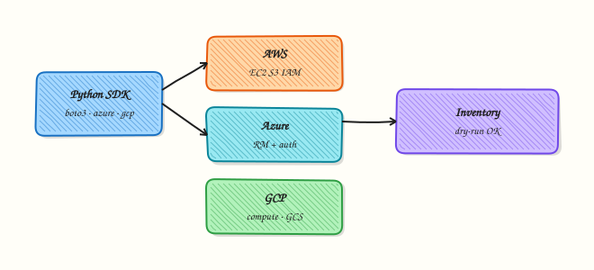

# Cloud Automation — AWS, Azure, and GCP

## Overview

Cloud vendors expose control planes as APIs. In Python you usually call **boto3** (Amazon Web Services / AWS), the **Azure SDK**, or **Google Cloud** client libraries. The important skills are the same on every cloud: how credentials are resolved, how to **list** resources safely, how pagination works, and how to keep **mutating** calls behind an explicit flag.

This tutorial teaches **inventory patterns**, not every service API. Prefer Identity and Access Management (IAM) **roles** and short-lived credentials over long-lived access keys. Prefer **read-only** actions in labs. If you have no cloud account, use **local stub clients** and fixture JSON — that is still valid practice for CI.

Creating virtual machines, load balancers, or large disks in a learning lab can create **surprise bills**. REBASH labs for this module are **read-only or simulated**. Never run “create instance” samples against a personal account without a budget alarm and a destroy plan.

This is **Tutorial 15** in **Module 15: Cloud Automation** of the REBASH Academy **Python for DevOps Engineers** series. It is written for Cloud, DevOps, Platform, and Site Reliability Engineering (SRE) engineers. By the end you will produce inventory evidence from live read-only APIs **or** honest stubs — without creating paid resources.

## Prerequisites

- [REST APIs — requests, Auth, and Resilience](rest-apis-requests-auth-and-resilience.md)
- Comfort with environment-based secrets ([Configuration and Secrets](configuration-management-and-secrets.md))
- Python 3.10+ and a virtual environment
- Optional: AWS / Azure / GCP credentials with **read-only** IAM — otherwise use fixtures

## Learning Objectives

By the end of this tutorial, you will be able to:

- [ ] Describe boto3 session / client patterns for list APIs
- [ ] Outline Azure `DefaultAzureCredential` and resource-group listing
- [ ] Outline Google Application Default Credentials for a list call
- [ ] Prefer IAM roles over long-lived access keys
- [ ] Run a dry-run inventory CLI that uses stubs when creds are missing
- [ ] Refuse to create paid resources in lab automation

## Architecture

Credentials resolve from the environment or cloud metadata. Your Python inventory client calls **list** APIs (or loads fixtures). Reports become JSON evidence. Mutating APIs stay disabled unless a future tool adds an explicit `--apply` (not used here).



## Theory

### What it is

**boto3** builds a session and clients (`s3`, `ec2`, …) that sign HTTP calls to AWS. **Azure SDK** uses `DefaultAzureCredential` and management clients for subscriptions and resource groups. **Google Cloud** clients use Application Default Credentials (ADC) for services such as Cloud Storage. All three are HTTP clients with pagination helpers and IAM underneath.

```python
# Pattern only — lab uses read-only list or stubs
import boto3

session = boto3.Session()  # env vars, shared config, or instance role
s3 = session.client("s3")
# response = s3.list_buckets()  # read-only
```

### Why it matters

Manual console clicking does not scale across accounts. Inventory bots find untagged resources, public buckets, and abandoned disks. The blast radius of a bad key with `*:*` is an entire cloud bill. Engineers who default to **list + report** and gate **create/delete** behind change control cause fewer incidents.

### How it works

1. **Resolve credentials** — env, config files, instance/workload identity — never hard-code.
2. **Create a client** — service-scoped (S3, Resource Manager, …).
3. **List with pagination** — paginators / `next_link` / pages.
4. **Normalise to JSON** — names, regions, tags for tickets.
5. **Stub when needed** — same interface, fixture data, `mode: stub` in evidence.

| Cloud | Auth habit | Safe list example |
|-------|------------|-------------------|
| AWS | Instance role / OIDC → boto3 Session | `list_buckets`, `describe_instances` |
| Azure | `DefaultAzureCredential` | list resource groups |
| GCP | Application Default Credentials | list buckets / projects (read) |

### Key concepts and comparisons

| Idea | Prefer | Avoid |
|------|--------|-------|
| Credentials | Roles, OIDC, short-lived | Long-lived keys in git |
| Lab mode | Read-only list or stub | Create VM / disk “to try” |
| CI | Fixtures + contract tests | Live keys in public runners |
| Mutation | Explicit `--apply` later | Default destroy/create |

### Common pitfalls

- Committing access keys.
- Using AdministratorAccess for a list script.
- Pagination stopped after first page.
- Creating resources without tags, budgets, or cleanup.
- Pretending a stub run proved live IAM.

## Hands-on Lab

### Objective

Build a **read-only** inventory tool under `~/rebash-python/lab15` that lists S3-style buckets (boto3) when AWS credentials work, otherwise uses fixture stubs for AWS/Azure/GCP shapes — and **never** creates paid resources.

### Prerequisites

- Python 3.10+
- Optional AWS credentials with `s3:ListAllMyBuckets` (or broader read-only)
- No requirement for Azure/GCP accounts — stubs cover them

### Lab environment

Workspace: `~/rebash-python/lab15`

```bash
mkdir -p ~/rebash-python/lab15/fixtures && cd ~/rebash-python/lab15
set -euo pipefail
python3 -m venv .venv
# shellcheck disable=SC1091
source .venv/bin/activate
python -m pip install -U pip
python -m pip install 'boto3>=1.34,<2'
python -c "import boto3; print(boto3.__version__)" | tee boto3-version.txt
```

**Expected output:** `boto3-version.txt` shows a version; Azure/GCP SDKs are **not** required for the stub path.

### Real-world scenario

FinOps asks for a weekly bucket / resource-group inventory across clouds. Security allows **read-only** roles only. Many laptops have no cloud creds, so the same CLI must emit fixture-based reports in CI. Creating resources is out of scope and forbidden in this lab.

### Step-by-step tasks

#### Task 1 – Fixture files for stub clients

```bash
cd ~/rebash-python/lab15
set -euo pipefail

cat > fixtures/aws-buckets.json << 'EOF'
{
  "Buckets": [
    {"Name": "rebash-lab-demo-logs", "CreationDate": "2026-01-15T10:00:00+00:00"},
    {"Name": "rebash-lab-demo-artifacts", "CreationDate": "2026-02-01T08:30:00+00:00"}
  ]
}
EOF

cat > fixtures/azure-resource-groups.json << 'EOF'
{
  "value": [
    {"name": "rg-rebash-lab-net", "location": "centralindia"},
    {"name": "rg-rebash-lab-app", "location": "centralindia"}
  ]
}
EOF

cat > fixtures/gcp-buckets.json << 'EOF'
{
  "items": [
    {"name": "rebash-lab-demo-gcs", "location": "ASIA-SOUTH1"},
    {"name": "rebash-lab-demo-tfstate", "location": "ASIA-SOUTH1"}
  ]
}
EOF

test -s fixtures/aws-buckets.json
echo "fixtures ok"
```

**Expected output:** three fixture files under `fixtures/`; `fixtures ok` printed.

#### Task 2 – Inventory CLI (live AWS list or stubs)

```bash
cd ~/rebash-python/lab15
set -euo pipefail
# shellcheck disable=SC1091
source .venv/bin/activate

cat > cloud_inventory.py << 'EOF'
#!/usr/bin/env python3
"""
Read-only cloud inventory. NEVER creates paid resources.
Uses boto3 list_buckets when credentials work; otherwise fixtures.
"""
from __future__ import annotations

import json
import os
import sys
from pathlib import Path

ROOT = Path(__file__).resolve().parent
FIX = ROOT / "fixtures"


def load_json(name: str) -> dict:
    return json.loads((FIX / name).read_text(encoding="utf-8"))


def aws_list_buckets() -> dict:
    if os.environ.get("LAB15_FORCE_STUB") == "1":
        data = load_json("aws-buckets.json")
        return {"mode": "stub", "provider": "aws", "buckets": [b["Name"] for b in data["Buckets"]]}
    try:
        import boto3
        from botocore.exceptions import BotoCoreError, ClientError
    except ImportError:
        data = load_json("aws-buckets.json")
        return {"mode": "stub", "provider": "aws", "buckets": [b["Name"] for b in data["Buckets"]], "reason": "boto3 missing"}

    try:
        client = boto3.client("s3")
        response = client.list_buckets()
        names = [b["Name"] for b in response.get("Buckets", [])]
        return {"mode": "live", "provider": "aws", "buckets": names}
    except (BotoCoreError, ClientError, Exception) as exc:  # noqa: BLE001 — lab: any creds failure → stub
        data = load_json("aws-buckets.json")
        return {
            "mode": "stub",
            "provider": "aws",
            "buckets": [b["Name"] for b in data["Buckets"]],
            "reason": type(exc).__name__,
        }


def azure_list_resource_groups() -> dict:
    # Stub-only in this lab (no create; optional live left for advanced readers)
    data = load_json("azure-resource-groups.json")
    return {
        "mode": "stub",
        "provider": "azure",
        "resource_groups": [x["name"] for x in data["value"]],
    }


def gcp_list_buckets() -> dict:
    data = load_json("gcp-buckets.json")
    return {
        "mode": "stub",
        "provider": "gcp",
        "buckets": [x["name"] for x in data["items"]],
    }


def main() -> int:
    # Guardrail: refuse known mutating intent
    if "--create" in sys.argv or "--apply" in sys.argv:
        print("REFUSED: this lab is read-only / stub only. No cloud creates.", file=sys.stderr)
        return 2

    report = {
        "aws": aws_list_buckets(),
        "azure": azure_list_resource_groups(),
        "gcp": gcp_list_buckets(),
        "policy": "read-only-or-stub; no paid resource creation",
    }
    out = ROOT / "cloud-inventory.json"
    out.write_text(json.dumps(report, indent=2) + "\n", encoding="utf-8")
    print(json.dumps(report, indent=2))
    assert report["aws"]["buckets"], "expected bucket names"
    assert report["azure"]["resource_groups"], "expected RGs"
    assert report["gcp"]["buckets"], "expected GCS names"
    return 0


if __name__ == "__main__":
    raise SystemExit(main())
EOF

python cloud_inventory.py | tee inventory-run.txt
test -s cloud-inventory.json
python -c 'import json; d=json.load(open("cloud-inventory.json")); assert d["policy"].startswith("read-only"); print(d["aws"]["mode"], len(d["aws"]["buckets"]))'
```

**Expected output:** `cloud-inventory.json` with `aws.mode` of `live` or `stub`; Azure/GCP stub lists non-empty; `--create` is refused (see Task 3).

#### Task 3 – Negative guard and evidence pack

```bash
cd ~/rebash-python/lab15
set -euo pipefail
# shellcheck disable=SC1091
source .venv/bin/activate

set +e
python cloud_inventory.py --create >create-denied.txt 2>&1
rc=$?
set -e
test "$rc" -eq 2
grep -F 'REFUSED' create-denied.txt

LAB15_FORCE_STUB=1 python cloud_inventory.py >stub-run.txt
python - << 'EOF'
import json
from pathlib import Path
d = json.loads(Path("cloud-inventory.json").read_text(encoding="utf-8"))
assert d["aws"]["mode"] == "stub"
pack = {
    "inventory": d,
    "create_denied_exit": 2,
}
Path("lab15-evidence.json").write_text(json.dumps(pack, indent=2) + "\n", encoding="utf-8")
print("evidence ok")
EOF
```

**Expected output:** `--create` exits `2` with `REFUSED`; forced stub mode writes evidence; `lab15-evidence.json` exists.

### Validation steps

- [ ] No code path creates VMs, disks, or buckets in this lab
- [ ] `cloud-inventory.json` lists names for aws/azure/gcp shapes
- [ ] Missing creds degrade to fixtures with `mode: stub`
- [ ] `--create` / `--apply` are refused

### Common errors and fixes

| Error | Cause | Fix |
|-------|-------|-----|
| `NoCredentialsError` | No AWS creds | Expected — stub path fills fixtures |
| `AccessDenied` on `list_buckets` | IAM too tight or wrong | Use stub; or attach read-only list permission |
| Import errors for azure/gcp | Not installed | Lab uses fixtures — OK |
| Accidental billing fear | Old habits from create tutorials | This lab refuses `--create` |

### Challenge exercise

Add a `--provider aws|azure|gcp|all` flag (argparse) that filters the report, and write `inventory-aws-only.json` when `--provider aws` is set. Still refuse `--create`. Optional stretch: if `AZURE_SUBSCRIPTION_ID` and azure-identity/mgmt packages exist, attempt a **read-only** resource-group list — on any failure, keep the stub.

### Learning outcomes

- Listed cloud inventory with boto3 or stubs
- Modelled Azure/GCP list shapes with fixtures
- Enforced read-only policy in the CLI
- Saved evidence without creating paid resources

### Cleanup

```bash
cd ~/rebash-python/lab15
deactivate 2>/dev/null || true
# No cloud resources were created by this lab.
# rm -rf .venv
```

## Validation

- [ ] Lab finished under `~/rebash-python/lab15/`
- [ ] You can explain role-based auth vs access keys
- [ ] You know why labs default to list/stub
- [ ] You can describe a billing incident from unbounded create scripts

## Code Walkthrough

Production cloud automation usually follows:

1. **Authenticate with least privilege** — read-only for inventory  
2. **List + paginate** — never assume one page  
3. **Normalise + tag gaps** — report, do not silently fix  
4. **Mutate only with `--apply` + change ticket**  
5. **Evidence** — account/subscription IDs, mode live vs stub  

## Security Considerations

- Never commit cloud access keys or JSON key files  
- Prefer OIDC / instance roles / workload identity  
- Scope IAM to list/get for inventory bots  
- Separate audit accounts from break-glass admin (emergency admin)  
- Log which identity ran the inventory — not the secret material  

## Common Mistakes

!!! warning "Using AdministratorAccess for a list script"
    A stolen CI token can destroy the account. **Fix:** grant only `List*` / `Get*` / Reader roles.

!!! warning "Creating resources in a learning script"
    Orphan VMs generate cost. **Fix:** inventory-only labs; budgets and destroy plans for any apply tooling.

!!! warning "Stopping after the first API page"
    Silent under-count. **Fix:** use paginators / follow next links.

!!! warning "Calling a stub run ‘production verified’"
    Fixtures do not prove IAM. **Fix:** label `mode: stub` vs `live` in evidence.

## Best Practices

- One inventory schema across clouds for FinOps joins  
- Tag `owner` and `expiry` on every created resource (when you create outside this lab)  
- Run inventory in CI with stubs; schedule live reads with roles  
- Pin SDK versions  
- Document required IAM actions next to the CLI  

## Troubleshooting

| Symptom | Likely cause | Fix |
|---------|--------------|-----|
| Empty bucket list live | Wrong account/region profile | Check `AWS_PROFILE` / account |
| Stub always | `LAB15_FORCE_STUB=1` or no creds | Unset force; configure read-only role |
| Slow lists | Many regions scanned | Scope regions; parallel carefully |
| Azure auth fails on laptop | No az login / SP | Use stub; or `az login` for advanced work |
| GCP ADC missing | No `gcloud auth application-default login` | Use stub |

## Summary

Multi-cloud Python automation starts with **credential patterns**, **read-only list APIs**, and honest **stubs** when offline — never surprise creates. Next, automate Git forges in [Git Automation — GitHub and GitLab](git-automation-github-and-gitlab.md).

## Interview Questions

**1. Why are long-lived AWS access keys risky for inventory bots?**

??? success "Reveal answer"
    Keys in env files or CI variables are often copied, logged, or left in forks. They do not rotate with host identity. Prefer instance roles, GitHub OIDC, or short-lived credentials so compromise is time-bounded and scoped. Inventory should use read-only policies.

**2. How do you keep a multi-cloud inventory script from creating cost?**

??? success "Reveal answer"
    Default to list/get only; refuse `--create` / `--apply` in learning tools; use stubs in CI; require separate change-controlled tools for mutation; enable budgets and anomaly alerts on the account. Evidence should show `mode: live|stub` and the IAM principal used.

**3. What does `DefaultAzureCredential` try, at a high level?**

??? success "Reveal answer"
    It chains common Azure identity sources (environment service principal, managed identity, Azure CLI login, and others depending on version/package). That lets the same code run on a laptop (CLI login) and in Azure (managed identity) without hard-coding secrets. Failures should fall back clearly in labs.

**4. How does pagination bite cloud list APIs?**

??? success "Reveal answer"
    APIs return pages. If you only read the first response, reports miss resources and FinOps numbers look wrong. Use boto3 paginators, Azure `list` iterators, or GCP page tokens until exhausted, and record page counts in evidence.

**5. When is a fixture stub acceptable in CI?**

??? success "Reveal answer"
    When you are testing **parsing, CLI flags, and report shape**, not live IAM. Mark `mode: stub` so reviewers know. Add a separate scheduled job with real read-only roles for production inventory truth.

**6. Compare boto3 client vs resource interfaces briefly.**

??? success "Reveal answer"
    **Clients** map closely to AWS API calls (good for explicit list/get). **Resources** are higher-level object wrappers. Many production inventory tools prefer clients + paginators for clarity and fewer surprises. Either way, still apply least-privilege IAM.

**7. A junior engineer wants to “just boto3 create_instance” in the lab account. What do you say?**

??? success "Reveal answer"
    Refuse without budget, tags, size limits, and a destroy checklist. Point them to read-only inventory and local stubs for learning. Unbounded create scripts are a common source of cloud bill incidents in training accounts.

## Related Tutorials

- [Python for DevOps Engineers – Overview](index.md)
- [REST APIs — requests, Auth, and Resilience](rest-apis-requests-auth-and-resilience.md) *(previous)*
- [Git Automation — GitHub and GitLab](git-automation-github-and-gitlab.md) *(next)*
- [Lab — AWS EC2 Inventory](../labs/python-aws-ec2-inventory.md) *(more practice)*

## References

- [boto3 documentation](https://boto3.amazonaws.com/v1/documentation/api/latest/index.html)  
- [Azure Identity libraries](https://learn.microsoft.com/en-us/azure/developer/python/sdk/authentication-overview)  
- [Google Cloud Python client auth](https://cloud.google.com/docs/authentication/application-default-credentials)  
- Track index: [Python for DevOps Engineers](index.md)
