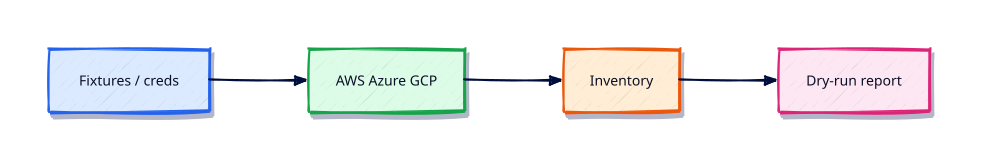

# Cloud Automation — AWS, Azure, and GCP

## Overview

Multi-cloud inventory is a classic Python job. Labs must work offline with fixtures so CI never needs live keys.

This is **Tutorial 15** in **Module 15: Cloud Automation** of the REBASH Academy **Python for DevOps Engineers** series — written for DevOps engineers, SREs, platform engineers, and cloud engineers who automate infrastructure with production-quality Python.

## Prerequisites

- REST APIs — requests, Auth, and Resilience
- Python 3.12+ on Linux (WSL2/VM/cloud)

## Learning Objectives

By the end of this tutorial, you will be able to:

- [ ] Apply the core ideas of “Cloud Automation — AWS, Azure, and GCP” in real ops automation
- [ ] Use a project venv and avoid relying on system site-packages
- [ ] Produce clear stderr diagnostics and meaningful exit codes
- [ ] Prefer safe patterns (pathlib, subprocess list args, dry-run)
- [ ] Relate this topic to day-to-day DevOps and platform work

## Architecture

Ops Python sits between operators/CI and platforms (files, APIs, CLIs, and cloud control planes). This topic’s control points are shown below.



## Theory

### boto3

AWS SDK for Python. Use sessions/profiles, never embed access keys in code.

### EC2

Describe instances, tags, and states for inventory. Start/stop only behind `--apply`.

### S3

List buckets/objects; upload artefacts carefully with server-side encryption settings required by policy.

### IAM

Read-only inventory of roles/policies in labs. Privilege changes need human change control.

### Lambda

Invoke or list functions for ops audits. Avoid deploying from ad-hoc laptops — use CI.

### Azure SDK

Use `azure-identity` (`DefaultAzureCredential`) and resource management clients. Same dry-run discipline.

### Authentication (Azure)

Prefer managed identity in cloud; service principals in CI with short-lived secrets.

### Resource Management (Azure)

List resource groups and resources for inventory tools; mutate only with explicit apply flags.

### Google Cloud SDK

Client libraries for GCP services. Application Default Credentials (ADC) in cloud; fixtures in CI.

### Storage (GCP)

Inventory buckets/objects; enforce uniform bucket-level access expectations in checks.

### Compute Engine

List VMs/instances and labels for inventory parity with EC2/Azure VM views.

When credentials are missing, load JSON fixtures and print `mode=fixture` so pipelines stay green.

## Hands-on Lab

Create a workspace for this tutorial.

```bash
mkdir -p ~/rebash-python/lab15 && cd ~/rebash-python/lab15
```

**Focus:** multi-cloud inventory CLI with fixtures + dry-run; no live cloud required

### Step 1 – Skeleton

```bash
cat > lab.py << 'EOF'
#!/usr/bin/env python3
print("lab15 cloud-automation-aws-azure-gcp")
EOF
chmod +x lab.py
python3 lab.py
```

### Step 2 – Multi-cloud inventory fixtures

```bash
mkdir -p fixtures
cat > fixtures/aws.json << 'EOF'
{"provider":"aws","instances":[{"id":"i-1","name":"web"}]}
EOF
cat > fixtures/azure.json << 'EOF'
{"provider":"azure","instances":[{"id":"vm-1","name":"api"}]}
EOF
cat > fixtures/gcp.json << 'EOF'
{"provider":"gcp","instances":[{"id":"gce-1","name":"worker"}]}
EOF
cat > inventory.py << 'EOF'
#!/usr/bin/env python3
import json, os
from pathlib import Path

def load(provider: str) -> dict:
    if os.environ.get(f"{provider.upper()}_CREDENTIALS"):
        mode = "live"
    else:
        mode = "fixture"
    data = json.loads(Path(f"fixtures/{provider}.json").read_text())
    data["mode"] = mode
    return data

for p in ("aws", "azure", "gcp"):
    print(load(p))
print("RESULT ok")
EOF
python3 inventory.py
```

### Final step – Cleanup note

```bash
python3 lab.py
# keep ~/rebash-python for later labs
```

## Validation

- [ ] Lab commands run under `~/rebash-python/lab15/`
- [ ] You can explain each Theory heading in your own words
- [ ] Failure path exits non-zero and prints diagnostics to stderr (where applicable)
- [ ] Dry-run / fixture behaviour is clear for any mutating or cloud action
- [ ] You can relate this topic to a real DevOps or platform task

## Code Walkthrough

Production Python for **Cloud Automation — AWS, Azure, and GCP** always combines:

1. A clear entry point (`main()` + `if __name__ == "__main__"`)
2. A project virtual environment and pinned dependencies when third-party libs are used
3. Explicit error handling and logging (no silent `except Exception: pass`)
4. Safe I/O: `pathlib`, timeouts on HTTP, `subprocess.run([...])` without `shell=True`
5. Documented exit codes and dry-run defaults for mutating actions

Keep modules short enough to review in a single merge request. Prefer stdlib first; add httpx/requests, Typer, pytest, and platform SDKs when the job needs them.

## Security Considerations

- Treat all external input (args, files, env, API payloads) as untrusted until validated
- Never log secrets or `Authorization` headers; prefer masked CI variables and secret stores
- Prefer least privilege tokens and read-only / dry-run modes by default
- Avoid `shell=True`, unvalidated path deletes, and committing `.env` files
- Pin dependencies; review transitive packages for automation that runs in CI

## Common Mistakes

!!! warning "Using system Python without a venv"
    Global packages drift between laptops and CI. **Fix:** `python3 -m venv .venv` per project and pin dependencies.

!!! warning "Calling subprocess with shell=True"
    Untrusted strings become remote code execution. **Fix:** pass a list of arguments; never build a shell string for the happy path.

!!! warning "Mutating without dry-run"
    Cleanup and apply tools destroy shared environments. **Fix:** default to dry-run; require `--apply` for side effects.

## Best Practices

- One purpose per command; share helpers in a small library package
- Log to stderr; reserve stdout for data or RESULT lines
- Idempotent behaviour where schedulers and CI may retry
- Fixture / mock paths for GitHub, Docker, Kubernetes, Terraform, and cloud SDKs in CI
- Pair every new tool with at least one failing-path test you actually run

## Troubleshooting

| Symptom | Likely cause | Fix |
|---------|--------------|-----|
| `ModuleNotFoundError` in CI | Missing venv / pins | Recreate venv; install from lock/requirements |
| Works locally, fails in pipeline | Different Python or env | Pin `requires-python`; fingerprint env in the job |
| Hang on HTTP call | No timeout | Set `timeout=` on requests/httpx clients |
| Secrets in logs | Debug printing headers | Redact; never log tokens |
| Accidental prune/delete | No dry-run default | Default dry-run; label lab resources |

## Summary

**Cloud Automation — AWS, Azure, and GCP** is a core skill for DevOps engineers automating real hosts, APIs, and pipelines with Python. Practise the lab until the failure path and dry-run path are as familiar as the happy path, then continue the track.

## Interview Questions

1. When would you choose Python over Bash for this kind of ops task?
2. What failure mode appears if you skip a venv, pinning, or dry-run here?
3. How would you test this behaviour in CI without live cloud credentials?
4. Where could secrets leak in a naive implementation of this topic?
5. What exit code contract would you document for teammates?

!!! tip "Sample answer — question 2"
    Floating dependencies and missing dry-run defaults create “works on my machine” automation that either breaks overnight or mutates shared infrastructure unexpectedly. Pin versions and default to report-only.

## Related Tutorials

- [Python for DevOps Engineers – Category Overview](index.md)
- [REST APIs — requests, Auth, and Resilience](rest-apis-requests-auth-and-resilience.md) *(previous)*
- [Git Automation — GitHub and GitLab](git-automation-github-and-gitlab.md) *(next)*
- [Shell Scripting for DevOps Engineers](../shell/index.md)
- [Learning Paths](../learning-paths/index.md)

## References

- [Python 3 documentation](https://docs.python.org/3/)
- [requests documentation](https://requests.readthedocs.io/)
- [httpx documentation](https://www.python-httpx.org/)
- Track index: [Python for DevOps Engineers](index.md)
