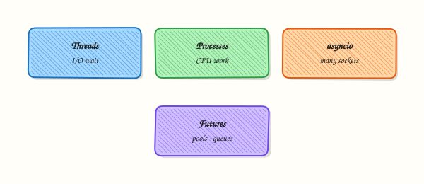

# Concurrency — Threads, asyncio, and Futures

## Overview

Concurrency means overlapping work so waiting time (network, disk, SSH) does not idle the whole script. Most DevOps concurrency is **I/O-bound**: waiting on APIs and hosts. **Threads** or **asyncio** beat processes for that. CPU-heavy parsing may need **multiprocessing**. Cap workers; respect rate limits.

Inventory jobs that hit hundreds of HTTP endpoints finish overnight if written as a plain loop. Bounded fan-out finishes in minutes. Wrong model wastes effort: threads do not speed up pure JSON crunching, and blocking `requests` inside `async def` can freeze the event loop.

This is **Tutorial 21** in **Module 21: Concurrency** of the REBASH Academy **Python for Cloud & DevOps Engineers** series. It is written for DevOps, Platform, and Site Reliability Engineering (SRE) engineers. By the end you will compare sequential versus concurrent localhost checks under `~/rebash-python/lab21` with timing evidence you can show in a review.

## Prerequisites

- [SSH Automation — Paramiko and Fabric](ssh-automation-paramiko-and-fabric.md)
- [REST APIs — requests, Auth, and Resilience](rest-apis-requests-auth-and-resilience.md)
- Python 3.10+ (stdlib is enough for the lab)

## Learning Objectives

By the end of this tutorial, you will be able to:

- [ ] Contrast threads, processes, and asyncio for DevOps workloads
- [ ] Use `ThreadPoolExecutor` for bounded I/O fan-out
- [ ] Sketch `asyncio.gather` for many HTTP checks
- [ ] Capture timing evidence that concurrency helped (or explain when it did not)
- [ ] Use a queue mindset for back-pressure
- [ ] Avoid unbounded fan-out against APIs and hosts

## Architecture

A coordinator submits many similar checks to a pool or event loop, gathers results and errors, and enforces a worker limit so memory and remote services stay healthy.



## Theory

### What it is

Python offers three common models for DevOps tooling: **threads** (`ThreadPoolExecutor`), **processes** (`ProcessPoolExecutor` / `multiprocessing`), and **asyncio** (cooperative tasks on one thread). Parallelism for CPU-heavy work is different: the Global Interpreter Lock (GIL) limits CPU speed-up in threads, so processes are the usual escape hatch.

### Why it matters

Choosing deliberately keeps automation fast, predictable, and easier to cancel under timeouts. Naïve “one thread per host” can trip rate limits, exhaust file descriptors, or lock out SSH. Sequential code is often fine until metrics demand concurrency — start simple, then measure.

### How it works

1. **Threads** — share memory; while one waits on a socket, others run. Use `concurrent.futures.ThreadPoolExecutor(max_workers=...)`.
2. **Processes** — separate interpreters for CPU work; arguments must pickle; higher memory cost.
3. **asyncio** — many coroutines on one thread; each must `await` I/O (for example `asyncio` streams or an async HTTP client). Offload blocking calls with `asyncio.to_thread`.
4. **Futures** — objects representing work in progress; always retrieve results or exceptions (`as_completed`, `gather`).
5. **Queues** — bound producers so you do not fill memory (`queue.Queue` / `asyncio.Queue`).

```python
from concurrent.futures import ThreadPoolExecutor, as_completed

with ThreadPoolExecutor(max_workers=8) as pool:
    futures = [pool.submit(check, url) for url in urls]
    for fut in as_completed(futures):
        print(fut.result())
```

### Key concepts and comparisons

| Workload | Prefer | Why |
|----------|--------|-----|
| Many HTTP/SSH waits | Threads or asyncio | Time is spent blocked on I/O |
| CPU-bound parsing / hashing | multiprocessing | Bypass GIL |
| Simple scripts / few hosts | Sequential first | Easier to debug |
| Structured async pipelines | asyncio + Queue | Back-pressure and cancel scope |

| Concept | Meaning |
|---------|---------|
| Fan-out | Start N similar tasks, gather results |
| Back-pressure | Bound workers/queue size so you do not run out of memory |
| Cancellation | Timeouts and clean shutdown of executors / tasks |

### Common pitfalls

- Spawning unbounded threads (one per host with no pool).
- Using threads for CPU-heavy loops and expecting linear speed-up.
- Calling blocking `requests` or `subprocess` inside `async def` without offloading.
- Ignoring exceptions on futures — always retrieve results or use `as_completed`.
- Sharing mutable state across threads without locks (prefer return values).

## Hands-on Lab

### Objective

Under `~/rebash-python/lab21`, run sequential versus `ThreadPoolExecutor` (and optional asyncio) checks against localhost HTTP or TCP, and save timing evidence that compares the two approaches.

### Prerequisites

- Python 3.10+
- Ability to bind a short-lived local HTTP server (stdlib)

### Lab environment

Workspace: `~/rebash-python/lab21`

```bash
mkdir -p ~/rebash-python/lab21 && cd ~/rebash-python/lab21
set -euo pipefail
python3 --version | tee python-version.txt
```

**Expected output:** `python-version.txt` shows Python 3.10 or newer.

### Real-world scenario

Your health-check tool pings twenty internal endpoints every minute. A sequential loop sometimes exceeds the cron window. You prototype bounded thread fan-out against a local stub server, measure wall time, and keep numbers for the design review before touching production APIs.

### Step-by-step tasks

#### Task 1 – Local stub server and check helpers


Create `fanout_checks.py`:

```python
#!/usr/bin/env python3
"""Compare sequential vs ThreadPoolExecutor (and asyncio) localhost checks."""
from __future__ import annotations

import asyncio
import json
import threading
import time
import urllib.error
import urllib.request
from concurrent.futures import ThreadPoolExecutor, as_completed
from http.server import BaseHTTPRequestHandler, HTTPServer
from pathlib import Path

ROOT = Path(__file__).resolve().parent
HOST, PORT = "127.0.0.1", 8765
URLS = [f"http://{HOST}:{PORT}/ok?i={i}" for i in range(20)]


class Handler(BaseHTTPRequestHandler):
    def do_GET(self) -> None:  # noqa: N802
        time.sleep(0.05)  # simulate network/service latency
        body = b"ok\n"
        self.send_response(200)
        self.send_header("Content-Length", str(len(body)))
        self.end_headers()
        self.wfile.write(body)

    def log_message(self, format: str, *args) -> None:  # noqa: A003
        return


def start_server() -> HTTPServer:
    server = HTTPServer((HOST, PORT), Handler)
    thread = threading.Thread(target=server.serve_forever, daemon=True)
    thread.start()
    return server


def check_url(url: str) -> dict:
    try:
        with urllib.request.urlopen(url, timeout=5) as resp:
            return {"url": url, "status": resp.status, "ok": resp.status == 200}
    except (urllib.error.URLError, TimeoutError) as exc:
        return {"url": url, "ok": False, "error": str(exc)}


def run_sequential(urls: list[str]) -> tuple[list[dict], float]:
    t0 = time.perf_counter()
    results = [check_url(u) for u in urls]
    return results, time.perf_counter() - t0


def run_threads(urls: list[str], workers: int = 8) -> tuple[list[dict], float]:
    t0 = time.perf_counter()
    results: list[dict] = []
    with ThreadPoolExecutor(max_workers=workers) as pool:
        futures = {pool.submit(check_url, u): u for u in urls}
        for fut in as_completed(futures):
            results.append(fut.result())
    return results, time.perf_counter() - t0


async def check_url_async(url: str) -> dict:
    return await asyncio.to_thread(check_url, url)


async def run_asyncio(urls: list[str]) -> tuple[list[dict], float]:
    t0 = time.perf_counter()
    results = await asyncio.gather(*[check_url_async(u) for u in urls])
    return list(results), time.perf_counter() - t0


def main() -> int:
    server = start_server()
    time.sleep(0.2)
    try:
        seq_results, seq_s = run_sequential(URLS)
        thr_results, thr_s = run_threads(URLS, workers=8)
        aio_results, aio_s = asyncio.run(run_asyncio(URLS))
    finally:
        server.shutdown()

    summary = {
        "checks": len(URLS),
        "sequential_seconds": round(seq_s, 3),
        "threadpool_seconds": round(thr_s, 3),
        "asyncio_seconds": round(aio_s, 3),
        "sequential_ok": sum(1 for r in seq_results if r.get("ok")),
        "threadpool_ok": sum(1 for r in thr_results if r.get("ok")),
        "asyncio_ok": sum(1 for r in aio_results if r.get("ok")),
        "speedup_threads_vs_seq": round(seq_s / thr_s, 2) if thr_s else None,
    }
    out = ROOT / "timing-evidence.json"
    out.write_text(json.dumps(summary, indent=2) + "\n", encoding="utf-8")
    print(out.read_text(encoding="utf-8"))
    if summary["threadpool_ok"] != len(URLS):
        return 1
    if thr_s >= seq_s:
        # Still accept if machine is heavily loaded, but flag in file
        summary["note"] = "thread pool not faster this run — re-run or check load"
        out.write_text(json.dumps(summary, indent=2) + "\n", encoding="utf-8")
    return 0


if __name__ == "__main__":
    raise SystemExit(main())
```

Run:

```bash
cd ~/rebash-python/lab21
set -euo pipefail
```

**Expected output:** File `fanout_checks.py` exists (run in Task 2).

#### Task 2 – Run and assert timing evidence

```bash
cd ~/rebash-python/lab21
set -euo pipefail

python3 fanout_checks.py | tee timing-run.txt
python3 - << 'PY'
import json
from pathlib import Path
d = json.loads(Path("timing-evidence.json").read_text(encoding="utf-8"))
assert d["checks"] == 20
assert d["threadpool_ok"] == 20
assert d["sequential_ok"] == 20
print("ok_counts_pass")
# Prefer thread pool faster; allow soft note if system is busy
if d["threadpool_seconds"] < d["sequential_seconds"]:
    print(f"speedup={d['speedup_threads_vs_seq']}")
else:
    assert "note" in d or d["threadpool_seconds"] <= d["sequential_seconds"] * 1.2
    print("timing_close_or_noted")
PY
```

**Expected output:** `timing-evidence.json` shows 20 successful checks; thread pool time is usually clearly lower than sequential (for example ~0.2s vs ~1.0s with 50ms sleeps).

#### Task 3 – Pack evidence

```bash
cd ~/rebash-python/lab21
set -euo pipefail

tar -czf concurrency-lab-evidence.tgz \
  python-version.txt timing-evidence.json timing-run.txt fanout_checks.py
ls -l concurrency-lab-evidence.tgz | tee evidence-ls.txt
test -s concurrency-lab-evidence.tgz
```

**Expected output:** Non-empty `concurrency-lab-evidence.tgz`.

### Validation steps

- [ ] Local stub served twenty `/ok` responses
- [ ] `timing-evidence.json` includes sequential, thread pool, and asyncio seconds
- [ ] All three modes report 20 OK (or you documented a port conflict and re-ran)
- [ ] You can explain why I/O waits benefit from threads/asyncio
- [ ] Evidence archive exists under `~/rebash-python/lab21`

### Common errors and fixes

| Error | Cause | Fix |
|-------|-------|-----|
| `Address already in use` | Port 8765 busy | Change `PORT` in the script and re-run |
| Thread pool not faster | Heavy machine load / tiny sleep | Increase simulated sleep slightly; re-run |
| `urlopen` timeout | Server not started | Ensure `start_server` runs before checks |
| asyncio “slower than threads” | `to_thread` overhead on tiny work | Expected for this stub; still valid for learning gather |
| Firewalls blocking localhost | Rare corporate agents | Use the same host/port loopback only |

### Challenge exercise

Add a `ProcessPoolExecutor` path that hashes large byte strings (CPU-bound) and compare it with `ThreadPoolExecutor` on the **same CPU work**. Save `cpu-timing.json` showing processes winning (or explain GIL if threads tie). Do not remove the I/O timing evidence.

### Learning outcomes

- Built bounded ThreadPoolExecutor fan-out
- Compared sequential vs concurrent wall times with evidence
- Used asyncio.gather with offloaded I/O
- Can justify worker limits for production APIs

### Cleanup

```bash
cd ~/rebash-python/lab21
set -euo pipefail
# Server is daemonised per run and shut down in finally — nothing left listening
# Keep evidence if you want it; otherwise:
# rm -f concurrency-lab-evidence.tgz *.txt *.json
```

## Validation

- [ ] Lab finished under `~/rebash-python/lab21/` with timing evidence
- [ ] You can explain threads vs processes vs asyncio
- [ ] You know why unbounded fan-out is dangerous
- [ ] You can describe one production failure mode (rate limits, deadlocks, blocking the event loop)

## Code Walkthrough

Production fan-out usually follows this order:

1. **Measure sequential baseline** — prove the need  
2. **Bound workers** — start small (8–32), watch errors and latency  
3. **Per-task timeouts and errors** — one bad host must not kill the batch  
4. **Back-pressure** — queues when producers outrun consumers  
5. **Cancel cleanly** — shutdown executors; cancel asyncio tasks on SIGTERM  

Prefer return values over shared mutable state.

## Security Considerations

- Do not disable TLS verification to “make fan-out easier”  
- Cap concurrency against login/SSH endpoints to avoid lockouts  
- Treat credentials in parallel tasks carefully — no shared writable token files without locks  
- Redact URLs that embed tokens before logging results  
- Rate-limit scanners; unauthorised mass probing may violate policy  

## Common Mistakes

!!! warning "One thread per host with no limit"
    File descriptors and remote rate limits explode. **Fix:** `ThreadPoolExecutor(max_workers=N)` and backoff.

!!! warning "Expecting threads to speed up CPU-heavy JSON parsing"
    The GIL limits CPU speed-up. **Fix:** use multiprocessing for CPU-bound work; keep threads for I/O.

!!! warning "Calling blocking requests inside async def"
    The event loop stalls. **Fix:** async client, or `asyncio.to_thread`.

!!! warning "Ignoring future exceptions"
    Failures look like success. **Fix:** always `result()` / `as_completed` and record per-item errors.

## Best Practices

- Sequential first; add concurrency when timers prove the need  
- Same timeouts in sequential and concurrent paths for fair comparison  
- Structured result objects per host/URL  
- Metrics: success count, p95 latency, worker utilisation  
- Document max_workers in the runbook  

## Troubleshooting

| Symptom | Likely cause | Fix |
|---------|--------------|-----|
| Rate limits (429) | Too many workers | Lower pool size; exponential backoff |
| Deadlocks | Joining wrong order / shared locks | Keep critical sections tiny; prefer return values |
| Blocking asyncio | Called `requests` in coro | Use async client or `to_thread` |
| Port in use | Previous server not stopped | Change port; ensure `shutdown()` in `finally` |
| No speedup | Work is CPU-bound or sleep too small | Re-check workload type; increase I/O wait in the stub |

## Summary

For DevOps I/O fan-out, prefer bounded threads or asyncio; use processes for CPU. This lab compared sequential and concurrent localhost checks with timing evidence. Next, lock behaviour in with [Testing with pytest](testing-with-pytest.md).

## Interview Questions

**1. When would you choose ThreadPoolExecutor over asyncio for HTTP health checks?**

??? success "Reveal answer"
    Choose **threads** when the team already uses blocking libraries (`requests`, many cloud SDKs) and wants a small change: wrap calls in a pool. Choose **asyncio** when you standardise on async clients and need many idle connections with less thread overhead. Both need timeouts and worker/connection limits.

**2. Why might threads not speed up a CPU-heavy hashing job?**

??? success "Reveal answer"
    CPython’s **Global Interpreter Lock (GIL)** allows only one thread to execute Python bytecode at a time. CPU-bound work should use **multiprocessing** / `ProcessPoolExecutor`, or native extensions that release the GIL. Threads still help when the CPU work is mostly waiting on I/O.

**3. What is back-pressure, and how do queues help?**

??? success "Reveal answer"
    Back-pressure means **slowing producers** when consumers cannot keep up, so memory does not grow without bound. A bounded `queue.Queue` or `asyncio.Queue` blocks putters when full. Unbounded lists of futures are a common out-of-memory cause in fan-out scripts.

**4. How do you handle one failing host among two hundred without aborting the whole run?**

??? success "Reveal answer"
    Catch exceptions **per future/task**, record `{host, ok, error}`, and continue. Use `as_completed` or `return_exceptions=True` with `asyncio.gather`. Exit non-zero only if the failure rate crosses a policy threshold — not on the first error — unless the job is fail-fast by design.

**5. What timing evidence would you bring to a design review?**

??? success "Reveal answer"
    Wall-clock for **sequential vs bounded pool** on a realistic batch size, success counts, timeouts, and remote error rates. Show that speedup is real and that lowering workers still meets the Service Level Objective (SLO). Numbers beat slogans.

**6. Why is unbounded asyncio.create_task in a loop still risky?**

??? success "Reveal answer"
    You can still create **tens of thousands of tasks** and open too many sockets. Use semaphores, worker pools, or chunked gather. Concurrency without a bound is still a load test against yourself and the target.

**7. A junior engineer mixes `time.sleep` inside async code. What happens?**

??? success "Reveal answer"
    **`time.sleep` blocks the event loop**, so all tasks stall. Use `await asyncio.sleep(...)` for async delays, and `asyncio.to_thread` (or an executor) for blocking library calls. Interviewers listen for “blocking the loop,” not only “sleep is bad.”

**8. How does concurrency interact with SSH MaxStartups or API rate limits?**

??? success "Reveal answer"
    Too many parallel sessions trigger **server-side rejection** or account lockouts. Cap workers below provider limits, add jittered backoff, and prefer inventory APIs when available. Measure error rates when you raise concurrency — not only happy-path latency.

## Related Tutorials

- [Python for Cloud & DevOps – Overview](index.md)
- [SSH Automation — Paramiko and Fabric](ssh-automation-paramiko-and-fabric.md) *(previous)*
- [Testing with pytest](testing-with-pytest.md) *(next)*
- [REST APIs — requests, Auth, and Resilience](rest-apis-requests-auth-and-resilience.md)
- [Production Engineering Patterns](production-engineering-patterns.md)

## References

- [`concurrent.futures`](https://docs.python.org/3/library/concurrent.futures.html) — Python docs  
- [`asyncio`](https://docs.python.org/3/library/asyncio.html) — Python docs  
- Track index: [Python for Cloud & DevOps Engineers](index.md)
