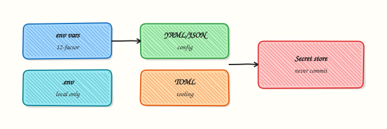

# Configuration Management and Secrets

## Overview

Load configuration from env vars and files (YAML/JSON/TOML), support local `.env` without committing it, and keep secrets out of git, logs, and defaults.

Twelve-factor style: **config in the environment**, structure in files, secrets in a store or CI variables. Mixing API keys into YAML in the repo is how breaches start.

Complete [Logging and Debugging](logging-and-debugging.md) first. Diagrams use Excalidraw only.

This is a core tutorial in **Module 11 · Configuration** of the REBASH Academy **Python for Cloud & DevOps Engineers** series — written for Cloud, DevOps, Platform, and SRE engineers.

## Prerequisites

### Required

- [Logging and Debugging](logging-and-debugging.md)
- [File Handling](file-handling-pathlib-json-yaml-csv.md) — YAML/JSON
- Project venv

## Learning Objectives

By the end of this tutorial, you will be able to:

- [ ] Read and validate environment variables  
- [ ] Use `.env` locally with python-dotenv (optional)  
- [ ] Merge file config with env overrides  
- [ ] Parse TOML for tool settings  
- [ ] List secret-handling rules for ops CLIs  
- [ ] Fail fast when required secrets are missing

## Architecture

This topic’s control points and relationships are shown below.



## Theory

### Environment variables

```python
import os
region = os.environ.get("AWS_REGION", "eu-west-1")
token = os.environ.get("API_TOKEN")
if not token:
    raise SystemExit("error: API_TOKEN is required")
```

Booleans: compare to `"1"`/`"true"` — do not use `bool(os.environ.get(...))` alone.

### dotenv

`python-dotenv` loads a local `.env` into the process environment for developer machines. **Never commit `.env`.** In CI/production, inject real env vars from the platform.

```python
from dotenv import load_dotenv
load_dotenv()  # no-op if file missing
```

### YAML / JSON config files

Non-secret structure: replicas, feature flags, endpoint URLs. Override with env when needed (`APP_REPLICAS`).

### TOML

Common for tooling (`pyproject.toml`). Stdlib `tomllib` (3.11+) reads TOML:

```python
import tomllib
from pathlib import Path
data = tomllib.loads(Path("pyproject.toml").read_text(encoding="utf-8"))
```

### Secret handling rules

1. No secrets in git — even “temporary”  
2. No secrets in logs or exception messages  
3. Prefer short-lived tokens / IAM roles over long-lived keys  
4. Pass secrets via env or secret mounts, not CLI flags (shell history)  
5. Document required variables in README; fail fast if missing  

Module 25 deepens encryption, scanning, and supply chain.

## Hands-on Lab

**Focus:** practise the core workflow for Configuration Management and Secrets

```bash
mkdir -p ~/rebash-python/module-11
cd ~/rebash-python/module-11

python3 -m venv .venv
source .venv/bin/activate
python -m pip install --upgrade pip
python -m pip install 'PyYAML==6.0.2' 'python-dotenv==1.0.1'
```

### Step 1 – File config + env override

```bash
cd ~/rebash-python/module-11
source .venv/bin/activate

mkdir -p config
cat > config/app.yaml << 'EOF'
env: lab
replicas: 2
api_url: https://api.example.internal
EOF

cat > load_settings.py << 'EOF'
#!/usr/bin/env python3
from __future__ import annotations

import os
import sys
from dataclasses import dataclass
from pathlib import Path

import yaml
from dotenv import load_dotenv


@dataclass(slots=True)
class Settings:
    env: str
    replicas: int
    api_url: str
    api_token: str


def load(path: Path) -> Settings:
    load_dotenv()
    doc = yaml.safe_load(path.read_text(encoding="utf-8")) or {}
    env = os.environ.get("APP_ENV", str(doc.get("env", "lab")))
    replicas = int(os.environ.get("APP_REPLICAS", doc.get("replicas", 1)))
    api_url = os.environ.get("APP_API_URL", str(doc.get("api_url", "")))
    token = os.environ.get("API_TOKEN", "")
    if not token:
        raise SystemExit("error: API_TOKEN is required")
    if not api_url:
        raise SystemExit("error: api_url missing")
    return Settings(env=env, replicas=replicas, api_url=api_url, api_token=token)


def main() -> int:
    settings = load(Path("config/app.yaml"))
    # Never print the token
    print(f"env={settings.env} replicas={settings.replicas} api_url={settings.api_url}")
    print("token_set=true", file=sys.stderr)
    return 0


if __name__ == "__main__":
    raise SystemExit(main())
EOF
```

### Step 2 – Local .env (gitignored pattern)

```bash
cat > .env << 'EOF'
API_TOKEN=lab-only-not-for-prod
APP_REPLICAS=5
EOF

echo '.env' >> .gitignore
API_TOKEN= python load_settings.py 2>/dev/null || true
# With dotenv:
python load_settings.py
```

### Step 3 – Override from the real environment

```bash
APP_REPLICAS=9 API_TOKEN=from-shell python load_settings.py
```

### Step 4 – TOML read

```bash
cat > sample.toml << 'EOF'
[tool.rebash]
name = "module-11"
EOF

python - <<'PY'
import tomllib
from pathlib import Path
data = tomllib.loads(Path("sample.toml").read_text(encoding="utf-8"))
print(data["tool"]["rebash"]["name"])
PY
```

## Validation

- [ ] Lab commands run under `~/rebash-python/module-11/`
- [ ] You can explain each Theory section in your own words
- [ ] You used modern tooling where it applies to this topic
- [ ] You can describe one production failure mode for this topic

## Code Walkthrough

Production practice for **Configuration Management and Secrets** always combines:

1. Inspect before you change (status, plan, logs, dry-run)
2. Prefer reversible, documented changes (Git, IaC, drop-ins, version pins)
3. Capture evidence (command output, pipeline logs) for handovers
4. Prefer current tools and APIs over legacy shortcuts
5. Least privilege — escalate credentials only when required

Keep runbooks short enough to follow under pressure. Automate checks; keep humans for judgement.

## Security Considerations

- Treat credentials and tokens for python as privileged — never commit them
- Prefer short-lived auth (OIDC, roles, SSO) over long-lived keys
- Validate blast radius before apply/deploy/delete operations
- Restrict who can approve production changes
- Collect audit logs; limit who can read sensitive traces

## Common Mistakes

!!! warning "Skipping fundamentals for Configuration Management and Secrets"
    Validate assumptions against the Theory section and official docs before changing production.

!!! warning "Treating lab defaults as production-ready for Configuration Management and Secrets"
    Lab shortcuts (open security groups, admin roles, skip approvals) must not ship unchanged.

!!! warning "Changing production without a rollback path"
    Always know how to revert (previous artefact, prior release, state rollback, DNS failback).

## Best Practices

- Encode Configuration Management and Secrets changes as code and review them in pull requests
- Pin versions (images, modules, actions, provider plugins)
- Separate environments with clear promotion gates
- Alert on symptoms with runbooks attached
- Destroy lab resources; tag everything with owner and expiry where possible

## Troubleshooting

| Symptom | Likely cause | What to do |
|---------|--------------|------------|
| Token empty in CI | `.env` not used in CI | Set CI secrets as env vars |
| Wrong replicas | Env vs file precedence unclear | Document order: env wins |
| Secret in traceback | Included in exception str | Redact; reference var name only |

## Summary

- Structure in files; secrets in env/secret stores  
- `.env` for local DX only — never commit  
- Env overrides for deploys; fail fast if required secrets missing  
- Never log secret values

## Interview Questions

1. How does **Configuration Management and Secrets** show up when operating Cloud or production platforms?
2. What would you check first if this area misbehaves in production?
3. Which modern tools or APIs replace older equivalents here?
4. What security control should accompany this capability?
5. How would you automate verification of this topic in CI?

!!! tip "Sample answer — question 2"
    Start with blast radius and recent changes, gather evidence (logs, status, plan/diff), then fix forward with a known rollback path — not guesswork.

## Related Tutorials

- [Course overview](index.md)
- - [CLI Applications — argparse, Click, and Typer](cli-applications-argparse-click-typer.md)  
- [Security for DevOps Python](security-for-devops-python.md)

## References

- [os.environ](https://docs.python.org/3/library/os.html#os.environ)  
- [python-dotenv](https://saurabh-kumar.com/python-dotenv/)  
- [tomllib](https://docs.python.org/3/library/tomllib.html)
