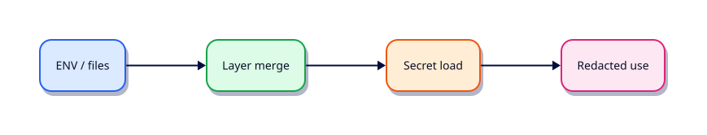

# Configuration Management and Secrets

## Overview

Config belongs in files and env; secrets belong in a secret store — never in Git.

This is **Tutorial 11** in **Module 11: Configuration Management** of the REBASH Academy **Python for DevOps Engineers** series — written for DevOps engineers, SREs, platform engineers, and cloud engineers who automate infrastructure with production-quality Python.

## Prerequisites

- Logging and Debugging
- Python 3.12+ on Linux (WSL2/VM/cloud)

## Learning Objectives

By the end of this tutorial, you will be able to:

- [ ] Apply the core ideas of “Configuration Management and Secrets” in real ops automation
- [ ] Use a project venv and avoid relying on system site-packages
- [ ] Produce clear stderr diagnostics and meaningful exit codes
- [ ] Prefer safe patterns (pathlib, subprocess list args, dry-run)
- [ ] Relate this topic to day-to-day DevOps and platform work

## Architecture

Ops Python sits between operators/CI and platforms (files, APIs, CLIs, and cloud control planes). This topic’s control points are shown below.



## Theory

### Environment Variables

Read with `os.environ.get("API_URL")` or `os.environ["REQUIRED"]` (raises KeyError). Document required vars in README. Prefer explicit fail on missing secrets.

### dotenv

`python-dotenv` loads `.env` for local labs. Add `.env` to `.gitignore`. Never commit credentials. In CI, inject secrets as masked variables instead.

### YAML

Human-friendly service configs — parse with `safe_load`, validate schema keys, reject unknown dangerous fields.

### JSON

Machine-friendly configs and API fixtures. Same validation rules as Module 7.

### TOML

`tomllib` (3.11+) reads `pyproject.toml` and tool configs. Good for packaging metadata and static tool settings.

### Configuration Files

Layering: defaults < file < env < CLI flags. Document precedence. Fail if conflicting sources disagree on critical safety flags.

### Secret Handling

Load secrets at runtime, keep them in memory briefly, never log them, never write them to world-readable files, rotate tokens, and prefer cloud secret managers in production.

## Hands-on Lab

Create a workspace for this tutorial.

```bash
mkdir -p ~/rebash-python/lab11 && cd ~/rebash-python/lab11
```

**Focus:** layered config (JSON + env); .env gitignore pattern; redact secrets in logs

### Step 1 – Skeleton

```bash
cat > lab.py << 'EOF'
#!/usr/bin/env python3
print("lab11 configuration-management-and-secrets")
EOF
chmod +x lab.py
python3 lab.py
```

### Step 2 – Config and secrets hygiene

```bash
cat > config.json << 'EOF'
{"api_url":"https://example.invalid","timeout":5}
EOF
cat > .env << 'EOF'
API_TOKEN=lab-secret-do-not-commit
EOF
echo '.env' > .gitignore
cat > cfg.py << 'EOF'
#!/usr/bin/env python3
import json, os, sys
from pathlib import Path

def redact(value: str) -> str:
    if len(value) <= 4:
        return "***"
    return value[:2] + "***" + value[-2:]

cfg = json.loads(Path("config.json").read_text())
token = os.environ.get("API_TOKEN", "")
# simulate dotenv without dependency:
for line in Path(".env").read_text().splitlines():
    if line.startswith("API_TOKEN="):
        token = line.split("=", 1)[1]
print(f"api_url={cfg['api_url']}")
print(f"token={redact(token)}", file=sys.stderr)
print("RESULT ok")
EOF
python3 cfg.py
```

### Final step – Cleanup note

```bash
python3 lab.py
# keep ~/rebash-python for later labs
```

## Validation

- [ ] Lab commands run under `~/rebash-python/lab11/`
- [ ] You can explain each Theory heading in your own words
- [ ] Failure path exits non-zero and prints diagnostics to stderr (where applicable)
- [ ] Dry-run / fixture behaviour is clear for any mutating or cloud action
- [ ] You can relate this topic to a real DevOps or platform task

## Code Walkthrough

Production Python for **Configuration Management and Secrets** always combines:

1. A clear entry point (`main()` + `if __name__ == "__main__"`)
2. A project virtual environment and pinned dependencies when third-party libs are used
3. Explicit error handling and logging (no silent `except Exception: pass`)
4. Safe I/O: `pathlib`, timeouts on HTTP, `subprocess.run([...])` without `shell=True`
5. Documented exit codes and dry-run defaults for mutating actions

Keep modules short enough to review in a single merge request. Prefer stdlib first; add httpx/requests, Typer, pytest, and platform SDKs when the job needs them.

## Security Considerations

- Treat all external input (args, files, env, API payloads) as untrusted until validated
- Never log secrets or `Authorization` headers; prefer masked CI variables and secret stores
- Prefer least privilege tokens and read-only / dry-run modes by default
- Avoid `shell=True`, unvalidated path deletes, and committing `.env` files
- Pin dependencies; review transitive packages for automation that runs in CI

## Common Mistakes

!!! warning "Using system Python without a venv"
    Global packages drift between laptops and CI. **Fix:** `python3 -m venv .venv` per project and pin dependencies.

!!! warning "Calling subprocess with shell=True"
    Untrusted strings become remote code execution. **Fix:** pass a list of arguments; never build a shell string for the happy path.

!!! warning "Mutating without dry-run"
    Cleanup and apply tools destroy shared environments. **Fix:** default to dry-run; require `--apply` for side effects.

## Best Practices

- One purpose per command; share helpers in a small library package
- Log to stderr; reserve stdout for data or RESULT lines
- Idempotent behaviour where schedulers and CI may retry
- Fixture / mock paths for GitHub, Docker, Kubernetes, Terraform, and cloud SDKs in CI
- Pair every new tool with at least one failing-path test you actually run

## Troubleshooting

| Symptom | Likely cause | Fix |
|---------|--------------|-----|
| `ModuleNotFoundError` in CI | Missing venv / pins | Recreate venv; install from lock/requirements |
| Works locally, fails in pipeline | Different Python or env | Pin `requires-python`; fingerprint env in the job |
| Hang on HTTP call | No timeout | Set `timeout=` on requests/httpx clients |
| Secrets in logs | Debug printing headers | Redact; never log tokens |
| Accidental prune/delete | No dry-run default | Default dry-run; label lab resources |

## Summary

**Configuration Management and Secrets** is a core skill for DevOps engineers automating real hosts, APIs, and pipelines with Python. Practise the lab until the failure path and dry-run path are as familiar as the happy path, then continue the track.

## Interview Questions

1. When would you choose Python over Bash for this kind of ops task?
2. What failure mode appears if you skip a venv, pinning, or dry-run here?
3. How would you test this behaviour in CI without live cloud credentials?
4. Where could secrets leak in a naive implementation of this topic?
5. What exit code contract would you document for teammates?

!!! tip "Sample answer — question 2"
    Floating dependencies and missing dry-run defaults create “works on my machine” automation that either breaks overnight or mutates shared infrastructure unexpectedly. Pin versions and default to report-only.

## Related Tutorials

- [Python for DevOps Engineers – Category Overview](index.md)
- [Logging and Debugging](logging-and-debugging.md) *(previous)*
- [CLI Applications — argparse, Click, and Typer](cli-applications-argparse-click-typer.md) *(next)*
- [Shell Scripting for DevOps Engineers](../shell/index.md)
- [Learning Paths](../learning-paths/index.md)

## References

- [Python 3 documentation](https://docs.python.org/3/)
- [requests documentation](https://requests.readthedocs.io/)
- [httpx documentation](https://www.python-httpx.org/)
- Track index: [Python for DevOps Engineers](index.md)
