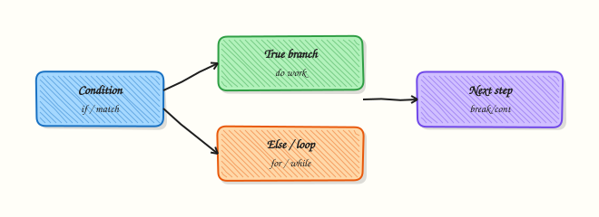

# Control Flow — Conditionals and Loops

## Overview

Automation is mostly **decisions** and **repetition**. Should this host be patched? Is disk usage above a threshold? For each row in an inventory file, do work — unless the row is a comment. In Python, **conditionals** (`if` / `elif` / `else`) choose a path. **Loops** (`for`, `while`) repeat work. **`break`** leaves a loop early; **`continue`** skips to the next item; **`pass`** is an intentional empty block.

This tutorial builds an inventory filter: read host rows, skip junk lines, classify environments, and stop early when a limit is reached. That is the same shape as “scan nodes until you find three unhealthy ones” in real SRE work. You will also see `match` (Python 3.10+) as a clean alternative for multi-way string branches.

Deep nesting is hard to test and hard to review. Prefer flat checks, early `continue`, and small loops with asserts. Functions in Module 4 will turn these patterns into reusable pieces; here you focus on clear control flow with proof.

This is **Tutorial 3** in **Module 3: Control Flow** of the REBASH Academy **Python for DevOps Engineers** series.

## Prerequisites

- [Python Basics — Types and I/O](python-basics-types-and-io.md)
- Comfortable creating a venv under `~/rebash-python/`

## Learning Objectives

By the end of this tutorial, you will be able to:

- [ ] Write `if` / `elif` / `else` branches for ops classification
- [ ] Loop with `for` over inventories and with `while` for retries/limits
- [ ] Use `break`, `continue`, and `pass` intentionally
- [ ] Apply `match` for simple multi-way string routing (3.10+)
- [ ] Assert filter results so CI can prove the logic

## Architecture

Control flow sits between input data and actions. Conditions gate work; loops walk collections; break/continue shape early exit and skip rules.



## Theory

### What it is

```python
if load > 90:
    state = "critical"
elif load > 70:
    state = "warn"
else:
    state = "ok"

for host in hosts:
    if host.startswith("#"):
        continue
    # process host
```

A **`for`** loop walks an iterable (list, file lines, range). A **`while`** loop repeats while a condition stays true — useful for retries with a counter. **`match`** compares a subject against patterns (good for status strings).

### Why it matters

Inventory scripts that forget to skip comments will try to SSH to `# bastion`. Loops without a limit can hammer an API forever. Missing `elif` order bugs classify `critical` as `warn` when thresholds are checked the wrong way. Clear control flow is how you keep automation predictable.

### How it works

1. **Branch** — evaluate booleans; first matching `if`/`elif` wins.
2. **Iterate** — `for item in iterable:`.
3. **Skip** — `continue` jumps to the next iteration.
4. **Stop** — `break` leaves the nearest loop.
5. **Placeholder** — `pass` keeps a block syntactically valid while you stub logic.
6. **Retry style** — `while attempts < max_attempts:` with a counter (avoid bare `while True` without a guard).

```python
attempts = 0
while attempts < 3:
    attempts += 1
    if try_connect():
        break
else:
    # while-else runs if loop did not break
    raise RuntimeError("connect failed")
```

### Key concepts and comparisons

| Construct | Use for | Avoid for |
|-----------|---------|-----------|
| `if/elif/else` | Thresholds, flags | Deep 6-level nesting |
| `for` | Known collections / lines | Busy-wait polling |
| `while` | Retries with a counter | Infinite loops without backoff |
| `match` | Multi-way string/status routing | Complex object graphs (keep patterns simple) |
| `break`/`continue` | Early stop / skip noise | Replacing clear functions entirely |

| Pattern | Prefer when | Avoid when |
|---------|-------------|------------|
| Early `continue` | Filtering inventory rows | Hiding important skips without comments |
| Guard clauses | Flat readable scripts | Nesting every check in `else` |
| `while` + max attempts | Network retries | Unlimited `while True` in CI |

### Common pitfalls

- Checking wide thresholds before narrow ones (`> 70` before `> 90`).
- Forgetting `continue` on comment/blank lines.
- Using `for` + growing a list when a later comprehension (Module 5) would be clearer — still fine to learn loops first.
- Relying on `while True` without `break` conditions.
- Empty `except` / empty blocks without `pass` where a stub is intended (syntax error).

## Hands-on Lab

### Objective

Build `filter_inventory.py` under `~/rebash-python/lab03` that filters a sample inventory with `if/elif`, `for`/`while`, `break`/`continue`, and writes asserted outputs.

### Prerequisites

- Python 3.11+ venv skills from Modules 1–2

### Lab environment

Workspace: `~/rebash-python/lab03`

```bash title="Terminal"
mkdir -p ~/rebash-python/lab03 && cd ~/rebash-python/lab03
set -euo pipefail
python3 -m venv .venv
# shellcheck disable=SC1091
source .venv/bin/activate
python -c 'import sys; assert sys.version_info >= (3, 11)'
python -V | tee python-version.txt
```

!!! example "Expected output"
    venv ready; version file written.


### Real-world scenario

Operations keeps a flat inventory of hosts with environment tags. Nightly automation must select only `prod` hosts that are marked `active`, skip comments, and stop after processing a maximum number of hosts so a bad file cannot create thousands of jobs. You implement and prove that filter.

### Step-by-step tasks

#### Task 1 – Sample inventory and filter script

```bash title="Terminal"
cd ~/rebash-python/lab03
set -euo pipefail
# shellcheck disable=SC1091
source .venv/bin/activate
```

Create `inventory.txt`:

```text title="inventory.txt"
# name,env,status
web-01,prod,active
web-02,prod,draining
api-01,staging,active
# spare capacity
db-01,prod,active
batch-01,dev,active
db-02,prod,active
```

Create `filter_inventory.py`:

```python title="filter_inventory.py"
"""Filter inventory rows with conditionals and loops."""
from __future__ import annotations

import sys
from pathlib import Path


def classify(env: str, status: str) -> str:
    if env == "prod" and status == "active":
        return "deploy-candidate"
    elif env == "prod" and status == "draining":
        return "drain-only"
    elif env == "staging":
        return "staging-pool"
    else:
        return "ignore"


def filter_rows(lines: list[str], limit: int) -> list[str]:
    selected: list[str] = []
    for raw in lines:
        line = raw.strip()
        if not line or line.startswith("#"):
            continue
        parts = line.split(",")
        if len(parts) != 3:
            continue
        name, env, status = parts
        label = classify(env, status)
        if label != "deploy-candidate":
            continue
        selected.append(name)
        if len(selected) >= limit:
            break
    return selected


def retry_probe(max_attempts: int = 3) -> int:
    """Demo while-loop with break; returns attempts used."""
    attempts = 0
    while attempts < max_attempts:
        attempts += 1
        # Simulated success on attempt 2
        if attempts >= 2:
            break
    return attempts


def main() -> int:
    path = Path("inventory.txt")
    lines = path.read_text(encoding="utf-8").splitlines()
    selected = filter_rows(lines, limit=2)
    print("selected=" + ",".join(selected))
    print(f"count={len(selected)}")
    print(f"probe_attempts={retry_probe()}")
    # Asserts for lab / CI
    assert selected == ["web-01", "db-01"], selected
    assert retry_probe() == 2
    return 0


if __name__ == "__main__":
    raise SystemExit(main())
```

Run:

```bash title="Terminal"
test -f inventory.txt
test -f filter_inventory.py
```

!!! example "Expected output"
    `inventory.txt` and `filter_inventory.py` exist.


#### Task 2 – Run filter and capture evidence

```bash title="Terminal"
cd ~/rebash-python/lab03
set -euo pipefail
# shellcheck disable=SC1091
source .venv/bin/activate

python filter_inventory.py | tee filter-output.txt
grep -F 'selected=web-01,db-01' filter-output.txt
grep -F 'count=2' filter-output.txt
grep -F 'probe_attempts=2' filter-output.txt
```

!!! example "Expected output"
    only the first two prod/active hosts; probe attempts equal 2.


#### Task 3 – match routing and continue/break checks

```bash title="Terminal"
cd ~/rebash-python/lab03
set -euo pipefail
# shellcheck disable=SC1091
source .venv/bin/activate
```

Create `route_status.py`:

```python title="route_status.py"
"""match-based status router (Python 3.10+)."""
from __future__ import annotations


def route(status: str) -> str:
    match status:
        case "active":
            return "run-checks"
        case "draining":
            return "no-new-traffic"
        case "down":
            return "page-oncall"
        case _:
            return "unknown"


def demo_loop() -> list[str]:
    actions: list[str] = []
    for status in ["active", "skip-me", "draining", "down"]:
        if status == "skip-me":
            continue
        action = route(status)
        actions.append(f"{status}:{action}")
        if status == "draining":
            break
    return actions


if __name__ == "__main__":
    out = demo_loop()
    print("|".join(out))
    assert out == ["active:run-checks", "draining:no-new-traffic"], out
```

Run:

```bash title="Terminal"
python route_status.py | tee route-output.txt
grep -F 'active:run-checks|draining:no-new-traffic' route-output.txt

tar -czf lab03-evidence.tgz inventory.txt filter_inventory.py filter-output.txt route_status.py route-output.txt
ls -l lab03-evidence.tgz | tee evidence-ls.txt
```

!!! example "Expected output"
    route demo stops after `draining` (does not include `down`); evidence archive created.


### Validation steps

- [ ] `filter_inventory.py` selects exactly `web-01,db-01`
- [ ] Comment lines are skipped
- [ ] `while` probe stops at attempt 2
- [ ] `match` router + `continue`/`break` demo passes asserts
- [ ] `lab03-evidence.tgz` exists

### Common errors and fixes

| Error | Cause | Fix |
|-------|-------|-----|
| `AssertionError` on selected hosts | Limit/order wrong | Confirm `break` after two candidates; inventory order |
| `SyntaxError: match` | Python older than 3.10 | Use 3.11+ venv from lab setup |
| Includes `web-02` | Treated draining as active | Check `classify` conditions |
| Infinite loop | `while True` without break | Always bound retries |

### Challenge exercise

Add `filter_by_env.py` that reads `inventory.txt`, accepts an env name as `sys.argv[1]`, prints matching **active** hostnames one per line, and exits `1` if none match. Include a `--limit N` style simple second arg (integer) using basic argv parsing (no argparse yet). Prove with `prod` → at least `web-01` and `db-01`, and with `prod` limit `1` → exactly one line.

### Learning outcomes

- Filtered inventory with `if/elif` and `continue`
- Bounded selection with `break`
- Demonstrated `while` retry counting
- Used `match` for status routing

### Cleanup

```bash title="Terminal"
cd ~/rebash-python/lab03
set -euo pipefail
deactivate 2>/dev/null || true
# rm -rf .venv
# rm -f *.txt lab03-evidence.tgz
```

## Validation

- [ ] Lab finished under `~/rebash-python/lab03/`
- [ ] You can explain `break` vs `continue`
- [ ] You order threshold checks from specific to general
- [ ] You bound `while` loops in automation

## Code Walkthrough

Habits for control flow in ops scripts:

1. **Filter noise first** — blank/comment lines → `continue`  
2. **Classify with clear labels** — return strings you can log  
3. **Bound work** — limits prevent runaway jobs  
4. **Prefer flat loops** — extract functions next module instead of nesting  
5. **Assert in labs/CI** — prove the selection set  

## Security Considerations

- Do not auto-target hosts from untrusted inventory without validation  
- Cap loop limits when inventory comes from user upload  
- Avoid executing shell from a loop over raw names without allow-lists  
- Log skip reasons at debug level without leaking secrets  
- Fail closed when classification is `unknown` for privileged actions  

## Common Mistakes

!!! warning "Threshold order bugs"
    Checking `load > 70` before `load > 90` never reaches critical. **Fix:** test the stricter condition first.

!!! warning "Forgetting to skip comments"
    Inventory headers and `#` lines become fake hosts. **Fix:** `continue` on blanks and comments.

!!! warning "Unlimited `while True`"
    A stuck dependency becomes an infinite CI bill. **Fix:** max attempts + timeout.

!!! warning "Using `pass` to silence real errors"
    Empty handlers hide failures. **Fix:** use `pass` only for intentional stubs; never for swallowed exceptions.

## Best Practices

- Keep loop bodies short; call functions for real work  
- Name booleans clearly (`is_active`, `should_deploy`)  
- Log when `break` triggers because a limit was hit  
- Prefer `for` over manual index loops  
- Add asserts or tests for filter edge cases  

## Troubleshooting

| Symptom | Likely cause | Fix |
|---------|--------------|-----|
| Empty selection | All rows skipped | Print each skip reason temporarily |
| Too many hosts | Missing `break`/limit | Enforce max selection |
| `match` SyntaxError | Old Python | Upgrade to 3.11+ |
| Staging host selected for prod deploy | Wrong `elif` chain | Tighten `classify` conditions |

## Summary

Conditionals and loops turn raw inventories into intentional action lists. Skip noise, classify clearly, bound work, and prove results with asserts. Next, package logic into [Functions — Parameters and Scope](functions-parameters-and-scope.md).

## Interview Questions

**1. What is the difference between `break` and `continue`?**

??? success "Reveal answer"
    **`break`** leaves the nearest loop entirely. **`continue`** skips the rest of the current iteration and goes to the next item. In inventory filters, `continue` skips comments; `break` stops after enough candidates.

**2. How do you avoid infinite loops in retry logic?**

??? success "Reveal answer"
    Use a **maximum attempt counter**, optional sleep/backoff, and a clear failure path when attempts are exhausted. Prefer `while attempts < max_attempts` over bare `while True` unless a `break` is guaranteed.

**3. Why does the order of `if` / `elif` threshold checks matter?**

??? success "Reveal answer"
    The first true branch wins. If a wide condition comes first, a stricter one never runs. Always evaluate the most specific / critical thresholds first.

**4. When is `match` a better fit than a long `if/elif` chain?**

??? success "Reveal answer"
    When you route on a **single subject** with several constant patterns (status strings, simple enums). Keep patterns readable. For complex boolean combinations, normal `if` may stay clearer.

**5. What does a `for`/`while` `else` clause mean in Python?**

??? success "Reveal answer"
    The `else` on a loop runs when the loop **did not** hit `break`. It is useful for “retry until success, else fail” patterns. Many teams avoid it for readability — if you use it, comment why.

**6. How would you explain `pass` in an interview?**

??? success "Reveal answer"
    `pass` is a no-op placeholder so a block is syntactically valid. Use it for stubs under development, not for swallowing errors. Empty `except: pass` is a red flag in production code.

**7. An inventory filter includes header lines as hosts. What control-flow fix do you apply?**

??? success "Reveal answer"
    Detect headers/comments (`startswith("#")` or column-name rows) and **`continue`**. Add a unit/lab assert that those lines never appear in the selection list.

**8. How do you prove a selection limit of two hosts in CI?**

??? success "Reveal answer"
    Run the filter on a fixture file and assert the exact list length and contents (as in this lab). Also test that a third matching host exists in the fixture but is not selected after `break`.

## Related Tutorials

- [Python for DevOps Engineers – Overview](index.md)
- [Python Basics — Types and I/O](python-basics-types-and-io.md) *(previous)*
- [Functions — Parameters and Scope](functions-parameters-and-scope.md) *(next)*
- [Data Structures — Comprehensions and Generators](data-structures-comprehensions-and-generators.md) *(related)*

## References

- [Compound statements](https://docs.python.org/3/reference/compound_stmts.html) — `if`, `for`, `while`, `match`  
- [break and continue Statements](https://docs.python.org/3/tutorial/controlflow.html#break-and-continue-statements-and-else-clauses-on-loops) — Python tutorial  
- Track index: [Python for DevOps Engineers](index.md)
