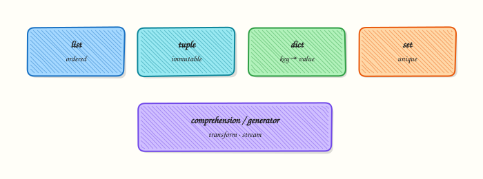

# Data Structures — Comprehensions and Generators

## Overview

DevOps data is rarely one variable. You work with **lists** of hosts, **dictionaries** of labels, **sets** of unique regions, and streams of log lines too large to load at once. Python’s core collections — `list`, `tuple`, `dict`, `set` — plus **comprehensions** and **generators** let you transform that data clearly and efficiently.

A **comprehension** builds a collection in one readable expression (filter + map). A **generator** yields items lazily with `yield` so you can scan a multi-gigabyte log without holding every line in memory. Choosing the wrong structure causes slow scripts, duplicate deploys, or out-of-memory failures on CI runners.

This tutorial builds a small analytics helper: parse sample log lines, use comprehensions for counts and unique values, and stream matches with a generator. You will assert outputs so the behaviour is proven, not guessed.

This is **Tutorial 5** in **Module 5: Data Structures** of the REBASH Academy **Python for DevOps Engineers** series.

## Prerequisites

- [Functions — Parameters and Scope](functions-parameters-and-scope.md)
- Comfortable with loops and basic types

## Learning Objectives

By the end of this tutorial, you will be able to:

- [ ] Choose among list, tuple, dict, and set for ops data
- [ ] Write list/dict/set comprehensions with filters
- [ ] Explain iterators vs generators at a practical level
- [ ] Stream large line-oriented input with a generator
- [ ] Assert transformation results in a lab script

## Architecture

Raw lines enter as an iterable. Comprehensions build small summarised structures. Generators stream filtered lines without materialising the whole file.



## Theory

### What it is

| Structure | Ordered | Mutable | Unique keys/items | Typical use |
|-----------|:-------:|:-------:|:-----------------:|-------------|
| `list` | yes | yes | no | Host lists, argv-like sequences |
| `tuple` | yes | no | no | Fixed records, dict keys |
| `dict` | yes (3.7+) | yes | keys unique | Labels, counts, JSON-like objects |
| `set` | no | yes | items unique | Dedup regions, membership tests |

```python
hosts = ["web-01", "web-02"]
labels = {"env": "prod", "team": "platform"}
regions = {"eu-west-1", "us-east-1"}
```

**Comprehensions:**

```python
active = [h for h in hosts if h.startswith("web")]
index = {h: i for i, h in enumerate(hosts)}
uniq = {line.split()[0] for line in lines if line.strip()}
```

**Generator:**

```python
def errors(path):
    with open(path, encoding="utf-8") as fh:
        for line in fh:
            if " ERROR " in line:
                yield line.rstrip()
```

### Why it matters

Membership tests on large lists are slow; sets are O(1) average. Loading a huge log with `readlines()` can kill a small CI agent. Comprehensions reduce noisy loop boilerplate when the transform is small. Generators keep memory flat for line scanners, Ansible-style inventories, and API pagination stubs.

### How it works

1. **Collect** — choose structure by access pattern (index vs key vs membership).  
2. **Transform** — comprehension or helper function.  
3. **Dedup** — `set` or `dict.fromkeys` when order matters.  
4. **Stream** — generator or generator expression `(x for x in items)`.  
5. **Materialise only when needed** — `list(generator)` for small results / asserts.

### Key concepts and comparisons

| Approach | Memory | Prefer when |
|----------|--------|-------------|
| List comprehension | Builds full list | Result is small and reused |
| Generator / `yield` | Lazy | Large files, one-pass scans |
| Generator expression | Lazy | Inline streaming into `sum`/`any` |
| `dict` counting | Moderate | Histograms of status codes |

| Pattern | Prefer when | Avoid when |
|---------|-------------|------------|
| `set` for membership | Hot “is host allowed?” checks | You need duplicates or positions |
| `tuple` for records | Immutable rows | You must update fields often → use dict/dataclass |
| Nested comprehensions | Short & clear | Complex logic — use a loop/function |

### Common pitfalls

- Using a list for repeated membership tests over thousands of hosts.
- Mutating a list while iterating over it.
- Assuming sets are ordered (do not rely on order for stable CI diffs).
- Calling `list(huge_generator)` accidentally in production.
- Dict key errors when a label is missing — use `.get` or validate.

## Hands-on Lab

### Objective

Under `~/rebash-python/lab05`, create sample logs and `log_stats.py` that uses list/dict/set comprehensions plus a generator to extract ERROR lines, with asserts on the results.

### Prerequisites

- Python 3.11+ venv skills
- Modules 1–4 concepts

### Lab environment

Workspace: `~/rebash-python/lab05`

```bash
mkdir -p ~/rebash-python/lab05 && cd ~/rebash-python/lab05
set -euo pipefail
python3 -m venv .venv
# shellcheck disable=SC1091
source .venv/bin/activate
python -c 'import sys; assert sys.version_info >= (3, 11)'
python -V | tee python-version.txt
```

**Expected output:** venv ready; version file present.

### Real-world scenario

A service writes large access/error logs on a jump host. You need a safe summary: count levels, unique hosts, and stream ERROR lines without loading the entire file. The script must assert fixture expectations so CI can catch regressions.

### Step-by-step tasks

#### Task 1 – Fixture log and stats script

```bash
cd ~/rebash-python/lab05
set -euo pipefail
# shellcheck disable=SC1091
source .venv/bin/activate
```

Create `app.log`:

```text
2026-08-02T10:00:01Z INFO web-01 ready
2026-08-02T10:00:02Z ERROR web-01 upstream timeout
2026-08-02T10:00:03Z INFO web-02 ready
2026-08-02T10:00:04Z WARN api-01 retrying
2026-08-02T10:00:05Z ERROR api-01 db connection reset
2026-08-02T10:00:06Z INFO web-01 healthy
2026-08-02T10:00:07Z ERROR web-01 upstream timeout
```

Create `log_stats.py`:

```python
"""Comprehensions + generator for log summaries."""
from __future__ import annotations

from collections.abc import Iterator
from pathlib import Path


def parse_level_host(line: str) -> tuple[str, str] | None:
    parts = line.split()
    if len(parts) < 3:
        return None
    # timestamp level host ...
    return parts[1], parts[2]


def summarise(path: Path) -> tuple[dict[str, int], set[str], list[str]]:
    lines = path.read_text(encoding="utf-8").splitlines()
    parsed = [parse_level_host(line) for line in lines if line.strip()]
    pairs = [p for p in parsed if p is not None]
    levels = {level for level, _host in pairs}
    counts = {level: sum(1 for lvl, _ in pairs if lvl == level) for level in levels}
    hosts = {host for _level, host in pairs}
    info_hosts = [host for level, host in pairs if level == "INFO"]
    return counts, hosts, info_hosts


def iter_errors(path: Path) -> Iterator[str]:
    with path.open(encoding="utf-8") as fh:
        for line in fh:
            if " ERROR " in line:
                yield line.rstrip("\n")


def main() -> int:
    small = Path("app.log")
    large = Path("app-large.log")
    counts, hosts, info_hosts = summarise(small)

    assert counts["ERROR"] == 3, counts
    assert counts["INFO"] == 3, counts
    assert hosts == {"web-01", "web-02", "api-01"}, hosts
    assert info_hosts.count("web-01") == 2

    # Generator over large file — count without storing all lines
    error_count = sum(1 for _ in iter_errors(large))
    assert error_count == 3 * 1000, error_count

    first_errors = []
    for line in iter_errors(large):
        first_errors.append(line)
        if len(first_errors) == 2:
            break
    assert all(" ERROR " in line for line in first_errors)

    print(f"counts={counts}")
    print(f"hosts={','.join(sorted(hosts))}")
    print(f"large_error_count={error_count}")
    print("asserts-ok")
    return 0


if __name__ == "__main__":
    raise SystemExit(main())
```

Run:

```bash
# Build a larger stream file for the generator demo (still small enough for lab)
python - << 'PY'
from pathlib import Path
lines = Path("app.log").read_text(encoding="utf-8").splitlines()
out = Path("app-large.log")
with out.open("w", encoding="utf-8") as fh:
    for i in range(1000):
        for line in lines:
            fh.write(f"{line} batch={i}\n")
print(f"wrote {out} lines={1000 * len(lines)}")
PY
test -f app.log
test -f log_stats.py
test -f app-large.log
```

**Expected output:** `app.log`, `app-large.log`, and `log_stats.py` created; large file line count printed.

#### Task 2 – Run asserts and save output

```bash
cd ~/rebash-python/lab05
set -euo pipefail
# shellcheck disable=SC1091
source .venv/bin/activate

python log_stats.py | tee stats-output.txt
grep -F 'asserts-ok' stats-output.txt
grep -F 'large_error_count=3000' stats-output.txt
grep -F 'web-01' stats-output.txt
```

**Expected output:** all asserts pass; output shows counts and `large_error_count=3000`.

#### Task 3 – Comprehension micro-checks

```bash
cd ~/rebash-python/lab05
set -euo pipefail
# shellcheck disable=SC1091
source .venv/bin/activate

python - << 'PY' | tee comps-output.txt
hosts = ["web-01", "web-02", "db-01", "web-01"]
webs = [h for h in hosts if h.startswith("web")]
uniq = {h for h in hosts}
index = {h: i for i, h in enumerate(uniq)}
assert webs == ["web-01", "web-02", "web-01"]
assert uniq == {"web-01", "web-02", "db-01"}
assert set(index) == uniq
print("webs=" + ",".join(webs))
print("uniq=" + ",".join(sorted(uniq)))
print("comps-ok")
PY

grep -F 'comps-ok' comps-output.txt
tar -czf lab05-evidence.tgz app.log log_stats.py stats-output.txt comps-output.txt
ls -l lab05-evidence.tgz | tee evidence-ls.txt
# large log can be removed to save space after success
rm -f app-large.log
```

**Expected output:** comprehension demo passes; evidence archive created; large log removed after proof.

### Validation steps

- [ ] `log_stats.py` asserts on small fixture pass
- [ ] Generator counts `3000` ERROR lines on the large file before cleanup
- [ ] Set/list/dict comprehensions demo prints `comps-ok`
- [ ] `lab05-evidence.tgz` exists

### Common errors and fixes

| Error | Cause | Fix |
|-------|-------|-----|
| `AssertionError` on counts | Fixture edited | Restore `app.log` from Task 1 |
| Memory pressure | Materialised huge list | Keep generator loop; avoid `readlines()` on huge files |
| Host set mismatch | Parsing columns wrong | Confirm `split()` indexes for level/host |
| Order-dependent CI fail | Compared set via list equality | Compare sets or sorted lists |

### Challenge exercise

Add `top_hosts.py` that streams `app.log` with a generator, counts ERROR lines **per host** using a `dict`, and prints the top host. Assert the top host is `web-01` with count `2` on the small fixture. Save `top-hosts.txt`.

### Learning outcomes

- Built summaries with comprehensions
- Deduplicated hosts with a set
- Streamed ERROR lines with a generator
- Asserted both small and large-file behaviours

### Cleanup

```bash
cd ~/rebash-python/lab05
set -euo pipefail
deactivate 2>/dev/null || true
rm -f app-large.log
# rm -rf .venv
# rm -f *.txt lab05-evidence.tgz
```

## Validation

- [ ] Lab finished under `~/rebash-python/lab05/`
- [ ] You can choose set vs list for membership
- [ ] You know when generators beat `readlines()`
- [ ] You can write a filtered list comprehension

## Code Walkthrough

Habits for collections in ops Python:

1. **Pick structure by access pattern** — not by habit  
2. **Comprehend small transforms** — loop when logic is complex  
3. **Stream large inputs** — `yield` line filters  
4. **Assert fixtures** — lock expected counts  
5. **Sort before stable output** — sets have no order guarantee for display  

## Security Considerations

- Treat log lines as untrusted data (injection in downstream shells)  
- Cap how many lines you materialise from a generator  
- Redact secrets if logs may contain tokens  
- Do not execute hostnames/fields as code  
- Be careful writing derived files with world-readable permissions  

## Common Mistakes

!!! warning "Using lists for hot membership tests"
    `host in huge_list` is slow. **Fix:** build a `set` for allow/deny checks.

!!! warning "Materialising a huge generator"
    `list(iter_errors(huge))` can exhaust memory. **Fix:** stream counts/aggregates in one pass.

!!! warning "Mutating a list while iterating"
    Items get skipped or duplicated. **Fix:** build a new list/comprehension.

!!! warning "Relying on set display order in CI snapshots"
    Order can vary across runs/versions. **Fix:** `sorted(set_value)` for output.

## Best Practices

- Prefer `.get()` or validation for optional dict keys  
- Use tuples for immutable records; dicts for evolving labels  
- Name comprehensions’ variables clearly (`for host in hosts`)  
- Document generator functions with yield types (`Iterator[str]`)  
- Keep challenge/production aggregations O(n) single pass when possible  

## Troubleshooting

| Symptom | Likely cause | Fix |
|---------|--------------|-----|
| Wrong ERROR count | Substring mismatch | Match on ` ERROR ` with spaces |
| `KeyError` | Missing level in counts dict | Build keys from observed levels |
| Slow script | Nested scans over large lists | Precompute sets/dicts |
| Empty generator | Path wrong / no matches | `print` first few lines of file |

## Summary

Lists, dicts, sets, comprehensions, and generators are the daily toolkit for ops data. Choose structures on purpose, stream large inputs, and assert results. Next, organise code into importable packages in [Modules, Packages, and Dependencies](modules-packages-and-dependencies.md).

## Interview Questions

**1. When do you choose a `set` over a `list` in automation?**

??? success "Reveal answer"
    Use a **set** when you care about uniqueness or fast membership tests (`host in allowed`). Use a **list** when order and duplicates matter (ordered pipeline steps, repeated values).

**2. What is the difference between an iterator and a generator?**

??? success "Reveal answer"
    An **iterator** is any object with `__next__` (and usually `__iter__`). A **generator** is a convenient way to build an iterator with `yield` or a generator expression. Generators are lazy: they produce values on demand.

**3. Why can `readlines()` be dangerous on production logs?**

??? success "Reveal answer"
    It loads the **entire file** into a list of strings. On multi-gigabyte logs this can exhaust CI or host memory. Prefer iterating the file object or a generator that yields matching lines.

**4. Rewrite a simple filter loop as a list comprehension and explain when not to.**

??? success "Reveal answer"
    Loop: build `out` with `if`. Comprehension: `out = [h for h in hosts if cond]`. Avoid heavy nested comprehensions with side effects — use a function/loop when logic needs statements, logging, or error handling.

**5. How do dictionary comprehensions help when building label maps?**

??? success "Reveal answer"
    They build `dict`s declaratively, for example `{h: "prod" for h in hosts}` or indexing `{name: idx for idx, name in enumerate(names)}`. Keep them readable; complex value logic belongs in a helper.

**6. What does laziness mean for a generator in a log scanner?**

??? success "Reveal answer"
    Work happens **as you iterate**. Memory stays roughly constant because lines are processed one at a time. If you never iterate, little work runs. If you `list()` the generator, laziness is lost.

**7. How would you count ERROR lines per host in one pass?**

??? success "Reveal answer"
    Stream lines, parse host, and do `counts[host] = counts.get(host, 0) + 1` (or `collections.Counter`). Avoid nested full-file scans per host.

**8. Why sort set contents before printing in CI evidence?**

??? success "Reveal answer"
    Sets are unordered. Sorting produces **stable** text for diffs and tickets. Compare with set equality in asserts; use sorted strings for human output.

## Related Tutorials

- [Python for DevOps Engineers – Overview](index.md)
- [Functions — Parameters and Scope](functions-parameters-and-scope.md) *(previous)*
- [Modules, Packages, and Dependencies](modules-packages-and-dependencies.md) *(next)*
- [File Handling — pathlib, JSON, YAML, CSV](file-handling-pathlib-json-yaml-csv.md) *(related)*

## References

- [Data Structures](https://docs.python.org/3/tutorial/datastructures.html) — Python tutorial  
- [Collections Abstract Base Classes](https://docs.python.org/3/library/collections.abc.html) — `Iterator`  
- Track index: [Python for DevOps Engineers](index.md)
