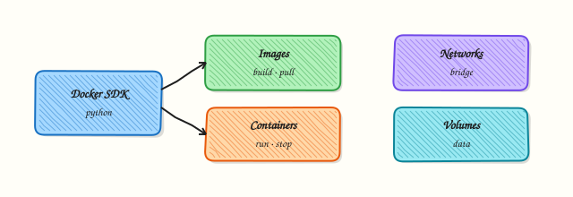

# Docker SDK Automation

## Overview

The **Docker SDK for Python** (`docker` package) talks to the same Engine API as the `docker` CLI — usually over the Unix socket `unix:///var/run/docker.sock`, or via `DOCKER_HOST` for a remote daemon. You can list containers and images as structured objects instead of scraping CLI text.

DevOps automation invents containers for tests, audits what runs on a builder, and sometimes cleans unused images. Surprise `prune` or `rmi -f` on a shared host deletes layers other jobs need. This course defaults to **read-only inventory** and **dry-run** scripts. Destructive cleanup belongs behind confirmation and change control — not in the happy path of a learning lab.

If the daemon is unavailable (common on locked-down laptops), you still practise by validating a client script against **fixture JSON** that looks like `docker version` / `docker ps` output. That keeps Continuous Integration (CI) green without requiring Docker-in-Docker everywhere.

This is **Tutorial 17** in **Module 17: Docker Automation** of the REBASH Academy **Python for DevOps Engineers** series. It is written for Cloud, DevOps, Platform, and Site Reliability Engineering (SRE) engineers. By the end you will produce Docker inventory evidence from a live daemon **or** an honest dry-run fixture path.

## Prerequisites

- [Git Automation — GitHub and GitLab](git-automation-github-and-gitlab.md)
- [Linux Automation](linux-automation-subprocess-and-psutil.md) habits (timeouts, exit codes)
- Python 3.10+ and a virtual environment
- Optional: Docker Engine running locally — otherwise use the fixture path

## Learning Objectives

By the end of this tutorial, you will be able to:

- [ ] Connect with `docker.from_env()` or fall back to subprocess `docker version` / `ps`
- [ ] List containers and images in a structured report
- [ ] Explain networks and volumes at an operations level
- [ ] Design cleanup as dry-run by default (no surprise deletes)
- [ ] Validate a client against fixture JSON when the daemon is down
- [ ] Note registry auth as a separate concern from local inventory

## Architecture

Your Python client reaches the Engine API (SDK or CLI). Inventory lists containers, images, networks, and volumes. Cleanup plans are dry-run unless explicitly applied later — this lab does not delete host images.



## Theory

### What it is

`docker.from_env()` builds a client from environment variables and default socket paths. `client.ping()` confirms the daemon is reachable. Containers expose `status` and names; images expose tags and IDs. Networks and volumes are separate namespaces. Registry login/pull/push need credentials from the environment or helpers — never from source code.

```python
import docker

client = docker.from_env()
client.ping()
for container in client.containers.list(all=True):
    print(container.name, container.status)
```

### Why it matters

CI builders fill disks with dangling images. Structured inventory shows what is running before you touch anything. Subprocess wrappers break when CLI columns change; the SDK returns attributes. Pin images by **digest** for promotion (`image@sha256:…`), not only by floating tags like `latest`.

### How it works

1. **Detect daemon** — SDK ping or `docker version`.  
2. **List** — containers (`all=True`), images, optional networks/volumes.  
3. **Report JSON** — IDs, names, status.  
4. **Dry-run cleanup plan** — compute “would remove” without calling delete.  
5. **Registry** — separate auth; pull digests in deploy jobs.

| Object | Read ops | Dangerous ops (avoid in lab) |
|--------|----------|-------------------------------|
| Container | list, inspect | rm -f running prod |
| Image | list | rmi / prune -a |
| Network / volume | list | rm in-use resources |

### Key concepts and comparisons

| Approach | Prefer when | Avoid when |
|----------|-------------|------------|
| Docker SDK | Structured automation | Daemon policy blocks socket |
| `subprocess` docker | Quick inventory, SDK blocked | Parsing unstable tables |
| Fixtures | CI without Docker | Claiming live daemon proof |

### Common pitfalls

- Running `prune -af` on shared agents.  
- Assuming socket access equals root-equivalent rights (it often does).  
- Using `:latest` in production deploys.  
- Forgetting Windows/`DOCKER_HOST` differences.  
- Destructive `rmi` without checking dependents.

## Hands-on Lab

### Objective

Under `~/rebash-python/lab17`, inventory Docker with the SDK or CLI when available; otherwise dry-run against fixtures. Produce `docker-inventory.json` without deleting images or containers on the host.

### Prerequisites

- Python 3.10+
- Optional: Docker daemon + `docker` CLI
- Optional: `pip install docker` for the SDK path

### Lab environment

Workspace: `~/rebash-python/lab17`

``` {.bash .ra-terminal title="Terminal"}
mkdir -p ~/rebash-python/lab17/fixtures && cd ~/rebash-python/lab17
set -euo pipefail
python3 -m venv .venv
# shellcheck disable=SC1091
source .venv/bin/activate
python -m pip install -U pip
python -m pip install 'docker>=7,<8' || true
command -v docker >/dev/null && docker version 2>/dev/null | head -n 20 | tee docker-server-version.txt || echo "no-daemon" | tee docker-server-version.txt
```

!!! example "Expected output"
    venv ready; `docker-server-version.txt` has version text or `no-daemon`.


### Real-world scenario

Build agents are running out of disk. Before any cleanup policy, platform wants a **read-only** inventory of containers and images from each agent. Laptops without Docker must still unit-test the report parser using fixtures. Nobody may `rmi -f` without a change ticket.

### Step-by-step tasks

#### Task 1 – Fixtures for dry-run mode


Create `fixtures/version.json`:

```json title="version.json"
{
  "Client": {"Version": "27.0.0"},
  "Server": {"Version": "27.0.0", "Os": "linux", "Arch": "amd64"}
}
```

Create `fixtures/ps.json`:

```json title="ps.json"
{
  "containers": [
    {"Id": "abc123", "Names": ["/rebash-lab-web"], "Status": "Up 2 hours", "Image": "nginx:1.27"},
    {"Id": "def456", "Names": ["/rebash-lab-redis"], "Status": "Exited (0) 1 hour ago", "Image": "redis:7"}
  ]
}
```

Create `fixtures/images.json`:

```json title="images.json"
{
  "images": [
    {"Id": "sha256:111", "Tags": ["nginx:1.27"], "Size": 187000000},
    {"Id": "sha256:222", "Tags": ["redis:7"], "Size": 116000000}
  ]
}
```

Run:

``` {.bash .ra-terminal title="Terminal"}
cd ~/rebash-python/lab17
set -euo pipefail
echo "fixtures ok"
```

!!! example "Expected output"
    `fixtures ok`; three JSON files present.


#### Task 2 – Inventory client (live or dry-run)


Create `docker_inventory.py`:

```python title="docker_inventory.py"
#!/usr/bin/env python3
"""Read-only Docker inventory — SDK, CLI, or fixtures. No deletes."""
from __future__ import annotations

import json
import os
import re
import shutil
import subprocess
import sys
from pathlib import Path

ROOT = Path(__file__).resolve().parent
FIX = ROOT / "fixtures"


def load_fixture_report() -> dict:
    version = json.loads((FIX / "version.json").read_text(encoding="utf-8"))
    ps = json.loads((FIX / "ps.json").read_text(encoding="utf-8"))
    images = json.loads((FIX / "images.json").read_text(encoding="utf-8"))
    return {
        "mode": "dry-run-fixture",
        "version": version,
        "containers": ps["containers"],
        "images": images["images"],
        "policy": "read-only; no rm/prune",
    }


def try_sdk() -> dict | None:
    try:
        import docker  # type: ignore
    except ImportError:
        return None
    try:
        client = docker.from_env()
        client.ping()
        containers = [
            {
                "Id": c.id[:12],
                "Names": [c.name],
                "Status": c.status,
                "Image": c.image.tags[0] if c.image.tags else str(c.image.short_id),
            }
            for c in client.containers.list(all=True)
        ]
        images = [
            {
                "Id": img.id.split(":")[-1][:12],
                "Tags": img.tags,
                "Size": img.attrs.get("Size"),
            }
            for img in client.images.list()
        ]
        ver = client.version()
        return {
            "mode": "live-sdk",
            "version": {"Server": {"Version": ver.get("Version")}},
            "containers": containers,
            "images": images,
            "policy": "read-only; no rm/prune",
        }
    except Exception as exc:  # noqa: BLE001
        return {"_sdk_error": type(exc).__name__}


def try_cli() -> dict | None:
    """CLI path avoids Go --format templates (MkDocs-safe, easy to copy)."""
    if shutil.which("docker") is None:
        return None
    try:
        ver = subprocess.run(
            ["docker", "version"],
            capture_output=True,
            text=True,
            timeout=15,
            check=False,
        )
        if ver.returncode != 0:
            return None
        match = re.search(r"Server:\s*(?:.|\n)*?Version:\s*(\S+)", ver.stdout or "")
        server_version = match.group(1) if match else "unknown"
        ps = subprocess.run(
            ["docker", "ps", "-a", "--no-trunc"],
            capture_output=True,
            text=True,
            timeout=30,
            check=True,
        )
        lines = (ps.stdout or "").splitlines()
        containers = []
        # Header + rows; keep a compact preview for evidence
        for line in lines[1:6]:
            containers.append({"raw": line.strip()})
        return {
            "mode": "live-cli",
            "version": {"Server": {"Version": server_version}},
            "containers": containers,
            "images": [],
            "policy": "read-only; no rm/prune",
            "note": "CLI path stores row previews; prefer SDK or fixtures for structured fields",
        }
    except (subprocess.SubprocessError, OSError):
        return None


def main() -> int:
    if "--prune" in sys.argv or "--rmi" in sys.argv:
        print("REFUSED: destructive flags disabled in lab17", file=sys.stderr)
        return 2
    if os.environ.get("LAB17_FORCE_FIXTURE") == "1":
        report = load_fixture_report()
    else:
        report = try_sdk()
        if report is None or report.get("_sdk_error"):
            report = try_cli() or load_fixture_report()
    path = ROOT / "docker-inventory.json"
    path.write_text(json.dumps(report, indent=2) + "\n", encoding="utf-8")
    print(json.dumps({"mode": report.get("mode"), "containers": len(report.get("containers", [])), "policy": report.get("policy")}, indent=2))
    assert report.get("policy", "").startswith("read-only")
    assert "containers" in report
    return 0


if __name__ == "__main__":
    raise SystemExit(main())
```

Run:

``` {.bash .ra-terminal title="Terminal"}
cd ~/rebash-python/lab17
set -euo pipefail
# shellcheck disable=SC1091
source .venv/bin/activate
python docker_inventory.py | tee inventory-run.txt
test -s docker-inventory.json
```

!!! example "Expected output"
    `docker-inventory.json` with `mode` of `live-sdk`, `live-cli`, or `dry-run-fixture`; policy read-only.


#### Task 3 – Force fixture, refuse destructive flags, pack evidence


Create `pack_evidence.py`:

```python title="pack_evidence.py"
import json
from pathlib import Path
d = json.loads(Path("docker-inventory.json").read_text(encoding="utf-8"))
Path("lab17-evidence.json").write_text(json.dumps({"inventory": d, "prune_refused": True}, indent=2) + "\n", encoding="utf-8")
print("evidence ok")
```

Run:

``` {.bash .ra-terminal title="Terminal"}
cd ~/rebash-python/lab17
set -euo pipefail
# shellcheck disable=SC1091
source .venv/bin/activate

LAB17_FORCE_FIXTURE=1 python docker_inventory.py | tee fixture-run.txt
python -c 'import json; d=json.load(open("docker-inventory.json")); assert d["mode"]=="dry-run-fixture"; print("fixture ok")'

set +e
python docker_inventory.py --prune >prune-denied.txt 2>&1
rc=$?
set -e
test "$rc" -eq 2
grep -F 'REFUSED' prune-denied.txt
python pack_evidence.py
```

!!! example "Expected output"
    fixture mode works; `--prune` exits 2; `lab17-evidence.json` written.


### Validation steps

- [ ] Inventory runs without deleting anything
- [ ] Fixture path works with `LAB17_FORCE_FIXTURE=1`
- [ ] Destructive flags refused
- [ ] Evidence under `~/rebash-python/lab17`

### Common errors and fixes

| Error | Cause | Fix |
|-------|-------|-----|
| `Error while fetching server API version` | Daemon down / no permission | Use fixture mode |
| `Permission denied` on docker.sock | User not in `docker` group | Fixture path, or fix group on practice VM |
| `ModuleNotFoundError: docker` | pip install skipped | `pip install docker` or rely on CLI/fixtures |
| Format string issues in docs | Macros vs Go templates | Prefer fixtures; escape in MkDocs when needed |

### Challenge exercise

Add a **dry-run cleanup plan** function that lists image tags from the inventory older than a fake cutoff (hard-code a rule on fixture data) and writes `cleanup-plan.json` with `{"would_remove":[...],"applied":false}`. Do **not** call delete APIs. Optionally include network/volume name lists in the inventory when using the SDK.

### Learning outcomes

- Inventoried Docker via SDK, CLI, or fixtures
- Kept policy read-only with refused prune flags
- Validated parsers against fixture JSON
- Packed evidence for a ticket

### Cleanup

``` {.bash .ra-terminal title="Terminal"}
cd ~/rebash-python/lab17
deactivate 2>/dev/null || true
# This lab does not remove host images/containers.
# rm -rf .venv
```

## Validation

- [ ] Lab finished under `~/rebash-python/lab17/`
- [ ] You can explain SDK vs CLI vs fixture modes
- [ ] You treat docker.sock access as privileged
- [ ] You know why prune is gated

## Code Walkthrough

Production Docker automation usually follows:

1. **Ping / version** — daemon reachable?  
2. **Inventory** — containers, images, disk pressure  
3. **Plan** — dry-run removals with age/tag rules  
4. **Apply** — only with confirmation on dedicated builders  
5. **Evidence** — before/after image lists  

## Security Considerations

- Access to docker.sock is often root-equivalent — restrict membership  
- Do not expose the daemon TCP API without TLS and auth  
- Scan images; pin digests for production  
- Keep registry credentials in helpers / CI secrets  
- Never `docker prune` production nodes without a window  

## Common Mistakes

!!! warning "Running `docker system prune -af` in a cron on shared agents"
    Breaks other jobs mid-build. **Fix:** inventory first; prune only unused resources on dedicated cleaners with limits.

!!! warning "Shipping `:latest`"
    Non-reproducible deploys. **Fix:** pin tags or digests; record digest in evidence.

!!! warning "Assuming SDK always available"
    Some hosts block the socket. **Fix:** CLI fallback + fixtures in CI.

!!! warning "Deleting volumes casually"
    Data loss. **Fix:** list and confirm; never default wipe.

## Best Practices

- Dry-run by default for any cleanup tool  
- Label containers with owner/job id  
- Separate build agents from production nodes  
- Prefer multi-stage builds and small base images (image hygiene)  
- Test automation against fixtures and a scratch daemon  

## Troubleshooting

| Symptom | Likely cause | Fix |
|---------|--------------|-----|
| Ping fails | Daemon stopped | `systemctl` / Docker Desktop; or fixtures |
| Empty ps | No containers | Still success — report empty list |
| Slow image list | Many layers | Paginate / filter dangling only |
| CI cannot use socket | Hardened runner | Fixture mode unit tests |

## Summary

Docker automation in Python should **inventory first**, prefer the **SDK or CLI with timeouts**, and keep **prune/rmi** behind confirmation — with fixtures when the daemon is missing. Next, talk to the API server with the [Kubernetes Python Client](kubernetes-python-client-automation.md).

## Interview Questions

**1. Why is access to `docker.sock` considered high privilege?**

??? success "Reveal answer"
    The Engine API can mount host paths, run privileged containers, and effectively reach root on the host. Membership in the `docker` group or mounting the socket into a container is a trust decision. Inventory tools still need care; never expose the socket on an open network.

**2. When do you prefer the Docker SDK over scraping `docker ps`?**

??? success "Reveal answer"
    The SDK returns structured attributes that survive CLI format changes and locales. Scraping tables breaks easily. Use the CLI when the SDK is blocked or for quick one-offs, and still avoid fragile column parsing when possible (`--format` with stable fields).

**3. How should a cleanup tool behave by default?**

??? success "Reveal answer"
    **Dry-run**: compute candidates, write a plan file, exit. Apply only with an explicit flag on disposable builders, with logs and a change record. Never prune production nodes from a learning script.

**4. What is the difference between stopping a container and removing an image?**

??? success "Reveal answer"
    Stopping ends a running process but keeps the container filesystem layers referenceable. Removing an image deletes filesystem layers that containers may need to start. Removing the wrong image breaks rollbacks. Inventory and dependency checks come first.

**5. How do fixtures help Docker automation tests?**

??? success "Reveal answer"
    Many CI systems lack a daemon. Fixtures prove your parser and report shape. Label results `dry-run-fixture` so nobody confuses them with live inventory. Add a separate job on agents that have Docker for integration checks.

**6. Why pin images by digest in deployment automation?**

??? success "Reveal answer"
    Tags like `latest` or even `1.27` can move. Digests (`sha256:…`) identify exact bytes. Promotion pipelines should record digests in evidence so incidents can answer “what exactly ran?”.

**7. How do networks and volumes fit into an inventory report?**

??? success "Reveal answer"
    They are separate Engine objects. Unused networks/volumes often waste space or confuse debugging. List them read-only; delete only when unused and approved. Attach volume names to the services that own them in real platforms.

## Related Tutorials

- [Python for DevOps Engineers – Overview](index.md)
- [Git Automation — GitHub and GitLab](git-automation-github-and-gitlab.md) *(previous)*
- [Kubernetes Python Client Automation](kubernetes-python-client-automation.md) *(next)*
- [Lab — Docker Cleanup Tool](../labs/python-docker-cleanup-tool.md) *(more practice)*
- [Docker course](../docker/index.md)

## References

- [Docker SDK for Python](https://docker-py.readthedocs.io/)  
- [Docker Engine API](https://docs.docker.com/engine/api/)  
- Track index: [Python for DevOps Engineers](index.md)
