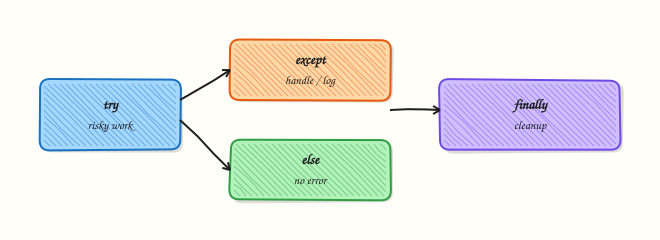

# Error Handling and Exceptions

## Overview

Automation fails: networks drop, files go missing, APIs return 500, credentials expire. Good DevOps Python catches **specific** exceptions, cleans up in `finally`, raises clear errors, and returns a non-zero exit code so Continuous Integration (CI) can see the problem.

Silent `except Exception: pass` hides outages. Use **try** / **except** / **else** / **finally**, custom exception types for tool boundaries, and a **retry** helper with a hard limit for flaky calls — then prove the intentional fail path still exits non-zero.

This is **Tutorial 8** in **Module 8: Error Handling** of the REBASH Academy **Python for Cloud & DevOps Engineers** series. It is written for DevOps, Cloud, Platform, and Site Reliability Engineering (SRE) engineers. By the end, you will have a working retry helper and evidence under `~/rebash-python/lab08`.

## Prerequisites

- [File Handling — pathlib, JSON, YAML, CSV](file-handling-pathlib-json-yaml-csv.md)
- Python 3.12+ with a project virtual environment (venv)

## Learning Objectives

By the end of this tutorial, you will be able to:

- [ ] Use `try` / `except` / `else` / `finally` correctly
- [ ] Catch specific exceptions instead of bare `Exception` by default
- [ ] Define a small custom exception type and raise it with context
- [ ] Build a retry helper that fails after N attempts
- [ ] Map failures to non-zero process exit codes

## Architecture

Risky operations sit inside a guarded block. Handlers map exceptions to messages and exit codes. Cleanup always runs. Optional retries wrap the same call with a limit.



## Theory

### What it is

An **exception** is an error object that interrupts normal flow. You **raise** it with `raise`, and **catch** it with `except`.

```python
try:
    data = Path("missing.json").read_text(encoding="utf-8")
except FileNotFoundError as exc:
    raise SystemExit(f"inventory missing: {exc}") from exc
else:
    print("loaded", len(data))
finally:
    print("cleanup runs either way")
```

- **`else`** runs only if no exception was raised in `try`.
- **`finally`** always runs (success, failure, or `return`).
- **`raise ... from exc`** chains the original cause for better tracebacks.

### Why it matters

CI needs clear exit codes: `0` success, non-zero failure. Operators need messages that say *which host* or *which file* failed. Broad catches hide bugs. Infinite retries hide outages and can hammer a failing API.

### How it works

1. **Validate early** — check inputs before the risky call (defensive programming).
2. **Catch narrow types** — `FileNotFoundError`, `TimeoutError`, `ValueError`.
3. **Translate** — map to a custom exception or a clear `SystemExit` / return code.
4. **Clean up** — close files, temp dirs, or locks in `finally`.
5. **Retry only when useful** — transient network errors; not for “file permanently missing”.

Custom exceptions mark a tool boundary (`InventoryError`). Retries wrap only transient failures with a hard attempt limit.

### Key concepts and comparisons

| Construct | Runs when | Typical use |
|-----------|-----------|-------------|
| `try` / `except SpecificError` | Risky work / that error | Recover or re-raise clearly |
| `else` / `finally` | Success only / always | Success logging / cleanup |
| `raise X from e` | You choose | Keep the cause chain |
| Retry with limit | Transient network/API errors | Not for missing local files |
| Exit code mapping | CLIs and CI jobs | Never swallow and exit 0 |

### Common pitfalls

- Broad `except Exception:` without a non-zero exit
- Retrying forever (or retrying permanent errors such as missing files)
- Bare `except:` catching `KeyboardInterrupt` / `SystemExit`
- Raising without `from` and losing the root cause

## Hands-on Lab

### Objective

Implement `try`/`except`/`else`/`finally`, a custom `InventoryError`, and a retry helper with an intentional fail path. Save evidence under `~/rebash-python/lab08`.

### Prerequisites

- Python 3.12+ and write access under your home directory

### Lab environment

Workspace: `~/rebash-python/lab08`

```bash
mkdir -p ~/rebash-python/lab08 && cd ~/rebash-python/lab08
set -euo pipefail
python3 -m venv .venv
source .venv/bin/activate
python -c "import sys; print(sys.version)"
```

**Expected output:** Python 3.12+ version string; `.venv` exists.

### Real-world scenario

Inventory fetch is flaky. You need retries for transient errors, a custom exception for permanent problems, and a non-zero exit when retries are exhausted so CI turns red instead of going green with empty data.

### Step-by-step tasks

#### Task 1 – Custom exception with try/except/else/finally

```bash
cd ~/rebash-python/lab08
set -euo pipefail
source .venv/bin/activate
```

Create `inventory_errors.py`:

```python
from __future__ import annotations

from pathlib import Path


class InventoryError(Exception):
    """Inventory could not be loaded or validated."""


def load_inventory(path: Path, cleanup_log: Path | None = None) -> str:
    handle = None
    try:
        handle = path.open(encoding="utf-8")
        text = handle.read()
    except FileNotFoundError as exc:
        raise InventoryError(f"missing inventory: {path}") from exc
    else:
        if not text.strip():
            raise InventoryError(f"empty inventory: {path}")
        return text
    finally:
        if handle is not None:
            handle.close()
        if cleanup_log is not None:
            cleanup_log.write_text("finally-ran\n", encoding="utf-8")
```

Run:

```bash
python << 'PY'
from pathlib import Path
from inventory_errors import InventoryError, load_inventory

root = Path.home() / "rebash-python" / "lab08"
finally_log = root / "finally-log.txt"
(root / "hosts.txt").write_text("web-01\nweb-02\n", encoding="utf-8")
assert "web-01" in load_inventory(root / "hosts.txt", finally_log)
assert finally_log.read_text(encoding="utf-8") == "finally-ran\n"

for label, path, setup in (
    ("missing", root / "no-such-hosts.txt", None),
    ("empty", root / "empty.txt", ""),
):
    if setup is not None:
        path.write_text(setup, encoding="utf-8")
    try:
        load_inventory(path, finally_log)
    except InventoryError as exc:
        (root / f"task1-{label}.txt").write_text(str(exc) + "\n", encoding="utf-8")
    else:
        raise SystemExit(f"expected InventoryError for {label}")
print("task1 ok")
PY
```

**Expected output:** `task1 ok`; `finally-log.txt` says `finally-ran`; missing/empty error files exist.

#### Task 2 – Retry helper with intentional fail path

```bash
cd ~/rebash-python/lab08
set -euo pipefail
source .venv/bin/activate
```

Create `retry_helper.py`:

```python
from __future__ import annotations

import time
from collections.abc import Callable
from typing import TypeVar

T = TypeVar("T")


class RetryError(Exception):
    """Raised when all retry attempts fail."""


def retry(
    fn: Callable[[], T],
    *,
    attempts: int = 3,
    delay_sec: float = 0.05,
    retry_on: tuple[type[BaseException], ...] = (TimeoutError,),
) -> T:
    last: BaseException | None = None
    for i in range(1, attempts + 1):
        try:
            return fn()
        except retry_on as exc:
            last = exc
            if i == attempts:
                break
            time.sleep(delay_sec)
    raise RetryError(f"failed after {attempts} attempts: {last}") from last
```

Run:

```bash
python << 'PY'
from pathlib import Path
from retry_helper import RetryError, retry

root = Path.home() / "rebash-python" / "lab08"
state = {"n": 0}

def flaky_ok():
    state["n"] += 1
    if state["n"] < 3:
        raise TimeoutError(f"transient #{state['n']}")
    return "ready"

result = retry(flaky_ok, attempts=3, delay_sec=0.01)
assert result == "ready"
(root / "task2-retry-ok.txt").write_text(f"result={result}\ncalls={state['n']}\n", encoding="utf-8")

def always_fail():
    raise TimeoutError("still down")

try:
    retry(always_fail, attempts=3, delay_sec=0.01)
except RetryError as exc:
    (root / "task2-retry-fail.txt").write_text(str(exc) + "\n", encoding="utf-8")
else:
    raise SystemExit("expected RetryError")
print("task2 ok")
PY
```

**Expected output:** `task2 ok`; `task2-retry-ok.txt` shows `result=ready`; `task2-retry-fail.txt` mentions failed attempts.

#### Task 3 – CLI-style exit codes

```bash
cd ~/rebash-python/lab08
set -euo pipefail
source .venv/bin/activate
```

Create `run_check.py`:

```python
from __future__ import annotations

import sys
from pathlib import Path

from inventory_errors import InventoryError, load_inventory
from retry_helper import RetryError, retry


def main(argv: list[str]) -> int:
    root = Path.home() / "rebash-python" / "lab08"
    mode = argv[1] if len(argv) > 1 else "ok"
    if mode == "ok":
        text = load_inventory(root / "hosts.txt")
        print(f"hosts_loaded={len(text.splitlines())}")
        return 0
    if mode == "missing":
        try:
            load_inventory(root / "no-such-hosts.txt")
        except InventoryError as exc:
            print(exc, file=sys.stderr)
            return 2
        return 0
    if mode == "retry-fail":
        def boom() -> None:
            raise TimeoutError("down")

        try:
            retry(boom, attempts=2, delay_sec=0.01)
        except RetryError as exc:
            print(exc, file=sys.stderr)
            return 3
        return 0
    print("unknown mode", mode, file=sys.stderr)
    return 1


if __name__ == "__main__":
    raise SystemExit(main(sys.argv))
```

Run:

```bash
python run_check.py ok | tee task3-ok.txt
test "$(python run_check.py ok >/dev/null; echo $?)" -eq 0
test "$(python run_check.py missing >/dev/null 2>task3-missing.err; echo $?)" -eq 2
test "$(python run_check.py retry-fail >/dev/null 2>task3-retry.err; echo $?)" -eq 3
echo "exit-codes-ok" | tee task3-summary.txt
```

**Expected output:** `task3-ok.txt` shows host count; exit code 2 for missing; exit code 3 for retry-fail; `task3-summary.txt` says `exit-codes-ok`.

### Validation steps

- [ ] `InventoryError` is raised for missing and empty files
- [ ] Retry succeeds on the third call for the flaky function
- [ ] Retry raises `RetryError` when all attempts fail
- [ ] `run_check.py` returns 0 / 2 / 3 for the three modes

### Common errors and fixes

| Error | Cause | Fix |
|-------|-------|-----|
| Exit code always 0 | Exception caught and ignored | Re-raise or `return` non-zero in `main` |
| `RetryError` never raised | `attempts` too high / function succeeds | Use the intentional `always_fail` path |
| File left open | No `finally` / context manager | Use `with` or close in `finally` |
| Lost root cause | `raise X` without `from` | Use `raise X(...) from exc` |

### Challenge exercise

Extend `retry_helper.py` with a `on_retry` callback that appends one line per attempt to `retry-log.txt` (attempt number + exception type). Prove three lines appear for the `always_fail` path. Do not change the successful flaky path behaviour.

### Learning outcomes

- Used `try`/`except`/`else`/`finally` with a custom exception
- Built a bounded retry helper and proved success and fail paths
- Mapped errors to CI-friendly exit codes

### Cleanup

```bash
cd ~/rebash-python/lab08
set -euo pipefail
# rm -rf .venv __pycache__ *.py *.txt *.err
deactivate 2>/dev/null || true
```

## Validation

- [ ] Lab finished under `~/rebash-python/lab08/` with evidence files
- [ ] You can explain `else` vs `finally`
- [ ] You catch specific exceptions for ops tools
- [ ] You can describe when retries help and when they hide outages

## Code Walkthrough

Production habits for errors:

1. **Validate inputs** before the network or file call  
2. **Catch narrow types** at the boundary  
3. **Chain causes** with `raise ... from exc`  
4. **Clean up in `finally` or `with`**  
5. **Exit non-zero** from CLI `main` when work failed  

## Security Considerations

- Do not put secrets in exception messages that may appear in CI logs
- Do not catch and ignore TLS/certificate errors to “make it work”
- Limit retries so failing auth does not look like a hang
- Fail closed when inventory or policy files are missing
- Avoid bare `except:` (can swallow `KeyboardInterrupt`)

## Common Mistakes

!!! warning "Catching `Exception` and continuing"
    Bugs disappear and CI stays green. **Fix:** catch specific types and exit non-zero when the job cannot succeed.

!!! warning "Retrying permanent errors"
    Missing files will not appear after ten sleeps. **Fix:** retry only transient types (`TimeoutError`, selected HTTP 5xx).

!!! warning "Raising without chaining"
    Operators lose the original traceback. **Fix:** `raise InventoryError(...) from exc`.

!!! warning "Cleanup only on the success path"
    Temp files and locks leak on failure. **Fix:** use `finally` or context managers.

## Best Practices

- One custom exception family per tool boundary (`InventoryError`, `DeployError`)
- Document exit codes in `--help` or README
- Keep retry delay small in tests; configurable in production
- Prefer `with` for files over manual `finally` when possible
- Unit-test both the success path and the fail path

## Troubleshooting

| Symptom | Likely cause | Fix |
|---------|--------------|-----|
| CI green but no work done | Swallowed exception | Fail the job; assert exit code |
| Traceback too short | Exception converted poorly | Chain with `from` |
| Too many API calls | High attempts / no backoff | Cap attempts; add delay |
| File descriptor leak | Open without close | Use `with path.open(...)` |
| `SystemExit` caught | Broad `except Exception` | Do not catch `BaseException` |

## Summary

Clear exceptions, bounded retries, and honest exit codes make automation trustworthy. Catch what you can handle, clean up always, and fail loudly when you cannot succeed. Next, model hosts and checks with classes in [OOP — Classes and Dataclasses](oop-classes-and-dataclasses.md).

## Interview Questions

**1. What is the difference between `else` and `finally` on a `try` block?**

??? success "Reveal answer"
    **`else`** runs only when `try` completes without an exception. **`finally`** always runs. Use `else` for success-only work; use `finally` (or `with`) for cleanup.

**2. Why is bare `except:` or broad `except Exception: pass` dangerous in DevOps scripts?**

??? success "Reveal answer"
    They hide bugs, keep CI green, and can mask interrupts. Prefer specific types, log context, and exit non-zero when the job cannot finish.

**3. When should you write a custom exception class?**

??? success "Reveal answer"
    At a tool boundary so callers catch `InventoryError` without caring about `FileNotFoundError` vs empty content. Group by meaning — not one tiny type per line.

**4. How do you design retries for a flaky HTTP call without hiding a real outage?**

??? success "Reveal answer"
    Retry only transient failures, cap attempts, use backoff, log each try, and raise when exhausted so CI fails. Do not retry auth or validation errors.

**5. What does `raise NewError("msg") from exc` give you that `raise NewError("msg")` does not?**

??? success "Reveal answer"
    Chaining keeps the **cause** in the traceback, so operators see both the high-level failure and the original timeout or missing file.

**6. How should a CLI map exceptions to process exit codes?**

??? success "Reveal answer"
    Catch expected errors in `main`, print to stderr, return a documented non-zero code (for example 2 bad input, 3 retries exhausted). Reserve 0 for success.

**7. A junior engineer wraps an entire deploy script in `try/except Exception` and emails “failed”. What do you change in review?**

??? success "Reveal answer"
    Require traceback logging, preserved exit codes, and stop-after-failure behaviour. Ask for fail-path tests. Vague catches are a review reject.

## Related Tutorials

- [Python for Cloud & DevOps – Overview](index.md)
- [File Handling — pathlib, JSON, YAML, CSV](file-handling-pathlib-json-yaml-csv.md) *(previous)*
- [OOP — Classes and Dataclasses](oop-classes-and-dataclasses.md) *(next)*
- [Logging and Debugging](logging-and-debugging.md)

## References

- [Errors and Exceptions](https://docs.python.org/3/tutorial/errors.html) — Python tutorial  
- [Built-in Exceptions](https://docs.python.org/3/library/exceptions.html) — Python docs  
- Track index: [Python for Cloud & DevOps Engineers](index.md)
