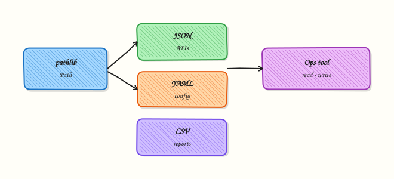

# File Handling — pathlib, JSON, YAML, CSV

## Overview

DevOps tools live on files. Inventory lists, Compose files, kubeconfigs, Terraform plan summaries, and CI reports are usually **JSON**, **YAML**, or **CSV**. If you build paths with string joins, forget encoding, or trust a file without checking it, jobs fail with `FileNotFoundError`, wrong hosts, or silent data loss.

**pathlib** gives you a clear path object instead of raw strings. The standard library handles JSON and CSV. **PyYAML** (or a similar library) loads and dumps YAML. You also need temporary files and `shutil` for safe copy/move work. In this tutorial you will build a small sample inventory, write it in three formats, and prove a **round-trip** (write → read → compare).

On cloud virtual machines (VMs), Continuous Integration (CI) runners, and jump servers, scripts must use absolute or well-known project paths, UTF-8 encoding, and validation before acting. Prefer `Path` over `os.path` for new code. Never build paths from untrusted user input without checks — that is a common path-injection risk.

This is **Tutorial 7** in **Module 7: File Handling** of the REBASH Academy **Python for Cloud & DevOps Engineers** series. It is written for DevOps, Cloud, Platform, and Site Reliability Engineering (SRE) engineers. By the end, you will have evidence files under `~/rebash-python/lab07` that you can explain in an interview or change ticket.

## Prerequisites

- [Modules, Packages, and Dependencies](modules-packages-and-dependencies.md)
- A practice Linux machine (or WSL2) with Python 3.12+ and a project virtual environment (venv)
- Ability to run `python3 -m pip install PyYAML`

## Learning Objectives

By the end of this tutorial, you will be able to:

- [ ] Build and join paths with `pathlib.Path` and open files with encoding
- [ ] Read and write JSON with the standard library
- [ ] Read and write YAML with PyYAML
- [ ] Read and write CSV for tabular inventory
- [ ] Prove a round-trip (write → read → same data) and clean up safely

## Architecture

Your script sits above the filesystem. Paths point to JSON, YAML, and CSV artefacts. Parsers turn bytes into Python data; writers reverse the flow. Temporary files and `shutil` help when you need atomic replace or copy.



## Theory

### What it is

**pathlib.Path** is an object for file system paths. You join with `/`, check `exists()`, and open with `.open()` or helpers like `.read_text()` / `.write_text()`.

**JSON** is a common API and config format. Use `json.load` / `json.dump` with a text file opened as UTF-8.

**YAML** is common for Kubernetes, Ansible, and Compose. Use `yaml.safe_load` / `yaml.safe_dump` (never `yaml.load` without a `Loader` — that is unsafe).

**CSV** is for tables (host lists, cost reports). Use `csv.DictReader` / `csv.DictWriter`.

```python
from pathlib import Path
import json

root = Path.home() / "rebash-python" / "lab07"
root.mkdir(parents=True, exist_ok=True)
(root / "sample.json").write_text(json.dumps({"ok": True}), encoding="utf-8")
```

### Why it matters

A wrong relative path in CI means “works on my laptop” and fails on the runner. A YAML load with the unsafe loader is a security issue. CSV without quoting breaks when hostnames or notes contain commas. Round-trip tests catch these problems before production.

### How it works

1. **Choose a root** — lab folder or project directory as a `Path`.
2. **Write** — open with `encoding="utf-8"`, dump JSON/YAML/CSV.
3. **Read** — load back into Python structures (`dict` / `list`).
4. **Validate** — compare keys, row counts, or a hash of the logical data.
5. **Clean up** — remove temp files; keep evidence if needed for a ticket.

```python
import csv
from pathlib import Path

path = Path("hosts.csv")
with path.open("w", encoding="utf-8", newline="") as fh:
    writer = csv.DictWriter(fh, fieldnames=["name", "env"])
    writer.writeheader()
    writer.writerow({"name": "web-01", "env": "prod"})
```

XML appears in some older tools; for this course prefer JSON/YAML/CSV unless a vendor format requires XML. Use `tempfile.TemporaryDirectory` or `NamedTemporaryFile` when you need a disposable workspace. Use `shutil.copy2` / `shutil.move` for copy and rename with metadata when needed.

### Key concepts and comparisons

| Format | Best for | Library | Watch out |
|--------|----------|---------|-----------|
| JSON | APIs, structured config | `json` (stdlib) | Trailing commas not allowed |
| YAML | K8s, Ansible, Compose | PyYAML `safe_load` | Indentation; unsafe loaders |
| CSV | Spreadsheets, inventories | `csv` (stdlib) | Commas inside fields need quoting |
| Path | All file work | `pathlib` | Relative paths depend on cwd |

| Pattern | Prefer when | Avoid when |
|---------|-------------|------------|
| `Path` + UTF-8 | New automation | String `+` path joins |
| `safe_load` | Untrusted or shared YAML | `yaml.load` without SafeLoader |
| Round-trip assert | CI validation | “Looks fine” visual check only |
| Temp dir for writes | Atomic replace | Partial writes to the live file |

### Common pitfalls

- Using the current working directory without documenting it — CI cwd may differ.
- Opening files without `encoding="utf-8"` on mixed locales.
- Using `yaml.load` (unsafe) instead of `yaml.safe_load`.
- Forgetting `newline=""` for CSV on some platforms.
- Building paths from user input without resolving and checking under an allowed root.

## Hands-on Lab

### Objective

Create a sample host inventory, write it as JSON, YAML, and CSV under `~/rebash-python/lab07`, read each file back, and prove the data matches.

### Prerequisites

- Python 3.12+ with a venv activated
- `PyYAML` installed in that venv
- Write access under your home directory

### Lab environment

Workspace: `~/rebash-python/lab07`

```bash title="Terminal"
mkdir -p ~/rebash-python/lab07 && cd ~/rebash-python/lab07
set -euo pipefail
python3 -m venv .venv
source .venv/bin/activate
python -m pip install --upgrade pip
python -m pip install 'PyYAML>=6.0'
python -c "import yaml, json, csv; from pathlib import Path; print('ok')"
```

!!! example "Expected output"
    `ok` printed; `.venv` exists under `lab07`.


### Real-world scenario

Your team keeps a small host inventory for a practice environment. Ops wants the same list available as JSON (for an API mock), YAML (for Ansible-style tools), and CSV (for a spreadsheet review). You must prove that all three formats describe the same hosts after a write/read cycle.

### Step-by-step tasks

#### Task 1 – Write inventory with pathlib, JSON, YAML, and CSV

```bash title="Terminal"
cd ~/rebash-python/lab07
set -euo pipefail
source .venv/bin/activate

python << 'PY'
from pathlib import Path
import json
import csv
import yaml

root = Path.home() / "rebash-python" / "lab07"
data_dir = root / "data"
data_dir.mkdir(parents=True, exist_ok=True)

hosts = [
    {"name": "web-01", "env": "prod", "ip": "10.0.1.11"},
    {"name": "web-02", "env": "prod", "ip": "10.0.1.12"},
    {"name": "db-01", "env": "prod", "ip": "10.0.2.11"},
]

(data_dir / "inventory.json").write_text(
    json.dumps({"hosts": hosts}, indent=2) + "\n",
    encoding="utf-8",
)

with (data_dir / "inventory.yaml").open("w", encoding="utf-8") as fh:
    yaml.safe_dump({"hosts": hosts}, fh, sort_keys=False)

with (data_dir / "inventory.csv").open("w", encoding="utf-8", newline="") as fh:
    writer = csv.DictWriter(fh, fieldnames=["name", "env", "ip"])
    writer.writeheader()
    writer.writerows(hosts)

print("wrote", data_dir)
for p in sorted(data_dir.iterdir()):
    print(p.name, p.stat().st_size)
PY
```

!!! example "Expected output"
    Three files under `data/` with non-zero sizes: `inventory.json`, `inventory.yaml`, `inventory.csv`.


#### Task 2 – Round-trip validate JSON, YAML, and CSV

```bash title="Terminal"
cd ~/rebash-python/lab07
set -euo pipefail
source .venv/bin/activate

python << 'PY'
from pathlib import Path
import json
import csv
import yaml

root = Path.home() / "rebash-python" / "lab07" / "data"
assert root.is_dir()

with (root / "inventory.json").open(encoding="utf-8") as fh:
    from_json = json.load(fh)["hosts"]

with (root / "inventory.yaml").open(encoding="utf-8") as fh:
    from_yaml = yaml.safe_load(fh)["hosts"]

with (root / "inventory.csv").open(encoding="utf-8", newline="") as fh:
    from_csv = list(csv.DictReader(fh))

assert from_json == from_yaml, "JSON and YAML differ"
assert from_json == from_csv, "JSON and CSV differ"
assert len(from_json) == 3

names = {h["name"] for h in from_json}
assert names == {"web-01", "web-02", "db-01"}

report = root.parent / "roundtrip-ok.txt"
report.write_text(
    f"hosts={len(from_json)}\nnames={sorted(names)}\nstatus=ok\n",
    encoding="utf-8",
)
print(report.read_text(encoding="utf-8"))
PY
```

!!! example "Expected output"
    `roundtrip-ok.txt` shows `status=ok` and three host names.


#### Task 3 – Evidence pack with shutil

```bash title="Terminal"
cd ~/rebash-python/lab07
set -euo pipefail
source .venv/bin/activate

python << 'PY'
from pathlib import Path
import shutil

root = Path.home() / "rebash-python" / "lab07"
evidence = root / "evidence"
if evidence.exists():
    shutil.rmtree(evidence)
evidence.mkdir()

for name in ("inventory.json", "inventory.yaml", "inventory.csv"):
    shutil.copy2(root / "data" / name, evidence / name)
shutil.copy2(root / "roundtrip-ok.txt", evidence / "roundtrip-ok.txt")

archive = shutil.make_archive(str(root / "inventory-evidence"), "gztar", root_dir=evidence)
print(archive)
assert Path(archive).stat().st_size > 0
PY
ls -l inventory-evidence.tar.gz | tee evidence-ls.txt
```

!!! example "Expected output"
    `inventory-evidence.tar.gz` exists and `evidence-ls.txt` shows a non-zero size.


### Validation steps

- [ ] `data/inventory.json`, `data/inventory.yaml`, and `data/inventory.csv` exist
- [ ] `roundtrip-ok.txt` contains `status=ok`
- [ ] JSON, YAML, and CSV describe the same three hosts
- [ ] `inventory-evidence.tar.gz` is not empty

### Common errors and fixes

| Error | Cause | Fix |
|-------|-------|-----|
| `ModuleNotFoundError: yaml` | PyYAML not installed | Activate venv; `python -m pip install PyYAML` |
| `FileNotFoundError` | Wrong cwd or path | Use `Path.home() / "rebash-python" / "lab07"` |
| CSV rows look wrong | Missing `newline=""` | Open CSV with `newline=""` |
| YAML differs from JSON | Extra nesting key | Keep the same `{"hosts": [...]}` shape |

### Challenge exercise

Add a fourth host `cache-01` (`env=prod`, `ip=10.0.3.11`) to all three formats with a small script `add_host.py`, re-run the round-trip asserts for **four** hosts, and write `challenge-ok.txt` with `count=4`. Keep the script under `~/rebash-python/lab07`.

### Learning outcomes

- Used `pathlib` for a fixed lab root
- Wrote and read JSON, YAML, and CSV for the same inventory
- Proved equality with asserts and saved evidence

### Cleanup

```bash title="Terminal"
cd ~/rebash-python/lab07
set -euo pipefail
# Keep the evidence archive if you want it; otherwise remove lab artefacts:
# rm -rf data evidence .venv *.txt *.tar.gz add_host.py
deactivate 2>/dev/null || true
```

## Validation

- [ ] Lab finished under `~/rebash-python/lab07/` with evidence files
- [ ] You can explain when to use JSON vs YAML vs CSV
- [ ] You use `yaml.safe_load` and UTF-8 by default
- [ ] You can describe one production failure from a wrong path or bad parse

## Code Walkthrough

In real DevOps tools, file handling usually follows this order:

1. **Fix the root** — project dir or config path from env/CLI, not “wherever I was when I ran it”
2. **Open with encoding** — UTF-8 unless a vendor format says otherwise
3. **Prefer safe parsers** — `json.load`, `yaml.safe_load`, `csv.DictReader`
4. **Validate shape** — required keys, types, and counts before acting
5. **Write safely** — temp file then replace, or keep a backup before overwrite

Later modules load config from env + YAML and build CLIs that accept a `--inventory` path.

## Security Considerations

- Never pass untrusted path strings into file open without resolving under an allowed directory
- Prefer `yaml.safe_load` for YAML from shared repos or tickets
- Do not log full file contents if they may contain secrets
- Use restrictive permissions (`0o600`) for files that might later hold tokens
- Prefer explicit paths over relying on a surprising current working directory

## Common Mistakes

!!! warning "Building paths with string concatenation"
    Easy to miss separators or break on Windows/WSL mixes. **Fix:** use `pathlib.Path` and the `/` operator.

!!! warning "Using `yaml.load` without a safe loader"
    Older examples enable arbitrary object construction. **Fix:** always use `yaml.safe_load` / `yaml.safe_dump`.

!!! warning "Assuming relative paths work in CI"
    Runner cwd is often the repo root or a checkout subfolder. **Fix:** resolve from a known root or CLI argument.

!!! warning "Skipping round-trip checks"
    Write-only scripts hide format bugs. **Fix:** read back and assert key fields in CI.

## Best Practices

- One inventory schema; generate JSON/YAML/CSV from the same Python list of dicts
- Pin PyYAML in `requirements.txt`
- Use context managers (`with path.open(...)`) so files close on errors
- Keep large binary blobs out of JSON/YAML when a file path is enough
- Document the expected path layout in the tool README

## Troubleshooting

| Symptom | Likely cause | Fix |
|---------|--------------|-----|
| `JSONDecodeError` | Truncated or hand-edited file | Validate with `python -m json.tool file.json` |
| YAML `ScannerError` | Bad indentation or tabs | Re-indent with spaces; re-dump from Python |
| Empty CSV data rows | Forgot header / wrong fieldnames | Match `DictWriter` fieldnames to keys |
| Permission denied | Directory owned by root | Fix ownership or use a home-based lab path |
| Different host order | Set vs list compare | Compare sorted names or a canonical sort |

## Summary

pathlib, JSON, YAML, and CSV are the daily file tools for DevOps Python. Write from one in-memory inventory, read each format back, and prove they match. Next, learn how to handle failures cleanly in [Error Handling and Exceptions](error-handling-and-exceptions.md).

## Interview Questions

**1. Why prefer `pathlib.Path` over string joins for automation paths?**

??? success "Reveal answer"
    `Path` handles joining, existence checks, and opening in a consistent way across platforms. String joins often miss separators or mix `/` and `\\`. Interviewers want to hear that you resolve a known root and avoid trusting the current working directory alone.

**2. What is the difference between `yaml.safe_load` and `yaml.load`, and which should ops tools use?**

??? success "Reveal answer"
    `safe_load` only builds simple Python types (dict, list, str, numbers). Full `load` without a safe loader can construct arbitrary objects and is a security risk for untrusted YAML. Ops tools should use `safe_load` / `safe_dump` unless there is a rare, controlled need for custom tags — and even then, lock the loader carefully.

**3. How do you prove JSON, YAML, and CSV represent the same inventory?**

??? success "Reveal answer"
    Write from one Python structure, read each file back into comparable lists of dicts, then assert equality (or compare sorted keys/names and counts). Save the assert result as evidence for CI or a change ticket. Visual “looks the same” is not enough.

**4. A CI job fails with `FileNotFoundError` for `data/inventory.yaml` but works on a laptop. What do you check first?**

??? success "Reveal answer"
    Check the **current working directory** on the runner, whether the file was committed or generated in an earlier job step, and whether the script uses a relative path. Fix by using an absolute path from the project root, a CLI flag, or an environment variable. Re-run with a print of `Path.cwd()` and the resolved path.

**5. When would you choose CSV over YAML for a host list?**

??? success "Reveal answer"
    Choose CSV when non-engineers edit the list in a spreadsheet, or when another system exports tables. Choose YAML when you need nested structure (groups, vars). Keep one generator so both formats stay in sync.

**6. Why open CSV files with `newline=""` in Python?**

??? success "Reveal answer"
    The `csv` module needs control of line endings. Passing `newline=""` avoids extra blank rows or broken newlines on some platforms. It is the documented pattern for `csv.reader` / `csv.writer`.

**7. How can path handling become a security issue in a CLI that accepts `--file`?**

??? success "Reveal answer"
    An attacker (or a bad ticket) can pass paths like `../../etc/passwd` or a symlink outside the allowed tree. Resolve the path, check it stays under an allowed root, and reject escapes. Do not open arbitrary paths with elevated privileges.

## Related Tutorials

- [Python for Cloud & DevOps – Overview](index.md)
- [Modules, Packages, and Dependencies](modules-packages-and-dependencies.md) *(previous)*
- [Error Handling and Exceptions](error-handling-and-exceptions.md) *(next)*
- [Configuration Management and Secrets](configuration-management-and-secrets.md)

## References

- [pathlib — Object-oriented filesystem paths](https://docs.python.org/3/library/pathlib.html) — Python docs  
- [json — JSON encoder and decoder](https://docs.python.org/3/library/json.html) — Python docs  
- [csv — CSV File Reading and Writing](https://docs.python.org/3/library/csv.html) — Python docs  
- [PyYAML documentation](https://pyyaml.org/wiki/PyYAMLDocumentation) — safe_load / safe_dump  
- Track index: [Python for Cloud & DevOps Engineers](index.md)
