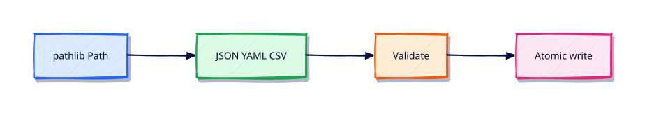

# File Handling — pathlib, JSON, YAML, CSV

## Overview

Configs and inventories live on disk. Parse them safely, validate keys, and write atomically.

This is **Tutorial 7** in **Module 7: File Handling** of the REBASH Academy **Python for DevOps Engineers** series — written for DevOps engineers, SREs, platform engineers, and cloud engineers who automate infrastructure with production-quality Python.

## Prerequisites

- Modules, Packages, and Dependencies
- Python 3.12+ on Linux (WSL2/VM/cloud)

## Learning Objectives

By the end of this tutorial, you will be able to:

- [ ] Apply the core ideas of “File Handling — pathlib, JSON, YAML, CSV” in real ops automation
- [ ] Use a project venv and avoid relying on system site-packages
- [ ] Produce clear stderr diagnostics and meaningful exit codes
- [ ] Prefer safe patterns (pathlib, subprocess list args, dry-run)
- [ ] Relate this topic to day-to-day DevOps and platform work

## Architecture

Ops Python sits between operators/CI and platforms (files, APIs, CLIs, and cloud control planes). This topic’s control points are shown below.



## Theory

### Reading Files

Prefer `pathlib.Path`:

```python
text = Path("config.json").read_text(encoding="utf-8")
```

Always set encoding. For large logs, iterate lines instead of `read_text()`.

### Writing Files

Write to a temp file then `replace` for atomic updates. Set restrictive permissions on secret-bearing files (`0o600`).

### CSV

Use the `csv` module for inventory exports — do not split on commas by hand. Prefer DictReader/DictWriter with explicit fieldnames.

### JSON

`json.loads` / `json.dumps` / `json.load` / `json.dump`. Validate required keys after parse. Pretty-print with `indent=2` for human reports.

### YAML

Use **PyYAML** `safe_load` / `safe_dump` — never `yaml.load` without a Loader. Treat YAML as untrusted input from Git.

### XML

Prefer `xml.etree.ElementTree` for simple manifests; avoid `xml` packages that resolve external entities unsafely. Many ops tools should prefer JSON/YAML over XML.

### pathlib

`Path`, `/` join, `.resolve()`, `.exists()`, `.glob()`, `.write_text()`. Resolve then check a path stays under an allow-listed root before deletes.

### shutil

`shutil.copy2`, `move`, `rmtree`, `which`. Wrap destructive calls behind `--apply` / dry-run defaults.

### Temporary Files

`tempfile.TemporaryDirectory` and `NamedTemporaryFile` for scratch space — always clean up, preferably via context managers.

## Hands-on Lab

Create a workspace for this tutorial.

```bash
mkdir -p ~/rebash-python/lab07 && cd ~/rebash-python/lab07
```

**Focus:** JSON + YAML validators; CSV inventory round-trip; tempfile + atomic write

### Step 1 – Skeleton

```bash
cat > lab.py << 'EOF'
#!/usr/bin/env python3
print("lab07 file-handling-pathlib-json-yaml-csv")
EOF
chmod +x lab.py
python3 lab.py
```

### Step 2 – JSON/YAML validators

```bash
python3 -m venv .venv && source .venv/bin/activate
python -m pip install -q 'PyYAML==6.0.2'
cat > good.json << 'EOF'
{"service":"api","replicas":2}
EOF
cat > good.yaml << 'EOF'
service: api
replicas: 2
EOF
cat > validate.py << 'EOF'
#!/usr/bin/env python3
import csv, json, sys, tempfile
from pathlib import Path
import yaml

def need(d: dict, keys: list[str]) -> None:
    missing = [k for k in keys if k not in d]
    if missing:
        raise SystemExit(f"missing keys: {missing}")

need(json.loads(Path("good.json").read_text()), ["service", "replicas"])
need(yaml.safe_load(Path("good.yaml").read_text()), ["service", "replicas"])
with Path("inv.csv").open("w", newline="") as fh:
    w = csv.DictWriter(fh, fieldnames=["name", "env"])
    w.writeheader()
    w.writerow({"name": "web", "env": "prod"})
td = tempfile.TemporaryDirectory()
p = Path(td.name) / "out.json"
p.write_text(json.dumps({"ok": True}) + "\n")
print(p.read_text().strip())
td.cleanup()
print("RESULT ok")
EOF
python validate.py
deactivate || true
```

### Final step – Cleanup note

```bash
python3 lab.py
# keep ~/rebash-python for later labs
```

## Validation

- [ ] Lab commands run under `~/rebash-python/lab07/`
- [ ] You can explain each Theory heading in your own words
- [ ] Failure path exits non-zero and prints diagnostics to stderr (where applicable)
- [ ] Dry-run / fixture behaviour is clear for any mutating or cloud action
- [ ] You can relate this topic to a real DevOps or platform task

## Code Walkthrough

Production Python for **File Handling — pathlib, JSON, YAML, CSV** always combines:

1. A clear entry point (`main()` + `if __name__ == "__main__"`)
2. A project virtual environment and pinned dependencies when third-party libs are used
3. Explicit error handling and logging (no silent `except Exception: pass`)
4. Safe I/O: `pathlib`, timeouts on HTTP, `subprocess.run([...])` without `shell=True`
5. Documented exit codes and dry-run defaults for mutating actions

Keep modules short enough to review in a single merge request. Prefer stdlib first; add httpx/requests, Typer, pytest, and platform SDKs when the job needs them.

## Security Considerations

- Treat all external input (args, files, env, API payloads) as untrusted until validated
- Never log secrets or `Authorization` headers; prefer masked CI variables and secret stores
- Prefer least privilege tokens and read-only / dry-run modes by default
- Avoid `shell=True`, unvalidated path deletes, and committing `.env` files
- Pin dependencies; review transitive packages for automation that runs in CI

## Common Mistakes

!!! warning "Using system Python without a venv"
    Global packages drift between laptops and CI. **Fix:** `python3 -m venv .venv` per project and pin dependencies.

!!! warning "Calling subprocess with shell=True"
    Untrusted strings become remote code execution. **Fix:** pass a list of arguments; never build a shell string for the happy path.

!!! warning "Mutating without dry-run"
    Cleanup and apply tools destroy shared environments. **Fix:** default to dry-run; require `--apply` for side effects.

## Best Practices

- One purpose per command; share helpers in a small library package
- Log to stderr; reserve stdout for data or RESULT lines
- Idempotent behaviour where schedulers and CI may retry
- Fixture / mock paths for GitHub, Docker, Kubernetes, Terraform, and cloud SDKs in CI
- Pair every new tool with at least one failing-path test you actually run

## Troubleshooting

| Symptom | Likely cause | Fix |
|---------|--------------|-----|
| `ModuleNotFoundError` in CI | Missing venv / pins | Recreate venv; install from lock/requirements |
| Works locally, fails in pipeline | Different Python or env | Pin `requires-python`; fingerprint env in the job |
| Hang on HTTP call | No timeout | Set `timeout=` on requests/httpx clients |
| Secrets in logs | Debug printing headers | Redact; never log tokens |
| Accidental prune/delete | No dry-run default | Default dry-run; label lab resources |

## Summary

**File Handling — pathlib, JSON, YAML, CSV** is a core skill for DevOps engineers automating real hosts, APIs, and pipelines with Python. Practise the lab until the failure path and dry-run path are as familiar as the happy path, then continue the track.

## Interview Questions

1. When would you choose Python over Bash for this kind of ops task?
2. What failure mode appears if you skip a venv, pinning, or dry-run here?
3. How would you test this behaviour in CI without live cloud credentials?
4. Where could secrets leak in a naive implementation of this topic?
5. What exit code contract would you document for teammates?

!!! tip "Sample answer — question 2"
    Floating dependencies and missing dry-run defaults create “works on my machine” automation that either breaks overnight or mutates shared infrastructure unexpectedly. Pin versions and default to report-only.

## Related Tutorials

- [Python for DevOps Engineers – Category Overview](index.md)
- [Modules, Packages, and Dependencies](modules-packages-and-dependencies.md) *(previous)*
- [Error Handling and Exceptions](error-handling-and-exceptions.md) *(next)*
- [Shell Scripting for DevOps Engineers](../shell/index.md)
- [Learning Paths](../learning-paths/index.md)

## References

- [Python 3 documentation](https://docs.python.org/3/)
- [requests documentation](https://requests.readthedocs.io/)
- [httpx documentation](https://www.python-httpx.org/)
- Track index: [Python for DevOps Engineers](index.md)
