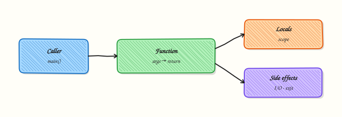

# Functions — Parameters and Scope

## Overview

A **function** packages a named piece of work you can call many times with different inputs. In DevOps scripts, functions turn copy-pasted blocks into reusable steps: parse a host, check a threshold, build a message, return a status code. Parameters pass inputs in. A **return** value passes a result out. **Default arguments** make common cases short. **Keyword arguments** (`name=value`) make call sites clear. **Scope** rules decide which names a function can see.

Without functions, inventory filters and health checks grow into long scripts that nobody wants to test. With functions, you can assert one unit of behaviour, reuse it from a CLI later, and keep `main()` thin. This tutorial also shows how automation maps logical results to process exit codes with `sys.exit` / `SystemExit` so CI knows pass from fail.

LEGB scope (Local, Enclosing, Global, Built-in) explains why a variable assigned inside a function does not change a global unless you intend it. Production code prefers parameters and return values over global mutable state.

This is **Tutorial 4** in **Module 4: Functions** of the REBASH Academy **Python for DevOps Engineers** series.

## Prerequisites

- [Control Flow — Conditionals and Loops](control-flow-conditionals-and-loops.md)
- Python 3.11+ venv under `~/rebash-python/`

## Learning Objectives

By the end of this tutorial, you will be able to:

- [ ] Define functions with parameters, defaults, and return values
- [ ] Call functions with positional and keyword arguments (`*args` / `**kwargs` awareness)
- [ ] Explain local vs global scope and avoid accidental globals
- [ ] Map function results to process exit codes for CI
- [ ] Keep a thin `main()` that orchestrates helpers

## Architecture

Callers pass arguments into a function’s local scope. The function returns a value (or raises). `main` turns that result into an exit code for the operating system and CI.



## Theory

### What it is

```python
def check_disk(used_pct: int, warn: int = 70, crit: int = 90) -> str:
    if used_pct >= crit:
        return "critical"
    if used_pct >= warn:
        return "warning"
    return "ok"
```

- **Parameters** — names in the `def` line  
- **Arguments** — values at the call site  
- **Defaults** — evaluated once at definition time (never use mutable defaults like `[]`)  
- **`*args` / `**kwargs`** — variable positional / keyword arguments  
- **Scope** — where a name is visible  

### Why it matters

CI wrappers, Terraform helpers, and Kubernetes checks all need stable building blocks. A function with a clear return is testable. Exit codes (`0` success, non-zero failure) are the language between your script and the pipeline. Scope bugs that mutate globals create “works until another module imports it” failures.

### How it works

1. **Define** — `def name(params) -> ReturnType:`  
2. **Call** — positional (`f(1, 2)`), keyword (`f(used_pct=80)`), or mixed with keywords after positionals  
3. **Return** — `return value` (or `return` → `None`)  
4. **Exit process** — `raise SystemExit(code)` or `sys.exit(code)` from `main`  
5. **Scope** — assignment inside a function creates a local unless declared `global` / `nonlocal` (prefer not to)

```python
def add_tag(tags: list[str], tag: str) -> list[str]:
    # return a new list; do not rely on mutating caller state silently
    return [*tags, tag]
```

### Key concepts and comparisons

| Feature | Example | Prefer when |
|---------|---------|-------------|
| Defaults | `def f(limit: int = 10)` | Optional knobs with safe defaults |
| Keyword-only | `def f(*, dry_run: bool)` | Forcing clear call sites |
| `*args` | `def f(*hosts: str)` | Variable host lists |
| `**kwargs` | `def f(**opts: str)` | Forwarding options carefully |
| `lambda` | `sorted(items, key=lambda x: x[1])` | Tiny one-line keys only |

| Pattern | Prefer when | Avoid when |
|---------|-------------|------------|
| Pure helpers + thin `main` | Scripts and CLIs | 200-line `main` with nested defs everywhere |
| Return status string/enum | Testable logic | Printing only, with no return |
| Immutable defaults | All functions | `def f(items=[])` mutable default |

### Common pitfalls

- Mutable default arguments (`def f(x=[])`) shared across calls.
- Using `global` to pass data instead of return values.
- Swallowing return values and only printing.
- Exiting from deep helpers (harder to test) instead of returning a code to `main`.
- Confusing `print` success with exit code `0` when an error was ignored.

## Hands-on Lab

### Objective

Under `~/rebash-python/lab04`, build `healthcheck.py` with helpers (defaults, kwargs, scope demo) and a `main` that exits `0` / `1` / `2` based on severity.

### Prerequisites

- Modules 1–3 completed
- Python 3.11+

### Lab environment

Workspace: `~/rebash-python/lab04`

```bash
mkdir -p ~/rebash-python/lab04 && cd ~/rebash-python/lab04
set -euo pipefail
python3 -m venv .venv
# shellcheck disable=SC1091
source .venv/bin/activate
python -c 'import sys; assert sys.version_info >= (3, 11)'
python -V | tee python-version.txt
```

**Expected output:** venv active; version recorded.

### Real-world scenario

Your team wants a tiny disk/CPU style health helper for a practice host metric feed. The logic must be unit-testable, support warn/crit thresholds as defaults, allow overrides via keyword arguments, and return Nagios-style exit codes: `0` ok, `1` warning, `2` critical.

### Step-by-step tasks

#### Task 1 – Implement helpers and main

```bash
cd ~/rebash-python/lab04
set -euo pipefail
# shellcheck disable=SC1091
source .venv/bin/activate
```

Create `healthcheck.py`:

```python
"""Function-based health check with defaults, kwargs, and exit codes."""
from __future__ import annotations

import sys
from typing import Final

OK, WARN, CRIT = 0, 1, 2
SEVERITY_TO_CODE: Final[dict[str, int]] = {
    "ok": OK,
    "warning": WARN,
    "critical": CRIT,
}


def severity(used_pct: int, *, warn: int = 70, crit: int = 90) -> str:
    """Return ok|warning|critical. Keyword-only thresholds."""
    if used_pct >= crit:
        return "critical"
    if used_pct >= warn:
        return "warning"
    return "ok"


def format_message(host: str, used_pct: int, level: str, **labels: str) -> str:
    extra = " ".join(f"{k}={v}" for k, v in sorted(labels.items()))
    base = f"host={host} used_pct={used_pct} level={level}"
    return f"{base} {extra}".rstrip()


def scope_demo() -> tuple[int, int]:
    """Show local assignment does not change a module-level name without global."""
    counter = 10  # local

    def bump() -> int:
        # reads enclosing/local clearly; returns new value instead of global mutate
        return counter + 1

    return counter, bump()


def run_check(host: str, used_pct: int, **thresholds: int) -> int:
    warn = thresholds.get("warn", 70)
    crit = thresholds.get("crit", 90)
    level = severity(used_pct, warn=warn, crit=crit)
    print(format_message(host, used_pct, level, team="platform"))
    return SEVERITY_TO_CODE[level]


def main(argv: list[str]) -> int:
    if len(argv) < 3:
        print("usage: healthcheck.py HOST USED_PCT [WARN] [CRIT]", file=sys.stderr)
        return 2
    host = argv[1]
    try:
        used = int(argv[2])
    except ValueError:
        print("error: USED_PCT must be int", file=sys.stderr)
        return 2
    warn = int(argv[3]) if len(argv) >= 4 else 70
    crit = int(argv[4]) if len(argv) >= 5 else 90
    local_before, bumped = scope_demo()
    assert local_before == 10 and bumped == 11
    return run_check(host, used, warn=warn, crit=crit)


if __name__ == "__main__":
    raise SystemExit(main(sys.argv))
```

Run:

```bash
test -f healthcheck.py
```

**Expected output:** `healthcheck.py` written.

#### Task 2 – Exercise defaults, kwargs, and exit codes

```bash
cd ~/rebash-python/lab04
set -euo pipefail
# shellcheck disable=SC1091
source .venv/bin/activate

set +e
python healthcheck.py web-01 55 > ok.out
echo $? > ok.code
python healthcheck.py web-01 75 > warn.out
echo $? > warn.code
python healthcheck.py web-01 95 > crit.out
echo $? > crit.code
# custom thresholds via argv (kwargs inside run_check)
python healthcheck.py api-01 60 50 80 > custom.out
echo $? > custom.code
set -e

grep -F 'level=ok' ok.out
grep -F 'level=warning' warn.out
grep -F 'level=critical' crit.out
grep -F 'level=warning' custom.out
test "$(cat ok.code)" = "0"
test "$(cat warn.code)" = "1"
test "$(cat crit.code)" = "2"
test "$(cat custom.code)" = "1"
```

**Expected output:** messages match levels; exit codes `0`/`1`/`2`/`1` respectively.

#### Task 3 – Pack evidence and negative usage

```bash
cd ~/rebash-python/lab04
set -euo pipefail
# shellcheck disable=SC1091
source .venv/bin/activate

set +e
python healthcheck.py only-host 2>usage.err
echo $? > usage.code
set -e
test "$(cat usage.code)" = "2"
grep -F 'usage:' usage.err

tar -czf lab04-evidence.tgz healthcheck.py ok.out warn.out crit.out custom.out *.code usage.err
ls -l lab04-evidence.tgz | tee evidence-ls.txt
```

**Expected output:** missing args → exit `2` and usage on stderr; evidence archive exists.

### Validation steps

- [ ] `severity` defaults classify 55/75/95 correctly
- [ ] Custom warn/crit changes classification
- [ ] Exit codes follow ok/warn/crit
- [ ] Scope demo assert passes inside `main`
- [ ] `lab04-evidence.tgz` exists

### Common errors and fixes

| Error | Cause | Fix |
|-------|-------|-----|
| `TypeError: ... keyword-only` | Passed warn positionally into `severity` | Use `warn=` keywords as designed |
| Wrong exit code | Compared strings not codes | Use `SEVERITY_TO_CODE` map |
| Mutable default bug (if added) | `def f(x=[])` | Use `None` + create list inside |
| Usage path exits 0 | Forgot return 2 | Return non-zero from `main` |

### Challenge exercise

Add `batch_check.py` that defines `run_many(hosts: list[str], used: list[int], **thresholds: int) -> int` returning the **worst** exit code across hosts, printing one line per host. Prove with hosts `[web-01, web-02]` and used `[55, 95]` → process exit `2`, and save `batch.out` / `batch.code`.

### Learning outcomes

- Built helpers with defaults and keyword-only parameters
- Forwarded thresholds via `**thresholds`
- Mapped severities to CI exit codes
- Demonstrated local scope without globals

### Cleanup

```bash
cd ~/rebash-python/lab04
set -euo pipefail
deactivate 2>/dev/null || true
# rm -rf .venv
# rm -f *.out *.code *.err lab04-evidence.tgz
```

## Validation

- [ ] Lab finished under `~/rebash-python/lab04/`
- [ ] You can explain LEGB at a practical level
- [ ] You avoid mutable default arguments
- [ ] You return codes from `main` instead of scattering `sys.exit` deep in helpers

## Code Walkthrough

Production habits for functions:

1. **Type-hint public helpers** — clearer reviews  
2. **Keyword-only for thresholds** — fewer positional mistakes  
3. **Return data; exit in `main`** — easier tests  
4. **No mutable defaults** — use `None` sentinels  
5. **Small functions** — one job each  

## Security Considerations

- Do not log secrets passed as kwargs  
- Validate numeric ranges before classification  
- Treat hostnames as untrusted labels in messages  
- Avoid `eval`/`exec` patterns for “dynamic functions”  
- Keep exit codes stable so security scanners/CI gates remain meaningful  

## Common Mistakes

!!! warning "Mutable default argument"
    `def f(items=[])` shares one list across calls. **Fix:** `def f(items: list[str] | None = None): items = list(items or [])`.

!!! warning "Using `global` for convenience"
    Hidden state breaks concurrency and tests. **Fix:** pass parameters in and return results out.

!!! warning "Calling `sys.exit` inside every helper"
    Helpers become hard to reuse and test. **Fix:** return a code or raise a domain error; exit only from `main`.

!!! warning "Defaults that surprise callers"
    Changing a default later can silently alter CI. **Fix:** document defaults; prefer explicit kwargs in production call sites.

## Best Practices

- One function, one responsibility  
- Prefer explicit keyword arguments for ops thresholds  
- Keep `main(argv) -> int` testable  
- Use `Final` or constants for exit code maps  
- Write a tiny assert or unit test around pure helpers  

## Troubleshooting

| Symptom | Likely cause | Fix |
|---------|--------------|-----|
| UnboundLocalError | Assigned local name also read before assign | Initialise locals; avoid dual use with globals |
| Always critical | Thresholds swapped | Ensure `warn < crit` |
| Exit code None | Forgot `return` in `main` | Return int explicitly |
| Labels missing | `**labels` empty | Pass kwargs at call site |

## Summary

Functions make automation reusable, testable, and CI-friendly. Use clear parameters, safe defaults, and exit codes from `main`. Next, work with richer collections in [Data Structures — Comprehensions and Generators](data-structures-comprehensions-and-generators.md).

## Interview Questions

**1. What is the mutable default argument bug, and how do you avoid it?**

??? success "Reveal answer"
    Defaults are evaluated **once** at function definition. A default `[]` or `{}` is shared across calls, so later calls see old data. Use `None` as the default and create a new list/dict inside the function body.

**2. Explain local vs global scope with a short example.**

??? success "Reveal answer"
    Names assigned inside a function are **local** by default. Reading a global is allowed; assigning without `global` creates a local and can cause `UnboundLocalError` if you also read it earlier. Prefer parameters/returns over `global`.

**3. Why prefer keyword-only parameters for warn/crit thresholds?**

??? success "Reveal answer"
    They make call sites self-documenting (`severity(95, warn=70, crit=90)`) and prevent accidental positional swaps. In Python, put `*` before those parameters.

**4. How should a library-style helper signal failure versus a CLI `main`?**

??? success "Reveal answer"
    Helpers should **return values or raise exceptions**. CLI `main` maps those outcomes to **exit codes** (`sys.exit` / `SystemExit`). That split keeps logic testable without ending the test process.

**5. What are `*args` and `**kwargs` useful for in DevOps tooling?**

??? success "Reveal answer"
    `*args` collects extra positional values (for example a list of hosts). `**kwargs` forwards optional labelled settings. Use them carefully — too much magic hurts readability. Typing and validation still matter.

**6. When is `lambda` acceptable, and when should you write a `def`?**

??? success "Reveal answer"
    Use `lambda` for tiny throwaway functions (often `key=` in `sorted`). If you need a name, docstring, statements, or reuse, write a real `def`.

**7. How do Nagios-style exit codes typically map for monitoring scripts?**

??? success "Reveal answer"
    Common convention: `0` OK, `1` WARNING, `2` CRITICAL, `3` UNKNOWN. Teams should document the mapping. This lab uses `0/1/2` for ok/warning/critical.

**8. A function prints “critical” but CI still passes. What was forgotten?**

??? success "Reveal answer"
    Printing is not an exit code. The process likely returned `0`. Map severity to `sys.exit(code)` from `main`, and assert the code in CI.

## Related Tutorials

- [Python for DevOps Engineers – Overview](index.md)
- [Control Flow — Conditionals and Loops](control-flow-conditionals-and-loops.md) *(previous)*
- [Data Structures — Comprehensions and Generators](data-structures-comprehensions-and-generators.md) *(next)*
- [CLI Applications — argparse, Click, and Typer](cli-applications-argparse-click-typer.md) *(related)*

## References

- [Defining Functions](https://docs.python.org/3/tutorial/controlflow.html#defining-functions) — Python tutorial  
- [Typing — support for type hints](https://docs.python.org/3/library/typing.html)  
- Track index: [Python for DevOps Engineers](index.md)
