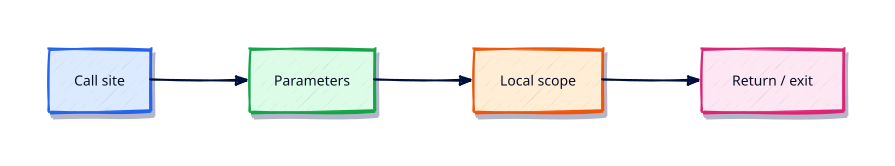

# Functions — Parameters and Scope

## Overview

Readable automation is small functions with clear contracts — inputs, side effects, and exit behaviour.

This is **Tutorial 4** in **Module 4: Functions** of the REBASH Academy **Python for DevOps Engineers** series — written for DevOps engineers, SREs, platform engineers, and cloud engineers who automate infrastructure with production-quality Python.

## Prerequisites

- Control Flow — Conditionals and Loops
- Python 3.12+ on Linux (WSL2/VM/cloud)

## Learning Objectives

By the end of this tutorial, you will be able to:

- [ ] Apply the core ideas of “Functions — Parameters and Scope” in real ops automation
- [ ] Use a project venv and avoid relying on system site-packages
- [ ] Produce clear stderr diagnostics and meaningful exit codes
- [ ] Prefer safe patterns (pathlib, subprocess list args, dry-run)
- [ ] Relate this topic to day-to-day DevOps and platform work

## Architecture

Ops Python sits between operators/CI and platforms (files, APIs, CLIs, and cloud control planes). This topic’s control points are shown below.



## Theory

### Functions

```python
def die(msg: str, code: int = 1) -> None:
    print(msg, file=sys.stderr)
    raise SystemExit(code)
```

Name functions as verbs. Keep side effects obvious; pure helpers are easier to test.

### Parameters

Positional parameters are required unless they have defaults. Annotate types on public APIs. Validate early and fail with stderr + non-zero exit.

### Return Values

Prefer returning data (`dict`, `Path`, `int` status) from library functions and reserve `SystemExit` for CLI entry points. Returning `None` implicitly is fine for mutators that only log.

### Default Arguments

Defaults are evaluated once at definition time — never use mutable defaults (`list`, `dict`). Use `None` and create inside:

```python
def collect(items: list[str] | None = None) -> list[str]:
    items = list(items or [])
    return items
```

### Keyword Arguments

Call with names for clarity: `run(cmd, dry_run=True, timeout=30)`. Force keyword-only with `*` in the signature when flags must not be positional.

### Variable Arguments

`*args` and `**kwargs` forward to lower layers — use sparingly and document. Prefer explicit parameters for ops flags teammates must discover.

### Lambda Functions

`lambda x: x["name"]` suits short `key=` / `sort` hooks. Prefer `def` for anything with branching or more than one expression.

### Scope

LEGB: Local → Enclosing → Global → Built-in. Avoid `global` in ops tools. Pass state as parameters or use a small class/dataclass (Module 9).

## Hands-on Lab

Create a workspace for this tutorial.

```bash
mkdir -p ~/rebash-python/lab04 && cd ~/rebash-python/lab04
```

**Focus:** die/classify helpers; keyword-only dry_run; demonstrate scope pitfalls

### Step 1 – Skeleton

```bash
cat > lab.py << 'EOF'
#!/usr/bin/env python3
print("lab04 functions-parameters-and-scope")
EOF
chmod +x lab.py
python3 lab.py
```

### Step 2 – Functions

```bash
cat > funcs.py << 'EOF'
#!/usr/bin/env python3
from __future__ import annotations
import sys

def die(msg: str, code: int = 1) -> None:
    print(msg, file=sys.stderr)
    raise SystemExit(code)

def run(*, dry_run: bool = True, hosts: list[str] | None = None) -> int:
    hosts = list(hosts or [])
    for h in hosts:
        action = "WOULD_CHECK" if dry_run else "CHECK"
        print(f"{action} {h}")
    return 0

def main(argv: list[str]) -> int:
    if len(argv) < 2:
        die(f"usage: {argv[0]} host [host...]", 2)
    apply = "--apply" in argv
    hosts = [a for a in argv[1:] if a != "--apply"]
    return run(dry_run=not apply, hosts=hosts)

if __name__ == "__main__":
    raise SystemExit(main(sys.argv))
EOF
python3 funcs.py web01 web02
python3 funcs.py web01 --apply
```

### Final step – Cleanup note

```bash
python3 lab.py
# keep ~/rebash-python for later labs
```

## Validation

- [ ] Lab commands run under `~/rebash-python/lab04/`
- [ ] You can explain each Theory heading in your own words
- [ ] Failure path exits non-zero and prints diagnostics to stderr (where applicable)
- [ ] Dry-run / fixture behaviour is clear for any mutating or cloud action
- [ ] You can relate this topic to a real DevOps or platform task

## Code Walkthrough

Production Python for **Functions — Parameters and Scope** always combines:

1. A clear entry point (`main()` + `if __name__ == "__main__"`)
2. A project virtual environment and pinned dependencies when third-party libs are used
3. Explicit error handling and logging (no silent `except Exception: pass`)
4. Safe I/O: `pathlib`, timeouts on HTTP, `subprocess.run([...])` without `shell=True`
5. Documented exit codes and dry-run defaults for mutating actions

Keep modules short enough to review in a single merge request. Prefer stdlib first; add httpx/requests, Typer, pytest, and platform SDKs when the job needs them.

## Security Considerations

- Treat all external input (args, files, env, API payloads) as untrusted until validated
- Never log secrets or `Authorization` headers; prefer masked CI variables and secret stores
- Prefer least privilege tokens and read-only / dry-run modes by default
- Avoid `shell=True`, unvalidated path deletes, and committing `.env` files
- Pin dependencies; review transitive packages for automation that runs in CI

## Common Mistakes

!!! warning "Using system Python without a venv"
    Global packages drift between laptops and CI. **Fix:** `python3 -m venv .venv` per project and pin dependencies.

!!! warning "Calling subprocess with shell=True"
    Untrusted strings become remote code execution. **Fix:** pass a list of arguments; never build a shell string for the happy path.

!!! warning "Mutating without dry-run"
    Cleanup and apply tools destroy shared environments. **Fix:** default to dry-run; require `--apply` for side effects.

## Best Practices

- One purpose per command; share helpers in a small library package
- Log to stderr; reserve stdout for data or RESULT lines
- Idempotent behaviour where schedulers and CI may retry
- Fixture / mock paths for GitHub, Docker, Kubernetes, Terraform, and cloud SDKs in CI
- Pair every new tool with at least one failing-path test you actually run

## Troubleshooting

| Symptom | Likely cause | Fix |
|---------|--------------|-----|
| `ModuleNotFoundError` in CI | Missing venv / pins | Recreate venv; install from lock/requirements |
| Works locally, fails in pipeline | Different Python or env | Pin `requires-python`; fingerprint env in the job |
| Hang on HTTP call | No timeout | Set `timeout=` on requests/httpx clients |
| Secrets in logs | Debug printing headers | Redact; never log tokens |
| Accidental prune/delete | No dry-run default | Default dry-run; label lab resources |

## Summary

**Functions — Parameters and Scope** is a core skill for DevOps engineers automating real hosts, APIs, and pipelines with Python. Practise the lab until the failure path and dry-run path are as familiar as the happy path, then continue the track.

## Interview Questions

1. When would you choose Python over Bash for this kind of ops task?
2. What failure mode appears if you skip a venv, pinning, or dry-run here?
3. How would you test this behaviour in CI without live cloud credentials?
4. Where could secrets leak in a naive implementation of this topic?
5. What exit code contract would you document for teammates?

!!! tip "Sample answer — question 2"
    Floating dependencies and missing dry-run defaults create “works on my machine” automation that either breaks overnight or mutates shared infrastructure unexpectedly. Pin versions and default to report-only.

## Related Tutorials

- [Python for DevOps Engineers – Category Overview](index.md)
- [Control Flow — Conditionals and Loops](control-flow-conditionals-and-loops.md) *(previous)*
- [Data Structures — Comprehensions and Generators](data-structures-comprehensions-and-generators.md) *(next)*
- [Shell Scripting for DevOps Engineers](../shell/index.md)
- [Learning Paths](../learning-paths/index.md)

## References

- [Python 3 documentation](https://docs.python.org/3/)
- [requests documentation](https://requests.readthedocs.io/)
- [httpx documentation](https://www.python-httpx.org/)
- Track index: [Python for DevOps Engineers](index.md)
