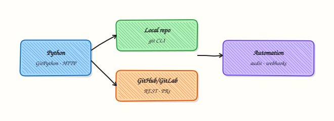

# Git Automation — GitHub and GitLab

## Overview

Git automation has two layers. **Local facts** — current branch, recent commits, clean or dirty tree — come from the `git` CLI (via `subprocess`) or libraries such as GitPython. **Forge APIs** — GitHub and GitLab — expose repositories, pull/merge requests, and webhooks over HTTP. Python glues both for inventory bots, release helpers, and policy checks.

Platform work is pull-request-centric. Scripts that list open pull requests (PRs), verify default branch names, or report clone health save hours of console clicking. Tokens with write scope are high-value secrets. Prefer **read-only** tokens and dry-run reports; keep merge/push actions behind explicit flags (not used in this lab).

A compromised Continuous Integration (CI) job with a wide `repo` token can rewrite `main`. Treat forges like any other API: timeouts, pagination, least privilege, and evidence files. Local labs should create commits only inside a disposable directory under your home folder.

This is **Tutorial 16** in **Module 16: Git Automation** of the REBASH Academy **Python for DevOps Engineers** series. It is written for Cloud, DevOps, Platform, and Site Reliability Engineering (SRE) engineers. By the end you will drive `git` in a temp repo, optionally query a public API read-only, and save evidence JSON.

## Prerequisites

- [REST APIs — requests, Auth, and Resilience](rest-apis-requests-auth-and-resilience.md)
- Git installed locally (`git --version`)
- Python 3.10+ and a virtual environment
- Optional: `GITHUB_TOKEN` / `GITLAB_TOKEN` with **read** scopes — not required

## Learning Objectives

By the end of this tutorial, you will be able to:

- [ ] Inspect and create commits in a local repo via `subprocess` + `git`
- [ ] Explain GitHub/GitLab REST shapes for repo metadata
- [ ] Call a public read-only API (or skip cleanly without a token)
- [ ] Keep mutating forge actions out of default automation
- [ ] Write git evidence suitable for a change ticket
- [ ] Describe webhook use cases at a high level

## Architecture

Python orchestrates local `git` for repository facts and optional HTTPS calls to GitHub/GitLab for forge metadata. Reports stay read-oriented; webhooks are notification edges into your service.



## Theory

### What it is

**Local Git automation** runs commands such as `git status`, `git log`, and `git commit` with timeouts and captured output. **Forge APIs** return JSON for repositories and pull/merge requests. **Webhooks** push event JSON to your URL when something happens (push, PR opened). This course focuses on inventory and local commits — not silent auto-merge.

```python
import subprocess

r = subprocess.run(
    ["git", "rev-parse", "--abbrev-ref", "HEAD"],
    cwd="/path/to/repo",
    capture_output=True,
    text=True,
    timeout=10,
    check=True,
)
print(r.stdout.strip())
```

### Why it matters

Release trains and platform audits need facts: default branch, open PR count, last commit SHA. Shell one-liners break in CI; Python adds structure and tests. Write tokens in shared runners are a frequent incident theme — design read-only first.

### How it works

1. **Local** — `git init` / clone → configure user for lab → commit → read log.  
2. **API** — `GET /repos/{owner}/{repo}` (GitHub) or project API (GitLab) with timeout.  
3. **Auth** — `Authorization: Bearer` / `PRIVATE-TOKEN` from env only.  
4. **Pagination** — follow Link headers for PR lists.  
5. **Webhooks** — configure in UI/API; your service verifies signatures.

| Layer | Tooling | Safe default |
|-------|---------|--------------|
| Local repo | `subprocess` + `git`, or GitPython | Commits only in lab dir |
| GitHub | REST / PyGithub | Read metadata |
| GitLab | REST / python-gitlab | Read metadata |

### Key concepts and comparisons

| Approach | Prefer when | Avoid when |
|----------|-------------|------------|
| `subprocess` git | Exact CLI parity, simple labs | Parsing unstable human output |
| GitPython | Rich object model in-process | You only need two commands |
| Forge API | Org-wide audit | You only need local SHA |

### Common pitfalls

- Force-push automation to shared branches.  
- Logging PATs.  
- `git commit` without `user.email` in fresh CI images.  
- Assuming page one of PRs is complete.  
- Mixing personal tokens into open-source forks.

## Hands-on Lab

### Objective

Under `~/rebash-python/lab16`, create a local Git repository with Python-driven commits, capture log evidence, and optionally query the public GitHub API for `octocat/Hello-World` (read-only) — or record a skipped API result.

### Prerequisites

- `git` on PATH
- Python 3.10+
- `requests` for optional API call

### Lab environment

Workspace: `~/rebash-python/lab16`

```bash
mkdir -p ~/rebash-python/lab16 && cd ~/rebash-python/lab16
set -euo pipefail
python3 -m venv .venv
# shellcheck disable=SC1091
source .venv/bin/activate
python -m pip install -U pip
python -m pip install 'requests>=2.31,<3'
git --version | tee git-version.txt
```

**Expected output:** `git-version.txt` contains a Git version string.

### Real-world scenario

Your team wants a small release helper that records the latest commit on a policy repo and checks that a well-known public repository is reachable via the API (connectivity canary). Merges stay manual. You practise local commits in a disposable folder and a read-only public API GET.

### Step-by-step tasks

#### Task 1 – Temp repo and local commits via subprocess


Create `local_git_lab.py`:

```python
#!/usr/bin/env python3
"""Create a disposable repo and two commits — lab directory only."""
from __future__ import annotations

import json
import subprocess
from pathlib import Path

ROOT = Path(__file__).resolve().parent
REPO = ROOT / "sample-repo"


def git(args: list[str]) -> str:
    completed = subprocess.run(
        ["git", *args],
        cwd=REPO,
        capture_output=True,
        text=True,
        timeout=30,
        check=False,
    )
    if completed.returncode != 0:
        raise RuntimeError(completed.stderr.strip() or completed.stdout.strip())
    return (completed.stdout or "").strip()


def main() -> int:
    if REPO.exists():
        # reset lab repo
        import shutil
        shutil.rmtree(REPO)
    REPO.mkdir(parents=True)
    subprocess.run(["git", "init"], cwd=REPO, check=True, timeout=30, capture_output=True)
    # lab-only identity (does not change your global gitconfig)
    git(["config", "user.email", "lab16@rebash.local"])
    git(["config", "user.name", "REBASH Lab16"])
    (REPO / "README.md").write_text("# lab16\n", encoding="utf-8")
    git(["add", "README.md"])
    git(["commit", "-m", "chore: initial commit"])
    (REPO / "VERSION").write_text("0.1.0\n", encoding="utf-8")
    git(["add", "VERSION"])
    git(["commit", "-m", "chore: add VERSION"])
    log = git(["log", "--oneline", "-n", "5"])
    branch = git(["rev-parse", "--abbrev-ref", "HEAD"])
    head = git(["rev-parse", "HEAD"])
    evidence = {
        "repo": str(REPO),
        "branch": branch,
        "head": head,
        "log_oneline": log.splitlines(),
        "commit_count": len(log.splitlines()),
    }
    Path("local-git-evidence.json").write_text(json.dumps(evidence, indent=2) + "\n", encoding="utf-8")
    print(json.dumps(evidence, indent=2))
    assert evidence["commit_count"] >= 2
    return 0


if __name__ == "__main__":
    raise SystemExit(main())
```

Run:

```bash
cd ~/rebash-python/lab16
set -euo pipefail
# shellcheck disable=SC1091
source .venv/bin/activate
python local_git_lab.py | tee local-git-run.txt
test -s local-git-evidence.json
test -d sample-repo/.git
```

**Expected output:** `local-git-evidence.json` shows at least two commits; `sample-repo/.git` exists.

#### Task 2 – Read-only public GitHub API (or skip)


Create `forge_readonly.py`:

```python
#!/usr/bin/env python3
"""Read-only public GitHub API canary — no mutations."""
from __future__ import annotations

import json
import os
import sys
from pathlib import Path

import requests

URL = "https://api.github.com/repos/octocat/Hello-World"


def main() -> int:
    if "--mutate" in sys.argv:
        print("REFUSED: lab is read-only", file=sys.stderr)
        return 2
    headers = {
        "Accept": "application/vnd.github+json",
        "User-Agent": "rebash-lab16",
    }
    token = os.environ.get("GITHUB_TOKEN")
    if token:
        headers["Authorization"] = f"Bearer {token}"

    try:
        response = requests.get(URL, headers=headers, timeout=(3.05, 15))
    except requests.RequestException as exc:
        result = {"ok": False, "mode": "skipped", "error": type(exc).__name__, "detail": str(exc)}
        Path("forge-evidence.json").write_text(json.dumps(result, indent=2) + "\n", encoding="utf-8")
        print(json.dumps(result, indent=2))
        return 0

    payload = {
        "ok": response.status_code == 200,
        "mode": "live",
        "status_code": response.status_code,
        "full_name": None,
        "default_branch": None,
    }
    if response.status_code == 200:
        data = response.json()
        payload["full_name"] = data.get("full_name")
        payload["default_branch"] = data.get("default_branch")
    else:
        payload["body_preview"] = (response.text or "")[:160]
    Path("forge-evidence.json").write_text(json.dumps(payload, indent=2) + "\n", encoding="utf-8")
    print(json.dumps(payload, indent=2))
    return 0


if __name__ == "__main__":
    raise SystemExit(main())
```

Run:

```bash
cd ~/rebash-python/lab16
set -euo pipefail
# shellcheck disable=SC1091
source .venv/bin/activate
python forge_readonly.py | tee forge-run.txt
test -s forge-evidence.json
```

**Expected output:** `forge-evidence.json` with `mode` `live` (status 200) or `skipped` on network errors — both acceptable.

#### Task 3 – Evidence pack and mutate refusal


Create `pack_evidence.py`:

```python
import json
from pathlib import Path

pack = {
    "local": json.loads(Path("local-git-evidence.json").read_text(encoding="utf-8")),
    "forge": json.loads(Path("forge-evidence.json").read_text(encoding="utf-8")),
}
Path("lab16-evidence.json").write_text(json.dumps(pack, indent=2) + "\n", encoding="utf-8")
assert pack["local"]["commit_count"] >= 2
print("evidence ok")
```

Run:

```bash
cd ~/rebash-python/lab16
set -euo pipefail
# shellcheck disable=SC1091
source .venv/bin/activate

set +e
python forge_readonly.py --mutate >mutate-denied.txt 2>&1
rc=$?
set -e
test "$rc" -eq 2
grep -F 'REFUSED' mutate-denied.txt
python pack_evidence.py
```

**Expected output:** mutate refused; `lab16-evidence.json` merges local + forge facts.

### Validation steps

- [ ] `sample-repo` has ≥2 commits created by the lab script
- [ ] Lab sets `user.email` / `user.name` **locally** in that repo only
- [ ] Forge call is GET-only (or skipped); `--mutate` refused
- [ ] Evidence under `~/rebash-python/lab16`

### Common errors and fixes

| Error | Cause | Fix |
|-------|-------|-----|
| `Author identity unknown` | No user config in repo | Lab sets local `git config` — re-run Task 1 |
| API 403 rate limit | Unauthenticated GitHub limits | Set `GITHUB_TOKEN` read-only or accept skip |
| `git: command not found` | Git not installed | Install Git; re-run env setup |
| Wrong cwd | Ran outside lab16 | `cd ~/rebash-python/lab16` |

### Challenge exercise

Extend `local_git_lab.py` to create a branch `lab16/challenge`, commit a file `notes.txt`, and write `branch-evidence.json` with branch name and `git log -1 --format=%H`. Optional: if `python-gitlab` or PyGithub is installed and a token exists, list **your** user repos read-only — still no creates.

### Learning outcomes

- Automated local git init/add/commit via subprocess
- Captured commit log evidence
- Performed or skipped a read-only forge API canary
- Refused mutating flags by default

### Cleanup

```bash
cd ~/rebash-python/lab16
deactivate 2>/dev/null || true
# rm -rf sample-repo .venv
# Keep lab16-evidence.json if useful
```

## Validation

- [ ] Lab finished under `~/rebash-python/lab16/`
- [ ] You can explain local git vs forge API responsibilities
- [ ] You keep write tokens out of default scripts
- [ ] You can describe a webhook at a high level

## Code Walkthrough

Production git automation usually follows:

1. **Local facts first** — branch, SHA, dirty tree  
2. **Forge read APIs** — protections, open PRs, checks  
3. **Timeouts + pagination**  
4. **Mutations behind flags + human approval**  
5. **Evidence** — SHAs and PR URLs in release tickets  

## Security Considerations

- Least-privilege PATs (public_repo / read_api) for inventory  
- Never log tokens or webhook secrets  
- Verify webhook signatures on receivers  
- Avoid `git push --force` in automation on shared branches  
- Separate bot accounts from human admins  

## Common Mistakes

!!! warning "Storing GITHUB_TOKEN in the repository"
    Tokens leak via forks and logs. **Fix:** CI secrets / env only; rotate if exposed.

!!! warning "Auto-merge in a learning script"
    Skips review. **Fix:** report-only defaults; merges stay in the forge UI or controlled bots.

!!! warning "Global `git config` from a lab"
    Pollutes the engineer’s machine identity. **Fix:** set `user.name` / `user.email` inside the lab repo only (as this lab does).

!!! warning "Parsing `git log` without stable format flags"
    Breaks across versions. **Fix:** use `--format=` / `--oneline` deliberately and test.

## Best Practices

- Pin bot identity and signed commits where policy requires  
- Paginate PR list endpoints  
- Record `head` SHA in deploy evidence  
- Prefer fine-scoped GitHub App tokens over classic PATs when possible  
- Test against public repos before private org automation  

## Troubleshooting

| Symptom | Likely cause | Fix |
|---------|--------------|-----|
| Empty log | Commit failed | Check stderr from `git` wrapper |
| 401 from API | Bad token | Remove token; use public unauthenticated GET carefully |
| Detached HEAD confusion | CI checkout | `git rev-parse` and document expected ref |
| Dirty tree false positive | Line endings | Normalise `.gitattributes` in real projects |

## Summary

Git automation combines **local `git` via subprocess** with **read-only forge APIs**. Practise commits in a disposable lab repo, canary public metadata, and keep merges human-approved. Next, drive the Docker Engine API in [Docker SDK Automation](docker-sdk-automation.md).

## Interview Questions

**1. When would you choose subprocess `git` over GitPython?**

??? success "Reveal answer"
    Choose **subprocess** when you want exact CLI behaviour, simple commands, or to match what operators type. Choose **GitPython** when you need a richer in-process model and fewer process spawns. Either way, set timeouts and avoid shell injection.

**2. Why are write-scoped forge tokens dangerous in CI?**

??? success "Reveal answer"
    A compromised job can push to `main`, change webhooks, or exfiltrate other repos. Prefer read-only scopes for inventory, short-lived OIDC tokens, and separate promotion pipelines for writes. Never print tokens in logs.

**3. How do you configure git author identity safely inside CI?**

??? success "Reveal answer"
    Set `user.name` and `user.email` **locally in the job workspace** (or via `git -c`) so you do not overwrite an engineer’s global config. Use a bot identity your org documents. For this course lab, local repo config is enough.

**4. What is a webhook useful for in DevOps automation?**

??? success "Reveal answer"
    Webhooks notify your service when events happen (push, PR opened) so you do not poll every minute. Your endpoint must verify signatures, respond quickly, and push work to a queue. They complement REST inventory; they do not replace access control.

**5. How would you audit open pull requests across many repos?**

??? success "Reveal answer"
    Use the forge list APIs with pagination and a read token, normalise results to JSON (repo, author, age, checks), and schedule the job. Keep merge actions out of the auditor. Store evidence for compliance reviews.

**6. A script force-pushes to update a bot branch — what is the risk?**

??? success "Reveal answer"
    Force-push rewrites history and can discard others’ commits if the branch is shared. Prefer regular pushes, protected branches, and explicit human approval for history rewrites. Automation should default to refuse `--force`.

**7. How does this topic connect to the REST module?**

??? success "Reveal answer"
    GitHub/GitLab are HTTP APIs: timeouts, retries on 429, auth headers from env, and no secret logging. The Git module adds local repository facts and forge-specific resources (PRs, webhooks) on top of those HTTP habits.

## Related Tutorials

- [Python for DevOps Engineers – Overview](index.md)
- [Cloud Automation — AWS, Azure, and GCP](cloud-automation-aws-azure-gcp.md) *(previous)*
- [Docker SDK Automation](docker-sdk-automation.md) *(next)*
- [Lab — GitHub Repository Auditor](../labs/python-github-repository-auditor.md) *(more practice)*

## References

- [Git documentation](https://git-scm.com/doc)  
- [GitHub REST API](https://docs.github.com/en/rest)  
- [GitLab REST API](https://docs.gitlab.com/ee/api/rest/)  
- Track index: [Python for DevOps Engineers](index.md)
