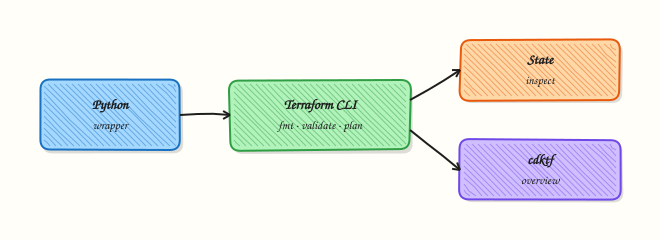

# Infrastructure Automation — Terraform

## Overview

Infrastructure as Code (IaC) means you describe servers, networks, and files in code, then let a tool apply the plan. **Terraform** (and OpenTofu) use HashiCorp Configuration Language (HCL). In DevOps Python work you rarely rewrite providers in Python. You **orchestrate** the CLI: format, validate, plan, parse plan JSON, and fail Continuous Integration (CI) when policy says no.

Python wrappers give one standard path for every pipeline: timeouts, exit codes, artefact upload of `tfplan`, and checks such as “no unexpected destroys.” Click-ops drift and unreviewed `apply` cause outages. State backends hold real inventory and sometimes secrets — protect them; never commit `terraform.tfstate`.

This is **Tutorial 19** in **Module 19: Infrastructure** of the REBASH Academy **Python for Cloud & DevOps Engineers** series. It is written for Cloud, DevOps, Platform, and Site Reliability Engineering (SRE) engineers. By the end you will have a local-only Terraform (or template) workflow under `~/rebash-python/lab19` that you can explain in a change ticket — with **no** apply to paid cloud.

## Prerequisites

- [Kubernetes Python Client Automation](kubernetes-python-client-automation.md)
- [Linux Automation — subprocess](linux-automation-subprocess-and-psutil.md) (subprocess patterns)
- Python 3.10+ on a practice machine
- Optional: `terraform` or `tofu` on `PATH` (lab works without them)

## Learning Objectives

By the end of this tutorial, you will be able to:

- [ ] Explain Python’s role around Terraform CLI (orchestrate, not replace HCL)
- [ ] Run `fmt` / `validate` (and optional `plan`) via subprocess with timeouts
- [ ] Template a tiny local HCL module and prove required blocks exist when Terraform is missing
- [ ] Capture plan JSON or validation evidence for CI
- [ ] State why apply/destroy stay gated and why state files are sensitive
- [ ] Summarise when CDK for Terraform (CDKTF) is useful versus plain HCL

## Architecture

Python sits beside Terraform: it starts the CLI, reads exit codes and JSON, and applies policy. HCL still owns resources. State lives in a backend — not in Git.



## Theory

### What it is

**Terraform** reads `.tf` files, builds a dependency graph, and produces a plan of creates, updates, and deletes. **Python** wraps `terraform` or `tofu` with `subprocess.run([...], timeout=..., capture_output=True, text=True)` — never `shell=True` with interpolated paths. **CDK for Terraform (CDKTF)** lets teams define stacks in Python that synthesise to Terraform JSON when language reuse matters; state still exists afterwards.

### Why it matters

Platform teams build wrappers once so every pipeline behaves the same. Parsing human `plan` text breaks when wording changes; `terraform show -json` is stable. Auto-`apply` from a laptop against shared state without a lock or ticket is a common incident cause. Understanding the boundary — HCL owns resources; Python owns process and policy — keeps both layers honest.

### How it works

1. **Format** — `terraform fmt -check -recursive` (or `tofu fmt`).
2. **Validate** — `terraform init -backend=false` then `terraform validate` for syntax and provider schema without remote state.
3. **Plan** — `terraform plan -out=tfplan` then `terraform show -json tfplan` for create/update/delete counts.
4. **Gate** — CI fails on policy (for example unexpected destroys). Apply only with an explicit flag and human approval.
5. **State** — `state list` / `state show` are read-sensitive; never print secrets from state into chat logs.

```bash
terraform fmt -check -recursive
terraform init -backend=false
terraform validate
# plan is optional in labs; apply to paid cloud is never the tutorial default
```

### Key concepts and comparisons

| Approach | Role | Prefer when |
|----------|------|-------------|
| HCL + CLI wrappers | Default for most ops teams | Shared modules, clear reviews |
| CDKTF (Python/TS) | Synthesise Terraform JSON | Strong language reuse across services |
| Pure cloud SDKs | Bypass Terraform | Small one-off API calls — different trade-offs |

| Command | Tutorial default |
|---------|------------------|
| `fmt` / `validate` / local `plan` | Allowed |
| `apply` / `destroy` against cloud | Require explicit approval; never in this lab |

### Common pitfalls

- Running apply from a laptop against shared state without a lock or ticket.
- Parsing human `plan` text instead of `-json`.
- Committing state or provider credentials.
- Skipping `timeout=` so stuck providers hang CI forever.
- Treating CDKTF as “no need to understand Terraform state” — state still exists.

## Hands-on Lab

### Objective

Under `~/rebash-python/lab19`, create a tiny local Terraform module (`local_file` or `null_resource`) and a Python wrapper that runs `fmt`/`validate` when Terraform is installed, or templates HCL and asserts required blocks when it is not. Never apply to paid cloud.

### Prerequisites

- Python 3.10+
- Write access under your home directory
- Optional: `terraform` or `tofu` binary

### Lab environment

Workspace: `~/rebash-python/lab19`

```bash
mkdir -p ~/rebash-python/lab19 && cd ~/rebash-python/lab19
set -euo pipefail
python3 --version | tee python-version.txt
command -v terraform >/dev/null && terraform version | tee terraform-version.txt || \
  command -v tofu >/dev/null && tofu version | tee terraform-version.txt || \
  echo "terraform_missing" | tee terraform-version.txt
```

**Expected output:** `python-version.txt` exists; `terraform-version.txt` shows a version line or `terraform_missing`.

### Real-world scenario

Your platform team wants every pull request to prove Terraform configs are formatted and valid before merge. Cloud credentials must not be required for that check. You build a small wrapper that works with a local-only module (file on disk) so CI can run on any agent — and you keep proof for the change ticket.

### Step-by-step tasks

#### Task 1 – Tiny local HCL module (no cloud)

Write a module that only touches a local file. No AWS, Azure, or GCP providers.

```bash
cd ~/rebash-python/lab19
set -euo pipefail

mkdir -p tf
cat > tf/main.tf << 'EOF'
terraform {
  required_version = ">= 1.0"
}

resource "local_file" "lab_marker" {
  content  = "rebash-lab19-ok\n"
  filename = "${path.module}/lab-marker.txt"
}
EOF

# Prove HCL shape even before terraform runs
grep -q 'resource "local_file"' tf/main.tf
grep -q 'lab_marker' tf/main.tf
wc -l tf/main.tf | tee hcl-lines.txt
```

**Expected output:** `hcl-lines.txt` shows a positive line count; `grep` finds `local_file`.

#### Task 2 – Python wrapper: validate or template-check

```bash
cd ~/rebash-python/lab19
set -euo pipefail

cat > tf_wrapper.py << 'EOF'
#!/usr/bin/env python3
"""Orchestrate terraform/tofu fmt+validate, or assert HCL shape if CLI missing."""
from __future__ import annotations

import json
import shutil
import subprocess
import sys
from pathlib import Path

ROOT = Path(__file__).resolve().parent
TF_DIR = ROOT / "tf"
REQUIRED_SNIPPETS = (
    'resource "local_file"',
    "lab_marker",
    "required_version",
)


def find_bin() -> str | None:
    for name in ("terraform", "tofu"):
        path = shutil.which(name)
        if path:
            return path
    return None


def assert_hcl(path: Path) -> dict:
    text = path.read_text(encoding="utf-8")
    missing = [s for s in REQUIRED_SNIPPETS if s not in text]
    if missing:
        raise SystemExit(f"HCL missing snippets: {missing}")
    return {"mode": "hcl_assert", "file": str(path), "ok": True}


def run_cli(bin_path: str) -> dict:
    steps = []
    for args in (
        [bin_path, "fmt", "-check", "-recursive"],
        [bin_path, "init", "-backend=false", "-input=false"],
        [bin_path, "validate", "-json"],
    ):
        proc = subprocess.run(
            args,
            cwd=TF_DIR,
            capture_output=True,
            text=True,
            timeout=120,
            check=False,
        )
        steps.append(
            {
                "cmd": args,
                "returncode": proc.returncode,
                "stdout": proc.stdout[-2000:],
                "stderr": proc.stderr[-2000:],
            }
        )
        if proc.returncode != 0:
            raise SystemExit(json.dumps({"ok": False, "steps": steps}, indent=2))
    return {"mode": "cli", "bin": bin_path, "ok": True, "steps": steps}


def main() -> int:
    if not TF_DIR.joinpath("main.tf").is_file():
        print("missing tf/main.tf", file=sys.stderr)
        return 1
    bin_path = find_bin()
    if bin_path:
        try:
            result = run_cli(bin_path)
        except SystemExit:
            # Offline agents: CLI present but provider download failed — still prove HCL
            result = assert_hcl(TF_DIR / "main.tf")
            result["cli_fallback"] = True
    else:
        result = assert_hcl(TF_DIR / "main.tf")
    out = ROOT / "validate-result.json"
    out.write_text(json.dumps(result, indent=2) + "\n", encoding="utf-8")
    print(out.read_text(encoding="utf-8"))
    return 0


if __name__ == "__main__":
    raise SystemExit(main())
EOF

python3 tf_wrapper.py | tee wrapper-run.txt
python3 -c 'import json; d=json.load(open("validate-result.json")); assert d["ok"] is True'
```

**Expected output:** `validate-result.json` has `"ok": true` and either `"mode": "cli"` or `"mode": "hcl_assert"`.

#### Task 3 – Evidence pack (no apply)

```bash
cd ~/rebash-python/lab19
set -euo pipefail

# Explicitly refuse apply in this lab directory
cat > refuse-apply.sh << 'EOF'
#!/usr/bin/env bash
set -euo pipefail
echo "This lab never runs terraform apply against cloud." >&2
exit 2
EOF
chmod +x refuse-apply.sh
./refuse-apply.sh > apply-guard.txt 2>&1 || test $? -eq 2

tar -czf terraform-lab-evidence.tgz \
  python-version.txt terraform-version.txt hcl-lines.txt \
  validate-result.json wrapper-run.txt apply-guard.txt tf/main.tf tf_wrapper.py
ls -l terraform-lab-evidence.tgz | tee evidence-ls.txt
test -s terraform-lab-evidence.tgz
```

**Expected output:** `apply-guard.txt` mentions that apply is refused; `terraform-lab-evidence.tgz` is non-empty.

### Validation steps

- [ ] `tf/main.tf` uses only `local_file` (no cloud provider block)
- [ ] `python3 tf_wrapper.py` writes `validate-result.json` with `"ok": true`
- [ ] If Terraform is installed, mode is `cli`; otherwise `hcl_assert`
- [ ] Evidence archive exists under `~/rebash-python/lab19`
- [ ] You did **not** run `terraform apply` against paid cloud

### Common errors and fixes

| Error | Cause | Fix |
|-------|-------|-----|
| `No such file or directory: terraform` | CLI missing | Wrapper falls back to HCL assert — re-run Task 2 |
| `Error: Failed to query available provider packages` | Network blocked for provider download | Keep `-backend=false`; offline agents use HCL assert path |
| `fmt -check` fails | Bad indentation | Run `terraform fmt tf/` once, then re-check |
| Wrapper timeout | Slow provider init | Increase timeout only for CI caches; prefer validate-only |
| Tempted to add AWS provider “to learn” | Scope creep | Stay on `local_file` for this tutorial |

### Challenge exercise

Extend `tf_wrapper.py` so that when the CLI is present it also runs `terraform plan -out=tfplan` **with** `-input=false` in `tf/`, then `terraform show -json tfplan`, and writes create/update/delete counts to `plan-summary.json`. Still do **not** run apply. Save `plan-summary.json` into a second evidence tarball if you complete this stretch.

### Learning outcomes

- Authored a cloud-free local Terraform module
- Orchestrated fmt/validate (or HCL shape checks) from Python
- Captured CI-style evidence without applying infrastructure
- Can explain why apply stays gated in production wrappers

### Cleanup

```bash
cd ~/rebash-python/lab19
set -euo pipefail
rm -rf tf/.terraform tf/.terraform.lock.hcl tf/tfplan tf/lab-marker.txt 2>/dev/null || true
# Keep evidence if you want it; otherwise:
# rm -f terraform-lab-evidence.tgz *.txt *.json
```

## Validation

- [ ] Lab finished under `~/rebash-python/lab19/` with evidence files
- [ ] You can explain fmt → validate → plan → gated apply
- [ ] You can describe why state files and credentials must not land in Git
- [ ] You know when CDKTF helps versus staying with HCL

## Code Walkthrough

In production Terraform orchestration usually follows this order:

1. **Detect binary** — `terraform` or `tofu`, pin versions in CI images  
2. **Format and validate first** — fail fast before plan  
3. **Plan as an artefact** — upload `tfplan` / JSON summary  
4. **Policy gate** — no surprise destroys; no auto-apply on main without approval  
5. **Least privilege** — short-lived cloud credentials; separate plan and apply roles  

Keep humans for apply judgement; automate checks.

## Security Considerations

- Never commit `terraform.tfstate`, `.tfvars` with secrets, or provider keys  
- Prefer OpenID Connect (OIDC) / short-lived roles over long-lived access keys  
- Treat `state show` output as sensitive — redact before logging  
- Separate plan credentials from apply credentials where the cloud allows it  
- Block `apply` in tutorial and PR jobs unless an explicit protected environment is used  

## Common Mistakes

!!! warning "Auto-apply from a wrapper cron"
    Shared state can be corrupted or resources destroyed. **Fix:** require an explicit `--apply` flag plus environment protection; default to plan-only.

!!! warning "Parsing human plan text in CI"
    Wording changes break gates. **Fix:** use `terraform show -json` and count resource changes structurally.

!!! warning "Committing state or lock files with secrets"
    Credentials and resource IDs leak. **Fix:** remote backend + `.gitignore` for local state; scan pull requests.

!!! warning "No timeout on subprocess"
    A stuck provider download hangs the whole pipeline. **Fix:** always set `timeout=` and fail with a clear message.

## Best Practices

- One wrapper library shared by all Terraform pipelines  
- Pin Terraform/OpenTofu and provider versions  
- Use `-backend=false` for pure validate in PR agents when safe  
- Store plan artefacts with retention limits  
- Document that local labs never touch paid cloud  

## Troubleshooting

| Symptom | Likely cause | Fix |
|---------|--------------|-----|
| Provider download fails | Network in CI | Cache plugins; use HCL assert path for offline labs |
| State locked | Concurrent apply | Do not apply from casual wrappers; wait or force-unlock with care |
| Wrong binary | tofu vs terraform | Detect both; pin one in the image |
| `validate` fails after fmt | Syntax / missing required_providers | Fix HCL; re-run wrapper |
| Plan wants cloud auth | Real cloud resources in module | Keep lab on `local_file` / `null_resource` only |

## Summary

Python orchestrates Terraform: format, validate, plan, and policy — while HCL remains the source of truth. This lab proved a local-only module and a wrapper that works with or without the CLI, without applying to paid cloud. Next, automate remote hosts with [SSH Automation — Paramiko and Fabric](ssh-automation-paramiko-and-fabric.md).

## Interview Questions

**1. Why do platform teams wrap Terraform in Python (or another language) instead of only calling the CLI in a shell script?**

??? success "Reveal answer"
    Wrappers standardise **timeouts**, exit-code handling, plan JSON parsing, artefact upload, and policy gates across many repositories. Shell one-liners drift; a small library gives one behaviour for fmt/validate/plan and keeps apply behind explicit controls. Interviewers want the orchestration boundary: Python owns process and policy; HCL owns resources.

**2. When is `terraform init -backend=false` useful in CI?**

??? success "Reveal answer"
    For **syntax and provider schema validation** without talking to remote state. It speeds pull-request checks and avoids needing backend credentials just to validate. Full plan against real state still needs a proper backend and credentials. Labs and offline agents often combine this with a tiny local-only module.

**3. Why is parsing human-readable `terraform plan` output a bad CI strategy?**

??? success "Reveal answer"
    Human text changes between Terraform versions and terminal width. **`terraform show -json`** (or plan JSON) gives stable fields for create/update/delete counts and policy engines. Teams that grep English lines get flaky pipelines and missed destroys.

**4. What makes Terraform state sensitive, and how should Python tools treat it?**

??? success "Reveal answer"
    State can contain **resource IDs, attributes, and sometimes secrets**. Python tools must not print full state to chatty logs, must not commit state files, and should use remote backends with access control. `state show` is a privileged read — redact before sharing in tickets.

**5. Compare HCL + CLI wrappers with CDK for Terraform (CDKTF). When would you pick each?**

??? success "Reveal answer"
    **HCL + wrappers** is the default: clear reviews, huge module ecosystem, ops-friendly. **CDKTF** helps when the team already lives in Python/TypeScript and wants shared language libraries that synthesise Terraform. CDKTF does not remove state or the need to understand plans and applies.

**6. How would you design a safe “apply” path for production in a Python wrapper?**

??? success "Reveal answer"
    Default to **plan-only**. Require an explicit `--apply` (or separate job), environment protection, and often a different Identity and Access Management (IAM) role. Check plan JSON for forbidden actions, keep locks, and record who approved. Never auto-apply from a laptop cron against shared state.

**7. A junior engineer wants to add an AWS provider to the lab “to make it real.” What do you say?**

??? success "Reveal answer"
    For learning orchestration, **local_file / null_resource** already exercise fmt, validate, and plan without cost or credentials. Cloud providers belong in a sandboxed account with budget alerts and destroy automation — not in a tutorial that must stay free and safe. Prove the wrapper first; add cloud later under explicit sandbox rules.

**8. How do you prove in a change ticket that a Terraform PR is safe to merge?**

??? success "Reveal answer"
    Attach **fmt/validate success**, a **plan summary** (JSON or counted changes), confirmation of **no unexpected destroys**, and note that apply is a separate gated step. Include wrapper version and Terraform version. Least privilege is shown by what the plan will *not* do, as well as by what it will.

## Related Tutorials

- [Python for Cloud & DevOps – Overview](index.md)
- [Kubernetes Python Client Automation](kubernetes-python-client-automation.md) *(previous)*
- [SSH Automation — Paramiko and Fabric](ssh-automation-paramiko-and-fabric.md) *(next)*
- [Lab — Terraform Wrapper](../labs/python-terraform-wrapper.md) *(more practice)*
- [Terraform track](../terraform/index.md)

## References

- [Terraform CLI](https://developer.hashicorp.com/terraform/cli) — HashiCorp  
- [CDK for Terraform](https://developer.hashicorp.com/terraform/cdktf) — HashiCorp  
- [`subprocess` — Python docs](https://docs.python.org/3/library/subprocess.html)  
- Track index: [Python for Cloud & DevOps Engineers](index.md)
