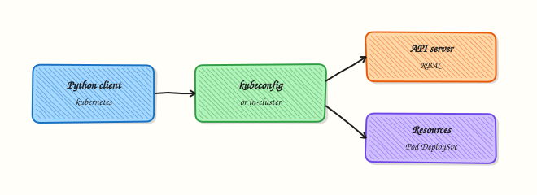

# Kubernetes Python Client Automation

## Overview

The official **`kubernetes`** Python package is a generated client around the Kubernetes API server. Your script loads credentials, builds typed API objects such as `CoreV1Api`, and issues the same verbs `kubectl` uses — get, list, create, patch, delete — over HTTPS. For this course the happy path is **get/list** inventory, not cluster surgery.

Out of cluster, `config.load_kube_config()` reads `KUBECONFIG` or `~/.kube/config`. Inside a Pod, `config.load_incluster_config()` uses the mounted ServiceAccount token. Errors surface as `ApiException` with HTTP status codes: 401/403 for auth or Role-Based Access Control (RBAC), 404 for missing objects. Prefer namespace-scoped lists when you can — cluster-wide scans need broader permissions and are slower.

If you have no cluster (common on student laptops), you still practise by **generating and validating YAML manifests** and printing **dry-run notes** in script output. Never run delete-namespace or destroy kind clusters from a learning script’s default path.

This is **Tutorial 18** in **Module 18: Kubernetes Automation** of the REBASH Academy **Python for DevOps Engineers** series. It is written for Kubernetes, Platform, DevOps, and Site Reliability Engineering (SRE) engineers. By the end you will have inventory evidence from a live API **or** validated manifests with dry-run guidance — without destroying a cluster.

## Prerequisites

- [Docker SDK Automation](docker-sdk-automation.md)
- [REST APIs](rest-apis-requests-auth-and-resilience.md) concepts (status codes, timeouts)
- Python 3.10+ and a virtual environment
- Optional: kubeconfig for kind / minikube / k3s / a lab cluster — otherwise use the YAML path

## Learning Objectives

By the end of this tutorial, you will be able to:

- [ ] Load kubeconfig (and describe in-cluster config)
- [ ] List Namespaces and Pods read-only when the API is reachable
- [ ] Sketch Deployments, Services, ConfigMaps, Jobs, and Secret handling rules
- [ ] Treat Secret *data* as opaque (metadata only in reports)
- [ ] Generate/validate YAML manifests when kubeconfig is missing
- [ ] Refuse cluster-destroy style flags in lab tooling

## Architecture

Python loads kubeconfig or in-cluster credentials, calls the API server through typed clients, and emits inventory JSON. Offline, the same workflow validates local manifests and prints dry-run notes instead of mutating the cluster.



## Theory

### What it is

`kubernetes` clients wrap REST under `/api` and `/apis`. **Pods** are the atomic running unit; **Deployments** manage replicas; **Services** provide stable networking; **ConfigMaps** and **Secrets** hold configuration; **Jobs** run finite work; **Namespaces** isolate names. RBAC decides whether your identity may list or change them.

```python
from kubernetes import client, config

config.load_kube_config()
v1 = client.CoreV1Api()
for ns in v1.list_namespace().items:
    print(ns.metadata.name)
```

### Why it matters

Platform and SRE teams live in clusters. Shelling out to `kubectl` works for one-offs; Python gives structured objects, testable parsers, and CI gates (“no Pending Pods older than N minutes”). Mutating tools inherit the ServiceAccount’s RBAC — least privilege is enforceable.

### How it works

1. **Load config** — kubeconfig or in-cluster.  
2. **Build API clients** — `CoreV1Api`, `AppsV1Api`, ….  
3. **List/get** — namespaced or cluster-scoped.  
4. **Handle ApiException** — map status codes to clear errors.  
5. **Offline path** — write YAML, `kubectl apply --dry-run=client` notes, or PyYAML validation only.

| Resource | Typical read | Caution |
|----------|--------------|---------|
| Namespace / Pod | list names & phases | Wide list needs RBAC |
| Deployment | replicas / conditions | Avoid delete in labs |
| Secret | list names only | Never log `data` values |
| Job | completions / failures | |

### Key concepts and comparisons

| Mode | Prefer when | Evidence label |
|------|-------------|----------------|
| Live client list | kubeconfig works | `mode: live` |
| YAML validate + dry-run notes | No cluster / CI | `mode: manifest-dry-run` |
| `kubectl` subprocess | Quick check | Still read-only flags |

### Common pitfalls

- Logging Secret values.  
- Cluster-admin kubeconfig in CI for a list job.  
- Ignoring 403 (RBAC) vs 401 (auth).  
- Deleting namespaces as “cleanup” in shared clusters.  
- Mixing API versions (`apps/v1` vs obsolete ones).

## Hands-on Lab

### Objective

Under `~/rebash-python/lab18`, list namespaces/pods when kubeconfig works; otherwise generate a small Deployment+Service YAML set, validate with PyYAML, and write dry-run notes. Refuse destroy flags. No cluster teardown.

### Prerequisites

- Python 3.10+
- Optional: working `kubectl` / kubeconfig
- `pip install kubernetes pyyaml` (kubernetes optional if offline-only)

### Lab environment

Workspace: `~/rebash-python/lab18`

``` {.bash .ra-terminal title="Terminal"}
mkdir -p ~/rebash-python/lab18/manifests && cd ~/rebash-python/lab18
set -euo pipefail
python3 -m venv .venv
# shellcheck disable=SC1091
source .venv/bin/activate
python -m pip install -U pip
python -m pip install 'pyyaml>=6,<7'
python -m pip install 'kubernetes>=29,<32' || true
command -v kubectl >/dev/null && kubectl config current-context 2>/dev/null | tee kube-context.txt || echo "no-kubeconfig" | tee kube-context.txt
```

!!! example "Expected output"
    venv ready; `kube-context.txt` has a context name or `no-kubeconfig`.


### Real-world scenario

Your platform team wants a Python health inventory: namespaces and Pod phases for a lab cluster. Student machines often lack clusters, so the same repository must validate example manifests and print how you would dry-run apply. Destroying kind clusters or namespaces is forbidden in the default tool.

### Step-by-step tasks

#### Task 1 – Manifest generate + YAML validation (always works)


Create `generate_manifests.py`:

```python title="generate_manifests.py"
#!/usr/bin/env python3
"""Generate sample manifests and validate YAML structure."""
from __future__ import annotations

import json
from pathlib import Path

import yaml

ROOT = Path(__file__).resolve().parent
MAN = ROOT / "manifests"

DEPLOYMENT = """
apiVersion: apps/v1
kind: Deployment
metadata:
  name: rebash-lab18-web
  namespace: default
  labels:
    app: rebash-lab18
spec:
  replicas: 1
  selector:
    matchLabels:
      app: rebash-lab18
  template:
    metadata:
      labels:
        app: rebash-lab18
    spec:
      containers:
        - name: web
          image: nginx:1.27
          ports:
            - containerPort: 80
"""

SERVICE = """
apiVersion: v1
kind: Service
metadata:
  name: rebash-lab18-web
  namespace: default
spec:
  selector:
    app: rebash-lab18
  ports:
    - port: 80
      targetPort: 80
  type: ClusterIP
"""


def main() -> int:
    MAN.mkdir(parents=True, exist_ok=True)
    (MAN / "deployment.yaml").write_text(DEPLOYMENT.strip() + "\n", encoding="utf-8")
    (MAN / "service.yaml").write_text(SERVICE.strip() + "\n", encoding="utf-8")
    docs = []
    for path in sorted(MAN.glob("*.yaml")):
        loaded = list(yaml.safe_load_all(path.read_text(encoding="utf-8")))
        for doc in loaded:
            assert doc and "kind" in doc and "apiVersion" in doc
            docs.append({"file": path.name, "kind": doc["kind"], "name": doc["metadata"]["name"]})
    notes = {
        "mode": "manifest-dry-run",
        "docs": docs,
        "dry_run_notes": [
            "kubectl apply --dry-run=client -f manifests/",
            "kubectl apply --dry-run=server -f manifests/  # needs API access",
            "Do NOT kubectl delete namespace or kind delete cluster from this lab",
        ],
    }
    Path("manifest-evidence.json").write_text(json.dumps(notes, indent=2) + "\n", encoding="utf-8")
    print(json.dumps(notes, indent=2))
    return 0


if __name__ == "__main__":
    raise SystemExit(main())
```

Run:

``` {.bash .ra-terminal title="Terminal"}
cd ~/rebash-python/lab18
set -euo pipefail
# shellcheck disable=SC1091
source .venv/bin/activate
python generate_manifests.py | tee manifest-run.txt
test -s manifests/deployment.yaml
test -s manifest-evidence.json
python -c 'import json; d=json.load(open("manifest-evidence.json")); assert len(d["docs"])==2; print("yaml ok")'
```

!!! example "Expected output"
    two manifests; `manifest-evidence.json` lists Deployment and Service with dry-run notes.


#### Task 2 – Live read-only list (or honest skip)


Create `k8s_inventory.py`:

```python title="k8s_inventory.py"
#!/usr/bin/env python3
"""Read-only namespace/pod inventory — never destroy."""
from __future__ import annotations

import json
import os
import sys
from pathlib import Path

ROOT = Path(__file__).resolve().parent


def refuse_destroy() -> None:
    bad = {"--destroy", "--delete-all", "--delete-namespace", "--kind-delete"}
    if bad.intersection(sys.argv):
        print("REFUSED: cluster destroy / delete flags disabled in lab18", file=sys.stderr)
        raise SystemExit(2)


def live_inventory() -> dict:
    from kubernetes import client, config
    from kubernetes.client.rest import ApiException

    config.load_kube_config()
    v1 = client.CoreV1Api()
    namespaces = [i.metadata.name for i in v1.list_namespace().items]
    pods = []
    # Limit blast: default namespace only for the lab report
    for p in v1.list_namespaced_pod("default").items:
        pods.append(
            {
                "name": p.metadata.name,
                "phase": p.status.phase,
                "namespace": p.metadata.namespace,
            }
        )
    return {
        "mode": "live",
        "namespaces": namespaces,
        "pods_default": pods,
        "policy": "read-only list; no deletes",
    }


def main() -> int:
    refuse_destroy()
    if os.environ.get("LAB18_FORCE_MANIFEST") == "1":
        result = {
            "mode": "skipped-live",
            "reason": "LAB18_FORCE_MANIFEST=1",
            "policy": "read-only list; no deletes",
        }
    else:
        try:
            result = live_inventory()
        except Exception as exc:  # noqa: BLE001 — missing kubeconfig/module/RBAC
            result = {
                "mode": "skipped-live",
                "reason": type(exc).__name__,
                "detail": str(exc)[:300],
                "policy": "read-only list; no deletes",
                "hint": "use manifest-evidence.json dry-run path",
            }
    Path("k8s-inventory.json").write_text(json.dumps(result, indent=2) + "\n", encoding="utf-8")
    print(json.dumps(result, indent=2))
    return 0


if __name__ == "__main__":
    raise SystemExit(main())
```

Run:

``` {.bash .ra-terminal title="Terminal"}
cd ~/rebash-python/lab18
set -euo pipefail
# shellcheck disable=SC1091
source .venv/bin/activate
python k8s_inventory.py | tee inventory-run.txt
test -s k8s-inventory.json
```

!!! example "Expected output"
    `k8s-inventory.json` with `mode` `live` or `skipped-live` — both acceptable.


#### Task 3 – Destroy refusal and evidence pack


Create `pack_evidence.py`:

```python title="pack_evidence.py"
import json
from pathlib import Path

pack = {
    "manifests": json.loads(Path("manifest-evidence.json").read_text(encoding="utf-8")),
    "inventory": json.loads(Path("k8s-inventory.json").read_text(encoding="utf-8")),
    "destroy_refused": True,
}
Path("lab18-evidence.json").write_text(json.dumps(pack, indent=2) + "\n", encoding="utf-8")
assert pack["manifests"]["mode"] == "manifest-dry-run"
print("evidence ok")
```

Run:

``` {.bash .ra-terminal title="Terminal"}
cd ~/rebash-python/lab18
set -euo pipefail
# shellcheck disable=SC1091
source .venv/bin/activate

set +e
python k8s_inventory.py --destroy >destroy-denied.txt 2>&1
rc=$?
set -e
test "$rc" -eq 2
grep -F 'REFUSED' destroy-denied.txt
python pack_evidence.py
```

!!! example "Expected output"
    destroy refused; `lab18-evidence.json` merges manifest + inventory evidence.


### Validation steps

- [ ] Manifests validate (`kind` / `apiVersion` present)
- [ ] Live list is read-only or cleanly skipped
- [ ] Destroy-style flags exit `2`
- [ ] Evidence under `~/rebash-python/lab18`

### Common errors and fixes

| Error | Cause | Fix |
|-------|-------|-----|
| `ConfigException` / no kubeconfig | No cluster | Use manifest path; expected |
| `ApiException` 403 | RBAC too tight | Ask for get/list only; or skip-live |
| `ModuleNotFoundError: kubernetes` | pip failed | Manifest path still works with PyYAML |
| Fear of kind delete | Old habits | Lab refuses destroy flags |

### Challenge exercise

Add a ConfigMap manifest (`rebash-lab18-config`) with two keys, validate it in `generate_manifests.py`, and extend evidence `docs` to three entries. Optional: if live mode works, also list Deployments in `default` via `AppsV1Api().list_namespaced_deployment` — still no deletes. Never print Secret data.

### Learning outcomes

- Generated and validated Kubernetes YAML in Python
- Listed namespaces/pods when kubeconfig allowed
- Documented dry-run apply notes for tickets
- Refused cluster-destroy flags

### Cleanup

``` {.bash .ra-terminal title="Terminal"}
cd ~/rebash-python/lab18
deactivate 2>/dev/null || true
# Do NOT kind delete cluster / kubectl delete ns from this lab.
# If you manually applied manifests in a personal cluster, delete only those named objects:
# kubectl delete -f manifests/ --dry-run=client
# rm -rf .venv
```

## Validation

- [ ] Lab finished under `~/rebash-python/lab18/`
- [ ] You can explain kubeconfig vs in-cluster config
- [ ] You never log Secret values
- [ ] You know why destroy is gated

## Code Walkthrough

Production Kubernetes Python automation usually follows:

1. **Load identity** — kubeconfig or ServiceAccount  
2. **Least-privilege list/get** — namespace scope when possible  
3. **Map ApiException codes** — 401/403/404  
4. **Report phases/conditions** — not raw Secret data  
5. **Mutate only with flags + RBAC + change control**  

## Security Considerations

- Use read-only Roles/ClusterRoles for inventory bots  
- Never commit kubeconfig files with embedded tokens  
- Do not log Secret `data` or bearer tokens  
- Prefer namespaced ServiceAccounts over cluster-admin  
- Audit who can `delete collection` in production  

## Common Mistakes

!!! warning "Logging Secret values for debugging"
    Credentials leak into CI logs. **Fix:** log Secret *names* and keys existence only.

!!! warning "Cluster-admin kubeconfig in a list job"
    Over-privilege. **Fix:** bind get/list on required resources only.

!!! warning "kubectl delete namespace as lab cleanup on shared clusters"
    Wipes teammates’ work. **Fix:** delete only named lab objects; never default destroy.

!!! warning "Ignoring 403"
    Scripts look “empty” when RBAC denied the list. **Fix:** surface ApiException status clearly.

## Best Practices

- Default tools to dry-run / read-only  
- Pin client library versions  
- Prefer server-side apply in real GitOps; keep Python for inventory/gates  
- Record API resource versions in evidence when debugging races  
- Pair with NetworkPolicy and Pod Security separately from this client intro  

## Troubleshooting

| Symptom | Likely cause | Fix |
|---------|--------------|-----|
| Empty pod list | Wrong namespace | Query `default` or pass namespace flag |
| 401 | Expired token / bad kubeconfig | `kubectl auth can-i list pods` |
| 403 | Missing RBAC | Grant get/list RoleBinding |
| SSL errors | Custom CA | Configure cluster CA in kubeconfig |
| Slow cluster list | Too wide | Namespace scope; limit field selectors |

## Summary

Kubernetes Python automation starts with **config loading**, **read-only list/get**, careful **Secret hygiene**, and an offline **manifest + dry-run notes** path when no cluster exists — never default cluster destroy. Next, wrap Terraform workflows in [Infrastructure Automation — Terraform](infrastructure-automation-terraform.md).

## Interview Questions

**1. What is the difference between `load_kube_config` and `load_incluster_config`?**

??? success "Reveal answer"
    **`load_kube_config`** reads a kubeconfig file (local laptop, CI with a fetched kubeconfig). **`load_incluster_config`** uses the ServiceAccount token and CA mounted into a Pod. Controllers and in-cluster jobs use the latter; developer laptops use the former. Choosing wrong raises a clear config error.

**2. Why should inventory tools avoid printing Secret data?**

??? success "Reveal answer"
    Secret values are credentials and tokens. CI logs and chat pastes become leak channels. Report Secret *names*, namespaces, and maybe key *names* — never base64 payloads. Prefer external secret managers for real systems.

**3. How do HTTP status codes from `ApiException` guide troubleshooting?**

??? success "Reveal answer"
    **401** means identity/auth failed. **403** means authenticated but RBAC denied. **404** means the object or path is missing. **409** often means conflict. Retrying 403 with the same SA will not help — fix RoleBindings.

**4. When is a YAML dry-run path acceptable instead of a live list?**

??? success "Reveal answer"
    When teaching parsers, validating manifests in CI without a cluster, or developing on a laptop. Label evidence `manifest-dry-run` vs `live`. Add a separate integration job against kind for true API behaviour.

**5. What RBAC verbs should a pod inventory bot need?**

??? success "Reveal answer"
    Typically `get` and `list` on `pods` and `namespaces` (and maybe `deployments`) in the target namespaces. It should not need `delete`, `create`, or secrets `get` on data. Bind a dedicated ServiceAccount with a Role/RoleBinding.

**6. How do Deployments and Pods relate in an inventory report?**

??? success "Reveal answer"
    A Deployment owns ReplicaSets that own Pods. Reporting only Pods shows phases; reporting Deployments shows desired vs ready replicas and conditions. Healthy platforms watch both — Pending Pods under a Deployment that cannot schedule is a common production signal.

**7. A junior engineer wants the script to `kind delete cluster` in Cleanup. What do you say?**

??? success "Reveal answer"
    Refuse in shared or unclear environments. Cleanup should remove only lab-named objects the script created, with dry-run first. Destroying a cluster is a deliberate local decision, not a default tutorial step — especially when kubeconfig might point at something else.

## Related Tutorials

- [Python for DevOps Engineers – Overview](index.md)
- [Docker SDK Automation](docker-sdk-automation.md) *(previous)*
- [Infrastructure Automation — Terraform](infrastructure-automation-terraform.md) *(next)*
- [Lab — Kubernetes Health Checker](../labs/python-kubernetes-health-checker.md) *(more practice)*

## References

- [Kubernetes Python client](https://github.com/kubernetes-client/python)  
- [Kubernetes API overview](https://kubernetes.io/docs/reference/using-api/)  
- [RBAC authorization](https://kubernetes.io/docs/reference/access-authn-authz/rbac/)  
- Track index: [Python for DevOps Engineers](index.md)
