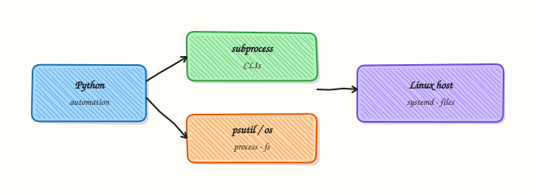

# Linux Automation — subprocess and psutil

## Overview

DevOps scripts often need facts from the Linux host: kernel name, listening ports, disk pressure, or whether a process is alive. In Python you get those facts by running safe commands with **`subprocess`**, reading paths with **pathlib**, and (optionally) sampling CPU and memory with **`psutil`**. You are not replacing systemd or the package manager — you wrap the same tools operators already trust, with timeouts and structured exit handling.

A common mistake is `shell=True` plus string concatenation. That pattern can turn user input into a shell injection. Prefer an **argument list**, always set a **timeout**, and capture stdout/stderr as text when you need to parse it. Check `returncode` instead of assuming success. Use pathlib and shutil for file copy and disk usage. Register short handlers for `SIGINT` / `SIGTERM` so long jobs can exit cleanly in Continuous Integration (CI).

On jump servers, cloud virtual machines (VMs), and CI runners, hung commands without timeouts waste minutes; scripts that run as root “to make CI green” create security risk. Good automation fails closed when permissions are missing, writes evidence to a file, and stays readable for the next engineer on call.

This is **Tutorial 13** in **Module 13: Linux Automation** of the REBASH Academy **Python for DevOps Engineers** series. It is written for Cloud, DevOps, Platform, Linux, and Site Reliability Engineering (SRE) engineers. By the end you will have a small host probe that writes JSON evidence you can attach to a change ticket or interview portfolio.

## Prerequisites

- [CLI Applications — argparse, Click, and Typer](cli-applications-argparse-click-typer.md)
- Python 3.10+ on Linux, Windows Subsystem for Linux (WSL), or macOS
- Ability to create a virtual environment (`python3 -m venv`)
- Optional: package `iproute2` on Linux for `ip` / `ss` (the lab falls back to `uname`)

## Learning Objectives

By the end of this tutorial, you will be able to:

- [ ] Call `subprocess.run` with a list of arguments, timeout, and captured stdout
- [ ] Handle non-zero return codes without hiding failures
- [ ] Use pathlib and shutil for paths and disk usage checks
- [ ] Optionally sample CPU and memory with `psutil` inside a venv
- [ ] Explain why `shell=True` is dangerous with untrusted input
- [ ] Write host facts to a JSON evidence file for tickets or CI

## Architecture

Python sits between your automation and the host: subprocess starts CLIs; pathlib/shutil touch the filesystem; psutil reads `/proc`-style counters without scraping text by hand.



## Theory

### What it is

**`subprocess`** starts another program, waits (with a timeout), and returns a result object with `returncode`, `stdout`, and `stderr`. **`os`** and **pathlib** describe the process environment and paths. **`shutil`** copies trees and reports `disk_usage`. **`psutil`** samples CPU percent, memory, and process tables. **Signals** (`signal` module) let you shut down cooperatively when CI cancels a job.

```python
import subprocess

r = subprocess.run(
    ["uname", "-a"],
    check=False,
    capture_output=True,
    text=True,
    timeout=10,
)
print(r.returncode, r.stdout.strip())
```

### Why it matters

Cloud SDKs do not answer “is this bastion out of disk?” or “what kernel is on the build agent?”. Shell one-liners grow fragile; Python wrappers add parsing, tests, and JSON reports. Done badly (no timeout, `shell=True`, assume root), they become hung runners and injection bugs. Done well, they are the backbone of agentless health checks and inventory bots.

### How it works

1. **Choose argv** — pass a list: `["ss", "-tln"]`, never `f"ss {user_flag}"` through a shell.
2. **Run with bounds** — set `timeout=…`, `capture_output=True`, `text=True`.
3. **Inspect result** — use `check=True` when failure is exceptional; otherwise branch on `returncode`.
4. **File facts** — `Path.home()`, `shutil.disk_usage("/")`.
5. **Optional metrics** — `psutil.cpu_percent(interval=0.1)`, `psutil.virtual_memory().percent`.
6. **Signals** — register a handler that sets a flag; avoid heavy work inside the handler.

```python
from pathlib import Path
import shutil

usage = shutil.disk_usage(Path("/"))
free_pct = 100 * usage.free / usage.total
```

### Key concepts and comparisons

| Tool | Job |
|------|-----|
| `subprocess` | Run CLIs with timeout and captured output |
| `pathlib` / `shutil` | Paths, copy, disk usage |
| `psutil` | CPU, memory, process tables |
| `signal` | Cooperative shutdown on SIGTERM |

| Practice | Prefer | Avoid |
|----------|--------|--------|
| Invocation | Argument list | `shell=True` + user input |
| Timeouts | Always set | Infinite wait on NFS / hung CLI |
| Permissions | Fail closed with a clear error | Silent `sudo` everywhere |
| Output | Machine-friendly flags / JSON | Locale-dependent human text only |

### Common pitfalls

- Omitting `timeout` on mounts, package managers, or remote CLIs.
- Parsing locale-dependent human output instead of stable flags (`-b`, `--json` when available).
- Running as root “to make CI green” instead of fixing permissions.
- Heavy work inside signal handlers (keep them short).
- Treating `returncode == 0` as healthy when stdout clearly says degraded.

## Hands-on Lab

### Objective

Build a small host probe under `~/rebash-python/lab13` that runs `uname` (and `ip`/`ss` when present) via `subprocess`, optionally samples CPU/memory with `psutil`, and writes `host-evidence.json`.

### Prerequisites

- Python 3.10+
- `python3 -m venv` available
- Practice host (not a shared production server)

### Lab environment

Workspace: `~/rebash-python/lab13`

``` {.bash .ra-terminal title="Terminal"}
mkdir -p ~/rebash-python/lab13 && cd ~/rebash-python/lab13
set -euo pipefail
python3 -m venv .venv
# shellcheck disable=SC1091
source .venv/bin/activate
python -m pip install -U pip
python -m pip install 'psutil>=5.9,<7'
python -c "import sys; print(sys.version)" | tee python-version.txt
```

!!! example "Expected output"
    `python-version.txt` exists; `psutil` installs in the venv (if pip fails, continue — Task 2 treats psutil as optional).


### Real-world scenario

Your platform team wants a lightweight agentless check on new Ubuntu build VMs: kernel string, whether `ss` works, free disk, and a CPU/memory sample. Security asks for no shell injection and a JSON artefact for the change ticket. You implement the probe locally first.

### Step-by-step tasks

#### Task 1 – Safe subprocess probe (uname / ip / ss)


Create `host_probe.py`:

```python title="host_probe.py"
#!/usr/bin/env python3
"""Safe host facts via subprocess — no shell=True."""
from __future__ import annotations

import json
import shutil
import subprocess
import sys
from pathlib import Path


def run_cmd(argv: list[str], timeout: float = 10.0) -> dict:
    try:
        completed = subprocess.run(
            argv,
            check=False,
            capture_output=True,
            text=True,
            timeout=timeout,
        )
    except FileNotFoundError:
        return {
            "argv": argv,
            "ok": False,
            "returncode": None,
            "stdout": "",
            "stderr": "command not found",
        }
    except subprocess.TimeoutExpired:
        return {
            "argv": argv,
            "ok": False,
            "returncode": None,
            "stdout": "",
            "stderr": "timeout",
        }
    return {
        "argv": argv,
        "ok": completed.returncode == 0,
        "returncode": completed.returncode,
        "stdout": (completed.stdout or "").strip(),
        "stderr": (completed.stderr or "").strip(),
    }


def main() -> int:
    out_dir = Path(__file__).resolve().parent
    commands: list[list[str]] = [["uname", "-a"]]
    if shutil.which("ip"):
        commands.append(["ip", "-br", "addr"])
    if shutil.which("ss"):
        commands.append(["ss", "-tln"])

    results = [run_cmd(cmd) for cmd in commands]
    usage = shutil.disk_usage(str(Path.home()))
    payload = {
        "commands": results,
        "disk_home": {
            "total": usage.total,
            "used": usage.used,
            "free": usage.free,
        },
        "python": sys.version.split()[0],
    }
    evidence = out_dir / "host-evidence.json"
    evidence.write_text(json.dumps(payload, indent=2) + "\n", encoding="utf-8")
    print(f"wrote {evidence}")
    # At least uname must succeed
    if not results or not results[0]["ok"]:
        print("uname failed", file=sys.stderr)
        return 1
    return 0


if __name__ == "__main__":
    raise SystemExit(main())
```

Run:

``` {.bash .ra-terminal title="Terminal"}
cd ~/rebash-python/lab13
set -euo pipefail
# shellcheck disable=SC1091
source .venv/bin/activate
python host_probe.py | tee probe-run.txt
test -s host-evidence.json
python -c 'import json; d=json.load(open("host-evidence.json")); assert d["commands"][0]["ok"]; print("uname_ok")'
```

!!! example "Expected output"
    `wrote …/host-evidence.json`; assert prints `uname_ok`; `host-evidence.json` is non-empty.


#### Task 2 – Optional psutil CPU/memory sample


Create `metrics_sample.py`:

```python title="metrics_sample.py"
#!/usr/bin/env python3
"""Optional psutil sample; degrades cleanly if missing."""
from __future__ import annotations

import json
import sys
from pathlib import Path


def sample() -> dict:
    try:
        import psutil  # type: ignore
    except ImportError:
        return {"psutil": False, "reason": "not installed"}
    return {
        "psutil": True,
        "cpu_percent": psutil.cpu_percent(interval=0.2),
        "memory_percent": psutil.virtual_memory().percent,
        "process_count": len(psutil.pids()),
    }


def main() -> int:
    path = Path(__file__).resolve().parent / "metrics.json"
    data = sample()
    path.write_text(json.dumps(data, indent=2) + "\n", encoding="utf-8")
    print(json.dumps(data))
    return 0 if data.get("psutil") or data.get("reason") else 1


if __name__ == "__main__":
    raise SystemExit(main())
```

Run:

``` {.bash .ra-terminal title="Terminal"}
cd ~/rebash-python/lab13
set -euo pipefail
# shellcheck disable=SC1091
source .venv/bin/activate
python metrics_sample.py | tee metrics-run.txt
test -s metrics.json
python -c 'import json; d=json.load(open("metrics.json")); assert "psutil" in d; print("metrics_ok", d["psutil"])'
```

!!! example "Expected output"
    `metrics.json` exists; if `psutil` installed, `"psutil": true` with numeric samples; otherwise a clear `reason`.


#### Task 3 – Merge evidence pack


Create `merge_evidence.py`:

```python title="merge_evidence.py"
import json
from pathlib import Path

base = Path(".")
host = json.loads((base / "host-evidence.json").read_text(encoding="utf-8"))
metrics = json.loads((base / "metrics.json").read_text(encoding="utf-8"))
merged = {"host": host, "metrics": metrics}
(base / "lab13-evidence.json").write_text(json.dumps(merged, indent=2) + "\n", encoding="utf-8")
print("merged ok")
assert host["commands"][0]["ok"]
```

Run:

``` {.bash .ra-terminal title="Terminal"}
cd ~/rebash-python/lab13
set -euo pipefail
# shellcheck disable=SC1091
source .venv/bin/activate
python merge_evidence.py
ls -l lab13-evidence.json host-evidence.json metrics.json | tee evidence-ls.txt
```

!!! example "Expected output"
    `lab13-evidence.json` exists; `evidence-ls.txt` lists the three JSON files.


### Validation steps

- [ ] `host_probe.py` uses argument lists and `timeout` (no `shell=True`)
- [ ] `host-evidence.json` contains a successful `uname` result
- [ ] `metrics.json` records psutil present or an honest fallback
- [ ] `lab13-evidence.json` merges both artefacts under `~/rebash-python/lab13`

### Common errors and fixes

| Error | Cause | Fix |
|-------|-------|-----|
| `command not found` for `ss`/`ip` | Package not installed | Lab already falls back to `uname` only — continue |
| `ModuleNotFoundError: psutil` | venv not activated or pip skipped | `source .venv/bin/activate` then `pip install psutil` |
| Hang forever | Missing timeout | Always pass `timeout=` to `subprocess.run` |
| `Permission denied` | Non-root reading restricted paths | Probe only home/disk and public CLIs |

### Challenge exercise

Extend `host_probe.py` with a `--json-path` CLI flag (use `argparse`) that writes evidence to a custom path, and add a negative test: call `run_cmd(["false"])` and assert `ok` is `False` in a small `test_probe.py` run with `python -m pytest` (install pytest in the venv). Keep `shell=True` unused.

### Learning outcomes

- Ran host CLIs safely with `subprocess` lists and timeouts
- Captured stdout into JSON evidence
- Sampled or stubbed metrics with `psutil`
- Packed artefacts suitable for a change ticket

### Cleanup

``` {.bash .ra-terminal title="Terminal"}
cd ~/rebash-python/lab13
set -euo pipefail
deactivate 2>/dev/null || true
# Keep evidence JSON if you want it for a portfolio; remove the venv when done:
# rm -rf .venv
# Optional full wipe:
# rm -rf ~/rebash-python/lab13
```

## Validation

- [ ] Lab finished under `~/rebash-python/lab13/` with JSON evidence
- [ ] You can explain why argument lists beat `shell=True`
- [ ] You always set timeouts on external commands
- [ ] You can describe one production failure: hung CI job without timeout

## Code Walkthrough

In real servers, Linux automation with Python usually follows this order:

1. **Inspect** — `uname`, `ip`/`ss`, disk usage, process list  
2. **Bound the call** — argv list, timeout, capture text  
3. **Parse and assert** — return codes and structured fields, not hope  
4. **Evidence** — write JSON/logs for handovers  
5. **Least privilege** — never require root for a simple health probe  

Keep runbooks short. Automate checks; keep humans for judgement.

## Security Considerations

- Never build shell strings from untrusted input (`shell=True` risk)  
- Prefer list argv and fixed binaries on `PATH` you control  
- Do not run inventory scripts as root unless required  
- Avoid logging secrets from environment variables next to host facts  
- Treat CI runners as hostile: timeouts and resource limits matter  

## Common Mistakes

!!! warning "Using `shell=True` with f-strings"
    User-controlled text can become a second command. **Fix:** pass a list of arguments; validate inputs before use.

!!! warning "Omitting `timeout`"
    A stuck NFS mount or hung CLI blocks the whole pipeline. **Fix:** always set `timeout=` and handle `TimeoutExpired`.

!!! warning "Parsing human-only CLI output"
    Locale and version changes break scrapers. **Fix:** prefer machine flags (`-br`, `--json`) or stable fields.

!!! warning "Assuming root"
    Permission errors become mysterious “flakes”. **Fix:** fail with a clear message; document required capabilities.

## Best Practices

- Pin `psutil` in `requirements.txt` when you depend on it  
- Write evidence files next to the script for ticket attachments  
- Prefer pathlib over string path concatenation  
- Register SIGTERM handlers for long probes in CI  
- Unit-test the parser with fixture stdout, not only live hosts  

## Troubleshooting

| Symptom | Likely cause | Fix |
|---------|--------------|-----|
| Hang | Missing timeout | Add `timeout=` |
| `FileNotFoundError` | Binary not on PATH | Use `shutil.which` and degrade |
| Empty stdout | Forgot `text=True` / capture | Set `capture_output=True, text=True` |
| Wrong disk numbers | Measured wrong path | Use `Path.home()` or `/` deliberately |
| psutil import fails in CI | System Python vs venv | Install into the job’s venv |

## Summary

Safe Linux automation in Python means **subprocess with lists and timeouts**, clear return-code handling, pathlib/shutil for files, and optional **psutil** metrics — all written to evidence you can show. Next, call HTTP APIs with timeouts and retries in [REST APIs — requests, Auth, and Resilience](rest-apis-requests-auth-and-resilience.md).

## Interview Questions

**1. Why should DevOps Python prefer an argument list over `shell=True`?**

??? success "Reveal answer"
    An argument list is passed directly to the program. `shell=True` asks `/bin/sh` to parse a string, so characters like `;`, `|`, or `` ` `` from untrusted input can run extra commands. Prefer lists, fixed binaries, and validated inputs. Use a shell only when you truly need shell features, and never with raw user text.

**2. A CI job hangs on `subprocess.run(["apt-get", "update"])`. What do you check first?**

??? success "Reveal answer"
    Check for a missing **timeout**, waiting on locks (`/var/lib/dpkg`), or needing a TTY/confirmation. Add `timeout=`, capture stderr, and fail clearly. For package work, prefer non-interactive flags and run on disposable agents — not as an unbounded step.

**3. When is `psutil` better than scraping `/proc` or calling `top`?**

??? success "Reveal answer"
    `psutil` gives structured numbers (CPU percent, memory, PIDs) across platforms with fewer fragile text parsers. Scraping `top` breaks with locale and version changes. Use `psutil` for metrics; use `subprocess` when you must call a specific CLI the team already trusts (`ss`, `systemctl`).

**4. How do you prove a host probe is safe enough for a shared jump server?**

??? success "Reveal answer"
    Show no `shell=True`, timeouts on every external call, no requirement for root, no secrets in logs, and a read-only style of commands (`uname`, `ss -tln`, disk usage). Attach JSON evidence. Negative tests (failed command path) show you handle errors.

**5. What is the difference between `check=True` and inspecting `returncode` yourself?**

??? success "Reveal answer"
    `check=True` raises `CalledProcessError` on any non-zero exit — good when failure is exceptional. Inspecting `returncode` is better when non-zero is expected (for example `grep` with no match, or probing optional tools). Choose based on whether “not found” is an error or a branch.

**6. How would you shut down a long probe when Kubernetes sends SIGTERM to the Pod?**

??? success "Reveal answer"
    Register a `signal` handler for `SIGTERM` that sets a flag or event; the main loop checks the flag, flushes evidence, and exits with a non-zero or special code. Do not run heavy I/O inside the handler. This matches how CI and orchestrators cancel work.

**7. Disk looks fine in `df` but your script alarms — what might be wrong?**

??? success "Reveal answer"
    You may have measured a different mount (`Path.home()` vs `/`), used inode exhaustion (df -i), or compared bytes without reserving root’s 5% on ext filesystems. Align the path with the service’s data directory and document the threshold logic.

## Related Tutorials

- [Python for DevOps Engineers – Overview](index.md)
- [CLI Applications — argparse, Click, and Typer](cli-applications-argparse-click-typer.md) *(previous)*
- [REST APIs — requests, Auth, and Resilience](rest-apis-requests-auth-and-resilience.md) *(next)*
- [Lab — Linux Health Checker](../labs/python-linux-health-checker.md) *(more practice)*

## References

- [subprocess — Python docs](https://docs.python.org/3/library/subprocess.html)  
- [psutil documentation](https://psutil.readthedocs.io/)  
- [pathlib — Python docs](https://docs.python.org/3/library/pathlib.html)  
- Track index: [Python for DevOps Engineers](index.md)
