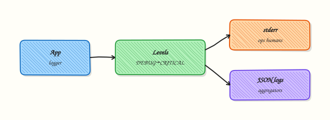

# Logging and Debugging

## Overview

`print` is fine for Module 2 labs. Production automation needs **logging**: levels, a clear destination, and no secrets. Operators and Continuous Integration (CI) systems read logs to answer “what happened?” without attaching a debugger every time.

The standard library `logging` module writes to **stderr** (good default for CLIs) and to **files** when you need persistence. Levels (`DEBUG`, `INFO`, `WARNING`, `ERROR`, `CRITICAL`) let you turn detail up in staging and down in production. When a path is still unclear, **pdb** / `breakpoint()` helps on a practice machine — not as the first response in a hot production deploy.

This is **Tutorial 10** in **Module 10: Logging & Debugging** of the REBASH Academy **Python for Cloud & DevOps Engineers** series. It is written for DevOps, Cloud, Platform, and Site Reliability Engineering (SRE) engineers. By the end, you will prove log lines on file and stderr under `~/rebash-python/lab10`.

## Prerequisites

- [OOP — Classes and Dataclasses](oop-classes-and-dataclasses.md)
- [Error Handling and Exceptions](error-handling-and-exceptions.md)
- Python 3.12+ with a project virtual environment (venv)

## Learning Objectives

By the end of this tutorial, you will be able to:

- [ ] Configure logging to stderr and to a file with sensible levels
- [ ] Choose DEBUG / INFO / WARNING / ERROR appropriately
- [ ] Prove that expected log lines were written
- [ ] Read a traceback to the failing line
- [ ] Use `breakpoint()` optionally when a local bug is unclear

## Architecture

Application code calls the logger. Handlers send records to stderr and/or a rotating file. Levels filter noise. Debuggers attach only when you opt in on a safe machine.



## Theory

### What it is

**logging** is the standard library facility for diagnostic messages. You get a **logger** (usually `logging.getLogger(__name__)`), set a **level**, and attach **handlers** (StreamHandler, FileHandler).

```python
import logging
import sys

logging.basicConfig(
    level=logging.INFO,
    format="%(asctime)s %(levelname)s %(name)s: %(message)s",
    handlers=[
        logging.StreamHandler(sys.stderr),
        logging.FileHandler("app.log", encoding="utf-8"),
    ],
)
log = logging.getLogger("inventory")
log.info("loaded hosts count=%s", 3)
```

Prefer `%s` lazy formatting (or `logger.info("x=%s", x)`) over f-strings in hot DEBUG loops so formatting is skipped when the level is filtered.

**Structured logging** means stable fields (`host=`, `env=`, or JSON lines) so log aggregators can filter. **Tracebacks** show the call stack when an exception is not handled. **pdb** is the built-in debugger; `breakpoint()` enters it when `PYTHONBREAKPOINT` is not disabled.

### Why it matters

CI captures stderr. Kubernetes and systemd capture process logs. If your tool only `print`s to stdout, you mix machine data with human noise. If you log secrets, they land in ticket systems and central log stores. If everything is DEBUG in production, you pay for storage and hide real errors.

### How it works

1. **Configure once** near process start (`basicConfig` or dictConfig).
2. **Get a named logger** per module.
3. **Log at the right level** — INFO for normal progress, ERROR for failures.
4. **Prove** — assert a file contains a substring, or capture stderr in tests.
5. **Debug** — read the traceback first; use `breakpoint()` only when needed.

```python
try:
    ...
except Exception:
    logging.exception("deploy failed host=%s", host)  # includes traceback
    raise
```

### Key concepts and comparisons

| Level | Typical use |
|-------|-------------|
| DEBUG | Detailed diagnostics in staging |
| INFO | Normal progress (“deploy started”) |
| WARNING | Unexpected but continuing |
| ERROR | Operation failed |
| CRITICAL | Process cannot continue |

| Pattern | Prefer when | Avoid when |
|---------|-------------|------------|
| stderr + file | CLIs and long jobs | Logging secrets to either |
| `logging.exception` | Inside `except` | Logging without traceback on unexpected errors |
| `breakpoint()` | Local hard bugs | Production pods (unless carefully gated) |
| Structured fields | Aggregators / grep | Unstable free-text only |

### Common pitfalls

- Calling `basicConfig` after other logs — config may be ignored.
- Logging passwords, tokens, or full kubeconfigs.
- Using INFO for every loop iteration — floods storage.
- Catching exceptions and logging without re-raising when the job must fail.
- Leaving `breakpoint()` in committed code without a guard.

## Hands-on Lab

### Objective

Configure logging to both stderr and a file, emit messages at multiple levels, prove the file contains expected lines, and optionally demonstrate `breakpoint` behind an environment flag. Workspace: `~/rebash-python/lab10`.

### Prerequisites

- Python 3.12+
- Write access under your home directory

### Lab environment

Workspace: `~/rebash-python/lab10`

```bash
mkdir -p ~/rebash-python/lab10 && cd ~/rebash-python/lab10
set -euo pipefail
python3 -m venv .venv
source .venv/bin/activate
python -c "import logging; print('ok')"
```

**Expected output:** `ok`

### Real-world scenario

Your inventory loader will run in CI. Platform asks for INFO lines on stderr for the job log, and a file on disk for later upload as a build artefact. You must prove the file contains `loaded hosts` and an ERROR line for a simulated failure — without printing secrets.

### Step-by-step tasks

#### Task 1 – Configure file + stderr logging

```bash
cd ~/rebash-python/lab10
set -euo pipefail
source .venv/bin/activate
```

Create `app_logging.py`:

```python
from __future__ import annotations

import logging
import sys
from pathlib import Path


def setup_logging(log_path: Path, level: int = logging.INFO) -> logging.Logger:
    log_path.parent.mkdir(parents=True, exist_ok=True)
    root = logging.getLogger()
    root.handlers.clear()
    root.setLevel(level)

    fmt = logging.Formatter("%(asctime)s %(levelname)s %(name)s: %(message)s")

    sh = logging.StreamHandler(sys.stderr)
    sh.setLevel(level)
    sh.setFormatter(fmt)

    fh = logging.FileHandler(log_path, encoding="utf-8")
    fh.setLevel(level)
    fh.setFormatter(fmt)

    root.addHandler(sh)
    root.addHandler(fh)
    return logging.getLogger("inventory")


def run_demo(log_path: Path) -> None:
    log = setup_logging(log_path, level=logging.DEBUG)
    log.debug("starting demo")
    log.info("loaded hosts count=%s", 3)
    log.warning("host web-02 missing optional tag")
    try:
        raise TimeoutError("mock api timeout")
    except TimeoutError:
        log.exception("fetch failed host=%s", "web-01")
```

Run:

```bash
test -f app_logging.py
```

**Expected output:** File `app_logging.py` created (no run yet).

#### Task 2 – Run demo and prove log lines

```bash
cd ~/rebash-python/lab10
set -euo pipefail
source .venv/bin/activate

python << 'PY'
from pathlib import Path
from app_logging import run_demo

root = Path.home() / "rebash-python" / "lab10"
log_path = root / "inventory.log"
if log_path.exists():
    log_path.unlink()

run_demo(log_path)

text = log_path.read_text(encoding="utf-8")
assert "loaded hosts count=3" in text
assert "WARNING" in text
assert "fetch failed host=web-01" in text
assert "TimeoutError" in text
assert "secret" not in text.lower()

(root / "log-proof.txt").write_text(
    "\n".join(
        [
            "has_info=yes",
            "has_warning=yes",
            "has_exception=yes",
            f"bytes={log_path.stat().st_size}",
        ]
    )
    + "\n",
    encoding="utf-8",
)
print(text)
print("proof ok")
PY
```

**Expected output:** Log lines printed; `log-proof.txt` shows `has_exception=yes`; `inventory.log` is non-empty.

#### Task 3 – Optional breakpoint behind a flag

```bash
cd ~/rebash-python/lab10
set -euo pipefail
source .venv/bin/activate
```

Create `maybe_debug.py`:

```python
from __future__ import annotations

import os


def compute(values: list[int]) -> int:
    total = 0
    for item in values:
        if os.environ.get("REBASH_DEBUG") == "1":
            # Optional local debug only — do not enable in CI by default
            breakpoint()
        total += item
    return total


if __name__ == "__main__":
    # Default path: no breakpoint (REBASH_DEBUG unset)
    assert compute([1, 2, 3]) == 6
    print("maybe_debug ok")
```

Run:

```bash
REBASH_DEBUG=0 python maybe_debug.py | tee task3-debug.txt
# Interactive demo (optional, skip in automation):
# REBASH_DEBUG=1 python maybe_debug.py
# Inside pdb: type 'c' to continue
test -s task3-debug.txt
```

**Expected output:** `maybe_debug ok` without entering pdb when `REBASH_DEBUG` is not `1`.

### Validation steps

- [ ] `inventory.log` contains INFO, WARNING, and exception text
- [ ] `log-proof.txt` exists with proof flags
- [ ] stderr also received logs during the demo run
- [ ] `maybe_debug.py` runs cleanly without `REBASH_DEBUG=1`

### Common errors and fixes

| Error | Cause | Fix |
|-------|-------|-----|
| Empty log file | `basicConfig` after first log / wrong path | Clear handlers; set FileHandler before logging |
| No traceback in file | Used `log.error` without `exc_info` | Use `log.exception(...)` inside `except` |
| pdb starts in CI | `breakpoint()` ungated | Gate with env flag; set `PYTHONBREAKPOINT=0` in CI |
| Secrets in logs | Logged full config | Allow-list fields; redact tokens |

### Challenge exercise

Add a `RotatingFileHandler` (from `logging.handlers`) with `maxBytes=2000` and `backupCount=2`. Write a loop that emits enough INFO lines to rotate at least once, then prove a rotated file such as `inventory.log.1` exists (or document the exact backup name your Python version creates).

### Learning outcomes

- Configured dual handlers (stderr + file)
- Proved log contents with asserts
- Gated optional debugging with an environment flag

### Cleanup

```bash
cd ~/rebash-python/lab10
set -euo pipefail
# rm -rf .venv __pycache__ *.py *.log* *.txt
deactivate 2>/dev/null || true
```

## Validation

- [ ] Lab finished under `~/rebash-python/lab10/`
- [ ] You can explain log levels for an ops CLI
- [ ] You avoid logging secrets
- [ ] You read a traceback before reaching for a debugger

## Code Walkthrough

Production habits:

1. **Configure logging at startup** — one place, named loggers  
2. **stderr for CI**, file when you need artefacts  
3. **`exception` in except blocks** for unexpected failures  
4. **Redact secrets** before formatting messages  
5. **Traceback first, debugger second**  

## Security Considerations

- Never log passwords, API tokens, private keys, or full `.env` contents
- Restrict permissions on log files that might include host details (`0o600` when sensitive)
- Do not enable remote debuggers on production without strong controls
- Set `PYTHONBREAKPOINT=0` in CI images to disable accidental breakpoints
- Avoid logging entire HTTP headers (Authorization)

## Common Mistakes

!!! warning "Relying only on print()"
    Hard to filter levels; mixes with stdout data. **Fix:** use `logging` and keep stdout for machine-readable output.

!!! warning "Logging the exception as a string only"
    You lose the stack. **Fix:** `logger.exception("...")` or `exc_info=True`.

!!! warning "DEBUG forever in production"
    Cost and noise. **Fix:** INFO default; DEBUG via env flag in staging.

!!! warning "Committing breakpoint()"
    Jobs hang waiting for input. **Fix:** gate with env; remove before merge.

## Best Practices

- Named loggers (`getLogger(__name__)`) not the root for library code
- Include stable fields: `host=`, `request_id=`
- Correlate CLI runs with a run id in every line when jobs are parallel
- Unit-test that an error path logs an expected fragment
- Prefer JSON logs only when your platform aggregates them

## Troubleshooting

| Symptom | Likely cause | Fix |
|---------|--------------|-----|
| No file output | Handler not attached / wrong path | Print handler list; check path exists |
| Duplicate lines | `basicConfig` + extra handlers | Clear handlers once at startup |
| Missing traceback | Wrong log method | Use `exception` |
| Hang in CI | `breakpoint()` | `PYTHONBREAKPOINT=0`; remove debug |
| Huge log volume | DEBUG in loops | Raise level; sample DEBUG |

## Summary

Logging tells the story of a run; debugging finds the cause when the story is unclear. Send useful levels to stderr and file, prove lines exist, and keep secrets out. Next, load settings safely in [Configuration Management and Secrets](configuration-management-and-secrets.md).

## Interview Questions

**1. Why should a DevOps CLI log to stderr and keep stdout for data?**

??? success "Reveal answer"
    Operators and CI capture stderr as the human/diagnostic stream. Stdout can be piped as JSON or plain data into other tools. Mixing both on stdout breaks pipelines (`tool | jq` fails when logs appear).

**2. When do you use `logger.exception` instead of `logger.error`?**

??? success "Reveal answer"
    Inside an `except` block when you want the message **and** the traceback. `error` without `exc_info=True` omits the stack. For expected business errors you may log a short ERROR without a full traceback.

**3. How do you prevent secrets from appearing in logs?**

??? success "Reveal answer"
    Never pass tokens into log messages. Allow-list fields when dumping config. Redact known key names. Review fixtures and sample logs in PRs. Treat log stores as sensitive systems.

**4. What is a practical level strategy from laptop to production?**

??? success "Reveal answer"
    Default INFO in production, WARNING if the tool is very chatty, DEBUG via environment variable in staging. CRITICAL for “cannot continue”. Avoid DEBUG loops that log every packet or file name in huge trees.

**5. How do you prove logging works in CI for a failure path?**

??? success "Reveal answer"
    Run the fail path in a test, capture the log file or `caplog` (pytest), and assert a stable substring exists (and that the process exit code is non-zero). Evidence beats “we added logging”.

**6. When is `breakpoint()` appropriate, and when is it not?**

??? success "Reveal answer"
    Appropriate on a local practice machine for a stubborn logic bug after reading the traceback. Not appropriate as the default in production containers or ungated in CI. Prefer gated flags and remove before merge.

**7. A job prints a traceback. How do you read it quickly under pressure?**

??? success "Reveal answer"
    Start at the **bottom** — the last exception type and message — then find the first stack frame in *your* code (not site-packages). Open that file and line, inspect inputs, and add a targeted log or test. Do not start in the middle of library frames.

## Related Tutorials

- [Python for Cloud & DevOps – Overview](index.md)
- [OOP — Classes and Dataclasses](oop-classes-and-dataclasses.md) *(previous)*
- [Configuration Management and Secrets](configuration-management-and-secrets.md) *(next)*
- [Error Handling and Exceptions](error-handling-and-exceptions.md)

## References

- [logging — Logging facility for Python](https://docs.python.org/3/library/logging.html) — Python docs  
- [pdb — The Python Debugger](https://docs.python.org/3/library/pdb.html) — Python docs  
- [Logging HOWTO](https://docs.python.org/3/howto/logging.html) — Python docs  
- Track index: [Python for Cloud & DevOps Engineers](index.md)
