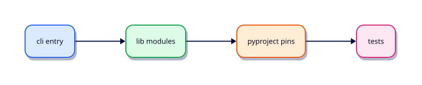

# Modules, Packages, and Dependencies

## Overview

A single 800-line script becomes unreviewable. Split into packages and pin dependencies early.

This is **Tutorial 6** in **Module 6: Modules & Packages** of the REBASH Academy **Python for DevOps Engineers** series — written for DevOps engineers, SREs, platform engineers, and cloud engineers who automate infrastructure with production-quality Python.

## Prerequisites

- Data Structures — Comprehensions and Generators
- Python 3.12+ on Linux (WSL2/VM/cloud)

## Learning Objectives

By the end of this tutorial, you will be able to:

- [ ] Apply the core ideas of “Modules, Packages, and Dependencies” in real ops automation
- [ ] Use a project venv and avoid relying on system site-packages
- [ ] Produce clear stderr diagnostics and meaningful exit codes
- [ ] Prefer safe patterns (pathlib, subprocess list args, dry-run)
- [ ] Relate this topic to day-to-day DevOps and platform work

## Architecture

Ops Python sits between operators/CI and platforms (files, APIs, CLIs, and cloud control planes). This topic’s control points are shown below.



## Theory

### import

```python
import json
from pathlib import Path
from mytool.lib.meta import fingerprint
```

Prefer absolute imports inside a package. Avoid `from module import *`.

### Standard Library

Reach for stdlib first: `pathlib`, `json`, `subprocess`, `logging`, `argparse`, `tempfile`, `dataclasses`, `concurrent.futures`. Add third-party libraries only when they clearly reduce risk or complexity.

### Custom Modules

A module is a `.py` file. Put shared helpers in `lib/` and keep `cli.py` thin. Use `if __name__ == "__main__":` only at entry points.

### Packages

A **package** is a directory with `__init__.py` (or a native namespace package). Layout that scales:

```text
tool/
  pyproject.toml
  src/tool/
    __init__.py
    cli.py
    lib/
  tests/
```

### Dependency Management

Pin versions in `requirements.txt` or a lockfile. Install only inside a venv. Separate runtime vs optional extras (`[dev]` for pytest). Never commit secrets; do commit the lock so CI and laptops match.

## Hands-on Lab

Create a workspace for this tutorial.

```bash
mkdir -p ~/rebash-python/lab06 && cd ~/rebash-python/lab06
```

**Focus:** create a tiny package with cli + lib; pin one dependency in requirements.txt

### Step 1 – Skeleton

```bash
cat > lab.py << 'EOF'
#!/usr/bin/env python3
print("lab06 modules-packages-and-dependencies")
EOF
chmod +x lab.py
python3 lab.py
```

### Step 2 – Package layout

```bash
mkdir -p demo_tool/lib
printf '%s\n' '' > demo_tool/__init__.py
printf '%s\n' '' > demo_tool/lib/__init__.py
cat > demo_tool/lib/meta.py << 'EOF'
def fingerprint() -> str:
    return "demo_tool-ok"
EOF
cat > demo_tool/cli.py << 'EOF'
from demo_tool.lib.meta import fingerprint

def main() -> int:
    print(fingerprint())
    return 0

if __name__ == "__main__":
    raise SystemExit(main())
EOF
echo 'PyYAML==6.0.2' > requirements.txt
PYTHONPATH=. python3 -m demo_tool.cli
```

### Final step – Cleanup note

```bash
python3 lab.py
# keep ~/rebash-python for later labs
```

## Validation

- [ ] Lab commands run under `~/rebash-python/lab06/`
- [ ] You can explain each Theory heading in your own words
- [ ] Failure path exits non-zero and prints diagnostics to stderr (where applicable)
- [ ] Dry-run / fixture behaviour is clear for any mutating or cloud action
- [ ] You can relate this topic to a real DevOps or platform task

## Code Walkthrough

Production Python for **Modules, Packages, and Dependencies** always combines:

1. A clear entry point (`main()` + `if __name__ == "__main__"`)
2. A project virtual environment and pinned dependencies when third-party libs are used
3. Explicit error handling and logging (no silent `except Exception: pass`)
4. Safe I/O: `pathlib`, timeouts on HTTP, `subprocess.run([...])` without `shell=True`
5. Documented exit codes and dry-run defaults for mutating actions

Keep modules short enough to review in a single merge request. Prefer stdlib first; add httpx/requests, Typer, pytest, and platform SDKs when the job needs them.

## Security Considerations

- Treat all external input (args, files, env, API payloads) as untrusted until validated
- Never log secrets or `Authorization` headers; prefer masked CI variables and secret stores
- Prefer least privilege tokens and read-only / dry-run modes by default
- Avoid `shell=True`, unvalidated path deletes, and committing `.env` files
- Pin dependencies; review transitive packages for automation that runs in CI

## Common Mistakes

!!! warning "Using system Python without a venv"
    Global packages drift between laptops and CI. **Fix:** `python3 -m venv .venv` per project and pin dependencies.

!!! warning "Calling subprocess with shell=True"
    Untrusted strings become remote code execution. **Fix:** pass a list of arguments; never build a shell string for the happy path.

!!! warning "Mutating without dry-run"
    Cleanup and apply tools destroy shared environments. **Fix:** default to dry-run; require `--apply` for side effects.

## Best Practices

- One purpose per command; share helpers in a small library package
- Log to stderr; reserve stdout for data or RESULT lines
- Idempotent behaviour where schedulers and CI may retry
- Fixture / mock paths for GitHub, Docker, Kubernetes, Terraform, and cloud SDKs in CI
- Pair every new tool with at least one failing-path test you actually run

## Troubleshooting

| Symptom | Likely cause | Fix |
|---------|--------------|-----|
| `ModuleNotFoundError` in CI | Missing venv / pins | Recreate venv; install from lock/requirements |
| Works locally, fails in pipeline | Different Python or env | Pin `requires-python`; fingerprint env in the job |
| Hang on HTTP call | No timeout | Set `timeout=` on requests/httpx clients |
| Secrets in logs | Debug printing headers | Redact; never log tokens |
| Accidental prune/delete | No dry-run default | Default dry-run; label lab resources |

## Summary

**Modules, Packages, and Dependencies** is a core skill for DevOps engineers automating real hosts, APIs, and pipelines with Python. Practise the lab until the failure path and dry-run path are as familiar as the happy path, then continue the track.

## Interview Questions

1. When would you choose Python over Bash for this kind of ops task?
2. What failure mode appears if you skip a venv, pinning, or dry-run here?
3. How would you test this behaviour in CI without live cloud credentials?
4. Where could secrets leak in a naive implementation of this topic?
5. What exit code contract would you document for teammates?

!!! tip "Sample answer — question 2"
    Floating dependencies and missing dry-run defaults create “works on my machine” automation that either breaks overnight or mutates shared infrastructure unexpectedly. Pin versions and default to report-only.

## Related Tutorials

- [Python for DevOps Engineers – Category Overview](index.md)
- [Data Structures — Comprehensions and Generators](data-structures-comprehensions-and-generators.md) *(previous)*
- [File Handling — pathlib, JSON, YAML, CSV](file-handling-pathlib-json-yaml-csv.md) *(next)*
- [Shell Scripting for DevOps Engineers](../shell/index.md)
- [Learning Paths](../learning-paths/index.md)

## References

- [Python 3 documentation](https://docs.python.org/3/)
- [requests documentation](https://requests.readthedocs.io/)
- [httpx documentation](https://www.python-httpx.org/)
- Track index: [Python for DevOps Engineers](index.md)
