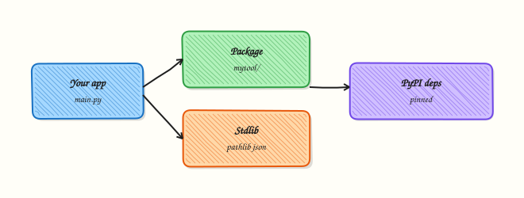

# Modules, Packages, and Dependencies

## Overview

Split an ops tool into importable modules, reuse the standard library first, and pin third-party dependencies in a project venv.

An 800-line script is hard to review and test. Packages give you boundaries: `cli.py`, `inventory.py`, `checks.py`. Dependencies belong in a venv with pins — never “whatever pip finds today.”

Complete [Data Structures](data-structures-comprehensions-and-generators.md) first. Diagrams use Excalidraw only.

This is a core tutorial in **Module 6 · Modules & Packages** of the REBASH Academy **Python for Cloud & DevOps Engineers** series — written for Cloud, DevOps, Platform, and SRE engineers.

## Prerequisites

### Required

- [Data Structures — Comprehensions and Generators](data-structures-comprehensions-and-generators.md)
- [Module 1 venv habits](python-fundamentals-install-venv-and-tooling.md)

## Learning Objectives

By the end of this tutorial, you will be able to:

- [ ] Import stdlib and local modules correctly  
- [ ] Lay out a small package (`mytool/`)  
- [ ] Use `if __name__ == "__main__"` vs library imports  
- [ ] Prefer stdlib before adding PyPI packages  
- [ ] Pin dependencies with `requirements.txt`

## Architecture

App entrypoint imports your package, stdlib, and pinned third-party deps.



## Theory

### import

```python
import json
from pathlib import Path
from collections import Counter
```

Prefer absolute imports inside packages. Avoid `from module import *`.

### Standard library first

Reach for `pathlib`, `json`, `subprocess`, `argparse`, `logging`, `urllib` before adding SDKs. Third-party earns its place when stdlib is awkward (YAML → `PyYAML`, rich CLIs → Typer).

### Custom modules

A `.py` file is a module. Same directory / `PYTHONPATH` / package install makes it importable.

### Packages

A directory with `__init__.py` (or a namespace package) groups modules:

```text
healthcheck/
  __init__.py
  checks.py
  cli.py
```

### Dependency management

```bash
python -m pip install 'PyYAML==6.0.2'
python -m pip freeze > requirements.txt
```

Document install in README: `python -m venv .venv && source .venv/bin/activate && pip install -r requirements.txt`. Later modules cover `pyproject.toml` (Module 23).

### Running vs importing

```python
# healthcheck/cli.py
def main() -> int:
    ...

if __name__ == "__main__":
    raise SystemExit(main())
```

Tests and other modules import `main` without executing side effects.

## Hands-on Lab

**Focus:** practise the core workflow for Modules, Packages, and Dependencies

```bash
mkdir -p ~/rebash-python/module-06
cd ~/rebash-python/module-06

python3 -m venv .venv
source .venv/bin/activate
python -m pip install --upgrade pip
```

### Step 1 – Package layout

```bash
cd ~/rebash-python/module-06
source .venv/bin/activate

mkdir -p healthcheck
cat > healthcheck/__init__.py << 'EOF'
"""Tiny healthcheck package for the Module 6 lab."""
__version__ = "0.1.0"
EOF

cat > healthcheck/checks.py << 'EOF'
from __future__ import annotations


def is_healthy(status: str) -> bool:
    return status == "healthy"
EOF

cat > healthcheck/cli.py << 'EOF'
from __future__ import annotations

import sys

from healthcheck.checks import is_healthy


def main(argv: list[str] | None = None) -> int:
    argv = argv if argv is not None else sys.argv[1:]
    if not argv:
        print("usage: python -m healthcheck.cli <status>", file=sys.stderr)
        return 2
    status = argv[0]
    ok = is_healthy(status)
    print("ok" if ok else "fail")
    return 0 if ok else 1


if __name__ == "__main__":
    raise SystemExit(main())
EOF
```

### Step 2 – Run as module

```bash
export PYTHONPATH=.
python -m healthcheck.cli healthy; echo exit=$?
python -m healthcheck.cli down; echo exit=$?
```

### Step 3 – Import without side effects

```bash
python - <<'PY'
from healthcheck.checks import is_healthy
from healthcheck import __version__
assert is_healthy("healthy")
print("version", __version__)
PY
```

### Step 4 – Pin an optional dep (YAML peek)

```bash
python -m pip install 'PyYAML==6.0.2'
python -m pip freeze | tee requirements.txt | head
python -c "import yaml; print(yaml.__version__)"
```

## Validation

- [ ] Lab commands run under `~/rebash-python/module-06/`
- [ ] You can explain each Theory section in your own words
- [ ] You used modern tooling where it applies to this topic
- [ ] You can describe one production failure mode for this topic

## Code Walkthrough

Production practice for **Modules, Packages, and Dependencies** always combines:

1. Inspect before you change (status, plan, logs, dry-run)
2. Prefer reversible, documented changes (Git, IaC, drop-ins, version pins)
3. Capture evidence (command output, pipeline logs) for handovers
4. Prefer current tools and APIs over legacy shortcuts
5. Least privilege — escalate credentials only when required

Keep runbooks short enough to follow under pressure. Automate checks; keep humans for judgement.

## Security Considerations

- Treat credentials and tokens for python as privileged — never commit them
- Prefer short-lived auth (OIDC, roles, SSO) over long-lived keys
- Validate blast radius before apply/deploy/delete operations
- Restrict who can approve production changes
- Collect audit logs; limit who can read sensitive traces

## Common Mistakes

!!! warning "Skipping fundamentals for Modules, Packages, and Dependencies"
    Validate assumptions against the Theory section and official docs before changing production.

!!! warning "Treating lab defaults as production-ready for Modules, Packages, and Dependencies"
    Lab shortcuts (open security groups, admin roles, skip approvals) must not ship unchanged.

!!! warning "Changing production without a rollback path"
    Always know how to revert (previous artefact, prior release, state rollback, DNS failback).

## Best Practices

- Encode Modules, Packages, and Dependencies changes as code and review them in pull requests
- Pin versions (images, modules, actions, provider plugins)
- Separate environments with clear promotion gates
- Alert on symptoms with runbooks attached
- Destroy lab resources; tag everything with owner and expiry where possible

## Troubleshooting

| Symptom | Likely cause | What to do |
|---------|--------------|------------|
| `ModuleNotFoundError: healthcheck` | Wrong cwd / PYTHONPATH | `export PYTHONPATH=.` or install editable later |
| Import runs CLI | Missing `if __name__` guard | Guard side effects |
| Works locally, fails in CI | Unpinned / missing install step | Commit requirements; install in job |

## Summary

- Split tools into packages early  
- Stdlib first; pin everything else  
- Entry points guarded with `__main__`  
- Same import path in tests and CLI

## Interview Questions

1. How does **Modules, Packages, and Dependencies** show up when operating Cloud or production platforms?
2. What would you check first if this area misbehaves in production?
3. Which modern tools or APIs replace older equivalents here?
4. What security control should accompany this capability?
5. How would you automate verification of this topic in CI?

!!! tip "Sample answer — question 2"
    Start with blast radius and recent changes, gather evidence (logs, status, plan/diff), then fix forward with a known rollback path — not guesswork.

## Related Tutorials

- [Course overview](index.md)
- - [File Handling — pathlib, JSON, YAML, CSV](file-handling-pathlib-json-yaml-csv.md)  
- [Packaging — pyproject.toml and Wheels](packaging-pyproject-and-wheels.md)

## References

- [Modules tutorial](https://docs.python.org/3/tutorial/modules.html)  
- [import system](https://docs.python.org/3/reference/import.html)
