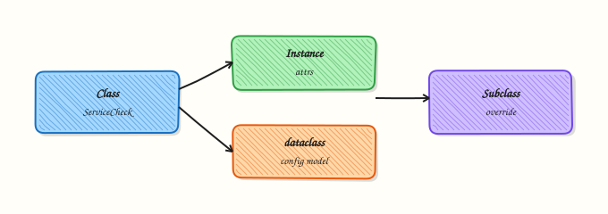

# OOP — Classes and Dataclasses

## Overview

You do not need a deep enterprise class hierarchy for a short shell helper. You do need clear types when a tool grows: a **host**, a **health check**, a **cloud account**. Object-Oriented Programming (OOP) gives you classes, methods, and inheritance. For data-shaped records, Python **dataclasses** reduce boilerplate and keep field lists obvious.

In DevOps work, a `Host` with `name`, `env`, and `ip` is easier to validate and serialise than a loose dict that may miss keys. Methods hold behaviour (`is_prod()`, `to_dict()`). `__post_init__` runs after a dataclass is created so you can reject bad values early. Inheritance and simple polymorphism help when several check types share a `run()` interface — without over-engineering.

This is **Tutorial 9** in **Module 9: OOP** of the REBASH Academy **Python for Cloud & DevOps Engineers** series. It is written for DevOps, Cloud, Platform, and Site Reliability Engineering (SRE) engineers. By the end, you will have a validated `Host` dataclass and dict serialisation under `~/rebash-python/lab09`.

## Prerequisites

- [Error Handling and Exceptions](error-handling-and-exceptions.md)
- Comfort with functions and dicts from earlier modules

## Learning Objectives

By the end of this tutorial, you will be able to:

- [ ] Define a class with methods and a clear public API
- [ ] Model config-like records with `@dataclass`
- [ ] Validate fields in `__post_init__`
- [ ] Serialise a dataclass to a `dict` for JSON/YAML
- [ ] Explain when a plain function is enough instead of a class

## Architecture

Ops concepts become types. A `Host` holds data and small methods. Validation runs at construction. Serialisation turns objects into dicts for files and APIs. Optional subclasses share a check interface.



## Theory

### What it is

A **class** is a blueprint. An **object** (instance) is one concrete value. **Methods** are functions on the class. A **constructor** in Python is `__init__`.

A **dataclass** generates `__init__`, `__repr__`, and comparison methods from annotated fields:

```python
from dataclasses import dataclass, asdict

@dataclass
class Host:
    name: str
    env: str
    ip: str

    def __post_init__(self) -> None:
        if not self.name:
            raise ValueError("name is required")
        if self.env not in {"dev", "stage", "prod"}:
            raise ValueError(f"bad env: {self.env}")

    def is_prod(self) -> bool:
        return self.env == "prod"

    def to_dict(self) -> dict:
        return asdict(self)
```

**Inheritance** shares behaviour (`class HttpCheck(BaseCheck):`). **Encapsulation** means keeping a clear public API and treating internal helpers as private by convention (`_validate`). **Polymorphism** means different objects share a method name (`check.run()`) so a runner can loop without caring about the exact type (duck typing is common in Python).

### Why it matters

Dicts are flexible but error-prone: missing `ip`, wrong `env`, or nested shape drift. Types at the boundary catch mistakes when config is loaded. Serialisation to dict keeps JSON/YAML easy. Over-deep inheritance trees slow reviews — prefer composition and dataclasses for data.

### How it works

1. **Model the record** — fields with types.
2. **Validate early** — `__post_init__` or a factory method.
3. **Add behaviour** — small methods, not god classes.
4. **Serialise** — `asdict()` / `to_dict()` for files and APIs.
5. **Stop when a function is enough** — one-off scripts do not need a class tax.

```python
h = Host(name="web-01", env="prod", ip="10.0.1.11")
assert h.is_prod()
payload = h.to_dict()  # {"name": "web-01", "env": "prod", "ip": "10.0.1.11"}
```

### Key concepts and comparisons

| Idea | Meaning | DevOps example |
|------|---------|----------------|
| Class / object | Blueprint / instance | `Host`, one server |
| Method | Behaviour on the instance | `is_prod()`, `to_dict()` |
| Inheritance | Share / extend behaviour | `BaseCheck` → `DiskCheck` |
| Dataclass | Data-focused class | Inventory rows, settings |
| Encapsulation | Clear public surface | Validate in `__post_init__` |

| Pattern | Prefer when | Avoid when |
|---------|-------------|------------|
| `@dataclass` | Config/inventory records | Heavy mutable services with many deps |
| Plain class + `__init__` | Complex setup / resources | Simple 3-field records |
| Inheritance | Shared check interface | Deep trees for every variant |
| Function module | Stateless helpers | Forcing a class with no state |

### Common pitfalls

- Building deep inheritance when a function and a dict would do.
- Skipping validation and discovering bad `env` in production.
- Mutable default fields (`list` / `dict`) without `field(default_factory=list)`.
- Putting network I/O inside `__init__` / `__post_init__` (hard to test).
- Treating private attributes as a security boundary — they are a convention only.

## Hands-on Lab

### Objective

Create a `Host` dataclass with methods, `__post_init__` validation, and `to_dict()` serialisation. Prove good hosts work and bad hosts raise. Save evidence under `~/rebash-python/lab09`.

### Prerequisites

- Python 3.12+ (dataclasses are in the standard library)
- Write access under your home directory

### Lab environment

Workspace: `~/rebash-python/lab09`

```bash
mkdir -p ~/rebash-python/lab09 && cd ~/rebash-python/lab09
set -euo pipefail
python3 -m venv .venv
source .venv/bin/activate
python -c "from dataclasses import dataclass; print('ok')"
```

**Expected output:** `ok`; `.venv` exists.

### Real-world scenario

Your inventory CLI will soon accept YAML hosts. Before wiring files, you model a `Host` type with validation so bad environments (`prd` typo) fail at construction, and you can dump clean dicts into JSON for a ticket attachment.

### Step-by-step tasks

#### Task 1 – Define Host dataclass with validation and methods

```bash
cd ~/rebash-python/lab09
set -euo pipefail
source .venv/bin/activate
```

Create `host_model.py`:

```python
from __future__ import annotations

from dataclasses import asdict, dataclass


ALLOWED_ENVS = frozenset({"dev", "stage", "prod"})


@dataclass
class Host:
    name: str
    env: str
    ip: str

    def __post_init__(self) -> None:
        self.name = self.name.strip()
        self.env = self.env.strip().lower()
        self.ip = self.ip.strip()
        if not self.name:
            raise ValueError("name is required")
        if self.env not in ALLOWED_ENVS:
            raise ValueError(f"env must be one of {sorted(ALLOWED_ENVS)}, got {self.env!r}")
        parts = self.ip.split(".")
        if len(parts) != 4 or not all(p.isdigit() and 0 <= int(p) <= 255 for p in parts):
            raise ValueError(f"ip looks invalid: {self.ip!r}")

    def is_prod(self) -> bool:
        return self.env == "prod"

    def label(self) -> str:
        return f"{self.name}.{self.env}"

    def to_dict(self) -> dict[str, str]:
        return asdict(self)
```

Run:

```bash
python -c "from host_model import Host; print(Host('web-01','prod','10.0.1.11').label())"
```

**Expected output:** `web-01.prod`

#### Task 2 – Serialise good hosts and reject bad ones

```bash
cd ~/rebash-python/lab09
set -euo pipefail
source .venv/bin/activate

python << 'PY'
import json
from pathlib import Path
from host_model import Host

root = Path.home() / "rebash-python" / "lab09"

hosts = [
    Host(name="web-01", env="prod", ip="10.0.1.11"),
    Host(name="web-02", env="stage", ip="10.0.1.12"),
    Host(name="db-01", env="PROD", ip="10.0.2.11"),  # normalised to prod
]

assert hosts[0].is_prod()
assert not hosts[1].is_prod()
assert hosts[2].env == "prod"

payload = {"hosts": [h.to_dict() for h in hosts]}
out = root / "hosts.json"
out.write_text(json.dumps(payload, indent=2) + "\n", encoding="utf-8")

# Negative tests
errors: list[str] = []
for bad in (
    dict(name="", env="prod", ip="10.0.1.11"),
    dict(name="x", env="prd", ip="10.0.1.11"),
    dict(name="x", env="dev", ip="10.0.1"),
):
    try:
        Host(**bad)
    except ValueError as exc:
        errors.append(str(exc))
    else:
        raise SystemExit(f"expected ValueError for {bad}")

(root / "validation-errors.txt").write_text("\n".join(errors) + "\n", encoding="utf-8")
assert len(errors) == 3
print("wrote", out)
print("errors", len(errors))
PY
```

**Expected output:** `hosts.json` written; three validation errors recorded.

#### Task 3 – Reload dicts into Host objects

```bash
cd ~/rebash-python/lab09
set -euo pipefail
source .venv/bin/activate

python << 'PY'
import json
from pathlib import Path
from host_model import Host

root = Path.home() / "rebash-python" / "lab09"
raw = json.loads((root / "hosts.json").read_text(encoding="utf-8"))
reloaded = [Host(**row) for row in raw["hosts"]]
assert len(reloaded) == 3
assert all(isinstance(h, Host) for h in reloaded)
assert reloaded[0].to_dict()["name"] == "web-01"

(root / "reload-ok.txt").write_text(
    "\n".join(h.label() for h in reloaded) + "\n",
    encoding="utf-8",
)
print((root / "reload-ok.txt").read_text(encoding="utf-8"))
PY
```

**Expected output:** `reload-ok.txt` lists three labels including `web-01.prod`.

### Validation steps

- [ ] `Host` rejects empty name, bad env, and bad IP
- [ ] `env` values are normalised (for example `PROD` → `prod`)
- [ ] `hosts.json` matches `to_dict()` output
- [ ] Reloading JSON into `Host` succeeds

### Common errors and fixes

| Error | Cause | Fix |
|-------|-------|-----|
| `mutable default` TypeError | `tags: list = []` | Use `field(default_factory=list)` |
| Validation never runs | Plain class without `__post_init__` | Use `@dataclass` + `__post_init__` or validate in `__init__` |
| `asdict` includes unwanted fields | Extra attributes | Keep only declared fields; or write a custom `to_dict` |
| Case typos in env | No normalisation | Strip/lower in `__post_init__` |

### Challenge exercise

Add an optional field `tags: list[str]` with `field(default_factory=list)`. Reject unknown tags outside `{"web","db","cache"}`. Create `Host("cache-01","prod","10.0.3.11", tags=["cache"])`, serialise to `challenge-host.json`, and prove reload works.

### Learning outcomes

- Built a dataclass with methods and validation
- Serialised to dict/JSON and reloaded
- Rejected invalid host records with clear errors

### Cleanup

```bash
cd ~/rebash-python/lab09
set -euo pipefail
# rm -rf .venv __pycache__ *.py *.json *.txt
deactivate 2>/dev/null || true
```

## Validation

- [ ] Lab finished under `~/rebash-python/lab09/`
- [ ] You can explain dataclass vs plain class
- [ ] You validate at construction time
- [ ] You know when a function is enough

## Code Walkthrough

Production habits for OOP in ops tools:

1. **Start with data** — dataclass fields that match YAML/JSON  
2. **Validate once** — `__post_init__` or a factory  
3. **Keep methods small** — no hidden network calls in constructors  
4. **Serialise explicitly** — `to_dict()` / `asdict()` at the boundary  
5. **Prefer composition** — a runner holding checks, not deep inheritance  

## Security Considerations

- Validation is not a substitute for auth — it only checks shape
- Do not store secrets as dataclass fields that get logged via `__repr__`
- Be careful dumping full objects into logs (use allow-listed fields)
- Treat private `_fields` as convention only, not access control
- Reject unexpected keys when loading from external JSON if you need strict schemas

## Common Mistakes

!!! warning "God classes that deploy, log, and page"
    Hard to test and review. **Fix:** keep `Host` as data; put I/O in separate functions/modules.

!!! warning "Mutable default arguments on fields"
    Shared list across instances. **Fix:** `field(default_factory=list)`.

!!! warning "Skipping `__post_init__` validation"
    Bad config reaches production. **Fix:** validate enums, IPs, and required strings early.

!!! warning "Deep inheritance for every cloud provider"
    Slow and brittle. **Fix:** shared protocol/duck typing + composition.

## Best Practices

- One dataclass per document shape (Host, Service, Alert)
- Normalise strings (strip, case) in one place
- Freeze dataclasses (`frozen=True`) when values should not change after load
- Add a short `label()` for human-readable logs
- Write unit tests for invalid env/IP cases

## Troubleshooting

| Symptom | Likely cause | Fix |
|---------|--------------|-----|
| `TypeError` on construct | Wrong field types / missing args | Match JSON keys to fields |
| Validation passes bad IP | Weak check | Improve `__post_init__` rules |
| JSON reload fails | Extra/missing keys | Align `to_dict` with constructor |
| Unexpected shared tags list | Mutable default | `default_factory` |
| Hard to mock Host | I/O in `__init__` | Move I/O out of the model |

## Summary

Classes and dataclasses turn loose dicts into validated ops models. Keep data objects small, validate in `__post_init__`, and serialise to dict for files and APIs. Next, emit useful diagnostics in [Logging and Debugging](logging-and-debugging.md).

## Interview Questions

**1. When do you choose a dataclass over a plain dict for inventory hosts?**

??? success "Reveal answer"
    Choose a dataclass when you have a stable set of fields, want validation, methods like `is_prod()`, and clear serialisation. Dicts are fine for throwaway scripts. Interviewers look for “validate once at the boundary” rather than checking keys in every function.

**2. What is `__post_init__` for, and what should you avoid putting in it?**

??? success "Reveal answer"
    It runs after the dataclass `__init__` to normalise and validate fields. Avoid network calls, file I/O, and heavy side effects there — those make objects hard to test and slow to construct. Keep `__post_init__` about data quality.

**3. How do inheritance and duck typing show up in a health-check runner?**

??? success "Reveal answer"
    A runner can call `check.run()` on any object that has that method. You may use a small base class or just a shared method name (duck typing). Prefer a shallow hierarchy: shared helpers, not five levels of subclasses.

**4. Why is `tags: list = []` as a dataclass field dangerous?**

??? success "Reveal answer"
    Mutable defaults are shared across instances if handled incorrectly. Dataclasses require `field(default_factory=list)` so each instance gets its own list. Shared mutables cause confusing cross-host tag bugs.

**5. How do you serialise a dataclass for JSON without leaking internal fields?**

??? success "Reveal answer"
    Use `asdict()` when all fields are public and JSON-safe, or write an explicit `to_dict()` that allow-lists keys. Do not dump objects that contain secrets. Round-trip test: dict → JSON → construct dataclass again.

**6. A colleague builds a 12-level class hierarchy for cloud resources. What do you suggest instead?**

??? success "Reveal answer"
    Prefer composition: a client object plus small resource models (dataclasses). Share behaviour with functions or a thin base only where it removes real duplication. Deep hierarchies are hard to change and review in ops codebases.

**7. How would you prove in a PR that Host validation works?**

??? success "Reveal answer"
    Show unit tests (or a lab script) that construct valid hosts successfully and assert `ValueError` for empty name, bad env, and bad IP. Attach sample `to_dict()` JSON. Evidence of both allow and deny paths matters — same idea as sudo allow/deny tests on Linux.

## Related Tutorials

- [Python for Cloud & DevOps – Overview](index.md)
- [Error Handling and Exceptions](error-handling-and-exceptions.md) *(previous)*
- [Logging and Debugging](logging-and-debugging.md) *(next)*
- [CLI Applications — argparse, Click, and Typer](cli-applications-argparse-click-typer.md)

## References

- [Classes](https://docs.python.org/3/tutorial/classes.html) — Python tutorial  
- [dataclasses — Data Classes](https://docs.python.org/3/library/dataclasses.html) — Python docs  
- Track index: [Python for Cloud & DevOps Engineers](index.md)
