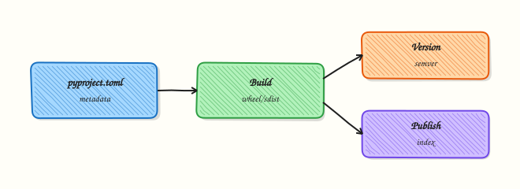

# Packaging — pyproject.toml and Wheels

## Overview

Turn an ops tool into an installable package with `pyproject.toml`, a console script entry point, a built wheel, and clear versioning/dependency metadata.

`PYTHONPATH=.` works in labs. Teams need **`pip install`** (or uv) of an internal wheel/index. Modern packaging centres on **pyproject.toml** + build backends (hatchling/setuptools).

Complete [Testing with pytest](testing-with-pytest.md) first. Diagrams use Excalidraw only.

This is a core tutorial in **Module 23 · Packaging** of the REBASH Academy **Python for Cloud & DevOps Engineers** series — written for Cloud, DevOps, Platform, and SRE engineers.

## Prerequisites

### Required

- [Modules, Packages, and Dependencies](modules-packages-and-dependencies.md)
- [CLI Applications](cli-applications-argparse-click-typer.md)

## Learning Objectives

By the end of this tutorial, you will be able to:

- [ ] Author a minimal `pyproject.toml`  
- [ ] Declare `requires-python` and dependencies  
- [ ] Define a console script entry point  
- [ ] Build an sdist/wheel  
- [ ] Explain versioning and private index publishing  
- [ ] Install the package into a clean venv

## Architecture

This topic’s control points and relationships are shown below.



## Theory

### What it is

Packaging turns a folder of scripts into an installable **distribution**: metadata, dependencies, and entry-point console scripts. Modern Python projects declare that in **`pyproject.toml`** (PEP 621). A **source distribution (sdist)** ships source; a **wheel** is a built install artefact that `pip`/`uv` can install quickly without running arbitrary setup code at install time (for pure Python).

### Why it matters

DevOps tools leave the lab when colleagues run `pip install rebash-healthcheck` (or install a private wheel in CI images). Without packaging you copy files and hope `PYTHONPATH` is set. With packaging you get versioned releases, dependency declarations, and a stable CLI name via `[project.scripts]`. Internal indexes (Artifactory, CodeArtifact, GitHub Packages) become the team’s “app store” for automation.

### How it works

`[project]` holds name, version, `requires-python`, and dependencies. `[project.scripts]` maps a command to `module:function`. `[build-system]` names the build backend (often setuptools or hatchling). Build with `python -m build` (or `uv build`) to produce `dist/*.whl` and an sdist. Install the wheel into a venv to verify the console script. Publish on git tags: public to PyPI, private to your index URL documented in the README and CI.

```toml
[project]
name = "rebash-healthcheck"
version = "0.1.0"
requires-python = ">=3.12"
dependencies = []

[project.scripts]
rebash-healthcheck = "rebash_healthcheck.cli:main"

[build-system]
requires = ["setuptools>=68"]
build-backend = "setuptools.build_meta"
```

### Key concepts and comparisons

| Artefact | Contents | Use |
|----------|----------|-----|
| sdist | Source + metadata | Rebuild on exotic platforms |
| wheel | Built package | Fast, preferred installs |

| Dependency style | When |
|------------------|------|
| Ranges (`>=x,<y`) | Libraries others import |
| Exact pins / lockfile | Apps and deploy images |
| Optional extras | Heavy optional features |

Version with SemVer-style `MAJOR.MINOR.PATCH`. Automate from git later (`setuptools_scm`) once the basics are solid.

### Common pitfalls

- Forgetting `[project.scripts]` so the CLI never appears on `PATH`.  
- Shipping secrets or huge fixtures inside the package data.  
- Publishing `0.0.0` repeatedly without tags — consumers cannot pin.  
- Mixing editable installs and system Python until imports resolve wrongly.  
- Using an untrusted private index without Transport Layer Security (TLS) verification.

## Hands-on Lab

**Focus:** practise the core workflow for Packaging — pyproject.toml and Wheels

```bash
mkdir -p ~/rebash-python/module-23
cd ~/rebash-python/module-23

python3 -m venv .venv
source .venv/bin/activate
python -m pip install --upgrade pip
python -m pip install 'build==1.2.2.post1'
```

### Step 1 – Package layout

```bash
cd ~/rebash-python/module-23
source .venv/bin/activate

mkdir -p src/rebash_healthcheck
cat > pyproject.toml << 'EOF'
[project]
name = "rebash-healthcheck"
version = "0.1.0"
description = "Module 23 lab CLI"
readme = "README.md"
requires-python = ">=3.12"
dependencies = []

[project.scripts]
rebash-healthcheck = "rebash_healthcheck.cli:main"

[build-system]
requires = ["setuptools>=68"]
build-backend = "setuptools.build_meta"

[tool.setuptools.packages.find]
where = ["src"]
EOF

cat > README.md << 'EOF'
# rebash-healthcheck

Lab package for Module 23.
EOF

cat > src/rebash_healthcheck/__init__.py << 'EOF'
__version__ = "0.1.0"
EOF

cat > src/rebash_healthcheck/cli.py << 'EOF'
from __future__ import annotations

import argparse


def main(argv: list[str] | None = None) -> int:
    p = argparse.ArgumentParser(prog="rebash-healthcheck")
    p.add_argument("--version", action="store_true")
    args = p.parse_args(argv)
    if args.version:
        from rebash_healthcheck import __version__

        print(__version__)
        return 0
    print("ok")
    return 0


if __name__ == "__main__":
    raise SystemExit(main())
EOF
```

### Step 2 – Build

```bash
python -m build
ls dist/
```

### Step 3 – Install into a clean venv

```bash
python3 -m venv /tmp/rebash-pkg-test
/tmp/rebash-pkg-test/bin/pip install dist/rebash_healthcheck-0.1.0-py3-none-any.whl
/tmp/rebash-pkg-test/bin/rebash-healthcheck --version
/tmp/rebash-pkg-test/bin/rebash-healthcheck
```

### Step 4 – Editable install for development

```bash
python -m pip install -e .
rebash-healthcheck --version
```

## Validation

- [ ] Lab commands run under `~/rebash-python/module-23/`
- [ ] You can explain each Theory section in your own words
- [ ] You used modern tooling where it applies to this topic
- [ ] You can describe one production failure mode for this topic

## Code Walkthrough

Production practice for **Packaging — pyproject.toml and Wheels** always combines:

1. Inspect before you change (status, plan, logs, dry-run)
2. Prefer reversible, documented changes (Git, IaC, drop-ins, version pins)
3. Capture evidence (command output, pipeline logs) for handovers
4. Prefer current tools and APIs over legacy shortcuts
5. Least privilege — escalate credentials only when required

Keep runbooks short enough to follow under pressure. Automate checks; keep humans for judgement.

## Security Considerations

- Treat credentials and tokens for python as privileged — never commit them
- Prefer short-lived auth (OIDC, roles, SSO) over long-lived keys
- Validate blast radius before apply/deploy/delete operations
- Restrict who can approve production changes
- Collect audit logs; limit who can read sensitive traces

## Common Mistakes

!!! warning "Forgetting `[project.scripts]` so the CLI never appears on `PATH`.  "
    Validate assumptions against the Theory section and official docs before changing production.

!!! warning "Shipping secrets or huge fixtures inside the package data.  "
    Lab shortcuts (open security groups, admin roles, skip approvals) must not ship unchanged.

!!! warning "Changing production without a rollback path"
    Always know how to revert (previous artefact, prior release, state rollback, DNS failback).

## Best Practices

- Encode Packaging — pyproject.toml and Wheels changes as code and review them in pull requests
- Pin versions (images, modules, actions, provider plugins)
- Separate environments with clear promotion gates
- Alert on symptoms with runbooks attached
- Destroy lab resources; tag everything with owner and expiry where possible

## Troubleshooting

| Symptom | Likely cause | What to do |
|---------|--------------|------------|
| Package not found | Wrong `where` / src layout | Fix setuptools package find |
| Script missing | Entry point typo | Check module:function |
| Wrong Python | requires-python | Build/install with 3.12+ |

## Summary

- `pyproject.toml` is the packaging source of truth  
- Wheels install cleanly in CI and servers  
- Console scripts expose CLIs  
- Publish to a private index for teams

## Interview Questions

1. How does **Packaging — pyproject.toml and Wheels** show up when operating Cloud or production platforms?
2. What would you check first if this area misbehaves in production?
3. Which modern tools or APIs replace older equivalents here?
4. What security control should accompany this capability?
5. How would you automate verification of this topic in CI?

!!! tip "Sample answer — question 2"
    Start with blast radius and recent changes, gather evidence (logs, status, plan/diff), then fix forward with a known rollback path — not guesswork.

## Related Tutorials

- [Course overview](index.md)
- - [Production Engineering Patterns](production-engineering-patterns.md)

## References

- [Python Packaging User Guide](https://packaging.python.org/)  
- [pyproject.toml spec](https://packaging.python.org/en/latest/specifications/pyproject-toml/)
