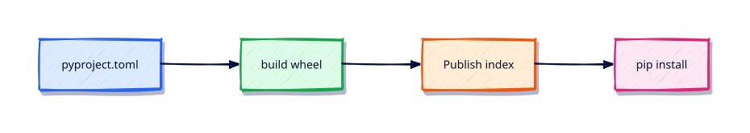

# Packaging — pyproject.toml and Wheels

## Overview

A tool teammates can `pip install` beats a wiki of copy-pasted scripts.

This is **Tutorial 23** in **Module 23: Packaging** of the REBASH Academy **Python for DevOps Engineers** series — written for DevOps engineers, SREs, platform engineers, and cloud engineers who automate infrastructure with production-quality Python.

## Prerequisites

- Testing with pytest
- Python 3.12+ on Linux (WSL2/VM/cloud)

## Learning Objectives

By the end of this tutorial, you will be able to:

- [ ] Apply the core ideas of “Packaging — pyproject.toml and Wheels” in real ops automation
- [ ] Use a project venv and avoid relying on system site-packages
- [ ] Produce clear stderr diagnostics and meaningful exit codes
- [ ] Prefer safe patterns (pathlib, subprocess list args, dry-run)
- [ ] Relate this topic to day-to-day DevOps and platform work

## Architecture

Ops Python sits between operators/CI and platforms (files, APIs, CLIs, and cloud control planes). This topic’s control points are shown below.



## Theory

### pyproject.toml

Declare build system, project metadata, scripts/entry points, and optional deps. Single source of truth for modern packaging.

### Wheels

Built distributions (`*.whl`) install fast and reproducibly. Build with `python -m build`.

### Publishing Packages

Publish to a private index (or PyPI) from CI using trusted publishing / tokens. Tag releases from CI, not laptops.

### Versioning

SemVer for APIs; calendar or SemVer for internal CLIs. Single-source version in package metadata.

### Dependency Management

Pin ranges thoughtfully (`>=x,<y`) for libraries; pin exact versions for applications/lockfiles. Separate `[project.optional-dependencies]` for dev/test.

## Hands-on Lab

Create a workspace for this tutorial.

```bash
mkdir -p ~/rebash-python/lab23 && cd ~/rebash-python/lab23
```

**Focus:** minimal pyproject.toml + console script entry; build wheel if build installed

### Step 1 – Skeleton

```bash
cat > lab.py << 'EOF'
#!/usr/bin/env python3
print("lab23 packaging-pyproject-and-wheels")
EOF
chmod +x lab.py
python3 lab.py
```

### Step 2 – Minimal packaging

```bash
mkdir -p src/rebash_lab
cat > src/rebash_lab/__init__.py << 'EOF'
__version__ = "0.1.0"
EOF
cat > src/rebash_lab/__main__.py << 'EOF'
def main() -> int:
    print("rebash-lab 0.1.0")
    return 0

if __name__ == "__main__":
    raise SystemExit(main())
EOF
cat > pyproject.toml << 'EOF'
[project]
name = "rebash-lab"
version = "0.1.0"
description = "Lab package"
requires-python = ">=3.11"
[project.scripts]
rebash-lab = "rebash_lab.__main__:main"
[build-system]
requires = ["setuptools>=68"]
build-backend = "setuptools.build_meta"
[tool.setuptools.packages.find]
where = ["src"]
EOF
PYTHONPATH=src python3 -m rebash_lab
python3 -m pip install -q build >/dev/null 2>&1 && python3 -m build || echo 'build optional'
```

### Final step – Cleanup note

```bash
python3 lab.py
# keep ~/rebash-python for later labs
```

## Validation

- [ ] Lab commands run under `~/rebash-python/lab23/`
- [ ] You can explain each Theory heading in your own words
- [ ] Failure path exits non-zero and prints diagnostics to stderr (where applicable)
- [ ] Dry-run / fixture behaviour is clear for any mutating or cloud action
- [ ] You can relate this topic to a real DevOps or platform task

## Code Walkthrough

Production Python for **Packaging — pyproject.toml and Wheels** always combines:

1. A clear entry point (`main()` + `if __name__ == "__main__"`)
2. A project virtual environment and pinned dependencies when third-party libs are used
3. Explicit error handling and logging (no silent `except Exception: pass`)
4. Safe I/O: `pathlib`, timeouts on HTTP, `subprocess.run([...])` without `shell=True`
5. Documented exit codes and dry-run defaults for mutating actions

Keep modules short enough to review in a single merge request. Prefer stdlib first; add httpx/requests, Typer, pytest, and platform SDKs when the job needs them.

## Security Considerations

- Treat all external input (args, files, env, API payloads) as untrusted until validated
- Never log secrets or `Authorization` headers; prefer masked CI variables and secret stores
- Prefer least privilege tokens and read-only / dry-run modes by default
- Avoid `shell=True`, unvalidated path deletes, and committing `.env` files
- Pin dependencies; review transitive packages for automation that runs in CI

## Common Mistakes

!!! warning "Using system Python without a venv"
    Global packages drift between laptops and CI. **Fix:** `python3 -m venv .venv` per project and pin dependencies.

!!! warning "Calling subprocess with shell=True"
    Untrusted strings become remote code execution. **Fix:** pass a list of arguments; never build a shell string for the happy path.

!!! warning "Mutating without dry-run"
    Cleanup and apply tools destroy shared environments. **Fix:** default to dry-run; require `--apply` for side effects.

## Best Practices

- One purpose per command; share helpers in a small library package
- Log to stderr; reserve stdout for data or RESULT lines
- Idempotent behaviour where schedulers and CI may retry
- Fixture / mock paths for GitHub, Docker, Kubernetes, Terraform, and cloud SDKs in CI
- Pair every new tool with at least one failing-path test you actually run

## Troubleshooting

| Symptom | Likely cause | Fix |
|---------|--------------|-----|
| `ModuleNotFoundError` in CI | Missing venv / pins | Recreate venv; install from lock/requirements |
| Works locally, fails in pipeline | Different Python or env | Pin `requires-python`; fingerprint env in the job |
| Hang on HTTP call | No timeout | Set `timeout=` on requests/httpx clients |
| Secrets in logs | Debug printing headers | Redact; never log tokens |
| Accidental prune/delete | No dry-run default | Default dry-run; label lab resources |

## Summary

**Packaging — pyproject.toml and Wheels** is a core skill for DevOps engineers automating real hosts, APIs, and pipelines with Python. Practise the lab until the failure path and dry-run path are as familiar as the happy path, then continue the track.

## Interview Questions

1. When would you choose Python over Bash for this kind of ops task?
2. What failure mode appears if you skip a venv, pinning, or dry-run here?
3. How would you test this behaviour in CI without live cloud credentials?
4. Where could secrets leak in a naive implementation of this topic?
5. What exit code contract would you document for teammates?

!!! tip "Sample answer — question 2"
    Floating dependencies and missing dry-run defaults create “works on my machine” automation that either breaks overnight or mutates shared infrastructure unexpectedly. Pin versions and default to report-only.

## Related Tutorials

- [Python for DevOps Engineers – Category Overview](index.md)
- [Testing with pytest](testing-with-pytest.md) *(previous)*
- [Production Engineering Patterns](production-engineering-patterns.md) *(next)*
- [Shell Scripting for DevOps Engineers](../shell/index.md)
- [Learning Paths](../learning-paths/index.md)

## References

- [Python 3 documentation](https://docs.python.org/3/)
- [requests documentation](https://requests.readthedocs.io/)
- [httpx documentation](https://www.python-httpx.org/)
- Track index: [Python for DevOps Engineers](index.md)
