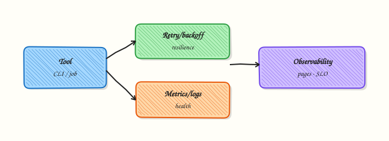

# Production Engineering Patterns

## Overview

A script that works once on your laptop is not a production tool. Production automation must survive short network blips, emit logs that operators can search, avoid writing the same change twice, and stop calling a broken dependency when it is clearly down. That set of habits is what engineers mean by **production engineering patterns** in Python.

In this tutorial you will combine four building blocks that show up in almost every Cloud and DevOps job: **structured logging** (machine-readable fields, not random `print` lines), **retries with backoff** for temporary failures, a **circuit-breaker-lite** that opens after too many failures, and an **idempotent write** so a second run does not corrupt state. You will wrap them in a small Command-Line Interface (CLI) that supports `--dry-run` and prints a clear `RESULT=` line for CI parsers.

On Continuous Integration (CI) runners, Kubernetes jobs, and cron hosts, these patterns decide whether a flaky Application Programming Interface (API) becomes a paging incident or a quiet retry. Teams that skip them often get silent double-writes, log spam with no correlation fields, or jobs that hammer a failing endpoint forever. Big platforms add OpenTelemetry later; the ideas start with clear logs, capped retries, and proof of success or failure.

This is **Tutorial 24** in **Module 24: Production Engineering** of the REBASH Academy **Python for Cloud & DevOps Engineers** series. It is written for DevOps, platform, and Site Reliability Engineering (SRE) engineers. By the end you will have a working CLI under `~/rebash-python/lab24` you can explain in a design review or interview.

## Prerequisites

- [Packaging — pyproject.toml and Wheels](packaging-pyproject-and-wheels.md)
- [Logging and Debugging](logging-and-debugging.md) (helpful)
- [REST APIs — requests, Auth, and Resilience](rest-apis-requests-auth-and-resilience.md) (helpful)
- Python 3.10+ on a practice machine or Ubuntu virtual machine (VM)
- Do **not** point this lab at a real production API

## Learning Objectives

By the end of this tutorial, you will be able to:

- [ ] Emit structured log lines with level, event, and attempt fields
- [ ] Implement capped retries with exponential backoff for temporary errors
- [ ] Open a simple circuit breaker after repeated failures and skip further calls
- [ ] Write state idempotently so a second run leaves a stable result
- [ ] Ship a CLI with `--dry-run` that prints a parseable `RESULT=` line

## Architecture

Resilience sits between your CLI and the outside world (APIs, disks, remote jobs). Logs leave for operators. Retries and the circuit breaker protect callers. Idempotent writes protect data.



## Theory

### What it is

**Structured logging** means each log line carries stable fields (for example `event=retry attempt=2`) so log tools can filter and alert. A **retry** re-runs a failing operation a limited number of times, usually with **exponential backoff** (wait 1s, then 2s, then 4s). A **circuit breaker** stops calling a dependency after a failure threshold, then optionally allows a probe later. **Idempotent** means “same request, same final state” — safe to run twice.

```python
import logging
logging.basicConfig(level=logging.INFO, format="%(levelname)s %(message)s")
logging.getLogger("job").info("event=start job_id=lab24")
```

### Why it matters

Cloud APIs return 429 (rate limit) and 5xx (server error). Disks fill. Remote hosts reboot. Without retries, CI fails for noise. Without a circuit breaker, one bad dependency floods logs and burns quotas. Without idempotent writes, a redeploy creates duplicate tickets or double charges. Operators need `RESULT=ok` or `RESULT=fail` in the last lines of a job so dashboards and pipelines can parse outcomes without reading novels.

### How it works

1. **Log** — configure `logging` once; put `event=` and key fields in the message (or JSON later).
2. **Retry** — catch only temporary errors; sleep with backoff; give up after `max_attempts`.
3. **Circuit** — count consecutive failures; when open, fail fast without calling the dependency.
4. **Idempotent write** — write to a temp file then `os.replace`, or skip if a marker already matches the desired content.
5. **CLI** — `argparse` with `--dry-run`; always print `RESULT=...` before exit.

```python
import time

def call_with_retry(fn, *, max_attempts=3, base_delay=0.05):
    last = None
    for attempt in range(1, max_attempts + 1):
        try:
            return fn()
        except TemporaryError as exc:
            last = exc
            if attempt == max_attempts:
                break
            time.sleep(base_delay * (2 ** (attempt - 1)))
    raise last
```

In production you may use libraries (`tenacity`, OpenTelemetry). Learn the ideas with a few dozen lines of clear code first.

### Key concepts and comparisons

| Pattern | Prefer when | Avoid when |
|---------|-------------|------------|
| Retry + backoff | Temporary 429/5xx, brief timeouts | Permanent 403, bad config, schema errors |
| Circuit breaker | Dependency is clearly down | Single rare blip (retries are enough) |
| Idempotent write | Jobs can be re-run or overlap | Operations that must create unique side effects every time |
| Dry-run | Change tickets, CI plan stages | Hiding that dry-run skipped the real write |

| Signal | Good for operators |
|--------|--------------------|
| Structured `event=` logs | Search and alert |
| `RESULT=ok` / `RESULT=fail` | CI step parsers |
| Exit code 0 / non-zero | Shell pipelines |

### Common pitfalls

- Retrying every exception, including `PermissionError` and bad arguments.
- Infinite retries with no cap (CI hangs until the job timeout).
- Logging secrets or full HTTP bodies in structured fields.
- Calling a “write” that appends forever instead of converging on one file state.
- Skipping `--dry-run` so the only way to test is to change production.

## Hands-on Lab

### Objective

Build a small production-style CLI under `~/rebash-python/lab24` that uses structured logs, retries, a circuit-breaker-lite, and an idempotent state write. Prove dry-run and live runs with a `RESULT=` line and evidence files.

### Prerequisites

- Python 3.10+ (`python3 --version`)
- Standard library only (no paid APIs)
- Writable home directory for the lab folder

### Lab environment

Workspace: `~/rebash-python/lab24`

```bash
mkdir -p ~/rebash-python/lab24 && cd ~/rebash-python/lab24
set -euo pipefail
python3 --version | tee python-version.txt
test -n "$(command -v python3)"
```

**Expected output:** `python-version.txt` shows Python 3.10 or newer.

### Real-world scenario

Your team runs a nightly sync that writes a small status file used by a dashboard. The remote probe sometimes fails twice then succeeds. Security asks for dry-run in the change ticket. On-call asks for a single `RESULT=` line at the end of every run. You implement the patterns locally with a fake flaky probe so you can prove behaviour without touching production.

### Step-by-step tasks

#### Task 1 – Resilience module (logging, retry, circuit, idempotent write)

Create the core module. The fake probe fails twice, then succeeds. The circuit opens if you force too many failures.

Create `resilient_job.py`:

```python
"""Production patterns lab: structured logs, retry, circuit, idempotent write."""
from __future__ import annotations

import argparse
import json
import logging
import os
import sys
import time
from pathlib import Path

LOG = logging.getLogger("rebash.lab24")


class TemporaryError(Exception):
    """Retryable failure (simulated blip)."""


class CircuitOpenError(Exception):
    """Dependency circuit is open — fail fast."""


class CircuitBreaker:
    def __init__(self, failure_threshold: int = 3) -> None:
        self.failure_threshold = failure_threshold
        self.failures = 0
        self.open = False

    def before_call(self) -> None:
        if self.open:
            raise CircuitOpenError("circuit_open")

    def record_success(self) -> None:
        self.failures = 0
        self.open = False

    def record_failure(self) -> None:
        self.failures += 1
        if self.failures >= self.failure_threshold:
            self.open = True
            LOG.warning("event=circuit_open failures=%s", self.failures)


class FlakyProbe:
    """Fails the first `fail_times` calls, then returns ok."""

    def __init__(self, fail_times: int = 2) -> None:
        self.fail_times = fail_times
        self.calls = 0

    def __call__(self) -> str:
        self.calls += 1
        if self.calls <= self.fail_times:
            raise TemporaryError(f"blip call={self.calls}")
        return "probe_ok"


def setup_logging(verbose: bool) -> None:
    level = logging.DEBUG if verbose else logging.INFO
    logging.basicConfig(
        level=level,
        format="%(levelname)s %(name)s %(message)s",
        stream=sys.stderr,
        force=True,
    )


def call_with_retry(fn, *, max_attempts: int, base_delay: float, circuit: CircuitBreaker):
    last: Exception | None = None
    for attempt in range(1, max_attempts + 1):
        circuit.before_call()
        try:
            LOG.info("event=attempt n=%s", attempt)
            value = fn()
            circuit.record_success()
            LOG.info("event=attempt_ok n=%s", attempt)
            return value
        except TemporaryError as exc:
            last = exc
            circuit.record_failure()
            LOG.warning("event=retry n=%s error=%s", attempt, exc)
            if attempt == max_attempts or circuit.open:
                break
            time.sleep(base_delay * (2 ** (attempt - 1)))
        except CircuitOpenError:
            raise
    assert last is not None
    raise last


def idempotent_write(path: Path, payload: dict, *, dry_run: bool) -> str:
    """Write JSON atomically. Skip rewrite if content already matches."""
    text = json.dumps(payload, sort_keys=True, indent=2) + "\n"
    if path.exists() and path.read_text(encoding="utf-8") == text:
        LOG.info("event=idempotent_skip path=%s", path)
        return "unchanged"
    if dry_run:
        LOG.info("event=dry_run_write path=%s", path)
        return "dry_run"
    path.parent.mkdir(parents=True, exist_ok=True)
    tmp = path.with_suffix(path.suffix + ".tmp")
    tmp.write_text(text, encoding="utf-8")
    os.replace(tmp, path)
    LOG.info("event=write_ok path=%s", path)
    return "written"


def main(argv: list[str] | None = None) -> int:
    parser = argparse.ArgumentParser(description="REBASH lab24 resilient job")
    parser.add_argument("--state-file", default="state/status.json")
    parser.add_argument("--dry-run", action="store_true")
    parser.add_argument("--max-attempts", type=int, default=4)
    parser.add_argument("--fail-times", type=int, default=2)
    parser.add_argument("--force-open-circuit", action="store_true")
    parser.add_argument("-v", "--verbose", action="store_true")
    args = parser.parse_args(argv)

    setup_logging(args.verbose)
    state_path = Path(args.state_file)
    circuit = CircuitBreaker(failure_threshold=3)
    probe = FlakyProbe(fail_times=args.fail_times)

    if args.force_open_circuit:
        for _ in range(3):
            circuit.record_failure()

    try:
        value = call_with_retry(
            probe,
            max_attempts=args.max_attempts,
            base_delay=0.02,
            circuit=circuit,
        )
        action = idempotent_write(
            state_path,
            {"status": "ok", "probe": value},
            dry_run=args.dry_run,
        )
        print(f"RESULT=ok action={action}")
        return 0
    except (TemporaryError, CircuitOpenError) as exc:
        LOG.error("event=job_failed error=%s", exc)
        print(f"RESULT=fail error={exc}")
        return 1


if __name__ == "__main__":
    raise SystemExit(main())
```

Run:

```bash
cd ~/rebash-python/lab24
set -euo pipefail
python3 -m py_compile resilient_job.py
```


**Expected output:** `py_compile` exits 0 with no traceback.

#### Task 2 – Dry-run, live run, and idempotent second run

```bash
cd ~/rebash-python/lab24
set -euo pipefail

python3 resilient_job.py --dry-run -v 2>run-dry.stderr | tee run-dry.stdout
grep -F 'RESULT=ok action=dry_run' run-dry.stdout
test ! -f state/status.json

python3 resilient_job.py -v 2>run-live.stderr | tee run-live.stdout
grep -F 'RESULT=ok action=written' run-live.stdout
test -f state/status.json
grep -F '"status": "ok"' state/status.json

python3 resilient_job.py -v 2>run-idem.stderr | tee run-idem.stdout
grep -F 'RESULT=ok action=unchanged' run-idem.stdout
grep -F 'event=idempotent_skip' run-idem.stderr
```

**Expected output:** dry-run does not create the file; first live run writes; second live run reports `unchanged`.

#### Task 3 – Circuit open path and evidence pack

```bash
cd ~/rebash-python/lab24
set -euo pipefail

set +e
python3 resilient_job.py --force-open-circuit --state-file state/circuit.json \
  2>run-circuit.stderr | tee run-circuit.stdout
rc=$?
set -e
test "$rc" -ne 0
grep -F 'RESULT=fail' run-circuit.stdout
grep -E 'circuit_open|CircuitOpenError|circuit open' run-circuit.stderr run-circuit.stdout || true
grep -F 'RESULT=fail error=circuit_open' run-circuit.stdout

tar -czf lab24-evidence.tgz \
  python-version.txt resilient_job.py state/status.json \
  run-dry.stdout run-dry.stderr \
  run-live.stdout run-live.stderr \
  run-idem.stdout run-idem.stderr \
  run-circuit.stdout run-circuit.stderr
ls -l lab24-evidence.tgz | tee evidence-ls.txt
```

**Expected output:** circuit run exits non-zero with `RESULT=fail`; `lab24-evidence.tgz` is non-empty.

### Validation steps

- [ ] `resilient_job.py` compiles
- [ ] Dry-run prints `RESULT=ok action=dry_run` and creates no state file
- [ ] Live run writes `state/status.json` then second run prints `action=unchanged`
- [ ] Forced circuit path prints `RESULT=fail` and non-zero exit
- [ ] `lab24-evidence.tgz` exists under `~/rebash-python/lab24`

### Common errors and fixes

| Error | Cause | Fix |
|-------|-------|-----|
| `RESULT=fail` on first live run | `fail_times` ≥ `max_attempts` | Keep defaults (`fail_times=2`, `max_attempts=4`) |
| State file missing after live run | Ran only `--dry-run` | Run without `--dry-run` |
| No retry lines in stderr | Forgot `-v` / logging level | Use `-v` and read `*.stderr` |
| `FileNotExists` in tar | Skipped a task | Re-run Task 2 then Task 3 |
| Sleep feels slow | Large `base_delay` | Lab uses `0.02` seconds on purpose |

### Challenge exercise

Add a `--job-id` CLI flag. Include `job_id` in every structured log line and inside `state/status.json`. Prove with a run that greps `job_id=change-42` in stderr and in the JSON file. Keep `--dry-run` working.

### Learning outcomes

- Structured logs with `event=` fields for operators
- Retries with backoff around a flaky probe
- Circuit-breaker-lite fail-fast path
- Idempotent state file write and dry-run CLI with `RESULT=`

### Cleanup

```bash
cd ~/rebash-python/lab24
set -euo pipefail
# Keep evidence if you want it for a portfolio; otherwise:
# rm -rf state __pycache__ *.stdout *.stderr lab24-evidence.tgz
rm -rf __pycache__
```

## Validation

- [ ] Lab finished under `~/rebash-python/lab24/` with evidence archive
- [ ] You can explain retry vs circuit breaker vs idempotent write in plain English
- [ ] You know which errors must not be retried
- [ ] You can describe what a CI parser should look for (`RESULT=` and exit code)

## Code Walkthrough

In real DevOps Python services, production patterns usually follow this order:

1. **Inspect** — dry-run or read-only probe before a mutating write  
2. **Bound failure** — timeouts, max attempts, circuit thresholds in config  
3. **Log for humans and machines** — levels plus stable field names  
4. **Converge state** — idempotent writes / upserts, not blind appends  
5. **Signal outcome** — exit codes and a final machine-readable result line  

Libraries help later. Clear contracts (dry-run, RESULT, evidence) help on day one.

## Security Considerations

- Never put tokens or passwords in structured log fields  
- Treat dry-run as a safety control, not as a substitute for least privilege  
- Cap retries so a stolen credential cannot hammer an API forever from your job  
- Write state files with restrictive permissions on shared hosts (`0o600` when sensitive)  
- Keep circuit and retry settings in reviewable config, not hard-coded secrets  

## Common Mistakes

!!! warning "Retrying permanent errors"
    A 403 or bad argument will not heal with sleep. **Fix:** retry only temporary classes; fail fast on auth and validation errors.

!!! warning "No result line for CI"
    Pipelines that scrape free-text logs break easily. **Fix:** print `RESULT=ok` or `RESULT=fail` and a non-zero exit on failure.

!!! warning "Non-idempotent writes in cron"
    Every run appends or creates duplicates. **Fix:** compare desired state, use atomic replace, store a content hash or natural key.

!!! warning "Circuit never opens"
    Unlimited retries look like a circuit but still overload the dependency. **Fix:** track consecutive failures and fail fast when open.

## Best Practices

- Put retry/circuit settings next to the job in config or flags, and document defaults  
- Prefer stderr for logs and stdout for `RESULT=` / machine data  
- Use atomic file replace (`write temp` + `os.replace`) for local state  
- Add one integration test that forces failure and expects non-zero exit  
- Promote dry-run in change tickets before the first production enablement  

## Troubleshooting

| Symptom | Likely cause | Fix |
|---------|--------------|-----|
| Job hangs | Sleep too large or unbounded retries | Cap attempts; keep lab delays tiny |
| Double write in monitoring | Not idempotent | Compare content before write |
| CI green but no side effect | Only dry-run in pipeline | Separate plan and apply stages |
| Logs useless in search | Free-text only | Add `event=` and stable keys |
| Circuit stuck open | Threshold too low / no reset | Reset on success; document probe policy |

## Summary

Production Python for DevOps is about **bounded failure** and **clear signals**: structured logs, capped retries, a simple circuit breaker, idempotent state, and a CLI that supports dry-run plus `RESULT=`. Next, harden secrets and supply-chain checks in [Security for DevOps Python](security-for-devops-python.md).

## Interview Questions

**1. What is the difference between a retry policy and a circuit breaker?**

??? success "Reveal answer"
    A **retry policy** re-runs a failed call a limited number of times, usually with backoff, hoping the failure was temporary. A **circuit breaker** tracks recent failures and, when a threshold is crossed, **stops calling** the dependency for a period (fail fast). Retries handle blips; breakers protect both sides when the dependency is clearly down.

**2. Which failures should you never retry in a DevOps CLI?**

??? success "Reveal answer"
    Do not retry permanent client errors: bad configuration, validation failures, **401/403** authentication or authorisation problems, and most **404** cases when the resource identity is wrong. Retry timeouts, **429**, and many **5xx** responses — with a cap. Interviewers want a clear split, not “retry everything”.

**3. How do you make a local state-file update idempotent?**

??? success "Reveal answer"
    Compute the desired file content, compare it to the current file, and skip if equal. When writing, use a temporary file and `os.replace` so readers never see a half-written file. Running the job twice should end in the same bytes and an `unchanged` (or equivalent) outcome.

**4. Why print `RESULT=ok` on stdout while sending structured logs to stderr?**

??? success "Reveal answer"
    Separating streams lets CI capture a single parseable outcome on stdout while humans and log agents consume stderr. Mixing free-text logs with the result line makes fragile scraping. Exit codes still matter; `RESULT=` helps dashboards and wrappers.

**5. What does `--dry-run` prove in a change ticket, and what does it not prove?**

??? success "Reveal answer"
    Dry-run proves the job can load config, reach the decision point, and report what it *would* do without mutating state. It does **not** prove production credentials, real API quotas, or locking behaviour under concurrency. Use dry-run for review, then a controlled apply with evidence.

**6. How would you explain exponential backoff to a junior engineer?**

??? success "Reveal answer"
    After each temporary failure, wait longer before the next try (for example 0.05s, 0.1s, 0.2s) so you do not stampede a recovering service. Always set a **maximum attempts** so the job still fails clearly. Optional jitter (random small delay) reduces synchronised retries from many workers.

**7. A job retries forever and pages the on-call — what did the author miss?**

??? success "Reveal answer"
    Missing **max attempts**, missing a **circuit breaker**, or retrying a permanent error. Fix by capping retries, failing fast on auth/config errors, opening a circuit after repeated failures, and emitting `RESULT=fail` with logs that include attempt counts and the final error.

## Related Tutorials

- [Python for Cloud & DevOps – Overview](index.md)
- [Packaging — pyproject.toml and Wheels](packaging-pyproject-and-wheels.md) *(previous)*
- [Security for DevOps Python](security-for-devops-python.md) *(next)*
- [Logging and Debugging](logging-and-debugging.md)
- [REST APIs — requests, Auth, and Resilience](rest-apis-requests-auth-and-resilience.md)

## References

- [logging — Logging facility for Python](https://docs.python.org/3/library/logging.html) — Python docs  
- [argparse — Parser for command-line options](https://docs.python.org/3/library/argparse.html) — Python docs  
- [os.replace](https://docs.python.org/3/library/os.html#os.replace) — atomic file replace  
- Track index: [Python for Cloud & DevOps Engineers](index.md)
