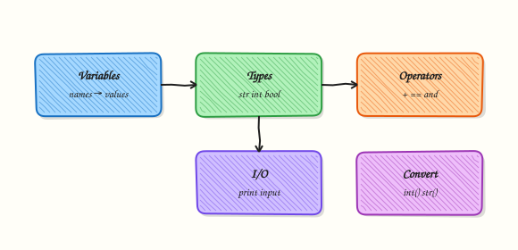

# Python Basics — Types and I/O

## Overview

Every automation script starts with **values**: a hostname string, a port number, a yes/no flag, or a line of text from standard input (stdin). In Python those values have **types**. A type tells the interpreter what you can do with a value — add numbers, join strings, or test true/false. If you treat a string `"22"` like an integer without converting it, comparisons and maths go wrong. If you print errors on standard output (stdout) mixed with data, CI pipelines cannot parse your tool cleanly.

This module teaches variables, core types (`str`, `int`, `float`, `bool`, `None`), operators, string formatting for logs, and safe conversion with clear messages. You will build a small script that reads arguments and stdin, converts values, and prints structured results. That pattern shows up in health checks, inventory helpers, and thin wrappers around shell tools.

In production, silent bad input is worse than a loud failure. Prefer explicit conversion, validate early, write diagnostics to stderr, and reserve stdout for machine-readable or human-readable results. Later modules add files, exceptions, and full Command-Line Interface (CLI) frameworks; the habits start here.

This is **Tutorial 2** in **Module 2: Basics** of the REBASH Academy **Python for DevOps Engineers** series. Complete [Module 1](python-fundamentals-install-venv-and-tooling.md) first so you have a project venv.

## Prerequisites

- [Python Fundamentals — Install, venv, and Tooling](python-fundamentals-install-venv-and-tooling.md)
- Python 3.11+ project venv available (you will create one under `~/rebash-python/lab02`)

## Learning Objectives

By the end of this tutorial, you will be able to:

- [ ] Name and use `str`, `int`, `float`, `bool`, and `None` in ops scripts
- [ ] Apply arithmetic, comparison, and logical operators correctly
- [ ] Format strings for logs and CLI output without fragile concatenation
- [ ] Convert types safely and fail with a clear stderr message
- [ ] Separate stdout (results) from stderr (diagnostics)

## Architecture

Data enters a script from arguments, environment variables, or stdin. The script converts and validates, then writes results to stdout and diagnostics to stderr. The process exit code tells CI whether the run succeeded.



## Theory

### What it is

A **variable** is a name bound to a value. Python is dynamically typed: the same name can hold different types over time, but clear names and conversions keep scripts safe.

| Type | Example | Typical DevOps use |
|------|---------|-------------------|
| `str` | `"web-01"` | Hostnames, paths, messages |
| `int` | `8080` | Ports, counts, exit codes |
| `float` | `99.5` | Ratios, durations |
| `bool` | `True` | Flags, health state |
| `None` | `None` | Missing optional value |

```python
hostname = "web-01"
port = 8080
healthy = True
note = None
```

### Why it matters

Cloud APIs and CLI flags often arrive as strings. `"false"` is a non-empty string, so it is **truthy** in a bare `if value:` check — a classic ops bug. Numeric thresholds (`cpu > 80`) need real numbers. Clean stdout/stderr separation lets you pipe JSON to `jq` while still seeing errors in the terminal.

### How it works

1. **Bind** — assign with `name = value`.
2. **Inspect** — `type(x)`, `isinstance(x, int)`.
3. **Convert** — `int(s)`, `str(n)`, `float(s)`; for booleans prefer an explicit allow-list.
4. **Format** — f-strings for logs: `f"host={hostname} port={port}"`.
5. **I/O** — `input()` for interactive demos; automation prefers `sys.argv` and stdin reads.
6. **Streams** — `print(...)` → stdout; `print(..., file=sys.stderr)` → stderr.

```python
import sys

raw = "22"
port = int(raw)
print(f"port={port}")  # stdout
print("debug: parsed port", file=sys.stderr)
```

### Key concepts and comparisons

| Operation | Example | Notes |
|-----------|---------|-------|
| Arithmetic | `a + b`, `a // b`, `a % b` | `//` is integer division |
| Comparison | `a == b`, `a != b`, `a < b` | Use `==` for values, not `is` (except `None`) |
| Logical | `and`, `or`, `not` | Short-circuit evaluation |
| Membership | `"web" in name` | Works on strings and collections |

| Pattern | Prefer when | Avoid when |
|---------|-------------|------------|
| Explicit `int(s)` with try/clear error | CLI ports and counts | Silent `0` defaults that hide bad input |
| f-strings for logs | Python 3.6+ scripts | Building secrets into format strings you commit |
| stderr for errors | Automation and CI | Mixing errors into piped stdout data |
| Explicit bool parsing | Config flags | `bool("false")` (always `True`) |

### Common pitfalls

- Using `bool("false")` — any non-empty string is `True`.
- Comparing numbers as strings (`"9" > "10"` is lexicographic).
- Using `is` instead of `==` for integers or strings (identity vs equality).
- Reading secrets with `input()` and echoing them to logs.
- Forgetting that `None` is not the same as `""` or `0`.

## Hands-on Lab

### Objective

Under `~/rebash-python/lab02`, build `parse_input.py` that reads a hostname argument, an optional port, and a line from stdin, converts types, and prints a clear summary with a non-zero exit on bad input.

### Prerequisites

- Module 1 skills: create and activate a venv
- Python 3.11+

### Lab environment

Workspace: `~/rebash-python/lab02`

```bash
mkdir -p ~/rebash-python/lab02 && cd ~/rebash-python/lab02
set -euo pipefail
python3 -m venv .venv
# shellcheck disable=SC1091
source .venv/bin/activate
python -V | tee python-version.txt
python -c 'import sys; assert sys.version_info >= (3, 11)'
```

**Expected output:** venv active; version file shows 3.11+.

### Real-world scenario

A junior engineer wrote a host check that treated every string as truthy and printed errors on stdout, breaking a CI `jq` step. You replace it with a small parser that validates types, writes diagnostics to stderr, and returns exit code `2` on bad input.

### Step-by-step tasks

#### Task 1 – Create the parser script

```bash
cd ~/rebash-python/lab02
set -euo pipefail
# shellcheck disable=SC1091
source .venv/bin/activate
```

Create `parse_input.py`:

```python
"""Parse hostname/port/flags for a tiny DevOps input contract."""
from __future__ import annotations

import sys
from typing import NoReturn


def die(message: str, code: int = 2) -> NoReturn:
    print(f"error: {message}", file=sys.stderr)
    raise SystemExit(code)


def parse_bool(raw: str) -> bool:
    value = raw.strip().lower()
    if value in {"1", "true", "yes", "y", "on"}:
        return True
    if value in {"0", "false", "no", "n", "off"}:
        return False
    die(f"invalid boolean: {raw!r}")


def main(argv: list[str]) -> int:
    if len(argv) < 2:
        die("usage: parse_input.py HOST [PORT]  (reads READY line from stdin)")

    hostname = argv[1].strip()
    if not hostname:
        die("hostname must be non-empty")

    port = 22
    if len(argv) >= 3:
        try:
            port = int(argv[2])
        except ValueError:
            die(f"port must be an integer, got {argv[2]!r}")
        if not 1 <= port <= 65535:
            die(f"port out of range: {port}")

    ready_line = sys.stdin.readline()
    if not ready_line:
        die("expected a READY=true|false line on stdin")
    if not ready_line.startswith("READY="):
        die("stdin line must start with READY=")
    ready = parse_bool(ready_line.split("=", 1)[1])

    # stdout = machine-friendly summary for pipelines
    print(f"host={hostname}")
    print(f"port={port}")
    print(f"ready={str(ready).lower()}")
    print(f"types=str,int,bool")
    return 0


if __name__ == "__main__":
    raise SystemExit(main(sys.argv))
```

Run:

```bash
test -f parse_input.py
```

**Expected output:** `parse_input.py` exists in the lab folder.

#### Task 2 – Happy-path run with args and stdin

```bash
cd ~/rebash-python/lab02
set -euo pipefail
# shellcheck disable=SC1091
source .venv/bin/activate

printf 'READY=true\n' | python parse_input.py web-01 8080 | tee happy.txt
grep -F 'host=web-01' happy.txt
grep -F 'port=8080' happy.txt
grep -F 'ready=true' happy.txt
```

**Expected output:** `happy.txt` contains the three result lines with correct values.

#### Task 3 – Conversion asserts and negative tests

```bash
cd ~/rebash-python/lab02
set -euo pipefail
# shellcheck disable=SC1091
source .venv/bin/activate

# Bad port must fail with stderr message and exit 2
set +e
printf 'READY=yes\n' | python parse_input.py db-01 not-a-port 2>bad-port.err
rc=$?
set -e
test "$rc" -eq 2
grep -F 'port must be an integer' bad-port.err

# Invalid boolean must fail
set +e
printf 'READY=maybe\n' | python parse_input.py db-01 5432 2>bad-bool.err
rc=$?
set -e
test "$rc" -eq 2
grep -F 'invalid boolean' bad-bool.err

# Formatting demo (no Jinja braces — plain f-string style in a one-liner)
python - << 'PY' | tee format-demo.txt
name = "api-01"
port = 443
print(f"check {name}:{port} ok")
print("check {0}:{1} ok".format(name, port))
assert "api-01:443" in f"check {name}:{port} ok"
print("format-ok")
PY
grep -F 'format-ok' format-demo.txt

tar -czf lab02-evidence.tgz parse_input.py happy.txt bad-port.err bad-bool.err format-demo.txt
ls -l lab02-evidence.tgz | tee evidence-ls.txt
```

**Expected output:** both negative tests exit `2` with clear stderr; `format-demo.txt` ends with `format-ok`; evidence archive exists.

### Validation steps

- [ ] Happy path prints `host`, `port`, and `ready` on stdout
- [ ] Bad port writes to stderr and exits `2`
- [ ] Invalid `READY=` value is rejected
- [ ] `lab02-evidence.tgz` exists under `~/rebash-python/lab02`

### Common errors and fixes

| Error | Cause | Fix |
|-------|-------|-----|
| `usage: parse_input.py...` | Missing hostname arg | Pass host and optional port |
| Hangs waiting for input | No stdin line | Pipe `READY=true` with `printf` |
| Exit 0 on bad port | Ran an old script | Confirm you are in `lab02` and re-run Task 1 |
| `ready=true` always | Used `bool(string)` | Use the explicit `parse_bool` allow-list |

### Challenge exercise

Extend `parse_input.py` (or add `parse_input_v2.py`) so an optional third argument `WEIGHT` is parsed as `float`, must be `> 0`, and is printed as `weight=...` with two decimal places using an f-string. Prove with a successful run and a failing negative run; save outputs as `weight-ok.txt` and `weight-bad.err`.

### Learning outcomes

- Converted strings to `int`/`bool` safely
- Separated stdout results from stderr errors
- Used exit codes CI can assert on
- Practised string formatting for ops messages

### Cleanup

```bash
cd ~/rebash-python/lab02
set -euo pipefail
deactivate 2>/dev/null || true
# rm -rf .venv
# rm -f *.txt *.err lab02-evidence.tgz
```

## Validation

- [ ] Lab finished under `~/rebash-python/lab02/`
- [ ] You can explain why `bool("false")` is dangerous
- [ ] You know when to use stderr vs stdout
- [ ] You can convert and validate a port string safely

## Code Walkthrough

Production-friendly I/O habits for this topic:

1. **Validate at the edge** — convert args/env/stdin before business logic  
2. **Fail loud** — clear stderr message + non-zero exit  
3. **Keep stdout clean** — one fact per line or JSON later  
4. **Prefer explicit bool maps** — never `bool(raw_string)` for flags  
5. **Name by meaning** — `hostname`, `port`, `ready` beat `a`, `b`, `x`  

Module 8 deepens exceptions; Module 12 introduces argparse/Click/Typer.

## Security Considerations

- Do not log passwords or tokens from `input()` or environment variables  
- Treat stdin and argv as untrusted — validate length and ranges  
- Avoid building shell commands from raw strings here (subprocess comes later with care)  
- Redact secrets if you echo configuration in debug mode  
- Use non-zero exits so CI does not treat bad input as success  

## Common Mistakes

!!! warning "Using `bool(user_text)` for feature flags"
    `bool("false")` is `True` because the string is non-empty. **Fix:** map known true/false spellings explicitly.

!!! warning "Comparing version or port numbers as strings"
    Lexicographic order is wrong for numbers. **Fix:** convert with `int`/`float` before comparing.

!!! warning "Printing errors on stdout"
    Pipelines that capture stdout for data will swallow or mis-parse errors. **Fix:** `print(..., file=sys.stderr)`.

!!! warning "Silent default on conversion failure"
    Catching all exceptions and returning `0` hides broken config. **Fix:** exit non-zero with a reason.

## Best Practices

- Document the input contract in the script docstring  
- Use type hints on public functions (`list[str] -> int`)  
- Prefer f-strings for readable ops logs  
- Keep interactive `input()` out of CI paths  
- Assert critical conversions in tests or lab checks  

## Troubleshooting

| Symptom | Likely cause | Fix |
|---------|--------------|-----|
| `ValueError: invalid literal` | Non-numeric port | Validate before `int()` or catch and explain |
| Empty stdout in CI | Script waited on stdin | Provide stdin or make stdin optional with a default |
| Wrong types in messages | Forgot conversion | Print `type(value)` while debugging |
| Exit code always 0 | `SystemExit` not used | Return codes via `raise SystemExit(code)` or `sys.exit` |

## Summary

Types and I/O are small ideas with large blast radius in automation. Convert explicitly, validate early, and keep stdout clean. Next, control decisions and loops in [Conditionals and Loops](control-flow-conditionals-and-loops.md).

## Interview Questions

**1. What is the difference between `==` and `is` in Python, and when do you use each in ops scripts?**

??? success "Reveal answer"
    `==` compares **values**. `is` compares **object identity**. For almost all ops checks (ports, hostnames, counts) use `==`. Use `is` for `None` checks (`value is None`). Relying on `is` for integers or strings is a common interview trap.

**2. Why is `bool("false")` a bug in configuration parsing?**

??? success "Reveal answer"
    Any non-empty string is truthy, so `bool("false")` is `True`. Parse booleans with an explicit allow-list (`true`/`false`, `1`/`0`, `yes`/`no`) and reject unknown values.

**3. How should a CLI separate stdout and stderr, and why does CI care?**

??? success "Reveal answer"
    Put **data/results on stdout** and **diagnostics on stderr**. CI and pipes can capture stdout for the next step while still showing errors in logs. Mixing them breaks `jq` and similar tools.

**4. How do you safely convert a port from a string argument?**

??? success "Reveal answer"
    Call `int(raw)`, catch `ValueError`, check the range `1..65535`, and exit non-zero with a clear stderr message on failure. Do not silently fall back to port `0`.

**5. When is `input()` appropriate, and what should automation use instead?**

??? success "Reveal answer"
    `input()` is fine for interactive teaching demos. Automation should use **CLI arguments**, environment variables, or stdin pipes so CI can run without a human. Module 12 covers argparse/Click/Typer.

**6. What does `None` mean, and how is it different from `""` or `0`?**

??? success "Reveal answer"
    `None` means **no value / missing**. `""` is an empty string (a real string). `0` is a number. Tests should use `value is None` for missing optional config, not truthiness alone — because `0` and `""` are falsy but valid in some contexts.

**7. Show how you would format a log line with hostname and port in modern Python.**

??? success "Reveal answer"
    Prefer an f-string, for example `f"host={hostname} port={port}"`, or `str.format` when the template is stored separately. Avoid slow, error-prone `+` chains for many fields. Never put secrets into format strings that are committed or shipped to shared logs.

**8. A script prints `ready=True` for input `READY=0`. What went wrong?**

??? success "Reveal answer"
    Likely the code used truthiness on the string `"0"` incorrectly, or inverted logic. `"0"` is non-empty so it is truthy if passed to `bool`. The fix is explicit parsing: map `"0"`/`"false"` to `False` and reject unknown tokens.

## Related Tutorials

- [Python for DevOps Engineers – Overview](index.md)
- [Python Fundamentals — Install, venv, and Tooling](python-fundamentals-install-venv-and-tooling.md) *(previous)*
- [Conditionals and Loops](control-flow-conditionals-and-loops.md) *(next)*
- [File Handling — pathlib, JSON, YAML, CSV](file-handling-pathlib-json-yaml-csv.md) *(related)*

## References

- [Built-in Types](https://docs.python.org/3/library/stdtypes.html) — Python documentation  
- [Built-in Functions](https://docs.python.org/3/library/functions.html) — `int`, `str`, `print`  
- [sys — System-specific parameters](https://docs.python.org/3/library/sys.html) — argv and stderr  
- Track index: [Python for DevOps Engineers](index.md)
