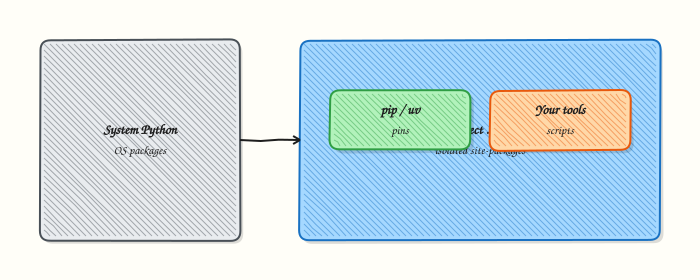
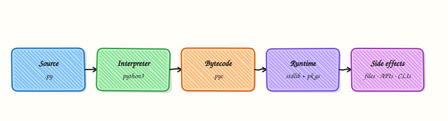

# Python Fundamentals — Install, venv, and Tooling

## Overview

Python is a language many DevOps teams use for automation: inventory scripts, Application Programming Interface (API) clients, Continuous Integration (CI) helpers, and small tools that wrap `kubectl`, Terraform, or cloud CLIs. Before you write useful scripts, you need three things: a supported **interpreter** (the `python` program), an isolated **virtual environment** (venv) so project packages do not fight with system packages, and a habit of pinning dependencies so the same `pip install` works on your laptop and in CI.

A **virtual environment** is a project-local folder (often named `.venv`) with its own `python` and `pip`. When you activate it, your shell uses that folder’s tools. Packages you install stay inside the project. That is how you avoid “it works on my machine” when a teammate has a different global Python. In this tutorial you will check the Python version, create a venv under `~/rebash-python/lab01`, install a tiny package, freeze a `requirements.txt` snippet, and run a hello script.

On cloud virtual machines (VMs), jump servers, and CI runners, people often share one image. If everyone installs packages into the system Python, upgrades break other jobs. Production practice is: one venv (or container) per project, pin versions in `requirements.txt` or a lock file, and never commit secrets into the environment. Tools such as **uv** and **Poetry** can speed installs and lock files; **pip** plus `venv` is the baseline every engineer should know first.

This is **Tutorial 1** in **Module 1: Fundamentals** of the REBASH Academy **Python for DevOps Engineers** series. It is written for DevOps, Cloud, Platform, and Site Reliability Engineering (SRE) learners. By the end you will have a reproducible project folder you can reuse for every later lab.

## Prerequisites

- [Linux Fundamentals](../linux/index.md)
- [Shell Scripting](../shell/index.md)
- A Linux host, Windows Subsystem for Linux (WSL2), or practice VM where you can create directories and install packages
- Python **3.11 or newer** available as `python3` (academy labs work on 3.11–3.13)

## Learning Objectives

By the end of this tutorial, you will be able to:

- [ ] Explain why DevOps teams isolate projects with a virtual environment
- [ ] Verify Python 3.11+ with `python3 -V` and record the interpreter path
- [ ] Create, activate, and deactivate a project `.venv`
- [ ] Install a package with `pip` and freeze a `requirements.txt` snippet
- [ ] Run a small hello script using the venv interpreter

## Architecture

Python tooling sits between your shell and your scripts. The interpreter runs code. The venv points `PATH` at a project-local `bin/` (or `Scripts/` on Windows). `pip` installs packages into that environment only.





## Theory

### What it is

**Python** is an interpreted language: you write `.py` files; the interpreter reads them and runs them. **CPython** is the usual implementation on Linux. A **virtual environment** is created with `python3 -m venv .venv`. After `source .venv/bin/activate`, `which python` should show a path under your project.

**pip** is the package installer that ships with the venv. **uv** is a fast alternative that can create venvs and install packages. **Poetry** manages both dependencies and packaging for larger apps. Start with `venv` + `pip`; add uv or Poetry when the team standardises on them.

```bash
python3 -V
python3 -m venv .venv
source .venv/bin/activate
python -V
which python
```

### Why it matters

CI jobs and shared VMs break when one person upgrades a global package another job needs. A venv keeps each project’s dependency tree separate. Pinning versions (`requests==2.32.3`) means a rebuild next month is closer to what you tested. Cloud images may ship an older system Python; your project can still use 3.11+ from `deadsnakes`, `pyenv`, or a container — as long as the lab documents which binary you call.

### How it works

1. **Check** — `python3 -V`, `command -v python3`.
2. **Create venv** — `python3 -m venv .venv` inside the project folder.
3. **Activate** — `source .venv/bin/activate` (Linux/macOS/WSL).
4. **Upgrade pip** — `python -m pip install --upgrade pip` (optional but common).
5. **Install** — `python -m pip install package==version`.
6. **Freeze** — `python -m pip freeze > requirements.txt` (or hand-pin a small file).
7. **Run** — `python hello.py` or `.venv/bin/python hello.py` without activating.

Prefer `python -m pip` over bare `pip` so you always install into the same interpreter you are about to run.

### Key concepts and comparisons

| Tool | Role | Prefer when |
|------|------|-------------|
| `venv` | Isolate site-packages | Every project and lab |
| `pip` | Install from PyPI | Small tools, CI with a freeze file |
| `uv` | Fast install / sync | Teams that already use Astral tooling |
| Poetry | Deps + package metadata | Libraries and apps with `pyproject.toml` |

| Pattern | Prefer when | Avoid when |
|---------|-------------|------------|
| Project `.venv` | Local and CI with a known Python | Committing `.venv` into git |
| Pinned `requirements.txt` | Reproducible CI | Unpinned `pip install requests` forever |
| System `apt install python3-foo` | OS utilities | Mixing with your app’s PyPI stack |

### Common pitfalls

- Running `pip install` **without** activating the venv (packages go to the wrong Python).
- Committing `.venv/` to git (large and machine-specific).
- Using `sudo pip` (can damage the system Python).
- Assuming `python` is Python 3 — on some hosts `python` is missing or means Python 2; prefer `python3` until the venv is active.
- Freezing **everything** including editable local paths without documenting them for teammates.

## Hands-on Lab

### Objective

Create `~/rebash-python/lab01` with a Python 3.11+ venv, install a tiny package, write a hello script, freeze a requirements snippet, and save proof files for a change ticket.

### Prerequisites

- `python3` 3.11+ and the `venv` module (`python3 -m venv --help`)
- Shell with `bash` (or compatible)
- Outbound network to install one package from PyPI (or use offline wheel if your site requires it)

### Lab environment

Workspace: `~/rebash-python/lab01`

```bash
mkdir -p ~/rebash-python/lab01 && cd ~/rebash-python/lab01
set -euo pipefail
python3 -V | tee python-version.txt
command -v python3 | tee python-path.txt
python3 -c 'import sys; assert sys.version_info >= (3, 11), sys.version'
```

**Expected output:** `python-version.txt` shows Python 3.11 or newer; the assert exits 0.

### Real-world scenario

Your team is starting a small inventory helper for a practice Ubuntu VM. Platform asks every automation repo to use a project venv, pin dependencies, and prove `python -V` in CI. You set up the baseline folder and a hello script so later modules can reuse the same layout.

### Step-by-step tasks

#### Task 1 – Create and activate the virtual environment

```bash
cd ~/rebash-python/lab01
set -euo pipefail

python3 -m venv .venv
# shellcheck disable=SC1091
source .venv/bin/activate

python -V | tee venv-python-version.txt
command -v python | tee venv-python-path.txt
test -x .venv/bin/python
grep -F '.venv' venv-python-path.txt
```

**Expected output:** `venv-python-path.txt` contains `.venv`; versions match a 3.11+ interpreter.

#### Task 2 – Install a package and freeze requirements

```bash
cd ~/rebash-python/lab01
set -euo pipefail
# shellcheck disable=SC1091
source .venv/bin/activate

python -m pip install --upgrade pip
python -m pip install 'rich==13.9.4'
python -m pip freeze | tee requirements-full.txt
grep -E '^rich==' requirements-full.txt | tee requirements.txt
test -s requirements.txt
```

**Expected output:** `requirements.txt` contains a line like `rich==13.9.4`.

#### Task 3 – Write and run a hello script

```bash
cd ~/rebash-python/lab01
set -euo pipefail
# shellcheck disable=SC1091
source .venv/bin/activate

cat > hello.py << 'PY'
"""Minimal DevOps hello — proves the venv interpreter runs project code."""
from __future__ import annotations

import sys
from pathlib import Path

from rich import print as rprint


def main() -> int:
    root = Path(__file__).resolve().parent
    rprint(f"[green]Hello from REBASH Python lab01[/green]")
    rprint(f"Python: {sys.version.split()[0]}")
    rprint(f"Executable: {sys.executable}")
    rprint(f"Project: {root}")
    return 0


if __name__ == "__main__":
    raise SystemExit(main())
PY

python hello.py | tee hello-output.txt
grep -F 'Hello from REBASH' hello-output.txt
grep -F '.venv' hello-output.txt

tar -czf lab01-evidence.tgz \
  python-version.txt python-path.txt \
  venv-python-version.txt venv-python-path.txt \
  requirements.txt hello.py hello-output.txt
ls -l lab01-evidence.tgz | tee evidence-ls.txt
```

**Expected output:** `hello-output.txt` shows the greeting and a `.venv` executable path; `lab01-evidence.tgz` is non-empty.

### Validation steps

- [ ] `~/rebash-python/lab01/.venv/bin/python` exists and is executable
- [ ] `python -V` inside the venv is 3.11+
- [ ] `requirements.txt` pins `rich`
- [ ] `python hello.py` prints the greeting
- [ ] `lab01-evidence.tgz` exists

### Common errors and fixes

| Error | Cause | Fix |
|-------|-------|-----|
| `ensurepip is not available` | Minimal Python without venv/ensurepip | Install `python3-venv` (Debian/Ubuntu) or use a full Python build |
| `No module named pip` | Broken venv bootstrap | Recreate venv; `python -m ensurepip --upgrade` |
| `rich` not found at runtime | Forgot to activate venv | `source .venv/bin/activate` or call `.venv/bin/python` |
| `Permission denied` under `/usr` | Used `sudo pip` | Never use sudo for project pip; use the venv |
| Assert failed on version | Python older than 3.11 | Install 3.11+ and point `python3` at it |

### Challenge exercise

Add `check_env.py` that exits `0` only if (1) `sys.prefix` contains `.venv`, (2) `rich` imports, and (3) `Path("requirements.txt").read_text()` contains `rich==`. Run it with `.venv/bin/python check_env.py` and save stdout to `check-env-output.txt`. Keep the script in the lab folder as your stretch artefact.

### Learning outcomes

- Created an isolated project venv with Python 3.11+
- Installed and pinned a dependency with pip
- Ran a project script with the venv interpreter
- Packed evidence suitable for a ticket or interview demo

### Cleanup

```bash
cd ~/rebash-python/lab01
set -euo pipefail
deactivate 2>/dev/null || true
# Keep evidence; remove the venv if you need disk space:
# rm -rf .venv
# Optional full wipe of generated text (keeps scripts if you want):
# rm -f *.txt lab01-evidence.tgz
```

## Validation

- [ ] Lab finished under `~/rebash-python/lab01/` with evidence files
- [ ] You can explain why a venv beats global `pip install`
- [ ] You prefer `python -m pip` over bare `pip`
- [ ] You know not to commit `.venv/` into git

## Code Walkthrough

In real DevOps repos, Python setup usually follows this order:

1. **Check the interpreter** — `python3 -V` and document the minimum in README  
2. **Create `.venv` once per clone** — or recreate in CI from scratch  
3. **Install from a pin file** — `pip install -r requirements.txt`  
4. **Run with the venv binary** — especially in non-interactive CI  
5. **Prove isolation** — `which python` / `sys.executable` in logs  

Later modules assume this layout. Packaging with `pyproject.toml` comes in Module 23.

## Security Considerations

- Do not run `sudo pip install` on shared hosts  
- Treat `requirements.txt` as code — review new packages before merge  
- Never put API tokens or passwords into venv files or freeze output you commit  
- Prefer hash-checking (`pip install --require-hashes`) in high-assurance CI when your pipeline supports it  
- Keep CI runners ephemeral so a compromised package cannot linger on a shared disk  

## Common Mistakes

!!! warning "Installing with system pip while the venv is inactive"
    Packages land in the wrong environment and CI cannot reproduce them. **Fix:** activate the venv or call `.venv/bin/python -m pip install …`.

!!! warning "Committing the `.venv` directory"
    Binaries are large and not portable across operating systems. **Fix:** add `.venv/` to `.gitignore`; commit only pin files and source.

!!! warning "Using unpinned `pip install requests` in production CI"
    A breaking upstream release can fail the pipeline overnight. **Fix:** pin versions and regenerate pins in a deliberate upgrade pull request.

!!! warning "Assuming `python` always means Python 3"
    Some images have no `python` command. **Fix:** use `python3` to create the venv; after activation, `python` is safe inside that shell.

## Best Practices

- One venv per project; name it `.venv` so editors auto-detect it  
- Document Python minimum version in README (`requires-python >= 3.11`)  
- Prefer `python -m pip` and `python -m venv`  
- Keep a short hand-maintained pin list for tiny tools; use a lock tool for larger apps  
- In CI, create a fresh venv every job instead of caching a dirty environment  

## Troubleshooting

| Symptom | Likely cause | Fix |
|---------|--------------|-----|
| `python3: command not found` | Python not installed | Install from distro packages or pyenv |
| Wrong package version at runtime | Multiple Pythons on `PATH` | Activate venv; check `sys.executable` |
| `externally-managed-environment` | PEP 668 on system Python | Use a venv; do not force `--break-system-packages` for labs |
| Slow installs on CI | Cold cache | Cache the pip download dir, not a dirty venv |
| Editor uses wrong interpreter | IDE not pointed at `.venv` | Select `.venv/bin/python` in VS Code / PyCharm |

## Summary

Module 1 gives you a **known Python**, a **project venv**, and a **pinned install** habit. That baseline stops dependency chaos before you write real automation. Next, learn variables, types, and safe input/output in [Python Basics — Types and I/O](python-basics-types-and-io.md).

## Interview Questions

**1. Why do DevOps teams use a virtual environment instead of installing packages with system `pip`?**

??? success "Reveal answer"
    A **venv** keeps each project’s packages separate from the operating system Python and from other projects. On shared VMs and CI runners, global installs cause version conflicts and hard-to-reproduce failures. Interviewers want to hear isolation, reproducibility, and “do not use `sudo pip`”.

**2. What is the difference between `python3 -m venv .venv` and activating that environment?**

??? success "Reveal answer"
    Creating the venv only builds the folder with a private `python` and `pip`. **Activation** changes your shell `PATH` so `python` and `pip` resolve inside `.venv`. You can skip activation by calling `.venv/bin/python` directly — common in CI scripts.

**3. Why prefer `python -m pip install` over `pip install`?**

??? success "Reveal answer"
    `python -m pip` runs pip for **that exact interpreter**. A bare `pip` on `PATH` might belong to another Python. This avoids “installed the package but import still fails”.

**4. What should you commit to git from a Python tooling setup, and what should you ignore?**

??? success "Reveal answer"
    Commit source, `requirements.txt` (or lock files), and docs. **Ignore** `.venv/`, `__pycache__/`, and local secret files. The venv is rebuilt from pins on each machine.

**5. How would you prove in a ticket that CI used the project venv?**

??? success "Reveal answer"
    Log `python -V`, `sys.executable` (or `which python`), and show the path contains the project `.venv`. Optionally print `pip freeze` for the job. Evidence beats “we activated it, trust me”.

**6. When would you choose uv or Poetry instead of plain pip + venv?**

??? success "Reveal answer"
    Choose **uv** for speed and simple lock/sync workflows. Choose **Poetry** when the project is a real package with rich metadata and scripts. For small ops scripts, pip + venv remains clear and portable. Match the team standard rather than inventing a third tool alone.

**7. A colleague’s script works locally but CI fails with `ModuleNotFoundError`. What do you check first?**

??? success "Reveal answer"
    Confirm CI creates/activates the same venv (or installs from the same pin file), that the dependency is listed, and that CI invokes the venv’s `python`. Also check the working directory and that the module name matches the package name. Compare `sys.path` / `pip freeze` between laptop and CI.

**8. What risk does `pip install` without a version pin create in production automation?**

??? success "Reveal answer"
    Upstream can publish a breaking release at any time. Unpinned installs make yesterday’s green pipeline fail today. Pin versions, upgrade in a controlled pull request, and run tests before merging.

## Related Tutorials

- [Python for DevOps Engineers – Overview](index.md)
- [Linux Fundamentals](../linux/index.md) *(prerequisite)*
- [Python Basics — Types and I/O](python-basics-types-and-io.md) *(next)*
- [Shell Scripting](../shell/index.md) *(related)*

## References

- [venv — Creation of virtual environments](https://docs.python.org/3/library/venv.html) — Python documentation  
- [pip user guide](https://pip.pypa.io/en/stable/user_guide/) — PyPA  
- [Installing Python Modules](https://docs.python.org/3/installing/index.html) — Python documentation  
- Track index: [Python for DevOps Engineers](index.md)
