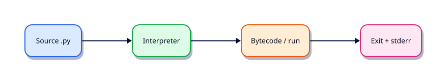

# Python Fundamentals — Install, venv, and Tooling

## Overview

Cloud VMs, CI runners, and automation hosts need a reproducible Python. This tutorial builds the install and tooling baseline every later module assumes.

This is **Tutorial 1** in **Module 1: Python Fundamentals** of the REBASH Academy **Python for DevOps Engineers** series — written for DevOps engineers, SREs, platform engineers, and cloud engineers who automate infrastructure with production-quality Python.

## Prerequisites

- Linux Fundamentals and basic Shell Scripting
- Python 3.12+ on Linux (WSL2/VM/cloud)

## Learning Objectives

By the end of this tutorial, you will be able to:

- [ ] Apply the core ideas of “Python Fundamentals — Install, venv, and Tooling” in real ops automation
- [ ] Use a project venv and avoid relying on system site-packages
- [ ] Produce clear stderr diagnostics and meaningful exit codes
- [ ] Prefer safe patterns (pathlib, subprocess list args, dry-run)
- [ ] Relate this topic to day-to-day DevOps and platform work

## Architecture

Ops Python sits between operators/CI and platforms (files, APIs, CLIs, and cloud control planes). This topic’s control points are shown below.



## Theory

### What is Python?

**Python** is a high-level, interpreted language with a large standard library and an ecosystem of SDKs for cloud, Kubernetes, Docker, and HTTP. For DevOps it is the layer that owns structured data (JSON/YAML), APIs, tests, and packaged CLIs — while Bash remains the launcher and glue.

Python is **not** a general “learn every language feature” course here. You will use it to automate infrastructure safely.

### Installing Python

On Linux prefer the distro package or a managed installer that gives **Python 3.12+**:

```bash
python3 --version
command -v python3
```

Cloud tip: pin the image Python or install via `deadsnakes` / `pyenv` only when the base image is too old. Never overwrite the system interpreter that package managers depend on.

### Python Versions

Use **3.12+** for this course. Check `sys.version_info` in scripts. Avoid writing for 2.x. When targeting fleet hosts, set `requires-python` in `pyproject.toml` so CI fails early on the wrong interpreter.

### Python Interpreter

The **interpreter** reads source (or bytecode) and executes it. `#!/usr/bin/env python3` resolves `python3` from `PATH`. Prefer `python3 -m pip` / `python3 -m venv` so you always target the intended binary.

### VS Code Setup

Install the official Python extension, select the workspace `.venv` interpreter, enable format-on-save (Ruff or Black), and open the lab folder as the workspace root so relative paths match CI.

### PyCharm Setup

Create a project pointing at the lab directory, configure a **Virtualenv** interpreter from `.venv`, and mark `src` as Sources Root when you adopt a package layout later.

### Virtual Environments

A **virtual environment** isolates project packages from the system site-packages:

```bash
python3 -m venv .venv
source .venv/bin/activate
python -m pip install --upgrade pip
```

Always activate (or call `.venv/bin/python`) before installing or running tools. Commit a lock/requirements file; do not commit `.venv`.

### pip

**pip** installs packages into the active environment. Prefer pins:

```bash
python -m pip install 'httpx==0.28.1'
python -m pip freeze > requirements.txt
```

Use `python -m pip` so you never hit a mismatched `pip` on `PATH`.

### uv

**uv** is a fast installer/resolver. Useful patterns:

```bash
uv venv .venv
source .venv/bin/activate
uv pip install -r requirements.txt
```

Use uv when you want quick, reproducible installs in CI; keep the same pins as teammates.

### Poetry

**Poetry** manages `pyproject.toml`, virtualenvs, and lockfiles together. For ops CLIs that you publish internally, Poetry (or hatch/uv) is fine — pick one tool per repo and document it. This course defaults to `venv` + pinned `requirements.txt` unless a module says otherwise.

## Hands-on Lab

Create a workspace for this tutorial.

```bash
mkdir -p ~/rebash-python/lab01 && cd ~/rebash-python/lab01
```

**Focus:** install/fingerprint Python; create venv; compare pip vs uv install of a pinned package

### Step 1 – Skeleton

```bash
cat > lab.py << 'EOF'
#!/usr/bin/env python3
print("lab01 python-fundamentals-install-venv-and-tooling")
EOF
chmod +x lab.py
python3 lab.py
```

### Step 2 – venv and tooling fingerprint

```bash
python3 -m venv .venv
source .venv/bin/activate
python -m pip install --upgrade pip
python -m pip install 'packaging==24.2'
python - <<'PY'
import platform, sys
print(f"executable={sys.executable}")
print(f"version={platform.python_version()}")
print(f"prefix={sys.prefix}")
PY
command -v uv >/dev/null && uv --version || echo 'uv optional'
command -v poetry >/dev/null && poetry --version || echo 'poetry optional'
deactivate || true
```

### Final step – Cleanup note

```bash
python3 lab.py
# keep ~/rebash-python for later labs
```

## Validation

- [ ] Lab commands run under `~/rebash-python/lab01/`
- [ ] You can explain each Theory heading in your own words
- [ ] Failure path exits non-zero and prints diagnostics to stderr (where applicable)
- [ ] Dry-run / fixture behaviour is clear for any mutating or cloud action
- [ ] You can relate this topic to a real DevOps or platform task

## Code Walkthrough

Production Python for **Python Fundamentals — Install, venv, and Tooling** always combines:

1. A clear entry point (`main()` + `if __name__ == "__main__"`)
2. A project virtual environment and pinned dependencies when third-party libs are used
3. Explicit error handling and logging (no silent `except Exception: pass`)
4. Safe I/O: `pathlib`, timeouts on HTTP, `subprocess.run([...])` without `shell=True`
5. Documented exit codes and dry-run defaults for mutating actions

Keep modules short enough to review in a single merge request. Prefer stdlib first; add httpx/requests, Typer, pytest, and platform SDKs when the job needs them.

## Security Considerations

- Treat all external input (args, files, env, API payloads) as untrusted until validated
- Never log secrets or `Authorization` headers; prefer masked CI variables and secret stores
- Prefer least privilege tokens and read-only / dry-run modes by default
- Avoid `shell=True`, unvalidated path deletes, and committing `.env` files
- Pin dependencies; review transitive packages for automation that runs in CI

## Common Mistakes

!!! warning "Using system Python without a venv"
    Global packages drift between laptops and CI. **Fix:** `python3 -m venv .venv` per project and pin dependencies.

!!! warning "Calling subprocess with shell=True"
    Untrusted strings become remote code execution. **Fix:** pass a list of arguments; never build a shell string for the happy path.

!!! warning "Mutating without dry-run"
    Cleanup and apply tools destroy shared environments. **Fix:** default to dry-run; require `--apply` for side effects.

## Best Practices

- One purpose per command; share helpers in a small library package
- Log to stderr; reserve stdout for data or RESULT lines
- Idempotent behaviour where schedulers and CI may retry
- Fixture / mock paths for GitHub, Docker, Kubernetes, Terraform, and cloud SDKs in CI
- Pair every new tool with at least one failing-path test you actually run

## Troubleshooting

| Symptom | Likely cause | Fix |
|---------|--------------|-----|
| `ModuleNotFoundError` in CI | Missing venv / pins | Recreate venv; install from lock/requirements |
| Works locally, fails in pipeline | Different Python or env | Pin `requires-python`; fingerprint env in the job |
| Hang on HTTP call | No timeout | Set `timeout=` on requests/httpx clients |
| Secrets in logs | Debug printing headers | Redact; never log tokens |
| Accidental prune/delete | No dry-run default | Default dry-run; label lab resources |

## Summary

**Python Fundamentals — Install, venv, and Tooling** is a core skill for DevOps engineers automating real hosts, APIs, and pipelines with Python. Practise the lab until the failure path and dry-run path are as familiar as the happy path, then continue the track.

## Interview Questions

1. When would you choose Python over Bash for this kind of ops task?
2. What failure mode appears if you skip a venv, pinning, or dry-run here?
3. How would you test this behaviour in CI without live cloud credentials?
4. Where could secrets leak in a naive implementation of this topic?
5. What exit code contract would you document for teammates?

!!! tip "Sample answer — question 2"
    Floating dependencies and missing dry-run defaults create “works on my machine” automation that either breaks overnight or mutates shared infrastructure unexpectedly. Pin versions and default to report-only.

## Related Tutorials

- [Python for DevOps Engineers – Category Overview](index.md)
- [Python Basics — Types and I/O](python-basics-types-and-io.md) *(next)*
- [Shell Scripting for DevOps Engineers](../shell/index.md)
- [Learning Paths](../learning-paths/index.md)

## References

- [Python 3 documentation](https://docs.python.org/3/)
- [requests documentation](https://requests.readthedocs.io/)
- [httpx documentation](https://www.python-httpx.org/)
- Track index: [Python for DevOps Engineers](index.md)
