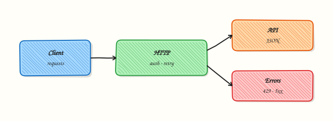

# REST APIs — requests, Auth, and Resilience

## Overview

Most cloud control planes, Git forges, and chat tools speak **HTTP** (Hypertext Transfer Protocol). In Python, the **`requests`** library sends methods (GET, POST, …), headers, and JSON bodies, then returns a status code and a body you can parse. **Resilience** means every call has a **timeout**, you retry only safe cases (429 / 5xx), and you never hang a Continuous Integration (CI) runner waiting forever.

Authentication usually means a **Bearer token** or API key from the environment — not hard-coded in the repo. Pagination means following `Link` headers or `page` / `cursor` fields until the list ends. Rate limits (HTTP 429) need backoff, not a tight loop. Logging must never print the full `Authorization` header.

Without timeouts, a slow API freezes deploy jobs. Without status checks, a 404 looks like “success” if you ignore `raise_for_status`. Production clients treat 401/403 as config bugs, 404 as missing resources, and 429/503 as temporary — with a clear give-up point.

This is **Tutorial 14** in **Module 14: REST APIs** of the REBASH Academy **Python for DevOps Engineers** series. It is written for Cloud, DevOps, Platform, and Site Reliability Engineering (SRE) engineers. By the end you will call a public test API (or a mocked file offline), assert statuses, and save evidence JSON.

## Prerequisites

- [Linux Automation — subprocess and psutil](linux-automation-subprocess-and-psutil.md)
- [Configuration and Secrets](configuration-management-and-secrets.md) — tokens via environment variables
- Python 3.10+ and a virtual environment
- Outbound HTTPS preferred; the lab includes an **offline mock** if the network is blocked

## Learning Objectives

By the end of this tutorial, you will be able to:

- [ ] Perform GET (and a simple POST) with `requests` and JSON
- [ ] Set connect and read timeouts on every call
- [ ] Retry transient failures with a simple loop or urllib3 Retry adapter
- [ ] Assert HTTP status codes deliberately (200/404/429 patterns)
- [ ] Pass auth headers from the environment without logging secrets
- [ ] Fall back to a mocked response file when offline

## Architecture

Your script uses a Session with timeouts and optional retries. Auth headers come from the environment. Success and failure become structured evidence — live HTTP or a local mock file.



## Theory

### What it is

A **REST** (Representational State Transfer) style API exposes resources over HTTP. **`requests.get(url, timeout=…)`** returns a `Response` with `.status_code`, `.headers`, and `.json()`. **Auth** is usually `Authorization: Bearer <token>` or a vendor header. **Resilience** is timeouts + limited retries + clear errors — not infinite loops.

```python
import requests

r = requests.get(
    "https://httpbin.org/get",
    timeout=(3.05, 10),  # (connect, read) seconds
)
r.raise_for_status()
print(r.json()["url"])
```

### Why it matters

Platform automation is API automation: create tickets, list repos, check deploy status, post Slack alerts. Forgotten timeouts hang runners. Ignored 429s burn quotas. Leaked tokens in logs become incidents. Teams that standardise Session + timeout + retry spend less time on “flaky scripts”.

### How it works

1. **Build a Session** — reuse TCP connections; attach default headers.
2. **Always timeout** — tuple `(connect, read)` or a single float.
3. **Check status** — `raise_for_status()` or explicit asserts for expected codes.
4. **Retry carefully** — GET/HEAD/PUT idempotent cases; avoid blind POST retries unless the API is idempotent.
5. **Paginate** — loop until empty page or no `next` link.
6. **Auth from env** — `os.environ["API_TOKEN"]`; never commit tokens.

```python
from requests.adapters import HTTPAdapter
from urllib3.util import Retry
import requests

retry = Retry(total=3, backoff_factor=0.5, status_forcelist=(429, 500, 502, 503, 504))
session = requests.Session()
session.mount("https://", HTTPAdapter(max_retries=retry))
```

### Key concepts and comparisons

| Concern | Approach |
|---------|----------|
| Timeout | `(connect, read)` on every request |
| Auth | Env var → header; short-lived tokens when possible |
| 429 / 5xx | Limited retries with backoff |
| 401 / 403 | Fail fast — fix credentials / RBAC |
| Pagination | Follow vendor `next` / cursor until done |

| Pattern | Prefer when | Avoid when |
|---------|-------------|------------|
| Simple retry loop | Tiny scripts, few calls | Complex APIs needing jitter budgets |
| urllib3 `Retry` on Session | Shared client for many calls | POSTs that create duplicates |
| Mock JSON file | Offline CI / air-gapped labs | Pretending mock proves live auth |

### Common pitfalls

- No timeout → hung job.
- Retrying non-idempotent POST forever → duplicate resources.
- Logging `Authorization` headers.
- Assuming JSON always parses (check `Content-Type` / empty body).
- Treating every non-200 as retryable (404 is usually final).

## Hands-on Lab

### Objective

Call `httpbin.org` (or `example.com`) with timeouts and retries, assert statuses, write `api-evidence.json`, and prove an offline path using a mocked response file under `~/rebash-python/lab14`.

### Prerequisites

- Python 3.10+
- `pip` in a venv
- Network optional — mock path works offline

### Lab environment

Workspace: `~/rebash-python/lab14`

```bash
mkdir -p ~/rebash-python/lab14 && cd ~/rebash-python/lab14
set -euo pipefail
python3 -m venv .venv
# shellcheck disable=SC1091
source .venv/bin/activate
python -m pip install -U pip
python -m pip install 'requests>=2.31,<3'
python -c "import requests; print(requests.__version__)" | tee requests-version.txt
```

**Expected output:** `requests-version.txt` shows a 2.x version.

### Real-world scenario

You are writing a small uptime helper for an internal admin API. Security wants timeouts and no secrets in logs. CI agents sometimes have no egress, so the same code must accept a fixture file. You practise against httpbin and a local mock.

### Step-by-step tasks

#### Task 1 – GET with timeout and status assert


Create `fetch_status.py`:

```python
#!/usr/bin/env python3
"""GET with explicit timeout and status handling."""
from __future__ import annotations

import json
import sys
from pathlib import Path

import requests

URL = "https://httpbin.org/get"
FALLBACK_URL = "https://example.com/"


def fetch(url: str) -> dict:
    try:
        response = requests.get(url, timeout=(3.05, 15))
    except requests.RequestException as exc:
        return {"ok": False, "url": url, "error": type(exc).__name__, "detail": str(exc)}
    body_preview = (response.text or "")[:200]
    return {
        "ok": response.status_code == 200,
        "url": url,
        "status_code": response.status_code,
        "content_type": response.headers.get("Content-Type", ""),
        "body_preview": body_preview,
    }


def main() -> int:
    result = fetch(URL)
    if not result.get("ok"):
        result = fetch(FALLBACK_URL)
    path = Path("live-get.json")
    path.write_text(json.dumps(result, indent=2) + "\n", encoding="utf-8")
    print(json.dumps(result, indent=2))
    if not result.get("ok") and "error" in result:
        # Network blocked — still write file; Task 3 covers mock
        print("live fetch failed (will use mock in Task 3)", file=sys.stderr)
        return 0
    assert result.get("status_code") == 200, result
    return 0


if __name__ == "__main__":
    raise SystemExit(main())
```

Run:

```bash
cd ~/rebash-python/lab14
set -euo pipefail
# shellcheck disable=SC1091
source .venv/bin/activate
python fetch_status.py | tee live-get-run.txt
test -s live-get.json
```

**Expected output:** `live-get.json` exists; status `200` when online, or a recorded error when offline (lab continues).

#### Task 2 – Simple retry loop for transient failures


Create `fetch_with_retry.py`:

```python
#!/usr/bin/env python3
"""Retry GET on 429/5xx with bounded attempts (safe for idempotent GET)."""
from __future__ import annotations

import json
import time
from pathlib import Path

import requests

URL = "https://httpbin.org/status/200"
TRANSIENT = {429, 500, 502, 503, 504}


def get_with_retries(url: str, attempts: int = 4) -> dict:
    last: dict = {}
    for i in range(1, attempts + 1):
        try:
            response = requests.get(url, timeout=(3.05, 15))
        except requests.RequestException as exc:
            last = {"ok": False, "attempt": i, "error": type(exc).__name__, "detail": str(exc)}
            time.sleep(0.4 * i)
            continue
        last = {
            "ok": response.status_code == 200,
            "attempt": i,
            "status_code": response.status_code,
            "url": url,
        }
        if response.status_code == 200:
            return last
        if response.status_code not in TRANSIENT:
            return last
        time.sleep(0.4 * i)
    return last


def main() -> int:
    result = get_with_retries(URL)
    Path("retry-get.json").write_text(json.dumps(result, indent=2) + "\n", encoding="utf-8")
    print(json.dumps(result, indent=2))
    return 0


if __name__ == "__main__":
    raise SystemExit(main())
```

Run:

```bash
cd ~/rebash-python/lab14
set -euo pipefail
# shellcheck disable=SC1091
source .venv/bin/activate
python fetch_with_retry.py | tee retry-run.txt
test -s retry-get.json
```

**Expected output:** `retry-get.json` records attempt count; online runs end with `status_code` 200.

#### Task 3 – Offline mock fallback and evidence pack


Create `mock-response.json`:

```json
{
  "args": {},
  "headers": {"User-Agent": "rebash-lab14"},
  "url": "https://httpbin.org/get"
}
```

Create `api_client.py`:

```python
#!/usr/bin/env python3
"""Live GET or offline mock — never log secrets."""
from __future__ import annotations

import json
import os
import sys
from pathlib import Path

import requests

MOCK_PATH = Path("mock-response.json")


def load_token() -> str | None:
    return os.environ.get("LAB14_API_TOKEN")


def fetch(*, force_mock: bool = False) -> dict:
    token = load_token()
    headers = {}
    if token:
        headers["Authorization"] = f"Bearer {token}"

    if force_mock or os.environ.get("LAB14_FORCE_MOCK") == "1":
        data = json.loads(MOCK_PATH.read_text(encoding="utf-8"))
        return {"mode": "mock", "ok": True, "status_code": 200, "json": data}

    try:
        response = requests.get(
            "https://httpbin.org/get",
            headers=headers,
            timeout=(3.05, 15),
        )
        # Do not log Authorization
        safe_headers = {k: v for k, v in response.request.headers.items() if k.lower() != "authorization"}
        return {
            "mode": "live",
            "ok": response.status_code == 200,
            "status_code": response.status_code,
            "request_headers_safe": safe_headers,
            "json": response.json() if response.headers.get("Content-Type", "").startswith("application/json") else None,
        }
    except requests.RequestException as exc:
        data = json.loads(MOCK_PATH.read_text(encoding="utf-8"))
        return {
            "mode": "mock-fallback",
            "ok": True,
            "status_code": 200,
            "error": type(exc).__name__,
            "json": data,
        }


def main() -> int:
    force = "--mock" in sys.argv
    result = fetch(force_mock=force)
    Path("api-evidence.json").write_text(json.dumps(result, indent=2) + "\n", encoding="utf-8")
    print(f"mode={result['mode']} ok={result['ok']} status={result.get('status_code')}")
    assert result["ok"] is True
    assert result.get("json") is not None
    return 0


if __name__ == "__main__":
    raise SystemExit(main())
```

Create `pack_evidence.py`:

```python
import json
from pathlib import Path

files = ["live-get.json", "retry-get.json", "api-evidence.json", "mock-response.json"]
pack = {name: json.loads(Path(name).read_text(encoding="utf-8")) for name in files if Path(name).is_file()}
Path("lab14-evidence.json").write_text(json.dumps(pack, indent=2) + "\n", encoding="utf-8")
assert Path("api-evidence.json").stat().st_size > 0
print("evidence pack ok")
```

Run:

```bash
cd ~/rebash-python/lab14
set -euo pipefail
# shellcheck disable=SC1091
source .venv/bin/activate
python api_client.py --mock | tee mock-run.txt
LAB14_FORCE_MOCK=0 python api_client.py | tee api-run.txt || python api_client.py --mock | tee api-run.txt
python pack_evidence.py
```

**Expected output:** `api-evidence.json` shows `mode` of `mock`, `live`, or `mock-fallback`; `lab14-evidence.json` packs the artefacts.

### Validation steps

- [ ] Every live call uses an explicit `timeout=`
- [ ] Retry helper bounds attempts (does not loop forever)
- [ ] Mock path works with `python api_client.py --mock`
- [ ] Evidence exists under `~/rebash-python/lab14`

### Common errors and fixes

| Error | Cause | Fix |
|-------|-------|-----|
| `ConnectTimeout` / `ConnectionError` | No egress | Use `--mock` or `mock-fallback` path |
| `JSONDecodeError` | HTML body (example.com) | Check `Content-Type` before `.json()` |
| Retries take too long | High backoff / too many attempts | Keep lab attempts small (3–4) |
| Token visible in logs | Printed headers | Filter `Authorization` like the lab |

### Challenge exercise

Add a `POST` to `https://httpbin.org/post` with a small JSON body `{"source":"lab14"}`, timeout, and status assert `200`. Save `post-evidence.json`. If offline, write the intended request body to `post-dry-run.json` instead and exit 0. Do not retry POST in a tight loop.

### Learning outcomes

- Called HTTP APIs with timeouts and status asserts
- Practised bounded retries for GET
- Used an offline mock fixture
- Packed API evidence without leaking tokens

### Cleanup

```bash
cd ~/rebash-python/lab14
deactivate 2>/dev/null || true
# rm -rf .venv
# Keep *-evidence.json if you want portfolio proof
```

## Validation

- [ ] Lab finished under `~/rebash-python/lab14/`
- [ ] You can explain timeout vs retry vs fail-fast for 401/404
- [ ] You never log full Authorization headers
- [ ] You know when mock mode is honest vs misleading

## Code Walkthrough

Production HTTP clients usually follow this order:

1. **Session + defaults** — base URL, User-Agent, accept JSON  
2. **Timeouts on every call** — connect and read  
3. **Status policy** — raise or branch; do not ignore codes  
4. **Retries only for transient, idempotent cases**  
5. **Evidence** — status, latency, correlation IDs — never secrets  

## Security Considerations

- Load tokens from the environment or a secret store — never commit them  
- Redact `Authorization` and cookie headers in logs  
- Prefer short-lived tokens / OAuth device flows over long-lived PATs when possible  
- Validate TLS (do not disable `verify=False` in production)  
- Treat 401/403 as security signals, not retry fuel  

## Common Mistakes

!!! warning "No timeout on requests"
    Runners hang until the job limit. **Fix:** always pass `timeout=` (tuple preferred).

!!! warning "Blind retries on POST"
    Duplicate tickets, charges, or deploys. **Fix:** retry only idempotent methods or APIs with idempotency keys.

!!! warning "Logging the full response headers"
    Tokens leak into CI logs. **Fix:** allow-list header names for logs.

!!! warning "Ignoring pagination"
    Scripts “work” on small accounts and miss data at scale. **Fix:** loop until empty / no next link.

## Best Practices

- Centralise one Session factory for an app  
- Map status codes to clear exceptions in your domain  
- Honour `Retry-After` on 429 when present  
- Use httpbin/mock servers in unit tests; contract-test staging  
- Document required scopes next to env var names  

## Troubleshooting

| Symptom | Likely cause | Fix |
|---------|--------------|-----|
| Hang | Missing timeout | Add `(connect, read)` |
| 401 loop | Bad/expired token | Fail fast; rotate secret |
| 429 storm | No backoff | Sleep / Retry-After; reduce concurrency |
| SSL error | Corporate proxy / old CA | Install corp CA; do not disable verify casually |
| Empty JSON | Wrong URL / HTML error page | Log status + content-type |

## Summary

Reliable DevOps HTTP clients use **`requests` with timeouts**, careful **retries**, explicit **status handling**, and **env-based auth** — with a mock path for offline CI. Next, apply the same discipline to cloud SDKs in [Cloud Automation — AWS, Azure, and GCP](cloud-automation-aws-azure-gcp.md).

## Interview Questions

**1. Why must every `requests` call set a timeout in CI?**

??? success "Reveal answer"
    Without a timeout, a slow or black-holed TCP connection can block the worker until the whole job is killed. Explicit connect/read timeouts fail fast, free the runner, and make failures visible in logs. Interviewers expect timeouts as a default habit, not an optimisation.

**2. Which HTTP statuses would you retry, and which must fail immediately?**

??? success "Reveal answer"
    Commonly retry **429** and **5xx** (502/503/504) with backoff and a maximum attempt count. Fail immediately on **401/403** (credentials/RBAC) and usually **404** (missing resource). Blind retries on auth errors waste time and can lock accounts.

**3. How do you pass a Bearer token safely in Python automation?**

??? success "Reveal answer"
    Read from an environment variable or secret store, set `headers={"Authorization": f"Bearer {token}"}`, never commit the token, and never print headers wholesale. Prefer short-lived tokens. In CI, inject secrets via the platform’s secret mechanism.

**4. What is the risk of retrying POST without an idempotency key?**

??? success "Reveal answer"
    Network timeouts can mean “request arrived” even when the client saw a failure. A naive retry may create **duplicate** resources (tickets, payments, deployments). Prefer idempotent methods, server idempotency keys, or explicit dedupe — and default mutating tools to dry-run.

**5. How would you design an offline fallback for API tests?**

??? success "Reveal answer"
    Keep a checked-in **fixture JSON** (or VCR-style cassette). When live calls fail or `FORCE_MOCK=1`, load the fixture and still assert parser logic. Be honest in evidence (`mode: mock`) so nobody thinks live auth was proven.

**6. Explain connect timeout vs read timeout.**

??? success "Reveal answer"
    **Connect** timeout bounds establishing the TCP/TLS session. **Read** timeout bounds waiting for bytes after the connection is up. A server that accepts then stalls needs a read timeout; a black hole needs a connect timeout. Using both (tuple) is best practice with `requests`.

**7. How does pagination affect inventory scripts for GitHub or cloud APIs?**

??? success "Reveal answer"
    List endpoints return pages. Stopping after page one under-reports repos, instances, or findings. Follow `Link` headers or cursor fields until empty, respect rate limits, and store page counts in evidence so reviewers see completeness.

## Related Tutorials

- [Python for DevOps Engineers – Overview](index.md)
- [Linux Automation — subprocess and psutil](linux-automation-subprocess-and-psutil.md) *(previous)*
- [Cloud Automation — AWS, Azure, and GCP](cloud-automation-aws-azure-gcp.md) *(next)*
- [Lab — REST API Monitoring Service](../labs/python-rest-api-monitoring-service.md) *(more practice)*

## References

- [Requests documentation](https://requests.readthedocs.io/)  
- [HTTP semantics — MDN](https://developer.mozilla.org/en-US/docs/Web/HTTP)  
- [urllib3 Retry](https://urllib3.readthedocs.io/en/stable/reference/urllib3.util.html)  
- Track index: [Python for DevOps Engineers](index.md)
