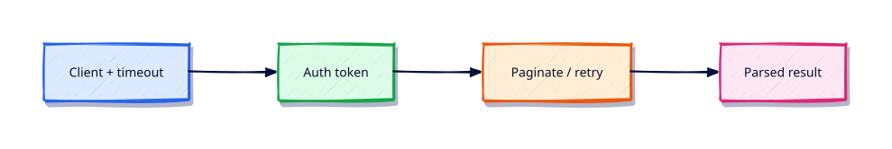

# REST APIs — requests, Auth, and Resilience

## Overview

Most DevOps glue is HTTP. Timeouts, auth hygiene, and pagination decide whether automation is production-ready.

This is **Tutorial 14** in **Module 14: REST APIs** of the REBASH Academy **Python for DevOps Engineers** series — written for DevOps engineers, SREs, platform engineers, and cloud engineers who automate infrastructure with production-quality Python.

## Prerequisites

- Linux Automation — subprocess and psutil
- Python 3.12+ on Linux (WSL2/VM/cloud)

## Learning Objectives

By the end of this tutorial, you will be able to:

- [ ] Apply the core ideas of “REST APIs — requests, Auth, and Resilience” in real ops automation
- [ ] Use a project venv and avoid relying on system site-packages
- [ ] Produce clear stderr diagnostics and meaningful exit codes
- [ ] Prefer safe patterns (pathlib, subprocess list args, dry-run)
- [ ] Relate this topic to day-to-day DevOps and platform work

## Architecture

Ops Python sits between operators/CI and platforms (files, APIs, CLIs, and cloud control planes). This topic’s control points are shown below.



## Theory

### requests

Popular sync HTTP client. Always set `timeout=`. Prefer sessions for connection pooling.

Also know **httpx** — modern alternative with sync/async APIs and explicit timeouts; many new tools choose httpx. Patterns below apply to both.

### HTTP Methods

GET for reads, POST/PUT/PATCH for writes, DELETE for removals. Use GET for health checks and inventory; require dry-run before destructive methods.

### Authentication

Basic, bearer tokens, and header API keys. Load secrets from env. Never hard-code credentials in source.

### OAuth

OAuth 2.0 client-credentials or device flows for cloud APIs. Store refresh tokens securely; rotate on revoke.

### Tokens

Short-lived tokens beat long-lived PATs when possible. Scope tokens to least privilege (read-only inventory vs write).

### Pagination

Follow `Link` headers or `next` cursors until exhausted. Cap pages in labs. Persist progress for huge inventories.

### Rate Limiting

Honour `Retry-After` and 429 responses with exponential backoff and jitter. Centralise retry helpers (Module 24).

### Error Handling

Treat non-2xx as failures unless documented. Log status codes and response IDs — not bodies that may contain secrets.

## Hands-on Lab

Create a workspace for this tutorial.

```bash
mkdir -p ~/rebash-python/lab14 && cd ~/rebash-python/lab14
```

**Focus:** fixture-based API monitor with requests/httpx timeouts, pagination stub, 429 handling

### Step 1 – Skeleton

```bash
cat > lab.py << 'EOF'
#!/usr/bin/env python3
print("lab14 rest-apis-requests-auth-and-resilience")
EOF
chmod +x lab.py
python3 lab.py
```

### Step 2 – Fixture API monitor

```bash
python3 -m venv .venv && source .venv/bin/activate
python -m pip install -q 'requests==2.32.3'
cat > fixture.json << 'EOF'
{"items":[{"id":1,"ok":true},{"id":2,"ok":false}],"next":null}
EOF
cat > monitor.py << 'EOF'
#!/usr/bin/env python3
import json, time
from pathlib import Path

def fetch_pages(path: Path):
    data = json.loads(path.read_text())
    yield data
    # pagination stub: stop when next is null
    while data.get("next"):
        time.sleep(0.01)
        data = json.loads(Path(data["next"]).read_text())
        yield data

failed = []
for page in fetch_pages(Path("fixture.json")):
    for item in page["items"]:
        if not item["ok"]:
            failed.append(item["id"])
print(f"RESULT failed={failed}")
EOF
python monitor.py
deactivate || true
```

### Final step – Cleanup note

```bash
python3 lab.py
# keep ~/rebash-python for later labs
```

## Validation

- [ ] Lab commands run under `~/rebash-python/lab14/`
- [ ] You can explain each Theory heading in your own words
- [ ] Failure path exits non-zero and prints diagnostics to stderr (where applicable)
- [ ] Dry-run / fixture behaviour is clear for any mutating or cloud action
- [ ] You can relate this topic to a real DevOps or platform task

## Code Walkthrough

Production Python for **REST APIs — requests, Auth, and Resilience** always combines:

1. A clear entry point (`main()` + `if __name__ == "__main__"`)
2. A project virtual environment and pinned dependencies when third-party libs are used
3. Explicit error handling and logging (no silent `except Exception: pass`)
4. Safe I/O: `pathlib`, timeouts on HTTP, `subprocess.run([...])` without `shell=True`
5. Documented exit codes and dry-run defaults for mutating actions

Keep modules short enough to review in a single merge request. Prefer stdlib first; add httpx/requests, Typer, pytest, and platform SDKs when the job needs them.

## Security Considerations

- Treat all external input (args, files, env, API payloads) as untrusted until validated
- Never log secrets or `Authorization` headers; prefer masked CI variables and secret stores
- Prefer least privilege tokens and read-only / dry-run modes by default
- Avoid `shell=True`, unvalidated path deletes, and committing `.env` files
- Pin dependencies; review transitive packages for automation that runs in CI

## Common Mistakes

!!! warning "Using system Python without a venv"
    Global packages drift between laptops and CI. **Fix:** `python3 -m venv .venv` per project and pin dependencies.

!!! warning "Calling subprocess with shell=True"
    Untrusted strings become remote code execution. **Fix:** pass a list of arguments; never build a shell string for the happy path.

!!! warning "Mutating without dry-run"
    Cleanup and apply tools destroy shared environments. **Fix:** default to dry-run; require `--apply` for side effects.

## Best Practices

- One purpose per command; share helpers in a small library package
- Log to stderr; reserve stdout for data or RESULT lines
- Idempotent behaviour where schedulers and CI may retry
- Fixture / mock paths for GitHub, Docker, Kubernetes, Terraform, and cloud SDKs in CI
- Pair every new tool with at least one failing-path test you actually run

## Troubleshooting

| Symptom | Likely cause | Fix |
|---------|--------------|-----|
| `ModuleNotFoundError` in CI | Missing venv / pins | Recreate venv; install from lock/requirements |
| Works locally, fails in pipeline | Different Python or env | Pin `requires-python`; fingerprint env in the job |
| Hang on HTTP call | No timeout | Set `timeout=` on requests/httpx clients |
| Secrets in logs | Debug printing headers | Redact; never log tokens |
| Accidental prune/delete | No dry-run default | Default dry-run; label lab resources |

## Summary

**REST APIs — requests, Auth, and Resilience** is a core skill for DevOps engineers automating real hosts, APIs, and pipelines with Python. Practise the lab until the failure path and dry-run path are as familiar as the happy path, then continue the track.

## Interview Questions

1. When would you choose Python over Bash for this kind of ops task?
2. What failure mode appears if you skip a venv, pinning, or dry-run here?
3. How would you test this behaviour in CI without live cloud credentials?
4. Where could secrets leak in a naive implementation of this topic?
5. What exit code contract would you document for teammates?

!!! tip "Sample answer — question 2"
    Floating dependencies and missing dry-run defaults create “works on my machine” automation that either breaks overnight or mutates shared infrastructure unexpectedly. Pin versions and default to report-only.

## Related Tutorials

- [Python for DevOps Engineers – Category Overview](index.md)
- [Linux Automation — subprocess and psutil](linux-automation-subprocess-and-psutil.md) *(previous)*
- [Cloud Automation — AWS, Azure, and GCP](cloud-automation-aws-azure-gcp.md) *(next)*
- [Shell Scripting for DevOps Engineers](../shell/index.md)
- [Learning Paths](../learning-paths/index.md)

## References

- [Python 3 documentation](https://docs.python.org/3/)
- [requests documentation](https://requests.readthedocs.io/)
- [httpx documentation](https://www.python-httpx.org/)
- Track index: [Python for DevOps Engineers](index.md)
