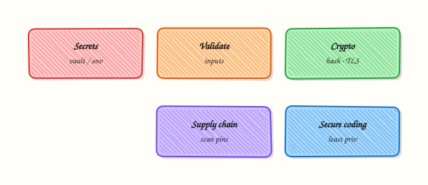

# Security for DevOps Python

## Overview

Ops scripts often hold more power than application code: cloud credentials, deploy hooks, and shell access on build agents. **Security for DevOps Python** means treating every CLI as a privileged program — validate inputs, keep secrets out of source and logs, call subprocesses safely, and scan dependencies when tools are available.

In this tutorial you will practise three controls that show up in real reviews: a **secret-scanning** check that fails when an Application Programming Interface (API) key pattern appears in a file, **safe `subprocess` usage** with a list of arguments (never `shell=True` for untrusted input), and an **optional** run of `bandit` or `pip-audit` when installed. You will keep evidence files for a change ticket.

On Continuous Integration (CI) runners and jump servers, a leaked token or a shell-injection bug becomes a full environment compromise. Teams that skip scanning learn about leaks from public Git history or cloud billing alerts. You do not need every security scanner for the lab to pass — you do need proof that unsafe patterns are caught.

This is **Tutorial 25** in **Module 25: Security** of the REBASH Academy **Python for Cloud & DevOps Engineers** series. It is written for DevOps, platform, SRE, and DevSecOps engineers. By the end you will have a working security evidence pack under `~/rebash-python/lab25`.

## Prerequisites

- [Production Engineering Patterns](production-engineering-patterns.md)
- [Configuration Management and Secrets](configuration-management-and-secrets.md) (helpful)
- Python 3.10+ on a practice machine
- Optional: `bandit` and/or `pip-audit` via `pip` (lab continues if they are missing)
- Do **not** use real production secrets in this lab

## Learning Objectives

By the end of this tutorial, you will be able to:

- [ ] Explain secret-handling rules for CLIs and CI (env vars, not source)
- [ ] Detect a fake API key pattern in a file and fail the check
- [ ] Run an external command with `subprocess` list arguments (not `shell=True`)
- [ ] Run `bandit` or `pip-audit` when available, or record a clear skip
- [ ] Package security evidence suitable for a change ticket

## Architecture

Security controls sit around your automation: secrets enter from the environment or a vault, scanners inspect code and dependencies, and subprocess calls stay on a safe path without a shell.



## Theory

### What it is

**Secret management** means credentials live in the environment, a vault, or a cloud Identity and Access Management (IAM) role — not in Git. **Input validation** rejects dangerous paths and unexpected characters before you use them. **Secure subprocess** means `subprocess.run(["cmd", arg], ...)` with a list, so the operating system does not interpret shell metacharacters. **Dependency scanning** (`pip-audit`, and static tools like `bandit`) finds known vulnerable packages and risky code patterns.

```python
import subprocess
# Safe: argv list — no shell metacharacter interpretation
subprocess.run(["python3", "-c", "print(40+2)"], check=True)
```

### Why it matters

A DevOps script with `shell=True` and a filename from a ticket can become command injection. A hard-coded key in a sample file often reaches the main branch. Unpinned dependencies pull known Common Vulnerabilities and Exposures (CVEs). Security reviews ask for evidence: scanner output, a failing secret check, and a note that shell=True is not used for untrusted data.

### How it works

1. **Secrets** — read `os.environ["NAME"]`; never commit `.env` with real values; never log secret values.  
2. **Scan text** — regular expression for common key shapes (lab uses a fake `REBASH_API_KEY=` pattern).  
3. **Subprocess** — always prefer list args; set `check=True` when failure must abort; capture output deliberately.  
4. **Optional tools** — if `bandit` / `pip-audit` exist, run them and save logs; if not, write `SKIPPED` with reason.  
5. **Evidence** — keep stdout/stderr and exit codes for the ticket.

```python
import re
from pathlib import Path

API_KEY_RE = re.compile(r"REBASH_API_KEY\s*=\s*['\"]?[A-Za-z0-9_\-]{16,}")

def scan_file(path: Path) -> list[str]:
    text = path.read_text(encoding="utf-8", errors="replace")
    return [f"{path}:{i}: secret-like pattern" for i, line in enumerate(text.splitlines(), 1) if API_KEY_RE.search(line)]
```

Hashing passwords needs a password KDF (for example `hashlib.scrypt` or a dedicated library). Integrity of files can use SHA-256. Do not “encrypt” secrets by Base64 — that is encoding, not encryption.

### Key concepts and comparisons

| Control | Prefer | Avoid |
|---------|--------|-------|
| Secrets | Env / vault / OIDC | Keys in source or world-readable files |
| Subprocess | List argv | `shell=True` with user input |
| HTTP clients | TLS verify on | `verify=False` “just for now” |
| Dependencies | Pin + audit in CI | Latest unpinned on every run |

| Tool | Role |
|------|------|
| Custom secret grep / scanner | Catch keys before commit |
| `bandit` | Static risky patterns in Python |
| `pip-audit` | Known vulnerable packages |

### Common pitfalls

- Using `shell=True` because a one-liner was faster to type.  
- Committing “temporary” keys and rotating them weeks later.  
- Logging `Authorization` headers at DEBUG in production.  
- Disabling TLS verification to silence certificate errors.  
- Assuming “private repo” means secrets are safe forever.

## Hands-on Lab

### Objective

Under `~/rebash-python/lab25`, build a secret scanner that fails on a planted fake key, demonstrate safe subprocess list-args, run optional `bandit`/`pip-audit`, and save an evidence archive.

### Prerequisites

- Python 3.10+
- Network only if you choose to `pip install` scanners (optional)
- Practice folder only — no production credentials

### Lab environment

Workspace: `~/rebash-python/lab25`

```bash title="Terminal"
mkdir -p ~/rebash-python/lab25 && cd ~/rebash-python/lab25
set -euo pipefail
python3 --version | tee python-version.txt
```

!!! example "Expected output"
    `python-version.txt` exists and shows Python 3.10+.


### Real-world scenario

Before a platform team merges a new deploy helper, security asks for three proofs: (1) a secret scan that would have caught a committed key, (2) confirmation that shell commands use argv lists, and (3) a dependency or static scan log — or an explicit skip if tools are not on the agent yet. You produce that pack on a practice machine.

### Step-by-step tasks

#### Task 1 – Secret scanner (fail on API key pattern)

Plant a fake key in a sample file, then build a scanner that exits non-zero when the pattern matches. Clean sample must pass.

Create `samples/clean_config.txt`:

```text title="clean_config.txt"
endpoint=https://example.invalid/api
timeout_seconds=10
```

Create `samples/leaky_config.txt`:

```text title="leaky_config.txt"
endpoint=https://example.invalid/api
REBASH_API_KEY=AKIA_TRAINING_ONLY_FAKEKEY99
timeout_seconds=10
```

Create `secret_scan.py`:

```python title="secret_scan.py"
"""Fail if a REBASH_API_KEY-like secret appears in scanned files."""
from __future__ import annotations

import argparse
import re
import sys
from pathlib import Path

API_KEY_RE = re.compile(
    r"REBASH_API_KEY\s*=\s*['\"]?[A-Za-z0-9_\-]{16,}"
)


def scan_path(path: Path) -> list[str]:
    findings: list[str] = []
    if path.is_dir():
        files = sorted(p for p in path.rglob("*") if p.is_file())
    else:
        files = [path]
    for file_path in files:
        text = file_path.read_text(encoding="utf-8", errors="replace")
        for lineno, line in enumerate(text.splitlines(), 1):
            if API_KEY_RE.search(line):
                findings.append(f"{file_path}:{lineno}: secret-like API key pattern")
    return findings


def main(argv: list[str] | None = None) -> int:
    parser = argparse.ArgumentParser(description="REBASH lab25 secret scan")
    parser.add_argument("path", type=Path)
    args = parser.parse_args(argv)
    findings = scan_path(args.path)
    if findings:
        print("RESULT=fail")
        for item in findings:
            print(item)
        return 1
    print("RESULT=ok findings=0")
    return 0


if __name__ == "__main__":
    raise SystemExit(main())
```

Run:

```bash title="Terminal"
cd ~/rebash-python/lab25
set -euo pipefail

mkdir -p samples
python3 secret_scan.py samples/clean_config.txt | tee scan-clean.stdout
grep -F 'RESULT=ok' scan-clean.stdout

set +e
python3 secret_scan.py samples/leaky_config.txt >scan-leaky.stdout 2>scan-leaky.stderr
rc=$?
set -e
test "$rc" -ne 0
grep -F 'RESULT=fail' scan-leaky.stdout
grep -F 'secret-like' scan-leaky.stdout
```


!!! example "Expected output"
    clean scan prints `RESULT=ok`; leaky scan exits non-zero with `RESULT=fail`.


#### Task 2 – Safe subprocess (list args, not shell=True)


Create `safe_subprocess_demo.py`:

```python title="safe_subprocess_demo.py"
"""Demonstrate argv-list subprocess (no shell=True)."""
from __future__ import annotations

import subprocess
import sys


def run_safe(expr: str) -> str:
    # Intentionally NOT shell=True — args are a list.
    completed = subprocess.run(
        [sys.executable, "-c", expr],
        check=True,
        capture_output=True,
        text=True,
    )
    return completed.stdout.strip()


def main() -> int:
    out = run_safe("print(40+2)")
    print(f"safe_output={out}")
    # Document the anti-pattern for training (never enable for untrusted input):
    print("policy=shell_True_forbidden_for_untrusted_input")
    print("RESULT=ok")
    return 0


if __name__ == "__main__":
    raise SystemExit(main())
```

Run:

```bash title="Terminal"
cd ~/rebash-python/lab25
set -euo pipefail
python3 safe_subprocess_demo.py | tee safe-subprocess.stdout
grep -F 'safe_output=42' safe-subprocess.stdout
grep -F 'RESULT=ok' safe-subprocess.stdout
# Prove source does not use shell=True
grep -F 'shell=True' safe_subprocess_demo.py && exit 1 || true
grep -F 'subprocess.run' safe_subprocess_demo.py
```

!!! example "Expected output"
    `safe_output=42` and `RESULT=ok`; source has no `shell=True`.


#### Task 3 – Optional bandit / pip-audit and evidence pack

```bash title="Terminal"
cd ~/rebash-python/lab25
set -euo pipefail

# Tiny requirements file for pip-audit demo (stdlib-only project still OK)
printf 'requests==2.32.3\n' > requirements-lab.txt

{
  echo "=== bandit ==="
  if command -v bandit >/dev/null 2>&1; then
    bandit -r . -f txt -x ./samples | tee bandit.txt
    echo "BANDIT=ran" | tee bandit-status.txt
  elif python3 -c "import bandit" 2>/dev/null; then
    python3 -m bandit -r . -f txt -x ./samples | tee bandit.txt
    echo "BANDIT=ran" | tee bandit-status.txt
  else
    echo "BANDIT=skipped reason=not_installed" | tee bandit-status.txt
    echo "Install later with: python3 -m pip install bandit" | tee bandit.txt
  fi

  echo "=== pip-audit ==="
  if command -v pip-audit >/dev/null 2>&1; then
    pip-audit -r requirements-lab.txt | tee pip-audit.txt || true
    echo "PIP_AUDIT=ran" | tee pip-audit-status.txt
  elif python3 -m pip_audit --help >/dev/null 2>&1; then
    python3 -m pip_audit -r requirements-lab.txt | tee pip-audit.txt || true
    echo "PIP_AUDIT=ran" | tee pip-audit-status.txt
  else
    echo "PIP_AUDIT=skipped reason=not_installed" | tee pip-audit-status.txt
    echo "Install later with: python3 -m pip install pip-audit" | tee pip-audit.txt
  fi
} 2>&1 | tee scanners-combined.txt

grep -E 'BANDIT=(ran|skipped)' bandit-status.txt
grep -E 'PIP_AUDIT=(ran|skipped)' pip-audit-status.txt

tar -czf lab25-evidence.tgz \
  python-version.txt secret_scan.py safe_subprocess_demo.py \
  samples/clean_config.txt samples/leaky_config.txt \
  scan-clean.stdout scan-leaky.stdout \
  safe-subprocess.stdout \
  bandit.txt bandit-status.txt pip-audit.txt pip-audit-status.txt \
  requirements-lab.txt scanners-combined.txt
ls -l lab25-evidence.tgz | tee evidence-ls.txt
```

!!! example "Expected output"
    status files say `ran` or `skipped`; `lab25-evidence.tgz` is non-empty. Missing scanners is OK.


### Validation steps

- [ ] Clean secret scan returns `RESULT=ok`
- [ ] Leaky sample returns non-zero and `RESULT=fail`
- [ ] Safe subprocess demo prints `safe_output=42` without `shell=True` in source
- [ ] `bandit-status.txt` and `pip-audit-status.txt` exist (`ran` or `skipped`)
- [ ] `lab25-evidence.tgz` exists under `~/rebash-python/lab25`

### Common errors and fixes

| Error | Cause | Fix |
|-------|-------|-----|
| Leaky scan passes | Pattern too strict / file path wrong | Scan `samples/leaky_config.txt`; keep `REBASH_API_KEY=` line |
| `bandit: command not found` | Not installed | Expected — status must be `skipped` |
| `pip-audit` needs network | Offline agent | Skip or install in a networked venv; record skip |
| False sense of safety | Only scanned samples/ | Point CI at the whole repo later |
| Real key by mistake | Copied from work | Rotate immediately; use only fake lab keys |

### Challenge exercise

Extend `secret_scan.py` with a `--allowlist` file of path substrings to ignore (for example `samples/leaky_config.txt` during a teaching demo). Prove that scanning `samples/` with an allowlist entry for the leaky file returns `RESULT=ok`, and without the allowlist still fails. Do not weaken the default (no allowlist) path.

### Learning outcomes

- Secret pattern scan with fail-closed behaviour  
- Safe subprocess list-args demo with evidence  
- Optional bandit/pip-audit or honest skip status  
- Evidence archive for security review  

### Cleanup

```bash title="Terminal"
cd ~/rebash-python/lab25
set -euo pipefail
# Remove the intentional leaky sample when finished practising:
# rm -f samples/leaky_config.txt
rm -rf __pycache__
```

## Validation

- [ ] Lab finished under `~/rebash-python/lab25/` with evidence archive
- [ ] You can explain why `shell=True` is dangerous with untrusted input
- [ ] You know where secrets should live (env/vault/IAM) vs must not live (Git)
- [ ] You can describe what bandit and pip-audit each check

## Code Walkthrough

Secure DevOps Python usually follows this order:

1. **Inventory secrets** — what the tool needs; prefer IAM/OIDC over static keys  
2. **Fail closed on leaks** — scanners in pre-commit and CI  
3. **Safe process boundaries** — list argv, timeouts, least privilege user  
4. **Validate inputs** — paths, URLs, enums; reject `../` surprises  
5. **Record evidence** — scanner logs and skip reasons, not screenshots only  

## Security Considerations

- Never commit real API keys — the lab key is fake and marked training-only  
- Rotate any credential that might have been pasted into a ticket or chat  
- Prefer short-lived cloud credentials over long-lived access keys  
- Keep TLS verification enabled on HTTP clients  
- Limit who can read CI logs that might accidentally print secrets  

## Common Mistakes

!!! warning "Using `shell=True` with ticket or filename input"
    Metacharacters become command injection. **Fix:** pass a list to `subprocess.run` / `Popen` and avoid the shell.

!!! warning "Disabling secret scan for one file forever"
    Exceptions become permanent holes. **Fix:** time-boxed allowlists with owners; delete leaky files.

!!! warning "Base64 as encryption"
    Encoding is reversible without a key. **Fix:** use a real vault or platform secret store.

!!! warning "Logging full exception objects that include headers"
    Tokens appear in log aggregators. **Fix:** redact; log status codes and request IDs only.

## Best Practices

- Run secret scanning on every merge request  
- Pin dependencies and audit them in CI (`pip-audit` or equivalent)  
- Use static analysis (`bandit`) on automation repos  
- Document required env vars in README without example secret values  
- Separate human credentials from machine/deploy roles  

## Troubleshooting

| Symptom | Likely cause | Fix |
|---------|--------------|-----|
| Scanner misses key | Pattern does not match format | Extend regex carefully; add tests |
| Too many false positives | Pattern too broad | Anchor on known prefixes; allowlist tests only |
| pip-audit fails offline | Needs advisory download | Cache advisories or skip with reason in air-gapped labs |
| bandit flags lab demo | Teaching sample | Exclude `samples/` or document finding |
| Secret in Git history | Committed earlier | Rotate key; purge history with team process |

## Summary

Secure DevOps Python means **secrets out of Git**, **fail-closed scanning**, **safe subprocess lists**, and **honest supply-chain checks**. Next, learn offline-first AI assistants for ops in [AI for DevOps — OpenAI, MCP, and LangChain](ai-for-devops-openai-mcp-langchain.md).

## Interview Questions

**1. Why is `subprocess` with a list safer than `shell=True` for untrusted input?**

??? success "Reveal answer"
    With a **list**, the operating system starts the program and passes arguments without asking a shell to parse the string. With **`shell=True`**, characters such as `;`, `|`, and backticks can run extra commands. Untrusted filenames or ticket fields must never go through a shell.

**2. Where should a deploy CLI load its cloud token from, and what must never appear in the repository?**

??? success "Reveal answer"
    Load tokens from the **environment**, a **vault**, or cloud **OIDC/IAM** roles injected at runtime. Never store real tokens in source, sample configs, or unit-test fixtures that ship in the wheel. Document variable *names* in the README, not values.

**3. What is the difference between `bandit` and `pip-audit`?**

??? success "Reveal answer"
    **bandit** is a static analyser for Python source (risky calls, common anti-patterns). **pip-audit** checks installed or declared packages against known vulnerability databases. You usually want both: code risks and dependency CVEs are different classes of problem.

**4. How would you prove to a security reviewer that a secret cannot land in the main branch unnoticed?**

??? success "Reveal answer"
    Show a **failing CI job** (or local scanner) when a fake key is planted, the scanner config in the pipeline, and that the clean tree passes. Attach logs. Mention pre-commit hooks as defence in depth, and key rotation if anything leaked historically.

**5. A junior disabled TLS verification (`verify=False`) to fix a corporate proxy error. What do you do?**

??? success "Reveal answer"
    Treat it as a **security defect**. Install the corporate Certificate Authority (CA) in the trust store, or configure the correct bundle path. Do not ship `verify=False`. If a temporary lab exception exists, keep it out of production branches and document the risk.

**6. What should happen when a secret scanner finds a match in CI?**

??? success "Reveal answer"
    The pipeline must **fail closed** (non-zero exit), block merge, and alert the author. Rotate the credential if it was real, remove it from history as needed, and add a regression test. Do not mark the job green with a warning-only policy for secrets.

**7. How do hashing for passwords and hashing for file integrity differ?**

??? success "Reveal answer"
    **Password hashing** needs a slow, salted password-based key derivation function resistant to brute force. **File integrity** often uses a fast cryptographic hash such as SHA-256 to detect changes. Reusing a fast hash alone for passwords is a common mistake interviewers listen for.

## Related Tutorials

- [Python for Cloud & DevOps – Overview](index.md)
- [Production Engineering Patterns](production-engineering-patterns.md) *(previous)*
- [AI for DevOps — OpenAI, MCP, and LangChain](ai-for-devops-openai-mcp-langchain.md) *(next)*
- [Configuration Management and Secrets](configuration-management-and-secrets.md)
- [Linux Automation — subprocess and psutil](linux-automation-subprocess-and-psutil.md)

## References

- [subprocess — Subprocess management](https://docs.python.org/3/library/subprocess.html) — Python docs  
- [Bandit documentation](https://bandit.readthedocs.io/) — PyCQA  
- [pip-audit](https://pypi.org/project/pip-audit/) — PyPI  
- [OWASP Secrets Management Cheat Sheet](https://cheatsheetseries.owasp.org/cheatsheets/Secrets_Management_Cheat_Sheet.html)  
- Track index: [Python for Cloud & DevOps Engineers](index.md)
