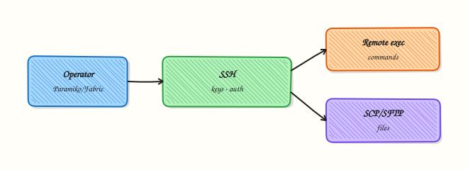

# SSH Automation — Paramiko and Fabric

## Overview

Secure Shell (SSH) is still how many fleets get bootstrap scripts and emergency fixes. **Paramiko** is the lower-level Python SSH library (connect, exec, SFTP). **Fabric** sits higher — tasks, `Connection.run()`, put/get — built on Paramiko for multi-host scripts. Both should use key-based auth and careful host-key checks.

Prefer configuration management or cloud-init for steady state. Use Paramiko or Fabric for targeted remote execution: health checks, config pulls, and controlled restarts. Never hard-code keys or passwords. A wrong host-key policy is a Man-in-the-Middle (MitM) risk.

This is **Tutorial 20** in **Module 20: SSH Automation** of the REBASH Academy **Python for Cloud & DevOps Engineers** series. It is written for Linux administrators, DevOps, Platform, and Site Reliability Engineering (SRE) engineers. By the end you will prove a safe local or mock SSH path under `~/rebash-python/lab20` and clean up lab keys only inside that directory.

## Prerequisites

- [Infrastructure Automation — Terraform](infrastructure-automation-terraform.md)
- [Linux Automation — subprocess](linux-automation-subprocess-and-psutil.md)
- SSH client basics (`ssh`, `ssh-keygen`)
- Python 3.10+; ability to `pip install paramiko` in a venv

## Learning Objectives

By the end of this tutorial, you will be able to:

- [ ] Contrast Paramiko (library) with Fabric (task layer)
- [ ] Describe key-based auth and `known_hosts` / RejectPolicy risks
- [ ] Sketch remote exec and SCP/SFTP flows
- [ ] Run a localhost SSH check, OpenSSH BatchMode fallback, or a mock channel
- [ ] Clean up lab keys under the lab directory only
- [ ] Gate destructive remote commands behind allow-lists and dry-run

## Architecture

Your Python process authenticates with a private key, verifies the server host key, then opens an exec or SFTP channel. Fabric wraps the same path for multi-host tasks.



## Theory

### What it is

**SSH automation** runs commands and transfers files on remote Linux hosts without an interactive terminal. **Paramiko** gives `SSHClient`, channels, and SFTP. **Fabric** adds `@task` style helpers and host lists on top of Paramiko/Invoke. OpenSSH CLI via `subprocess` is still useful for one-liners; structured Python wins when you need tests and allow-lists.

### Why it matters

Cloud APIs do not cover every appliance, jump server (bastion), or legacy box. Fleet checks (`uname`, disk, service status) still travel over SSH. Doing that in Python beats unmaintainable expect scripts — if you treat host keys, command allow-lists, and dry-run as first-class controls.

### How it works

1. **Keys** — prefer Ed25519; never commit private keys; load from agent or `key_filename` from a secure path.
2. **Host keys** — load `known_hosts`; use **`RejectPolicy`** for unknown keys in production (not `AutoAddPolicy`).
3. **Connect** — username + key; set socket and command timeouts.
4. **Exec / SFTP** — `exec_command` for remote shells; SFTP for put/get; validate remote paths before writes.
5. **Fabric** — wrap the same flow in tasks and host lists for multi-host scripts.

```python
import paramiko
client = paramiko.SSHClient()
client.set_missing_host_key_policy(paramiko.RejectPolicy())
# client.load_system_host_keys()
# client.connect(hostname, username=..., key_filename=...)
```

### Key concepts and comparisons

| Tool | Level | Best for |
|------|-------|----------|
| Paramiko | Low | Fine control, embedding in larger apps |
| Fabric | High | Multi-host task scripts |
| OpenSSH CLI via subprocess | External | One-liners; weaker structure |

| Action | Tutorial default |
|--------|------------------|
| `uname`, read-only checks | Allowed in labs |
| `rm`, service restart | `--apply` + command allow-list |

### Common pitfalls

- `AutoAddPolicy` in production (accepts any host key).
- Logging command lines that embed passwords.
- Unbounded parallel SSH that trips fail2ban or MaxStartups.
- Writing files to world-writable `/tmp` paths without ownership checks.
- Skipping bastion/ProxyJump modelling so scripts only work on a flat lab network.

## Hands-on Lab

### Objective

Under `~/rebash-python/lab20`, generate lab-only SSH keys, then prove connectivity with Paramiko to localhost, or fall back to `ssh -o BatchMode=yes`, or a `unittest.mock` channel if no SSH server is available. Delete only keys created in the lab directory.

### Prerequisites

- Python 3.10+
- Packages: `openssh-client` (for `ssh` / `ssh-keygen`); optional local `sshd`
- Network: localhost only

### Lab environment

Workspace: `~/rebash-python/lab20`

```bash
mkdir -p ~/rebash-python/lab20 && cd ~/rebash-python/lab20
set -euo pipefail
python3 -m venv .venv
# shellcheck disable=SC1091
source .venv/bin/activate
python -m pip install -q --upgrade pip
python -m pip install -q 'paramiko>=3.4'
python -c 'import paramiko; print(paramiko.__version__)' | tee paramiko-version.txt
```

**Expected output:** `paramiko-version.txt` contains a version such as `3.x`.

### Real-world scenario

You need a small inventory script that runs `uname -a` on jump hosts. Security asks for key-based auth, RejectPolicy for unknown hosts, and no passwords in code. Your laptop may not have `sshd` listening — so the script must fall back to OpenSSH BatchMode or a mock path while still proving the control flow for CI.

### Step-by-step tasks

#### Task 1 – Lab-only key pair

Create keys **only** under the lab directory. Do not touch `~/.ssh/id_*`.

```bash
cd ~/rebash-python/lab20
set -euo pipefail
# shellcheck disable=SC1091
source .venv/bin/activate

ssh-keygen -t ed25519 -N '' -f ./lab_ed25519 -C 'rebash-lab20' -q
test -f lab_ed25519 && test -f lab_ed25519.pub
ls -l lab_ed25519 lab_ed25519.pub | tee key-ls.txt
chmod 600 lab_ed25519
```

**Expected output:** `key-ls.txt` lists private and public key files; private key mode is restrictive.

#### Task 2 – Connect, BatchMode, or mock


Create `ssh_lab.py`:

```python
#!/usr/bin/env python3
"""Try Paramiko localhost, then OpenSSH BatchMode, then mock."""
from __future__ import annotations

import json
import os
import subprocess
import sys
from pathlib import Path
from unittest.mock import MagicMock, patch

import paramiko

ROOT = Path(__file__).resolve().parent
KEY = ROOT / "lab_ed25519"
USER = os.environ.get("USER") or os.environ.get("LOGNAME") or "lab"


def try_paramiko() -> dict | None:
    client = paramiko.SSHClient()
    client.set_missing_host_key_policy(paramiko.RejectPolicy())
    try:
        client.load_system_host_keys()
    except OSError:
        pass
    # Lab-only: allow first localhost key so practice VMs work; production must use RejectPolicy + known_hosts
    client.set_missing_host_key_policy(paramiko.WarningPolicy())
    try:
        client.connect(
            "127.0.0.1",
            username=USER,
            key_filename=str(KEY),
            timeout=5,
            allow_agent=False,
            look_for_keys=False,
        )
        _stdin, stdout, stderr = client.exec_command("uname -s", timeout=10)
        out = stdout.read().decode("utf-8", errors="replace").strip()
        err = stderr.read().decode("utf-8", errors="replace").strip()
        code = stdout.channel.recv_exit_status()
        client.close()
        if code != 0:
            return None
        return {"mode": "paramiko", "stdout": out, "stderr": err, "ok": True}
    except Exception as exc:  # noqa: BLE001 — lab probes many failure modes
        return {"mode": "paramiko", "ok": False, "error": str(exc)}


def try_openssh() -> dict | None:
    pub = KEY.with_suffix(".pub")
    # BatchMode never prompts; fails cleanly if auth/sshd unavailable
    cmd = [
        "ssh",
        "-o",
        "BatchMode=yes",
        "-o",
        "StrictHostKeyChecking=accept-new",
        "-o",
        "ConnectTimeout=5",
        "-i",
        str(KEY),
        f"{USER}@127.0.0.1",
        "uname -s",
    ]
    try:
        proc = subprocess.run(cmd, capture_output=True, text=True, timeout=15, check=False)
    except (FileNotFoundError, subprocess.TimeoutExpired) as exc:
        return {"mode": "openssh", "ok": False, "error": str(exc)}
    if proc.returncode != 0:
        return {
            "mode": "openssh",
            "ok": False,
            "error": proc.stderr.strip() or proc.stdout.strip(),
            "pub_hint": str(pub),
        }
    return {"mode": "openssh", "stdout": proc.stdout.strip(), "ok": True}


def try_mock() -> dict:
    with patch("paramiko.SSHClient") as mock_cls:
        client = mock_cls.return_value
        stdout = MagicMock()
        stderr = MagicMock()
        channel = MagicMock()
        channel.recv_exit_status.return_value = 0
        stdout.channel = channel
        stdout.read.return_value = b"Linux\n"
        stderr.read.return_value = b""
        client.exec_command.return_value = (MagicMock(), stdout, stderr)
        client.connect(
            "127.0.0.1",
            username=USER,
            key_filename=str(KEY),
            timeout=5,
        )
        _stdin, so, _se = client.exec_command("uname -s", timeout=10)
        out = so.read().decode().strip()
        assert out == "Linux"
        client.exec_command.assert_called()
    return {"mode": "mock", "stdout": out, "ok": True}


def main() -> int:
    if not KEY.is_file():
        print("missing lab_ed25519", file=sys.stderr)
        return 1
    result = try_paramiko()
    if not result or not result.get("ok"):
        result = try_openssh()
    if not result or not result.get("ok"):
        result = try_mock()
    out = ROOT / "ssh-result.json"
    out.write_text(json.dumps(result, indent=2) + "\n", encoding="utf-8")
    print(out.read_text(encoding="utf-8"))
    return 0 if result.get("ok") else 1


if __name__ == "__main__":
    raise SystemExit(main())
```

Run:

```bash
cd ~/rebash-python/lab20
set -euo pipefail
# shellcheck disable=SC1091
source .venv/bin/activate
python ssh_lab.py | tee ssh-run.txt
python -c 'import json; d=json.load(open("ssh-result.json")); assert d["ok"] is True'
```

**Expected output:** `ssh-result.json` has `"ok": true` and `"mode"` of `paramiko`, `openssh`, or `mock`.

#### Task 3 – Evidence and key hygiene note

```bash
cd ~/rebash-python/lab20
set -euo pipefail

# Prove keys stayed in the lab directory
find . -maxdepth 1 -name 'lab_ed25519*' | tee lab-keys-find.txt
grep -q 'lab_ed25519' lab-keys-find.txt

tar -czf ssh-lab-evidence.tgz \
  paramiko-version.txt key-ls.txt ssh-result.json ssh-run.txt \
  lab-keys-find.txt ssh_lab.py lab_ed25519.pub
# Do NOT pack the private key into shared tickets
ls -l ssh-lab-evidence.tgz | tee evidence-ls.txt
test -s ssh-lab-evidence.tgz
```

**Expected output:** Evidence archive exists; private key is **not** required inside the tarball (public key only).

### Validation steps

- [ ] `lab_ed25519` / `.pub` exist only under `~/rebash-python/lab20`
- [ ] `ssh_lab.py` produces `ssh-result.json` with `"ok": true`
- [ ] Mode is one of paramiko / openssh / mock
- [ ] Evidence tarball does not need the private key
- [ ] You understand RejectPolicy vs AutoAddPolicy

### Common errors and fixes

| Error | Cause | Fix |
|-------|-------|-----|
| `Authentication failed` | Public key not in `authorized_keys` | Use openssh fallback or mock; or append `.pub` to your user `authorized_keys` **only on a practice VM** |
| `Connection refused` | No `sshd` on localhost | Expected — script falls through to mock |
| `No hostkey for host` / RejectPolicy | Unknown host key | Lab uses WarningPolicy for localhost probe; production must preload `known_hosts` |
| `paramiko` import error | venv not active | `source .venv/bin/activate` and reinstall |
| Hung SSH | No timeout | Keep ConnectTimeout / Paramiko timeout |

### Challenge exercise

Add `fabric_probe.py` that defines a Fabric `@task` (or a thin wrapper class if Fabric is heavy) to run `uname -s` with the same fallback chain, and write `fabric-result.json`. Install Fabric in the lab venv only if you take this stretch: `python -m pip install -q fabric`. Cleanup must still remove only lab-dir keys.

### Learning outcomes

- Generated lab-scoped SSH keys
- Exercised Paramiko with safe fallbacks for missing sshd
- Separated public evidence from private key material
- Can explain host-key policy for production

### Cleanup

```bash
cd ~/rebash-python/lab20
set -euo pipefail
# Remove ONLY lab keys in this directory — never rm ~/.ssh/id_*
rm -f lab_ed25519 lab_ed25519.pub
rm -rf .venv
# Keep evidence if you want it; otherwise:
# rm -f ssh-lab-evidence.tgz *.txt *.json
```

## Validation

- [ ] Lab finished under `~/rebash-python/lab20/` with evidence files
- [ ] You can explain Paramiko vs Fabric and RejectPolicy
- [ ] You know why passwords must not appear in automation code
- [ ] You can describe cleanup limited to the lab directory

## Code Walkthrough

Production SSH automation usually follows this order:

1. **Keys from a vault or agent** — never from the repo  
2. **Load known_hosts + RejectPolicy** — verify out-of-band on first trust  
3. **Timeouts on connect and exec** — fail fast  
4. **Command allow-list + dry-run** — especially for restarts and deletes  
5. **Bound concurrency** — avoid MaxStartups / lockouts  

Capture stdout/stderr and exit codes for tickets; redact secrets.

## Security Considerations

- Prefer Ed25519 keys; disable password auth for service accounts  
- Never log private keys or passwords  
- Use RejectPolicy (or pinned host keys) in production — not AutoAddPolicy  
- Validate remote paths before SFTP writes  
- Limit who can read automation logs that may contain host inventory  

## Common Mistakes

!!! warning "Using AutoAddPolicy in production"
    Any host key is accepted — MitM becomes easy. **Fix:** RejectPolicy + managed `known_hosts` (or certificate-based host keys).

!!! warning "Committing private keys into Git"
    Full account takeover. **Fix:** generate keys outside the repo; use agents/secrets managers; rotate on leak.

!!! warning "No command allow-list for remote exec"
    A bug can run `rm -rf`. **Fix:** allow exact commands; dry-run by default; require `--apply` for changes.

!!! warning "Cleaning up with `rm -rf ~/.ssh`"
    Destroys the engineer’s real keys. **Fix:** delete only files under the lab path you created.

## Best Practices

- One small library for connect + exec with shared timeouts  
- Prefer configuration management for steady state; SSH for break-glass and bootstrap  
- Model ProxyJump/bastion explicitly  
- Rate-limit parallel SSH  
- Store only public keys in tickets and evidence packs  

## Troubleshooting

| Symptom | Likely cause | Fix |
|---------|--------------|-----|
| Auth failure | Wrong key/user | `ssh -v -i lab_ed25519 user@127.0.0.1`; check `authorized_keys` |
| Host key verify fail | First connect / rotation | Verify out-of-band; update known_hosts |
| Hang | No timeout | Set socket and command timeouts |
| fail2ban lockout | Too many parallel tries | Lower workers; backoff |
| Works in shell, fails in Paramiko | Agent vs key_filename | Pass `key_filename` and disable agent if needed |

## Summary

Paramiko is the library; Fabric is the task layer. Prefer keys, RejectPolicy, timeouts, and allow-lists. This lab proved a localhost or mock path and cleaned up keys only under `~/rebash-python/lab20`. Next, speed up fan-out with [Concurrency — Threads, asyncio, and Futures](concurrency-threads-asyncio-and-futures.md).

## Interview Questions

**1. What is the difference between Paramiko and Fabric, and when do you pick each?**

??? success "Reveal answer"
    **Paramiko** is the SSH protocol library: connect, channels, SFTP. **Fabric** builds a task-oriented API on top for multi-host scripts. Pick Paramiko when embedding SSH inside a larger app; pick Fabric when operators want concise `@task` host loops. Both need the same security controls for keys and host keys.

**2. Why is `AutoAddPolicy` dangerous in production?**

??? success "Reveal answer"
    It **accepts any server host key** on first connect, so an attacker on the network can present a fake host and capture credentials or commands. Production should use `RejectPolicy` (or WarningPolicy only in tightly controlled labs) and maintain `known_hosts` or SSH certificates.

**3. How would you automate SSH when the CI agent has no sshd on localhost?**

??? success "Reveal answer"
    Use a **mock** (`unittest.mock`) to assert connect/exec call patterns in unit tests, and run integration tests against a disposable VM or container with sshd in a labelled job. Falling back to `ssh -o BatchMode=yes` is useful on developer laptops when keys and sshd exist.

**4. What should never appear in Git or evidence tarballs for SSH labs?**

??? success "Reveal answer"
    **Private keys**, passwords, and sometimes full known_hosts with internal hostnames if policy forbids it. Public keys and redacted command output are usually fine. Rotate any private key that was ever committed.

**5. How do you prevent a buggy script from running destructive remote commands?**

??? success "Reveal answer"
    Maintain an **allow-list** of exact remote commands, default to dry-run (print what would run), require `--apply` for changes, and keep separate low-privilege SSH users. Log what ran with exit codes for audit.

**6. How does key-based auth relate to service accounts on jump servers?**

??? success "Reveal answer"
    Service accounts should use **keys (or certificates)**, no interactive password, often `ForceCommand` or restricted shells, and narrow sudo if needed. Human accounts stay separate. Automation loads keys from a secrets store or agent, not from the repository.

**7. Your Paramiko job suddenly hangs against 200 hosts. What do you check first?**

??? success "Reveal answer"
    **Timeouts**, pool size (MaxStartups / fail2ban), DNS delays, and whether host-key prompts are blocking. Cap workers, set connect/exec timeouts, and fail per-host without blocking the whole batch. Interviewers want bounded fan-out, not “spawn one thread per host forever.”

**8. When would you still shell out to the OpenSSH client instead of Paramiko?**

??? success "Reveal answer"
    For **one-off operator commands**, ProxyJump setups already perfected in `~/.ssh/config`, or environments where Paramiko cannot be installed. For testable productised automation with mocks and structured errors, prefer Paramiko/Fabric. Many teams use OpenSSH in thin wrappers and Paramiko inside libraries — be consistent per codebase.

## Related Tutorials

- [Python for Cloud & DevOps – Overview](index.md)
- [Infrastructure Automation — Terraform](infrastructure-automation-terraform.md) *(previous)*
- [Concurrency — Threads, asyncio, and Futures](concurrency-threads-asyncio-and-futures.md) *(next)*
- [Linux Automation — subprocess and psutil](linux-automation-subprocess-and-psutil.md)

## References

- [Paramiko documentation](https://docs.paramiko.org/)  
- [Fabric documentation](https://docs.fabfile.org/)  
- [OpenSSH manual pages](https://man.openbsd.org/ssh)  
- Track index: [Python for Cloud & DevOps Engineers](index.md)
