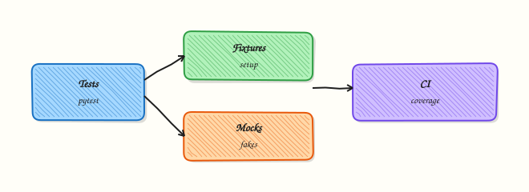

# Testing with pytest

## Overview

**pytest** is the usual Python test runner for libraries and automation. You write functions named `test_*`, use plain `assert`, and share setup with **fixtures**. For DevOps code, tests prove parsers, exit codes, and “given this API JSON, we classify healthy” — without a live cluster on every commit.

Untested automation breaks on release day. Unit tests with mocked HTTP or cloud clients run in seconds on every pull request. Integration tests (Docker, kind) run in dedicated jobs. Coverage reports show which failure branches you never exercised — often the ones that fail at 02:00.

This is **Tutorial 22** in **Module 22: Testing** of the REBASH Academy **Python for Cloud & DevOps Engineers** series. It is written for DevOps, Platform, and Site Reliability Engineering (SRE) engineers. By the end you will have a small inventory module with a green `pytest -q` run under `~/rebash-python/lab22`.

## Prerequisites

- [Concurrency — Threads, asyncio, and Futures](concurrency-threads-asyncio-and-futures.md)
- [Functions — Parameters and Scope](functions-parameters-and-scope.md)
- [Error Handling and Exceptions](error-handling-and-exceptions.md)
- Python 3.10+ and permission to install pytest in a venv

## Learning Objectives

By the end of this tutorial, you will be able to:

- [ ] Write pytest functions and clear assertions for ops logic
- [ ] Use fixtures for temporary paths and sample inventory data
- [ ] Mock external calls so unit tests need no live network
- [ ] Run `pytest -q` to green in CI style
- [ ] Separate unit tests from optional integration tests
- [ ] Explain when coverage reports help (and when they become theatre)

## Architecture

pytest collects tests, injects fixtures, runs assertions, and reports failures. Mocks replace network and cloud edges so the inventory logic stays under test.



## Theory

### What it is

pytest discovers tests in files matching `test_*.py` (and classes named `Test*`). **Fixtures** inject temporary paths (`tmp_path`), sample configs, or fake clients. **`monkeypatch`** / **`unittest.mock.patch`** replace `urllib` or SDK calls so tests return fixture JSON. Markers such as `@pytest.mark.integration` skip unless you opt in. pytest can still collect `unittest.TestCase` classes; prefer plain functions for new code.

### Why it matters

A one-line change to severity mapping can open a Sev-1 alert path or hide outages. Fast unit tests give confidence on every pull request. Integration tests prove the real edges. Coverage should focus on parsers and failure paths — not chasing 100% for show.

### How it works

1. **Arrange** — fixtures build sample inventory files or fake responses.  
2. **Act** — call the function under test.  
3. **Assert** — check return values, raised errors, and side effects on temp paths.  
4. **Mock edges** — patch where the name is looked up (usually where used).  
5. **Gate CI** — `pytest -q` must be green; mark slow tests separately.

```python
def test_healthy_host() -> None:
    assert classify({"status": "up"}) == "healthy"

@pytest.fixture
def sample_json(tmp_path: Path) -> Path:
    p = tmp_path / "hosts.json"
    p.write_text('[{"name": "web1", "status": "up"}]\n', encoding="utf-8")
    return p
```

### Key concepts and comparisons

| Layer | Talks to | When |
|-------|----------|------|
| Unit | Mocks / fixtures | Every PR |
| Integration | Real Docker / kind / API sandbox | Nightly or labelled jobs |
| End-to-end | Full stack | Sparse; expensive |

| Tool | Role |
|------|------|
| Fixtures | Reusable setup/teardown |
| monkeypatch / mock | Fake I/O and SDKs |
| Markers | Opt-in slow tests |
| Coverage | Find untested exit branches |

### Common pitfalls

- Hitting real cloud APIs in unit tests (flaky, costly, credential-dependent).
- Asserting exact log strings that change every refactor.
- Skipping tests for the hard error paths that matter most.
- Sharing mutable global state between tests.
- Importing modules that call the network at collection time.

## Hands-on Lab

### Objective

Under `~/rebash-python/lab22`, implement a small host inventory module and pytest tests (including a mock) so `pytest -q` is green. Coverage is optional.

### Prerequisites

- Python 3.10+
- pip available for a local venv

### Lab environment

Workspace: `~/rebash-python/lab22`

``` {.bash .ra-terminal title="Terminal"}
mkdir -p ~/rebash-python/lab22 && cd ~/rebash-python/lab22
set -euo pipefail
python3 -m venv .venv
# shellcheck disable=SC1091
source .venv/bin/activate
python -m pip install -q --upgrade pip
python -m pip install -q pytest
python -c 'import pytest; print(pytest.__version__)' | tee pytest-version.txt
```

!!! example "Expected output"
    `pytest-version.txt` shows a pytest version.


### Real-world scenario

Your team maintains a tiny inventory helper that loads host JSON and classifies health. Last month a bad status string slipped through and paging fired wrongly. You add unit tests with fixtures and a mocked fetch so every pull request proves the classifier — without calling production APIs.

### Step-by-step tasks

#### Task 1 – Inventory module

``` {.bash .ra-terminal title="Terminal"}
cd ~/rebash-python/lab22
set -euo pipefail
# shellcheck disable=SC1091
source .venv/bin/activate

mkdir -p inventory tests
```

Create `inventory/__init__.py`:

```python title="__init__.py"
"""Small host inventory helpers for the pytest lab."""
from .hosts import classify, load_hosts, summarise

__all__ = ["classify", "load_hosts", "summarise"]
```

Create `inventory/hosts.py`:

```python title="hosts.py"
from __future__ import annotations

import json
import urllib.request
from pathlib import Path
from typing import Any


def classify(host: dict[str, Any]) -> str:
    status = str(host.get("status", "")).lower().strip()
    if status in {"up", "healthy", "ok"}:
        return "healthy"
    if status in {"down", "unhealthy", "failed"}:
        return "unhealthy"
    return "unknown"


def load_hosts(path: Path) -> list[dict[str, Any]]:
    data = json.loads(path.read_text(encoding="utf-8"))
    if not isinstance(data, list):
        raise ValueError("inventory root must be a JSON list")
    return data


def summarise(hosts: list[dict[str, Any]]) -> dict[str, int]:
    counts = {"healthy": 0, "unhealthy": 0, "unknown": 0}
    for host in hosts:
        counts[classify(host)] += 1
    return counts


def fetch_remote_status(url: str, timeout: float = 5.0) -> dict[str, Any]:
    with urllib.request.urlopen(url, timeout=timeout) as resp:
        return json.loads(resp.read().decode("utf-8"))
```

Create `sample-hosts.json`:

```json title="sample-hosts.json"
[
  {"name": "web1", "status": "up"},
  {"name": "web2", "status": "down"},
  {"name": "db1", "status": "degraded"}
]
```

Run:

``` {.bash .ra-terminal title="Terminal"}
python - << 'PY'
from pathlib import Path
from inventory import load_hosts, summarise
print(summarise(load_hosts(Path("sample-hosts.json"))))
PY
```

!!! example "Expected output"
    A dict similar to `{'healthy': 1, 'unhealthy': 1, 'unknown': 1}`.


#### Task 2 – pytest suite with fixture and mock

``` {.bash .ra-terminal title="Terminal"}
cd ~/rebash-python/lab22
set -euo pipefail
# shellcheck disable=SC1091
source .venv/bin/activate
```

Create `tests/test_hosts.py`:

```python title="test_hosts.py"
from __future__ import annotations

import json
from pathlib import Path
from unittest.mock import MagicMock, patch

import pytest

from inventory.hosts import classify, fetch_remote_status, load_hosts, summarise


@pytest.fixture
def hosts_file(tmp_path: Path) -> Path:
    path = tmp_path / "hosts.json"
    path.write_text(
        json.dumps(
            [
                {"name": "a", "status": "healthy"},
                {"name": "b", "status": "failed"},
                {"name": "c", "status": "maybe"},
            ]
        )
        + "\n",
        encoding="utf-8",
    )
    return path


@pytest.mark.parametrize(
    ("status", "expected"),
    [
        ("up", "healthy"),
        ("OK", "healthy"),
        ("down", "unhealthy"),
        ("weird", "unknown"),
    ],
)
def test_classify(status: str, expected: str) -> None:
    assert classify({"status": status}) == expected


def test_load_and_summarise(hosts_file: Path) -> None:
    hosts = load_hosts(hosts_file)
    assert summarise(hosts) == {"healthy": 1, "unhealthy": 1, "unknown": 1}


def test_load_rejects_object(tmp_path: Path) -> None:
    bad = tmp_path / "bad.json"
    bad.write_text('{"no": "list"}\n', encoding="utf-8")
    with pytest.raises(ValueError, match="list"):
        load_hosts(bad)


def test_fetch_remote_status_mocked() -> None:
    payload = {"name": "edge1", "status": "up"}
    fake_resp = MagicMock()
    fake_resp.read.return_value = json.dumps(payload).encode("utf-8")
    fake_resp.__enter__.return_value = fake_resp
    fake_resp.__exit__.return_value = False
    with patch("inventory.hosts.urllib.request.urlopen", return_value=fake_resp) as mocked:
        data = fetch_remote_status("http://example.invalid/status")
    assert data == payload
    mocked.assert_called_once()
    assert classify(data) == "healthy"
```

Run:

``` {.bash .ra-terminal title="Terminal"}
python -m pytest -q | tee pytest-q.txt
grep -E 'passed|failed' pytest-q.txt
```

!!! example "Expected output"
    `pytest -q` reports all tests passed (for example `5 passed` or similar count).


#### Task 3 – Evidence (optional coverage)

``` {.bash .ra-terminal title="Terminal"}
cd ~/rebash-python/lab22
set -euo pipefail
# shellcheck disable=SC1091
source .venv/bin/activate

# Optional coverage — skip if install fails offline
if python -m pip install -q pytest-cov 2>/dev/null; then
  python -m pytest -q --cov=inventory --cov-report=term-missing | tee coverage.txt || true
else
  echo "coverage_skipped" | tee coverage.txt
fi

tar -czf pytest-lab-evidence.tgz \
  pytest-version.txt pytest-q.txt coverage.txt \
  sample-hosts.json inventory tests
ls -l pytest-lab-evidence.tgz | tee evidence-ls.txt
test -s pytest-lab-evidence.tgz
```

!!! example "Expected output"
    Evidence archive exists; `pytest-q.txt` shows a green run.


### Validation steps

- [ ] `inventory/hosts.py` classifies healthy / unhealthy / unknown
- [ ] `python -m pytest -q` exits 0
- [ ] Fixture-based load/summarise test passes
- [ ] Mocked `fetch_remote_status` never hits the network
- [ ] Evidence archive exists under `~/rebash-python/lab22`

### Common errors and fixes

| Error | Cause | Fix |
|-------|-------|-----|
| `ModuleNotFoundError: inventory` | Wrong cwd / no package | Run pytest from `~/rebash-python/lab22` with `inventory/` present |
| `fixture 'tmp_path' not found` | Old pytest / wrong import | Reinstall pytest in the venv |
| Tests hit the network | Mock patched wrong target | Patch `inventory.hosts.urllib.request.urlopen` |
| Parametrize count surprises | Extra cases added | Re-read `pytest-q.txt` for the new total |
| Coverage plugin missing | Offline pip | Leave `coverage_skipped` — unit tests still count |

### Challenge exercise

Add `@pytest.mark.integration` test that starts a tiny `http.server` (or uses the concurrency lab pattern) and calls `fetch_remote_status` for real on localhost. Make it skip unless `RUN_INTEGRATION=1`. Prove with:

```bash
RUN_INTEGRATION=1 python -m pytest -q -m integration
python -m pytest -q   # must still be green without the env var (integration skipped)
```

### Learning outcomes

- Built a testable inventory module
- Used fixtures, parametrize, and mocks
- Achieved a green `pytest -q` suitable for CI
- Know how optional coverage fits without blocking the lab

### Cleanup

``` {.bash .ra-terminal title="Terminal"}
cd ~/rebash-python/lab22
set -euo pipefail
rm -rf .venv .pytest_cache .coverage htmlcov
# Keep evidence if you want it; otherwise:
# rm -f pytest-lab-evidence.tgz *.txt
```

## Validation

- [ ] Lab finished under `~/rebash-python/lab22/` with a green pytest run
- [ ] You can explain fixtures vs mocks in your own words
- [ ] You know why unit tests must not need cloud credentials
- [ ] You can describe one flaky-test failure mode and how to avoid it

## Code Walkthrough

Production test practice usually follows this order:

1. **Pure functions first** — classifiers and parsers are easy to unit test  
2. **Fixtures for files** — `tmp_path`, never touch production paths  
3. **Mock at the boundary** — HTTP/SDK only  
4. **Markers for slow tests** — keep default CI fast  
5. **Assert behaviour** — not brittle log string snapshots  

Automate `pytest -q` on every pull request; keep humans for test design.

## Security Considerations

- Never embed live production tokens in test fixtures committed to Git  
- Prefer fake credentials clearly marked (`test-only-not-a-secret`)  
- Do not disable TLS verify in tests that later get copied to prod code  
- Limit who can read CI logs if tests print inventory hostnames  
- Review mocks so they cannot hide auth failures you still need to handle  

## Common Mistakes

!!! warning "Calling real cloud APIs in unit tests"
    Flaky, slow, and credential-dependent. **Fix:** mock SDK/HTTP; mark true integration tests separately.

!!! warning "Asserting exact log line text"
    Refactors break CI without behaviour changes. **Fix:** assert structured return values and error types.

!!! warning "Shared mutable globals between tests"
    Order-dependent failures. **Fix:** fixtures with fresh data; no module-level caches without reset.

!!! warning "Chasing 100% coverage theatre"
    Useless tests that assert nothing real. **Fix:** cover failure paths and classifiers that page humans.

## Best Practices

- Name tests after behaviour (`test_classify_down_is_unhealthy`)  
- Parametrize clear matrices of input → output  
- Keep unit tests under a few seconds total  
- Document `RUN_INTEGRATION=1` in the README  
- Fail CI on unit test failure; keep coverage gates modest and meaningful  

## Troubleshooting

| Symptom | Likely cause | Fix |
|---------|--------------|-----|
| Import errors | PYTHONPATH / package layout | Run from lab root; ensure `inventory/__init__.py` |
| Tests hit network | Forgot mock or wrong patch path | Patch where the name is used |
| Flaky integration | Shared cluster state | Isolate; mark/skip by default |
| Collection errors | Syntax error in test module | Run `pytest --collect-only` |
| Wrong assertion count | Parametrize expansion | Check parametrize rows |

## Summary

pytest plus fixtures and mocks keeps DevOps Python honest in CI. This lab built an inventory module, proved a green `pytest -q`, and kept network out of unit tests. Next, ship the tool as a wheel in [Packaging — pyproject.toml and Wheels](packaging-pyproject-and-wheels.md).

## Interview Questions

**1. Why prefer pytest over writing only unittest.TestCase classes for new DevOps tools?**

??? success "Reveal answer"
    pytest offers **plain assert**, fixtures, parametrize, and a large plugin ecosystem with less boilerplate. It still runs many unittest classes if you must. Teams pick pytest for speed of writing and clearer failure diffs — interviewers want practical reasons, not religion.

**2. What belongs in a unit test versus an integration test for an inventory CLI?**

??? success "Reveal answer"
    **Unit:** classifiers, JSON parsing, exit-code mapping, with mocked HTTP/SDK. **Integration:** real localhost server, Docker, or sandbox API with credentials from CI secrets. Unit tests run on every PR; integration tests are labelled or nightly.

**3. Where should you patch `urlopen` — and why does the import location matter?**

??? success "Reveal answer"
    Patch the name **as looked up by the code under test** (for example `inventory.hosts.urllib.request.urlopen`), not a random global. If the module did `from urllib.request import urlopen`, patch `inventory.hosts.urlopen`. Wrong targets silently call the real network.

**4. How do fixtures improve inventory tests?**

??? success "Reveal answer"
    Fixtures build **fresh temp files** and sample data per test, then clean up. That avoids editing shared fixtures on disk and keeps tests isolated. `tmp_path` is ideal for JSON inventories and config snippets.

**5. When is a coverage gate helpful, and when is it harmful?**

??? success "Reveal answer"
    Helpful when it forces tests on **paging paths and parsers**. Harmful when teams write empty tests to hit a percentage. Prefer meaningful coverage on critical modules over a global 100% rule.

**6. A test passes locally but fails in CI only. What do you check first?**

??? success "Reveal answer"
    **Timezone/locale**, filesystem case sensitivity, missing env vars, reliance on home-directory files, and accidental network access. Also check dependency versions pinned in CI images. Re-run with `pytest -q` inside the same container image.

**7. How would you test code that must call a cloud SDK without spending money?**

??? success "Reveal answer"
    Inject a **protocol/interface** or patch the client methods to return fixture payloads; assert the code called the right API with the right arguments. Use a sandbox account only in marked integration jobs with spend limits.

**8. What makes a good assertion for a health classifier?**

??? success "Reveal answer"
    Assert the **returned category** (and maybe structured error type), not the full log line. Use parametrize for a table of statuses. Include unknown/default cases — those often cause false pages in production.

## Related Tutorials

- [Python for Cloud & DevOps – Overview](index.md)
- [Concurrency — Threads, asyncio, and Futures](concurrency-threads-asyncio-and-futures.md) *(previous)*
- [Packaging — pyproject.toml and Wheels](packaging-pyproject-and-wheels.md) *(next)*
- [CLI Applications — argparse, Click, and Typer](cli-applications-argparse-click-typer.md)
- [Error Handling and Exceptions](error-handling-and-exceptions.md)

## References

- [pytest documentation](https://docs.pytest.org/)  
- [`unittest.mock`](https://docs.python.org/3/library/unittest.mock.html) — Python docs  
- Track index: [Python for Cloud & DevOps Engineers](index.md)
