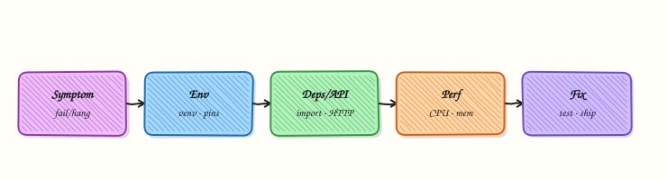

# Troubleshooting Python Automation

## Overview

When a DevOps Python job fails at 2 a.m., speed comes from a **checklist**, not guesswork. You fingerprint the environment, read the traceback to the failing line, classify the error (`NameError`, `ImportError`, swallowed exceptions), apply a minimal fix, and keep **before/after evidence** for the incident record.

In this tutorial you will start from a **deliberately broken** automation script, run a **triage helper** that captures the traceback plus an environment fingerprint, apply a focused fix, and prove the job succeeds afterward. This closes the **Python for Cloud & DevOps Engineers** tutorial track with a skill you will use on every team.

“Works on my machine” is an environment bug until proven otherwise. Wrong virtual environment (venv), missing dependency, typo in a variable name, or `except Exception: pass` that hides the real failure — each leaves a different fingerprint. Professionals capture evidence first, then change one thing at a time.

This is **Tutorial 27** in **Module 27: Troubleshooting** of the REBASH Academy **Python for Cloud & DevOps Engineers** series. It is written for DevOps, platform, and SRE engineers. By the end you will have a before/after evidence pack under `~/rebash-python/lab27`.

## Prerequisites

- [AI for DevOps — OpenAI, MCP, and LangChain](ai-for-devops-openai-mcp-langchain.md)
- [Logging and Debugging](logging-and-debugging.md) (helpful)
- [Error Handling and Exceptions](error-handling-and-exceptions.md) (helpful)
- Python 3.10+ on a practice machine
- Willingness to read full tracebacks (do not truncate the first time)

## Learning Objectives

By the end of this tutorial, you will be able to:

- [ ] Fingerprint Python version, platform, and working directory during an incident
- [ ] Capture a full traceback from a failing automation script
- [ ] Recognise and fix `NameError`, `ImportError`, and overly broad exception handling
- [ ] Re-run the job and produce clear before/after evidence
- [ ] Describe a production debugging order that avoids random changes

## Architecture

Troubleshooting is a loop: reproduce → fingerprint environment → capture traceback → classify → fix → verify → store evidence. The triage script automates the middle of that loop.



## Theory

### What it is

**Troubleshooting** means finding why automation failed and proving the fix. A **traceback** is Python’s stack of calls ending at the exception. An **environment fingerprint** records interpreter path, version, platform, virtualenv hints, and working directory so “works on my machine” becomes comparable data. Common failure classes in ops scripts:

| Exception | Typical meaning |
|-----------|-----------------|
| `NameError` | Typo or variable used before assignment |
| `ImportError` / `ModuleNotFoundError` | Missing package or wrong venv/`PYTHONPATH` |
| Broad `except:` / `except Exception: pass` | Real error hidden; job looks “fine” or fails late |

``` {.bash .ra-terminal title="Terminal"}
python3 -c 'import sys,platform; print(sys.version); print(platform.platform())'
```

### Why it matters

CI failures, cron jobs, and Kubernetes `CronJob` containers fail for the same Python reasons as laptops — plus different images and missing system libraries. Without a fingerprint, two engineers “fix” different things. Without a traceback file, chat messages lose the failing line. Without fixing bad `except` blocks, the next incident stays silent until customers notice.

### How it works

1. **Reproduce** — run the same command the job uses; do not start by rewriting the whole script.  
2. **Fingerprint** — Python version, executable path, cwd, optional `VIRTUAL_ENV`.  
3. **Capture** — run under a triage wrapper that writes traceback and fingerprint files.  
4. **Classify** — name error vs import vs logic vs permissions.  
5. **Fix minimally** — correct the name, install/import the module, or narrow exception handling.  
6. **Verify** — same command succeeds; keep before/after artefacts.

```python
import traceback
from pathlib import Path

def write_traceback(exc: BaseException, path: Path) -> None:
    path.write_text("".join(traceback.format_exception(type(exc), exc, exc.__traceback__)), encoding="utf-8")
```

Memory growth and slow jobs need profilers (`tracemalloc`, `cProfile`) after the crash class is ruled out. Start with the exception you have.

### Key concepts and comparisons

| Step | Question | Artefact |
|------|----------|----------|
| Reproduce | Does it fail the same way? | Command + exit code |
| Fingerprint | Which Python/where? | `env-fingerprint.txt` |
| Traceback | Which line/exception? | `traceback.txt` |
| Fix | Smallest correct change? | Diff / fixed file |
| Verify | Does the same command pass? | `after-run.stdout` |

| Anti-pattern | Prefer |
|--------------|--------|
| Rewrite without reading traceback | Read bottom frame first |
| `except Exception: pass` | Catch specific types; log and re-raise or exit non-zero |
| Debugging on production only | Minimal repro in lab/CI |
| Changing three things at once | One change, then re-test |

### Common pitfalls

- Reading only the top of the traceback (the useful line is usually near the **bottom**).  
- Fixing the wrong venv while CI uses another interpreter.  
- Swallowing exceptions so triage shows “success” with empty outputs.  
- Pasting secrets from env dumps into tickets.  
- Skipping the after-run proof when the clock is stressful.

## Hands-on Lab

### Objective

Under `~/rebash-python/lab27`, break-fix a small automation script: capture before evidence (traceback + fingerprint), apply fixes for `NameError` / `ImportError` / bad exception handling, and save after evidence.

### Prerequisites

- Python 3.10+
- Standard library only
- Practice directory (not a production checkout)

### Lab environment

Workspace: `~/rebash-python/lab27`

``` {.bash .ra-terminal title="Terminal"}
mkdir -p ~/rebash-python/lab27 && cd ~/rebash-python/lab27
set -euo pipefail
python3 --version | tee python-version.txt
```

!!! example "Expected output"
    `python-version.txt` shows Python 3.10+.


### Real-world scenario

A nightly inventory job started failing after a hurried change. On-call sees a non-zero exit in CI but the chat paste is incomplete. You recreate the broken script, run a triage helper to capture traceback and environment fingerprint, fix the defects, and attach before/after files to the incident ticket.

### Step-by-step tasks

#### Task 1 – Broken script and triage helper (before evidence)

Create a broken job and a triage runner that records fingerprint + traceback.

Create `broken_job.py`:

```python title="broken_job.py"
"""Intentionally broken automation for troubleshooting practice."""
from __future__ import annotations

import json
import sys
from pathlib import Path

# Bug 1: ImportError — module name is wrong (should be 'json', already imported).
# We additionally attempt a missing helper module below in load_rules().


def load_rules(path: Path) -> dict:
    try:
        # Bug 2: wrong exception handling — swallows real errors
        import rebash_missing_helper  # type: ignore  # noqa: F401
        text = path.read_text(encoding="utf-8")
        return json.loads(text)
    except Exception:
        # Hides ImportError and file errors — looks like "empty rules"
        return {}


def render_report(rules: dict) -> str:
    service = rules.get("service", "unknown")
    # Bug 3: NameError — typo in variable name
    return f"service={servcie} checks={rules.get('checks', [])}"


def main() -> int:
    rules_path = Path("rules.json")
    rules_path.write_text(
        json.dumps({"service": "payments-api", "checks": ["latency", "errors"]}),
        encoding="utf-8",
    )
    rules = load_rules(rules_path)
    print(render_report(rules))
    print("RESULT=ok")
    return 0


if __name__ == "__main__":
    raise SystemExit(main())
```

Create `triage.py`:

```python title="triage.py"
"""Capture environment fingerprint + traceback for a target script."""
from __future__ import annotations

import os
import platform
import runpy
import sys
import traceback
from pathlib import Path


def fingerprint(path: Path) -> None:
    lines = [
        f"python_executable={sys.executable}",
        f"python_version={sys.version.replace(chr(10), ' ')}",
        f"platform={platform.platform()}",
        f"cwd={Path.cwd()}",
        f"VIRTUAL_ENV={os.environ.get('VIRTUAL_ENV', '')}",
        f"sys_path_0={sys.path[0] if sys.path else ''}",
    ]
    path.write_text("\n".join(lines) + "\n", encoding="utf-8")


def main() -> int:
    if len(sys.argv) < 2:
        print("usage: triage.py <script.py>", file=sys.stderr)
        return 2
    target = Path(sys.argv[1]).resolve()
    out_dir = Path.cwd()
    fingerprint(out_dir / "env-fingerprint.txt")
    tb_path = out_dir / "traceback.txt"
    try:
        runpy.run_path(str(target), run_name="__main__")
        tb_path.write_text("NO_EXCEPTION\n", encoding="utf-8")
        print("TRIAGE_RESULT=ok")
        return 0
    except SystemExit as exc:
        code = exc.code if isinstance(exc.code, int) else 1
        if code == 0:
            tb_path.write_text("NO_EXCEPTION\n", encoding="utf-8")
            print("TRIAGE_RESULT=ok")
            return 0
        tb_path.write_text(
            "".join(traceback.format_exception(type(exc), exc, exc.__traceback__)),
            encoding="utf-8",
        )
        print(f"TRIAGE_RESULT=fail exit={code}")
        return code if code else 1
    except BaseException as exc:
        tb_path.write_text(
            "".join(traceback.format_exception(type(exc), exc, exc.__traceback__)),
            encoding="utf-8",
        )
        print(f"TRIAGE_RESULT=fail exc={type(exc).__name__}")
        return 1


if __name__ == "__main__":
    raise SystemExit(main())
```

Run:

``` {.bash .ra-terminal title="Terminal"}
cd ~/rebash-python/lab27
set -euo pipefail
set +e
python3 triage.py broken_job.py >before-triage.stdout 2>before-triage.stderr
before_rc=$?
set -e
test "$before_rc" -ne 0
grep -F 'TRIAGE_RESULT=fail' before-triage.stdout
test -s env-fingerprint.txt
test -s traceback.txt
cp traceback.txt traceback-before.txt
cp env-fingerprint.txt env-fingerprint-before.txt
grep -E 'NameError|ImportError|ModuleNotFoundError' traceback-before.txt
grep -F 'python_executable=' env-fingerprint-before.txt
```


!!! example "Expected output"
    triage fails; `traceback-before.txt` mentions `NameError` and/or import failure; fingerprint file is non-empty.


Note: because `load_rules` swallows exceptions, you may see **`NameError: name 'servcie' is not defined`** first (empty rules still reach `render_report`). That is intentional — bad `except` changes what you see.

#### Task 2 – Fix the script (imports, exceptions, NameError)


Create `fixed_job.py`:

```python title="fixed_job.py"
"""Fixed automation after triage (lab27)."""
from __future__ import annotations

import json
import sys
from pathlib import Path


def load_rules(path: Path) -> dict:
    if not path.is_file():
        raise FileNotFoundError(path)
    text = path.read_text(encoding="utf-8")
    data = json.loads(text)
    if not isinstance(data, dict):
        raise ValueError("rules root must be an object")
    return data


def render_report(rules: dict) -> str:
    service = rules.get("service", "unknown")
    checks = rules.get("checks", [])
    return f"service={service} checks={checks}"


def main() -> int:
    rules_path = Path("rules.json")
    if not rules_path.exists():
        rules_path.write_text(
            json.dumps({"service": "payments-api", "checks": ["latency", "errors"]}),
            encoding="utf-8",
        )
    try:
        rules = load_rules(rules_path)
        print(render_report(rules))
        print("RESULT=ok")
        return 0
    except (OSError, ValueError, json.JSONDecodeError) as exc:
        print(f"RESULT=fail error={type(exc).__name__}: {exc}", file=sys.stderr)
        return 1


if __name__ == "__main__":
    raise SystemExit(main())
```

Run:

``` {.bash .ra-terminal title="Terminal"}
cd ~/rebash-python/lab27
set -euo pipefail
python3 -m py_compile fixed_job.py
```

!!! example "Expected output"
    `fixed_job.py` compiles cleanly.


#### Task 3 – After evidence and comparison pack

``` {.bash .ra-terminal title="Terminal"}
cd ~/rebash-python/lab27
set -euo pipefail

python3 triage.py fixed_job.py | tee after-triage.stdout
grep -F 'TRIAGE_RESULT=ok' after-triage.stdout
grep -F 'NO_EXCEPTION' traceback.txt
cp traceback.txt traceback-after.txt

python3 fixed_job.py | tee after-run.stdout
grep -F 'service=payments-api' after-run.stdout
grep -F 'RESULT=ok' after-run.stdout

# Show that the old bug names are gone from the fixed source
! grep -F 'servcie' fixed_job.py
! grep -F 'rebash_missing_helper' fixed_job.py
! grep -F 'except Exception:' fixed_job.py

{
  echo "=== BEFORE (traceback head) ==="
  head -n 20 traceback-before.txt
  echo "=== AFTER ==="
  cat traceback-after.txt
  echo "=== FINGERPRINT ==="
  cat env-fingerprint-before.txt
} | tee before-after-summary.txt

tar -czf lab27-evidence.tgz \
  python-version.txt broken_job.py fixed_job.py triage.py \
  traceback-before.txt traceback-after.txt \
  env-fingerprint-before.txt \
  before-triage.stdout after-triage.stdout after-run.stdout \
  before-after-summary.txt rules.json
ls -l lab27-evidence.tgz | tee evidence-ls.txt
```

!!! example "Expected output"
    after triage is OK; `after-run.stdout` shows `RESULT=ok`; evidence archive exists.


### Validation steps

- [ ] Before triage fails and `traceback-before.txt` is non-empty
- [ ] `env-fingerprint-before.txt` includes `python_executable=` and `python_version=`
- [ ] `fixed_job.py` runs with `RESULT=ok` and correct service name
- [ ] `traceback-after.txt` contains `NO_EXCEPTION`
- [ ] `lab27-evidence.tgz` exists under `~/rebash-python/lab27`

### Common errors and fixes

| Error | Cause | Fix |
|-------|-------|-----|
| Before run shows only empty rules | Swallowed `ImportError` | Expected in Task 1; fix includes removing broad `except` |
| `NameError: servcie` | Typo left in place | Use `service` in `fixed_job.py` |
| Triage reports OK on broken script | Ran `fixed_job` too early | Re-copy broken script and re-run Task 1 |
| Fingerprint empty | Triage not run from lab dir | `cd ~/rebash-python/lab27` first |
| Still importing missing helper | Edited wrong file | Run `fixed_job.py`, not `broken_job.py` |

### Challenge exercise

Add a second broken mode: write `broken_job_v2.py` that raises `ImportError` **without** swallowing it (delete the broad `except`, keep the bad import). Run triage and confirm `traceback.txt` shows `ModuleNotFoundError` or `ImportError` for `rebash_missing_helper`. You do not need to keep v2 after capturing `traceback-import-before.txt`.

### Learning outcomes

- Captured traceback + environment fingerprint before changing code  
- Fixed NameError, bad import usage, and swallow-all exception handling  
- Proved success with after-run evidence  
- Packaged before/after artefacts for an incident ticket  

### Cleanup

``` {.bash .ra-terminal title="Terminal"}
cd ~/rebash-python/lab27
set -euo pipefail
rm -rf __pycache__
# Keep lab27-evidence.tgz for your portfolio if you want
```

## Validation

- [ ] Lab finished under `~/rebash-python/lab27/` with evidence archive
- [ ] You can explain the difference between fingerprint and traceback
- [ ] You know why `except Exception: pass` makes incidents harder
- [ ] You can describe a safe production debugging order

## Code Walkthrough

Production troubleshooting for Python automation usually follows this order:

1. **Reproduce with the same command** the scheduler/CI uses  
2. **Fingerprint** interpreter and cwd before changing code  
3. **Save the traceback** (full text, not a screenshot crop)  
4. **Fix the smallest root cause** (name, import, handler)  
5. **Re-run and attach before/after** to the ticket or pull request  

Profilers and debuggers come after the crash class is understood.

## Security Considerations

- Redact secrets when sharing fingerprints and env dumps  
- Do not paste production tokens into incident chat to “try the call again”  
- Prefer read-only diagnosis on production; mutate only with change control  
- Keep triage scripts from writing credentials to world-readable files  
- Treat customer data inside logs as sensitive when attaching evidence  

## Common Mistakes

!!! warning "Reading only the first lines of a traceback"
    The error type and line are usually at the **bottom**. **Fix:** scroll to the last frame before guessing.

!!! warning "Swallowing all exceptions"
    The job returns empty success and fails later elsewhere. **Fix:** catch specific errors; log; non-zero exit.

!!! warning "Changing the system Python instead of the job venv"
    Local `pip install` never reaches CI. **Fix:** compare `sys.executable` in the fingerprint to the pipeline image.

!!! warning "Declaring victory without an after-run artefact"
    The next on-call cannot see proof. **Fix:** save stdout/stderr and a `RESULT=ok` line.

## Best Practices

- Keep a triage script or CI “debug job” that dumps fingerprint + traceback  
- One fix per attempt; re-run the same command  
- Add a regression test for the bug class when practical  
- Document the root cause in the ticket in plain English  
- Prefer specific exception types and clear exit codes in automation  

## Troubleshooting

| Symptom | Likely cause | Fix |
|---------|--------------|-----|
| `ModuleNotFoundError` in CI only | Dependency not in image/lockfile | Pin and install in the pipeline venv |
| `NameError` after refactor | Renamed variable incompletely | Grep the old name; add a tiny unit test |
| Exit 0 but wrong output | Broad except returned defaults | Remove swallow; assert required keys |
| Different failure locally | Wrong cwd or Python | Match fingerprint fields to CI |
| Huge memory after fix | Unrelated leak | Use `tracemalloc` after crash is gone |

## Summary

Troubleshooting DevOps Python is a disciplined loop: **reproduce, fingerprint, capture traceback, fix minimally, prove after**. You close this course track ready to debug real jobs — next, revisit the [course overview](index.md) or plan practice with the [roadmap](roadmap.md).

## Interview Questions

**1. What is the first thing you capture when a scheduled Python job fails?**

??? success "Reveal answer"
    Reproduce with the **same command**, then save a **full traceback** and an **environment fingerprint** (Python executable, version, platform, cwd, virtualenv). That evidence prevents “works on my machine” debates and shows whether you are even on the same interpreter as CI.

**2. How do you read a Python traceback under pressure?**

??? success "Reveal answer"
    Start at the **bottom**: exception type, message, and the last frame (file and line). Then skim upward only as needed for call context. Do not begin rewriting from the first line of the dump.

**3. Why is `except Exception: pass` dangerous in automation?**

??? success "Reveal answer"
    It **hides the real failure**, often replacing it with empty defaults or a later confusing error. Operators lose the original traceback. Prefer specific exceptions, logging, and a non-zero exit so CI and cron alert correctly.

**4. How do you distinguish a local `ModuleNotFoundError` from a CI-only import failure?**

??? success "Reveal answer"
    Compare **`sys.executable`**, `VIRTUAL_ENV`, and installed packages (or lockfiles) from fingerprints in both environments. Local installs into the wrong Python never reach the pipeline image. Fix the image/lockfile, not only the laptop.

**5. What before/after evidence would you attach to an incident ticket?**

??? success "Reveal answer"
    Before: command, exit code, `traceback-before.txt`, `env-fingerprint.txt`. After: successful run stdout showing `RESULT=ok` (or equivalent), `traceback-after` / “NO_EXCEPTION”, and a one-paragraph root cause. Avoid pasting secrets.

**6. A job prints success but production state did not change — where do you look?**

??? success "Reveal answer"
    Look for **swallowed errors**, dry-run flags left on, wrong credentials that skip work, or idempotent early-returns. Check exit codes versus side effects, and verify the code path that performs the write still runs.

**7. How does troubleshooting automation differ from debugging a web app request?**

??? success "Reveal answer"
    Automation often runs **unattended** (cron/CI) with different env vars, images, and working directories. You rely more on artefacts (logs, fingerprints, exit codes) than interactive breakpoints. The method is the same — reproduce and evidence — but the runtime context is the usual culprit.

## Related Tutorials

- [Python for Cloud & DevOps – Overview](index.md)
- [AI for DevOps — OpenAI, MCP, and LangChain](ai-for-devops-openai-mcp-langchain.md) *(previous)*
- [Learning roadmap](roadmap.md) *(next / plan practice)*
- [Logging and Debugging](logging-and-debugging.md)
- [Production Engineering Patterns](production-engineering-patterns.md)
- [Error Handling and Exceptions](error-handling-and-exceptions.md)

## References

- [traceback — Print or retrieve a stack traceback](https://docs.python.org/3/library/traceback.html) — Python docs  
- [runpy — Locating and executing Python modules](https://docs.python.org/3/library/runpy.html) — Python docs  
- [The Python Debugger](https://docs.python.org/3/library/pdb.html) — `pdb`  
- [faulthandler](https://docs.python.org/3/library/faulthandler.html) — dump tracebacks on faults  
- Track index: [Python for Cloud & DevOps Engineers](index.md) · [Roadmap](roadmap.md)
