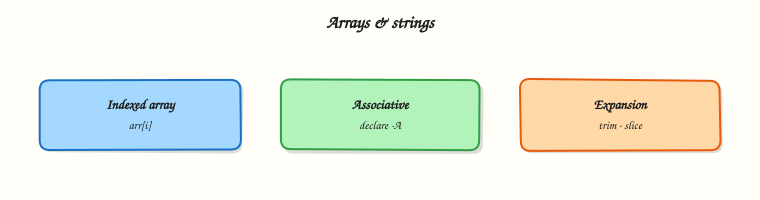

# Arrays and String Manipulation

## Overview

An **indexed array** stores a numbered list of values in one variable: hosts, files, or regions. You create it with `arr=(a b c)`, read elements with `"${arr[0]}"`, and expand all elements with `"${arr[@]}"`. Bash also has rich **string (parameter) expansions**: length `"{{ '${#var}' }}"`, slice `"${var:offset:length}"`, and replace `"${var/old/new}"`. Together, arrays and string ops let you build command lines and clean names without calling `sed` for every small change. In this tutorial you will build arrays, iterate them safely, practise slice/replace, and save proof under `~/rebash-shell/lab08`.

DevOps scripts often start with a list of targets. Putting that list in an array avoids brittle space-separated strings and makes `"${arr[@]}"` forwarding safe — the same idea as `"$@"` from the functions module. String expansions trim suffixes (`.log`), build backup names, and normalise environment names (`Dev` → `dev`) before talking to cloud APIs.

In production, the dangerous mistake is unquoted `${arr[@]}` or building lists with unquoted globs. Another trap is confusing `"${arr[*]}"` (joined) with `"${arr[@]}"` (separate words). Prefer arrays for lists of paths; prefer string expansion for single-value cleanup; move heavy parsing to `awk`/`jq` when the format is complex.

This is **Tutorial 8** in **Module 8: Arrays & Strings** of the REBASH Academy **Shell Scripting for DevOps Engineers** series. It is written for Linux administrators, DevOps engineers, Site Reliability Engineering (SRE), and platform engineers. By the end, you will manipulate lists and strings with patterns you can defend in review.

!!! note "MkDocs / macros and Bash `${…}`"
    Bash uses `${name}` for expansions (single braces after the dollar). The docs site macro engine treats double curly braces as template syntax. Keep all Bash examples in the `${…}` form shown on this page. If a page must show a double-brace sequence, break it up in prose or escape it per the MkDocs macros guidance so the build does not parse it as a template.

## Prerequisites

- [Functions, Parameters, and Locals](functions-parameters-and-locals.md)
- Bash 4.2+ on a practice Linux host (indexed arrays; associative arrays need Bash 4+)
- Comfort with quoting and `"$@"`

## Learning Objectives

By the end of this tutorial, you will be able to:

- [ ] Create and append to indexed arrays and read elements by index
- [ ] Expand all elements safely with `"${arr[@]}"` and contrast `"${arr[*]}"`
- [ ] Use string length, offset slice, and pattern replace expansions
- [ ] Iterate arrays in a `for` loop without word-splitting paths
- [ ] Save array/string evidence suitable for a change ticket

## Architecture

Arrays hold lists; string expansions transform single values; together they feed loops and commands. The diagram highlights that path.



## Theory

### What it is

**Indexed arrays** map integers starting at 0 to values:

```bash
hosts=(web01 web02 web03)
hosts+=("web04")
printf '%s\n' "${hosts[0]}"
printf 'count=%s\n' "{{ '${#hosts[@]}' }}"
```

**String expansions** work on any scalar variable (and on a single array element):

```bash
name="app.prod.log"
printf '%s\n' "{{ '${#name}' }}"
printf '%s\n' "${name:0:3}"
printf '%s\n' "${name%.log}"
printf '%s\n' "${name/prod/staging}"
```

### Why it matters

Space-separated strings break as soon as a path contains a space. Arrays keep elements separate. In Continuous Integration (CI) you often build an array of changed files or target environments, then pass `"${targets[@]}"` to a deployer. String replace and suffix removal keep naming rules in one place (for example strip `.yaml` before calling an API). Wrong quoting turns one path into many words and can delete or copy the wrong things.

### How it works

1. **Assign** — `arr=(one two "three four")` or `arr[0]=one`.
2. **Append** — `arr+=("next")`.
3. **Expand all** — `"${arr[@]}"` for separate words; `"${arr[*]}"` for one joined word.
4. **Length** — `"{{ '${#arr[@]}' }}"` is element count; `"{{ '${#var}' }}"` is string length.
5. **Slice / replace** — `"${var:offset:length}"`, `"${var/pattern/replacement}"`, `"${var//pattern/replacement}"` (all matches), prefix/suffix `${var#pat}` / `${var%pat}`.

```bash
files=("a b.log" "c.log")
for f in "${files[@]}"; do
  printf 'file=%s\n' "$f"
done

env_name="Prod-API"
norm="$(printf '%s' "$env_name" | tr '[:upper:]' '[:lower:]')"
# or pure Bash replace for simple cases:
short="${env_name%%-*}"
```

Associative arrays (`declare -A map`) store key/value pairs (Bash 4+). This module focuses on **indexed** arrays plus everyday string expansions; use associative maps when you need lookup by name.

### Key concepts and comparisons

| Expansion | Meaning |
|-----------|---------|
| `"${arr[@]}"` | All elements, separate words |
| `"${arr[*]}"` | All elements, joined into one word |
| `"{{ '${#arr[@]}' }}"` | Number of elements |
| `"${arr[i]}"` | Element at index `i` |
| `"{{ '${#var}' }}"` | String length |
| `"${var:offset:length}"` | Substring slice |
| `"${var/old/new}"` | Replace first match |
| `"${var//old/new}"` | Replace all matches |
| `"${var%suf}"` / `"${var#pre}"` | Remove shortest suffix / prefix |

| Prefer | Avoid |
|--------|-------|
| `"${arr[@]}"` in `for` / exec | Unquoted `${arr[@]}` |
| Arrays for path lists | `list="a b c"` then unquoted `$list` |
| String expansion for light cleanup | Giant nested expansions nobody can read |

### Common pitfalls

- Unquoted `${arr[@]}` re-splits elements that contain spaces.
- Using `"${arr[*]}"` when you meant to forward separate arguments.
- Off-by-one mistakes in `${var:offset:length}` (offset can be negative in Bash 4.2+ from the end).
- Forgetting that `${var/old/new}` replaces only the **first** match unless you use `//`.
- Treating arrays as portable to `dash` / plain POSIX `sh` — they are a Bash feature.

## Hands-on Lab

### Objective

Under `~/rebash-shell/lab08`, build a script that creates an indexed array of service names (including one with a space), iterates with `"${arr[@]}"`, applies string slice/replace to build artefact names, and writes evidence.

### Prerequisites

- Bash 4.2+, `chmod`, `tr`
- Write access under your home directory

### Lab environment

Workspace: `~/rebash-shell/lab08`

```bash
mkdir -p ~/rebash-shell/lab08/out
cd ~/rebash-shell/lab08
set -euo pipefail
bash --version | head -n1 | tee out/bash-version.txt
```

**Expected output:** `out/bash-version.txt` mentions `bash`.

### Real-world scenario

A deploy helper must accept a list of services, including one display name with a space for a legacy app, normalise environment labels (`Prod` → `prod`), and build backup filenames like `billing-prod-backup.tar`. You implement the list as an array and the name rules as string expansions, then attach proof for the release ticket.

### Step-by-step tasks

#### Task 1 – Indexed array create, append, and safe iterate

Create `array-demo.sh`:

```bash
#!/usr/bin/env bash
set -euo pipefail
outdir="./out"
mkdir -p "$outdir"

services=("billing" "auth api" "catalog")
services+=("payments")

printf 'count=%s\n' "{{ '${#services[@]}' }}" | tee "$outdir/array-count.txt"
: > "$outdir/services-listed.txt"
for s in "${services[@]}"; do
  printf 'svc=%s\n' "$s" | tee -a "$outdir/services-listed.txt"
done

# Joined form for contrast (one line)
printf 'joined=%s\n' "${services[*]}" | tee "$outdir/services-joined.txt"

grep -c '^svc=' "$outdir/services-listed.txt" | grep -qx 4
grep -F 'svc=auth api' "$outdir/services-listed.txt"
```

Run:

```bash
cd ~/rebash-shell/lab08
set -euo pipefail

chmod +x array-demo.sh
./array-demo.sh
```


**Expected output:** `array-count.txt` is `count=4`; `services-listed.txt` has four `svc=` lines including `svc=auth api` as one line.

#### Task 2 – String length, slice, and replace

Create `string-demo.sh`:

```bash
#!/usr/bin/env bash
set -euo pipefail
outdir="./out"
mkdir -p "$outdir"

filename="billing.Prod.log"
printf 'len=%s\n' "{{ '${#filename}' }}" | tee "$outdir/str-len.txt"
printf 'slice=%s\n' "${filename:0:7}" | tee "$outdir/str-slice.txt"
printf 'nosuffix=%s\n' "${filename%.log}" | tee "$outdir/str-nosuffix.txt"
printf 'replaced=%s\n' "${filename/Prod/prod}" | tee "$outdir/str-replace.txt"

base="${filename%%.*}"
env_part="${filename#*.}"
env_part="${env_part%%.*}"
env_norm="${env_part,,}"   # Bash 4+ lowercase
printf 'backup=%s-%s-backup.tar\n' "$base" "$env_norm" | tee "$outdir/backup-name.txt"

grep -qx 'slice=billing' "$outdir/str-slice.txt"
grep -qx 'replaced=billing.prod.log' "$outdir/str-replace.txt"
grep -qx 'backup=billing-prod-backup.tar' "$outdir/backup-name.txt"
```

Run:

```bash
cd ~/rebash-shell/lab08
set -euo pipefail

chmod +x string-demo.sh
./string-demo.sh
```


**Expected output:** slice starts with `billing`; replace lowercases only via pattern `Prod`→`prod`; backup name is `billing-prod-backup.tar`.

#### Task 3 – Combine array + strings and pack evidence

Create `build-names.sh`:

```bash
#!/usr/bin/env bash
set -euo pipefail
outdir="./out"
env_label="Prod"
env_norm="${env_label,,}"
services=("billing" "catalog" "payments")
: > "$outdir/artefact-names.txt"
for s in "${services[@]}"; do
  printf '%s-%s-backup.tar\n' "$s" "$env_norm" | tee -a "$outdir/artefact-names.txt"
done
grep -qx 'billing-prod-backup.tar' <(head -n1 "$outdir/artefact-names.txt")
test "$(wc -l <"$outdir/artefact-names.txt" | tr -d ' ')" -eq 3
```

Run:

```bash
cd ~/rebash-shell/lab08
set -euo pipefail

chmod +x build-names.sh
./build-names.sh

tar -czf out/arrays-evidence.tgz \
  out/bash-version.txt out/array-count.txt out/services-listed.txt \
  out/services-joined.txt out/str-len.txt out/str-slice.txt \
  out/str-nosuffix.txt out/str-replace.txt out/backup-name.txt \
  out/artefact-names.txt
ls -l out/arrays-evidence.tgz | tee out/evidence-ls.txt
```


**Expected output:** three artefact names; evidence archive is not empty.

### Validation steps

- [ ] Array iteration keeps `auth api` as a single element
- [ ] String replace / slice files match the expected values
- [ ] `artefact-names.txt` has three `*-prod-backup.tar` lines
- [ ] `out/arrays-evidence.tgz` exists

### Common errors and fixes

| Error | Cause | Fix |
|-------|-------|-----|
| `auth` and `api` on two lines | Unquoted expansion | Use `"${services[@]}"` and quote `"$s"` |
| `${var,,}` fails | Old Bash / `sh` | Use Bash 4+ shebang, or `tr` for lowercase |
| Replace did nothing | Wrong case / pattern | Patterns are case-sensitive; match exact text |
| `count=0` | Empty assignment / wrong script dir | Run from `~/rebash-shell/lab08` |
| Macro / build error on docs site | Accidental double-brace template syntax in page | Use Bash `${…}` only; escape per MkDocs macros guidance |

### Challenge exercise

Write `assoc-lite.sh` that uses a Bash **associative** array (`declare -A ports`) mapping `billing→8080`, `catalog→8081`, `payments→8082`, prints `service=port` lines to `out/ports.txt`, and asserts `billing` maps to `8080`. This stretch uses keys instead of only indexes.

### Learning outcomes

- Built and iterated indexed arrays with safe quoting
- Applied length, slice, suffix removal, and replace
- Combined arrays and string ops to build artefact names

### Cleanup

```bash
cd ~/rebash-shell/lab08
# Keep out/ for review, or: rm -rf ~/rebash-shell/lab08
```

## Validation

- [ ] Lab finished under `~/rebash-shell/lab08/` with evidence archive
- [ ] You can explain `"${arr[@]}"` vs `"${arr[*]}"`
- [ ] You can show one slice and one replace example from memory
- [ ] You know arrays are Bash-specific, not plain POSIX `sh`

## Code Walkthrough

Production use of **arrays and strings** usually follows this order:

1. **Collect** — build an array from args, files, or config  
2. **Normalise** — string expand each element (case, suffix, prefix)  
3. **Iterate** — `for x in "${arr[@]}"; do …; done`  
4. **Forward** — pass `"${arr[@]}"` into commands/functions  
5. **Evidence** — write the final list to a manifest file for CI  

When parsing JSON or YAML, switch to `jq`/`yq` (later module) instead of extreme string nesting.

## Security Considerations

- Do not trust array elements from users without validating path prefixes  
- Avoid building `eval` strings from array joins  
- Remember filenames can contain spaces and leading dashes — quote and use `--`  
- Do not log secret tokens while printing array dumps  
- Least privilege: this lab only needs home-directory writes  

## Common Mistakes

!!! warning "Unquoted `${arr[@]}`"
    Elements with spaces split into multiple words. **Fix:** always `"${arr[@]}"` and `"$element"`.

!!! warning "Using `"${arr[*]}"` to call a command"
    All args become one word. **Fix:** use `"${arr[@]}"` for exec/forwarding.

!!! warning "Assuming POSIX `sh` supports arrays"
    `dash` will fail. **Fix:** `#!/usr/bin/env bash` and document Bash 4.2+.

!!! warning "Forgetting `//` for replace-all"
    Only the first match changes. **Fix:** `"${var//old/new}"` when you need every match.

## Best Practices

- Prefer arrays over IFS-splitting for lists of paths  
- Keep string expansions readable — one transformation per line  
- Name arrays in plural (`hosts`, `files`) for clarity  
- Add ShellCheck in CI; it catches many quoting mistakes  
- Document Bash version minimum when using `${var,,}` or associative arrays  

## Troubleshooting

| Symptom | Likely cause | Fix |
|---------|--------------|-----|
| Extra words from one path | Missing quotes | Quote `"${arr[@]}"` / `"$s"` |
| `${var,,}` syntax error | Not Bash 4+ / wrong shell | Fix shebang; check `bash --version` |
| Index empty | Sparse array / wrong index | Print `"{{ '${#arr[@]}' }}"` and indexes |
| Replace no-op | Pattern mismatch | Print the value before/after; check case |
| Joined line surprises | Used `*` instead of `@` | Pick `@` vs `*` deliberately |

## Summary

Indexed arrays store lists without losing spaces; string expansions clean and reshape single values. Expand with `"${arr[@]}"`, slice and replace with `${var…}` forms, and keep evidence of the final names. Next, apply these skills to [File Operations in Shell](file-operations-in-shell.md).

## Interview Questions

**1. How do you iterate an array of files that may contain spaces?**

??? success "Reveal answer"
    Store each path as its own element and loop with `for f in "${files[@]}"; do …; done`, always quoting `"$f"`. Never iterate `for f in $files` or unquoted `${files[@]}`. This mirrors the `"$@"` rule for function arguments.

**2. What is the difference between `"${arr[@]}"` and `"${arr[*]}"`?**

??? success "Reveal answer"
    **`"${arr[@]}"`** expands to separate words (one per element). **`"${arr[*]}"`** joins elements into a **single** word using the first character of `IFS`. Use `@` when calling commands; use `*` when you intentionally want one string (for example a display line).

**3. How do you append to an indexed array and get its length?**

??? success "Reveal answer"
    Append with `arr+=("new element")`. Length (element count) is `"{{ '${#arr[@]}' }}"`. Do not confuse that with `"{{ '${#arr}' }}"`, which is not the portable way to count elements — use `"{{ '${#arr[@]}' }}"`.

**4. Show how you would strip a `.log` suffix and replace `Prod` with `prod` in Bash.**

??? success "Reveal answer"
    Example: `name="billing.Prod.log"` then `"${name%.log}"` → `billing.Prod`, and `"${name/Prod/prod}"` → `billing.prod.log`. For lowercase of a whole string in Bash 4+, `"${name,,}"` works. Prefer clear intermediate variables over one unreadable nested expansion.

**5. Why are Bash arrays a problem if your shebang is `#!/bin/sh` on Ubuntu?**

??? success "Reveal answer"
    On Ubuntu, `/bin/sh` is often **dash**, which does not support arrays. The script fails at `arr=(…)`. Use `#!/usr/bin/env bash` (or another Bash path) and state Bash 4.2+ in the README when you rely on arrays or `${var,,}`.

**6. When should you stop using string expansion and switch to `awk` or `jq`?**

??? success "Reveal answer"
    Switch when the input is a real structured format (CSV with quotes, JSON, YAML) or when expansions nest so deep that reviewers cannot see the rule. String expansion is perfect for suffixes, prefixes, and simple replace; parsers are safer for structured data.

**7. How would you prove an array kept a multi-word element intact in a ticket?**

??? success "Reveal answer"
    Write one `svc=…` line per element to a file and show that `svc=auth api` appears on a **single** line, with `grep -c '^svc='` equal to the element count. That evidence shows quoting was correct — better than a verbal claim.

## Related Tutorials

- [Shell Scripting for DevOps Engineers – Overview](index.md)
- [Functions, Parameters, and Locals](functions-parameters-and-locals.md) *(previous)*
- [File Operations in Shell](file-operations-in-shell.md) *(next)*
- [Text Processing in Shell Scripts](text-processing-in-shell-scripts.md)

## References

- [Bash arrays (GNU Bash manual)](https://www.gnu.org/software/bash/manual/html_node/Arrays.html)  
- [Shell parameter expansion](https://www.gnu.org/software/bash/manual/html_node/Shell-Parameter-Expansion.html)  
- [ShellCheck](https://www.shellcheck.net/)  
- Track index: [Shell Scripting for DevOps Engineers](index.md)
