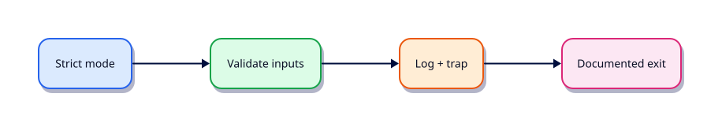

# Error Handling, Logging, and Debugging

## Overview

Silent success is how monitors lie. Make failure audible with strict mode, traps, logs, and a clear exit taxonomy.

This is **Tutorial 16** in **Module 16: Error Handling** of the REBASH Academy **Shell Scripting for DevOps Engineers** series — written for Linux administrators, DevOps engineers, SREs, and platform engineers who automate production hosts with Bash.

## Prerequisites

- Scheduling — cron, at, and systemd Timers
- Bash 4.2+ on Linux (WSL2/VM/cloud)

## Learning Objectives

By the end of this tutorial, you will be able to:

- [ ] Apply the core ideas of “Error Handling, Logging, and Debugging” in a real ops script
- [ ] Use `set -euo pipefail` as the production default
- [ ] Use quoted expansions and clear stderr diagnostics
- [ ] Produce meaningful exit codes for automation consumers
- [ ] Debug behaviour with `bash -x` when something fails
- [ ] Relate this topic to day-to-day Linux admin and DevOps work

## Architecture

Ops scripts sit between humans/automation and system tools. This topic’s control points are shown below.



## Theory

### Exit Codes

Map failures to documented integers. Propagate child failures; do not `|| true` away errors you care about.

### Trap

Use `trap` for cleanup and to translate signals into known exit codes. Pair with `set -E` if you need `ERR` traps inside functions.

### Defensive Programming

- `set -euo pipefail`
- Quote expansions
- Validate args early
- Prefer absolute paths under schedulers
- Fail closed on missing dependencies (`command -v jq >/dev/null`)

### Logging

Log to stderr with timestamps and levels (`INFO`, `WARN`, `ERROR`). Reserve stdout for data or `RESULT` lines consumers can parse.

### Debugging

`bash -x script.sh`, `PS4='+${BASH_SOURCE}:${LINENO}: '`, and temporary `set -x` around suspect blocks. Remove noisy traces before shipping.

## Hands-on Lab

Create a workspace for this tutorial.

```bash
mkdir -p ~/rebash-shell/lab16 && cd ~/rebash-shell/lab16
```

**Focus:** exit taxonomy; ERR/EXIT traps; log levels; bash -x drill

### Step 1 – Skeleton

```bash
cat > lab.sh << 'EOF'
#!/usr/bin/env bash
set -euo pipefail
echo "lab16 error-handling-logging-and-debugging on $(hostname -s)"
EOF
chmod +x lab.sh
./lab.sh
```

### Step 2 – Logging and debug

```bash
cat > robust.sh << 'EOF'
#!/usr/bin/env bash
set -euo pipefail
log() { printf '[%s] %s\n' "$1" "$2" >&2; }
die() { log ERROR "$1"; exit "${2:-1}"; }
trap 'log ERROR "failed at line $LINENO"' ERR
[[ $# -ge 1 ]] || die "usage: $0 <name>" 2
log INFO "hello $1"
echo "RESULT ok"
EOF
chmod +x robust.sh
./robust.sh lab16
bash -x ./robust.sh lab16 2>&1 | tail -n 15
```

### Final step – Trace and cleanup note

```bash
bash -x ./lab.sh 2>&1 | tail -n 20 || true
# keep ~/rebash-shell for later labs
```

## Validation

- [ ] Lab commands run under `~/rebash-shell/lab16/`
- [ ] You can explain each Theory heading in your own words
- [ ] Failure path exits non-zero and prints diagnostics to stderr (where applicable)
- [ ] You can relate this topic to a real DevOps or Linux admin task

## Code Walkthrough

Production Bash for **Error Handling, Logging, and Debugging** always combines:

1. A clear shebang (`#!/usr/bin/env bash`)
2. Strict mode near the top (`set -euo pipefail`) from Module 2 onward
3. Quoted expansions and explicit tests
4. Functions with `local` for reusable behaviour
5. Documented exit codes and stderr logging

Keep scripts short enough to review in a single merge request. When logic grows (complex JSON APIs, heavy state), hand off to Python and keep Bash as the launcher.

## Security Considerations

- Treat all external input (args, files, env) as untrusted until validated
- Never log secrets; prefer masked CI variables and secret stores
- Prefer least privilege — do not require root for file-local tasks
- Avoid `eval` and unquoted expansions in destructive commands
- Validate paths stay under an allow-listed root before `rm` or overwrite

## Common Mistakes

!!! warning "Skipping strict mode"
    Cron and CI hide failures that an interactive terminal would show. **Fix:** start with `set -euo pipefail` from Module 2 onward.

!!! warning "Unquoted path expansions"
    Spaces and globs rewrite your command line. **Fix:** always `"$path"` / `"$@"`.

!!! warning "Assuming interactive PATH"
    Aliases and fancy PATH entries disappear under schedulers. **Fix:** set `PATH` or use absolute paths.

## Best Practices

- One purpose per script; compose with functions or small binaries
- Log to stderr; reserve stdout for data or RESULT lines
- Idempotent behaviour where scheduling may overlap
- Pair every new script with a failing-path test you actually run
- Run ShellCheck in CI before merging automation

## Troubleshooting

| Symptom | Likely cause | Fix |
|---------|--------------|-----|
| Works in terminal, fails in cron | PATH / cwd / env | Fingerprint env; set PATH |
| `unbound variable` | `set -u` | Provide defaults or export vars |
| Pipeline “succeeds” incorrectly | Missing `pipefail` | `set -o pipefail` |
| `[[` unexpected operator | Running under `sh`/dash | Fix shebang to Bash |

## Summary

**Error Handling, Logging, and Debugging** is a core skill for Linux admins and DevOps engineers automating real hosts and pipelines. Practise the lab until the failure path is as familiar as the happy path, then continue the track.

## Interview Questions

1. How does this topic show up in production Linux administration or CI?
2. What failure mode appears if you ignore quoting or strict mode here?
3. How would you test this behaviour under a minimal cron-like environment?
4. When would you move this logic out of Bash into Python or another tool?
5. What exit code contract would you document for teammates?

!!! tip "Sample answer — question 2"
    Unquoted expansions and missing `pipefail` create silent or partial failures — especially under cron — that look healthy in monitoring until data is wrong.

## Related Tutorials

- [Shell Scripting for DevOps Engineers – Category Overview](index.md)
- [Scheduling — cron, at, and systemd Timers](scheduling-cron-at-and-timers.md) *(previous)*
- [Production Shell Scripting](production-shell-scripting.md) *(next)*
- [Learning Paths](../learning-paths/index.md)

## References

- [GNU Bash manual](https://www.gnu.org/software/bash/manual/)
- [POSIX shell command language](https://pubs.opengroup.org/onlinepubs/9699919799/utilities/V3_chap02.html)
- [ShellCheck](https://www.shellcheck.net/)
- Track index: [Shell Scripting for DevOps Engineers](index.md)
