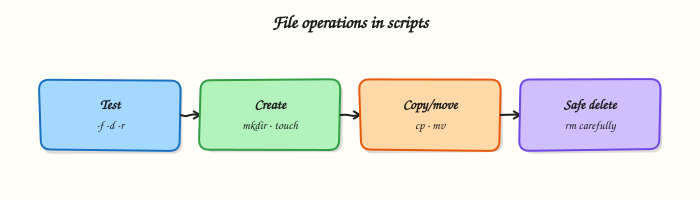

# File Operations in Shell

## Overview

Most ops scripts **create folders**, **find files**, **copy or move** them, and clean up **temporary files**. Bash does not replace `cp`, `mv`, `find`, or `mkdir` — it orchestrates them safely. You will use `mkdir -p`, guarded `find`, `cp`/`mv` with checks, **`mktemp`** for unique temp paths, and an optional **lock file** so two cron jobs do not run the same work at once. Practice stays under `~/rebash-shell/lab09` so you never touch production data by mistake.

On jump servers and Continuous Integration (CI) agents, unsafe file ops are a common outage class: `mv` over an unexpected path, `rm -rf` on a variable that expanded empty, or two backups writing the same destination. Site Reliability Engineering (SRE) and platform teams expect scripts that create parents with `mkdir -p`, write to temp files then rename, and prove what was copied.

In production, prefer: allow-listed base directories, `mktemp` under `$TMPDIR`, `mv` for atomic publish when on the same filesystem, and a lock (for example `flock` or a lock directory) for overlapping schedules. Never invent temp names with fixed strings like `/tmp/myjob.txt` on a shared host.

This is **Tutorial 9** in **Module 9: File Operations** of the REBASH Academy **Shell Scripting for DevOps Engineers** series. It is written for Linux administrators, DevOps engineers, SRE, and platform engineers. By the end, you will have a small staging-and-publish script with evidence for a change ticket.

## Prerequisites

- [Arrays and String Manipulation](arrays-and-string-manipulation.md)
- Bash 4.2+ and coreutils (`mkdir`, `cp`, `mv`, `find`, `mktemp`)
- Optional: `flock` (from `util-linux`, present on Ubuntu)

## Learning Objectives

By the end of this tutorial, you will be able to:

- [ ] Create directory trees with `mkdir -p` and verify with tests
- [ ] Use `find` with clear roots and predicates (not unbounded `/` searches)
- [ ] Copy and move files safely with existence checks and `--` for odd names
- [ ] Create temp files/dirs with `mktemp` and clean them up
- [ ] Optionally take a lock file/`flock` so concurrent runs do not clash

## Architecture

Scripts discover files, stage work in temp space, then publish into a target tree — optionally under a lock so only one writer runs.



## Theory

### What it is

**Directory ops** — `mkdir -p path` creates parents as needed; `[[ -d path ]]` tests directories.  
**Discovery** — `find ROOT -type f -name '*.log'` lists matches under a known root.  
**Copy / move** — `cp` duplicates; `mv` renames or relocates (atomic replace when staying on one filesystem).  
**Temp files** — `mktemp` / `mktemp -d` create unique names.  
**Locks** — `flock` or exclusive `mkdir` lockdirs serialise jobs.

```bash
base="$HOME/rebash-shell/lab09"
mkdir -p "$base/staging" "$base/published"
tmp="$(mktemp -d "$base/tmp.XXXXXX")"
```

### Why it matters

CI artefacts, config drops, and backup jobs are all file choreography. A script that writes directly to the final path can leave a half-written file if it is killed. A job without a lock can interleave two writers. `find /` without limits can load a server and touch files you must not change. Safe patterns keep automation predictable and reviewable.

### How it works

1. **Fix a base directory** — never trust a relative path from an unknown cwd alone; `cd` to the lab root or use absolute paths.
2. **`mkdir -p`** — create staging and destination trees.
3. **`find`** — start from a narrow root; filter with `-type`, `-name`, `-mtime` as needed.
4. **Stage then publish** — write under `mktemp -d`, then `mv` into place.
5. **Lock (optional)** — wrap the critical section with `flock` or a lock directory.

```bash
src_root="./incoming"
find "$src_root" -type f -name '*.conf' -print

tmpdir="$(mktemp -d)"
cp -- "$src" "$tmpdir/file.conf"
mv -- "$tmpdir/file.conf" "./published/file.conf"
rmdir "$tmpdir" 2>/dev/null || rm -rf "$tmpdir"
```

**Safe `mv`/`cp` habits:** quote paths; use `--` before paths that may start with `-`; test sources with `[[ -f ]]`; avoid `cp` to a path you have not created parents for (`mkdir -p` first).

### Key concepts and comparisons

| Tool | Role | Caution |
|------|------|---------|
| `mkdir -p` | Create tree | Still check you are under the intended base |
| `find` | Discover | Bound the root; avoid `find /` in labs |
| `cp` | Duplicate | Overwrites by default if target exists |
| `mv` | Rename / publish | Cross-device `mv` copies then deletes |
| `mktemp` | Unique temp | Always clean up in `trap` for long scripts |
| `flock` | Serialise | Needs a lock file path both jobs share |

| Pattern | Prefer when |
|---------|-------------|
| Write temp + `mv` | Publishing a config that readers must see whole |
| `cp -a` | Preserving mode/times for backups |
| Lock file | Cron overlap risk |

### Common pitfalls

- Using a fixed `/tmp/job.txt` name on a shared host (collisions / symlink attacks).
- Running `find /` or unquoted variables in `rm -rf`.
- Forgetting `mkdir -p` before writing a nested destination.
- Relying on `mv` atomicity across filesystems (it is not atomic then).
- Leaving temp directories behind when the script fails mid-way (use `trap`).

## Hands-on Lab

### Objective

Under `~/rebash-shell/lab09`, create an incoming tree, find `*.conf` files, stage them with `mktemp -d`, publish with `mv`, take an optional `flock`, and pack evidence.

### Prerequisites

- Bash, `find`, `mktemp`, `cp`, `mv`
- `flock` recommended (`util-linux` on Ubuntu)

### Lab environment

Workspace: `~/rebash-shell/lab09`

```bash
mkdir -p ~/rebash-shell/lab09/{incoming,published,out}
cd ~/rebash-shell/lab09
set -euo pipefail
bash --version | head -n1 | tee out/bash-version.txt
command -v mktemp | tee out/mktemp-path.txt
```

**Expected output:** `out/bash-version.txt` and `out/mktemp-path.txt` are non-empty.

### Real-world scenario

A small app drops config snippets into `incoming/`. Your job must copy only `*.conf` files into `published/`, never two runs at once, and leave a manifest for the change ticket. Temps must be unique so parallel agents on the same host do not clash.

### Step-by-step tasks

#### Task 1 – Seed incoming files and discover with `find`

```bash
cd ~/rebash-shell/lab09
set -euo pipefail

mkdir -p incoming/app-a incoming/app-b
printf 'port=8080\n' > incoming/app-a/app.conf
printf 'port=8081\n' > incoming/app-b/app.conf
printf 'ignore me\n' > incoming/app-a/readme.txt

find ./incoming -type f -name '*.conf' | sort | tee out/found-confs.txt
test "$(wc -l <out/found-confs.txt | tr -d ' ')" -eq 2
grep -F 'app.conf' out/found-confs.txt
! grep -F 'readme.txt' out/found-confs.txt
```

**Expected output:** exactly two `*.conf` paths listed; `readme.txt` absent.

#### Task 2 – Stage with `mktemp`, safe `cp`/`mv`, publish

Create `publish-confs.sh`:

```bash
#!/usr/bin/env bash
set -euo pipefail
root="$(cd "$(dirname "$0")" && pwd)"
cd "$root"
mkdir -p published out

tmpdir="$(mktemp -d "$root/out/stage.XXXXXX")"
cleanup() { rm -rf "$tmpdir"; }
trap cleanup EXIT

: > out/published-manifest.txt
while IFS= read -r -d '' f; do
  base="$(basename "$(dirname "$f")")"
  dest_dir="published/$base"
  mkdir -p "$dest_dir"
  stage="$tmpdir/${base}.conf"
  cp -- "$f" "$stage"
  mv -- "$stage" "$dest_dir/app.conf"
  printf '%s -> %s\n' "$f" "$dest_dir/app.conf" | tee -a out/published-manifest.txt
done < <(find ./incoming -type f -name '*.conf' -print0)

test -f published/app-a/app.conf
test -f published/app-b/app.conf
grep -F 'app-a' out/published-manifest.txt
```

Run:

```bash
cd ~/rebash-shell/lab09
set -euo pipefail

chmod +x publish-confs.sh
./publish-confs.sh
```


**Expected output:** `published/app-a/app.conf` and `published/app-b/app.conf` exist; manifest lists both mappings; temp stage directory is removed by `trap`.

#### Task 3 – Optional lock with `flock` and evidence pack

Create `locked-publish.sh`:

```bash
#!/usr/bin/env bash
set -euo pipefail
root="$(cd "$(dirname "$0")" && pwd)"
cd "$root"
mkdir -p out
lockfile="$root/out/publish.lock"

if ! command -v flock >/dev/null 2>&1; then
  printf 'flock_missing=1\n' | tee out/lock-status.txt
  exit 0
fi

# Hold the lock while we re-run publish (serialised section)
(
  flock -n 9 || { printf 'lock_busy=1\n' | tee out/lock-status.txt; exit 1; }
  printf 'lock_acquired=1\n' | tee out/lock-status.txt
  ./publish-confs.sh
) 9>"$lockfile"

grep -q 'lock_acquired=1' out/lock-status.txt
```

Run:

```bash
cd ~/rebash-shell/lab09
set -euo pipefail

chmod +x locked-publish.sh
./locked-publish.sh

tar -czf out/fileops-evidence.tgz \
  out/bash-version.txt out/mktemp-path.txt out/found-confs.txt \
  out/published-manifest.txt out/lock-status.txt \
  published/app-a/app.conf published/app-b/app.conf
ls -l out/fileops-evidence.tgz | tee out/evidence-ls.txt
```


**Expected output:** `lock-status.txt` shows `lock_acquired=1` (or `flock_missing=1` if `flock` is unavailable); evidence archive is not empty.

### Validation steps

- [ ] `find` lists exactly the two `*.conf` files under `incoming/`
- [ ] `publish-confs.sh` creates `published/app-a/app.conf` and `published/app-b/app.conf`
- [ ] Temp stage directories under `out/stage.*` are gone after a successful run
- [ ] Evidence archive exists under `~/rebash-shell/lab09/out/`

### Common errors and fixes

| Error | Cause | Fix |
|-------|-------|-----|
| `No such file or directory` on publish | Missing `mkdir -p` | Create `published/$base` first |
| `find` picks `readme.txt` | Wrong `-name` | Use `-name '*.conf'` |
| Temp dirs left behind | No `trap` / failed early | `trap cleanup EXIT` |
| `flock: command not found` | Minimal image | Install `util-linux` or skip lock path |
| Overwrote wrong file | Relative cwd drift | `cd` to script root as in the lab |

### Challenge exercise

Write `safe-backup.sh` that: creates `backup/` with `mkdir -p`, copies every published `app.conf` to `backup/<app>-app.conf.$(date -u +%Y%m%d)`, uses `mktemp -d` for staging, and refuses to run if `out/publish.lock` is already held (`flock -n` failure must exit `1` with a clear stderr message). Prove with a second listing in `out/backup-manifest.txt`.

### Learning outcomes

- Discovered files with a bounded `find`
- Staged with `mktemp` and published with `mv`
- Applied an optional `flock` and packed ticket evidence

### Cleanup

```bash
cd ~/rebash-shell/lab09
set -euo pipefail
rm -f out/publish.lock
# Keep published/ and out/ for review, or:
# rm -rf ~/rebash-shell/lab09
```

## Validation

- [ ] Lab finished under `~/rebash-shell/lab09/` with evidence archive
- [ ] You can explain why `mktemp` beats fixed `/tmp` names
- [ ] You can explain stage-then-`mv` for safer publishes
- [ ] You know one risk of unbounded `find /` or unlocked cron overlap

## Code Walkthrough

Production **file operations** in shell usually follow this order:

1. **Resolve a base directory** — script root or explicit `--root`  
2. **Create destinations** — `mkdir -p` before writes  
3. **Discover narrowly** — `find` under that base only  
4. **Stage → publish** — `mktemp` then `mv` / checked `cp`  
5. **Serialise if needed** — `flock` around the critical section; clean temps with `trap`  

Long-running agents should also log every source→destination pair to a manifest.

## Security Considerations

- Never `rm -rf` on an unvalidated variable; refuse empty roots  
- Prefer `mktemp` over predictable temp names on multi-user hosts  
- Do not follow unexpected symlinks into sensitive trees — consider `find -P` / careful `cp -P` policy  
- Lock files should live on local disk, not on broken network mounts when possible  
- Least privilege: this lab needs only home-directory write access  

## Common Mistakes

!!! warning "Fixed temp filenames in `/tmp`"
    Parallel jobs and symlink tricks collide. **Fix:** `mktemp` / `mktemp -d` and private directories under the job root when possible.

!!! warning "`find /` in a maintenance script"
    Huge I/O and accidental matches. **Fix:** start from an allow-listed root.

!!! warning "Writing the final file in place"
    Readers see partial content. **Fix:** write temp, then `mv` into place on the same filesystem.

!!! warning "No lock on overlapping cron"
    Two writers corrupt output. **Fix:** `flock` or an exclusive lock directory.

## Best Practices

- Manifest every publish (`source -> dest`) for tickets and audits  
- Use `--` before arbitrary path arguments  
- `trap` cleanup for temp directories  
- Prefer absolute paths after resolving script location  
- Test overwrite behaviour explicitly (`cp`/`mv` onto existing files)  

## Troubleshooting

| Symptom | Likely cause | Fix |
|---------|--------------|-----|
| Destination missing | No `mkdir -p` | Create parent dirs first |
| `find` returns nothing | Wrong root / pattern | Check cwd and `-name` |
| Cross-device `mv` slow / non-atomic | Different filesystems | Stage on the destination filesystem |
| Lock always busy | Stale process / crashed holder | Inspect holders; remove stale lock only when safe |
| Temps accumulate | Missing `trap` | Add `EXIT` cleanup |

## Summary

File operations in shell are about **safe choreography**: narrow `find`, `mkdir -p`, `mktemp`, checked `cp`/`mv`, and locks when jobs overlap. Prove every publish with a manifest. Next, parse file contents with [Text Processing in Shell Scripts](text-processing-in-shell-scripts.md).

## Interview Questions

**1. Why is `mktemp` safer than redirecting to `/tmp/myjob.conf`?**

??? success "Reveal answer"
    Fixed names collide when two jobs run together and can be targeted with symlink attacks on shared `/tmp`. **`mktemp`** creates a unique name with safe permissions. Always clean up with `trap` so failures do not leave sensitive leftovers.

**2. How does write-to-temp then `mv` improve config publishes?**

??? success "Reveal answer"
    Readers either see the old file or the new file, not a half-written file, when `mv` is on the **same filesystem** (rename is atomic). Writing directly to the live path can expose partial content if the process is killed. Cross-filesystem `mv` copies then deletes — plan staging on the destination filesystem when atomicity matters.

**3. What makes a `find` invocation dangerous in production scripts?**

??? success "Reveal answer"
    Unbounded roots (`/`), missing `-type` filters, or acting on results with `rm` without a dry-run can touch the wrong files and create heavy disk load. Prefer an allow-listed root, clear predicates (`-name`, `-mtime`), and a manifest before destructive actions.

**4. How would you stop two cron invocations from publishing at once?**

??? success "Reveal answer"
    Wrap the critical section with **`flock`** on a lock file, or use an exclusive `mkdir` lockdir. If the lock cannot be acquired, exit non-zero (or skip with a logged reason). Do not rely on “the job is usually fast enough”.

**5. Why use `cp -- "$src" "$dest"` / `mv -- …`?**

??? success "Reveal answer"
    Paths can start with `-` and be interpreted as options. **`--`** ends option parsing so the next argument is always a path. Combine with quoting for spaces.

**6. What should a publish script leave for a change ticket?**

??? success "Reveal answer"
    A **manifest** of source→destination, timestamps, tool versions if relevant, and proof that unexpected files (for example `readme.txt`) were ignored. An evidence `tar` of manifests plus sample outputs is enough for many reviews.

**7. When is `cp -a` preferable to plain `cp`?**

??? success "Reveal answer"
    When you need to preserve mode, ownership (if permitted), and timestamps — typical for backups or promoting a tree. For single config files where you intentionally set mode afterward, plain `cp` plus `chmod` may be clearer. State the choice in the script comments.

## Related Tutorials

- [Shell Scripting for DevOps Engineers – Overview](index.md)
- [Arrays and String Manipulation](arrays-and-string-manipulation.md) *(previous)*
- [Text Processing in Shell Scripts](text-processing-in-shell-scripts.md) *(next)*
- [Linux Admin Automation](linux-admin-automation.md)

## References

- [`mktemp(1)`](https://manpages.ubuntu.com/manpages/jammy/en/man1/mktemp.1.html) — Ubuntu man-pages  
- [`find(1)`](https://manpages.ubuntu.com/manpages/jammy/en/man1/find.1.html)  
- [`flock(1)`](https://manpages.ubuntu.com/manpages/jammy/en/man1/flock.1.html)  
- Track index: [Shell Scripting for DevOps Engineers](index.md)
