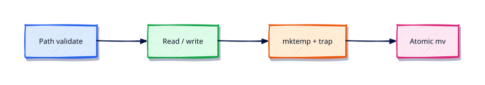

# File Operations in Shell

## Overview

Backup jobs, lock files, and config rewrites all touch the filesystem. Do it with tests, temps, and cleanup traps.

This is **Tutorial 9** in **Module 9: File Operations** of the REBASH Academy **Shell Scripting for DevOps Engineers** series — written for Linux administrators, DevOps engineers, SREs, and platform engineers who automate production hosts with Bash.

## Prerequisites

- Arrays and String Manipulation
- Bash 4.2+ on Linux (WSL2/VM/cloud)

## Learning Objectives

By the end of this tutorial, you will be able to:

- [ ] Apply the core ideas of “File Operations in Shell” in a real ops script
- [ ] Use `set -euo pipefail` as the production default
- [ ] Use quoted expansions and clear stderr diagnostics
- [ ] Produce meaningful exit codes for automation consumers
- [ ] Debug behaviour with `bash -x` when something fails
- [ ] Relate this topic to day-to-day Linux admin and DevOps work

## Architecture

Ops scripts sit between humans/automation and system tools. This topic’s control points are shown below.



## Theory

### Reading Files

```bash
while IFS= read -r line; do
  printf '%s\n' "$line"
done <"$file"
```

Prefer `mapfile`/`readarray` for modest files. Avoid `for line in $(cat file)` — it splits on IFS.

### Writing Files

`printf ... >"$out"` truncates; `>>` appends. Write to a temp file then `mv` for atomic replace on the same filesystem.

### Temporary Files

```bash
tmp=$(mktemp)
tmpdir=$(mktemp -d)
trap 'rm -rf "$tmp" "$tmpdir"' EXIT
```

Never hard-code `/tmp/myjob` — collisions and symlink attacks follow.

### File Tests

`-e` exists, `-f` regular file, `-d` directory, `-r`/`-w`/`-x` permissions, `-s` non-empty, `-L` symlink.

### Directory Operations

`mkdir -p`, `find`, `install -d`, `rsync -a` for trees. Validate paths stay under an allowed root before `rm -rf`.

## Hands-on Lab

Create a workspace for this tutorial.

```bash
mkdir -p ~/rebash-shell/lab09 && cd ~/rebash-shell/lab09
```

**Focus:** read/write atomically; mktemp + trap; file tests; safe mkdir

### Step 1 – Skeleton

```bash
cat > lab.sh << 'EOF'
#!/usr/bin/env bash
set -euo pipefail
echo "lab09 file-operations-in-shell on $(hostname -s)"
EOF
chmod +x lab.sh
./lab.sh
```

### Step 2 – Safe file ops

```bash
cat > files.sh << 'EOF'
#!/usr/bin/env bash
set -euo pipefail
root=$PWD/data
mkdir -p "$root"
tmp=$(mktemp)
trap 'rm -f "$tmp"' EXIT
printf 'line1\nline2\n' >"$tmp"
out=$root/out.txt
cp "$tmp" "$out.tmp"
mv "$out.tmp" "$out"
[[ -f "$out" && -s "$out" ]] || exit 4
while IFS= read -r line; do echo "got=$line"; done <"$out"
EOF
chmod +x files.sh
./files.sh
```

### Final step – Trace and cleanup note

```bash
bash -x ./lab.sh 2>&1 | tail -n 20 || true
# keep ~/rebash-shell for later labs
```

## Validation

- [ ] Lab commands run under `~/rebash-shell/lab09/`
- [ ] You can explain each Theory heading in your own words
- [ ] Failure path exits non-zero and prints diagnostics to stderr (where applicable)
- [ ] You can relate this topic to a real DevOps or Linux admin task

## Code Walkthrough

Production Bash for **File Operations in Shell** always combines:

1. A clear shebang (`#!/usr/bin/env bash`)
2. Strict mode near the top (`set -euo pipefail`) from Module 2 onward
3. Quoted expansions and explicit tests
4. Functions with `local` for reusable behaviour
5. Documented exit codes and stderr logging

Keep scripts short enough to review in a single merge request. When logic grows (complex JSON APIs, heavy state), hand off to Python and keep Bash as the launcher.

## Security Considerations

- Treat all external input (args, files, env) as untrusted until validated
- Never log secrets; prefer masked CI variables and secret stores
- Prefer least privilege — do not require root for file-local tasks
- Avoid `eval` and unquoted expansions in destructive commands
- Validate paths stay under an allow-listed root before `rm` or overwrite

## Common Mistakes

!!! warning "Skipping strict mode"
    Cron and CI hide failures that an interactive terminal would show. **Fix:** start with `set -euo pipefail` from Module 2 onward.

!!! warning "Unquoted path expansions"
    Spaces and globs rewrite your command line. **Fix:** always `"$path"` / `"$@"`.

!!! warning "Assuming interactive PATH"
    Aliases and fancy PATH entries disappear under schedulers. **Fix:** set `PATH` or use absolute paths.

## Best Practices

- One purpose per script; compose with functions or small binaries
- Log to stderr; reserve stdout for data or RESULT lines
- Idempotent behaviour where scheduling may overlap
- Pair every new script with a failing-path test you actually run
- Run ShellCheck in CI before merging automation

## Troubleshooting

| Symptom | Likely cause | Fix |
|---------|--------------|-----|
| Works in terminal, fails in cron | PATH / cwd / env | Fingerprint env; set PATH |
| `unbound variable` | `set -u` | Provide defaults or export vars |
| Pipeline “succeeds” incorrectly | Missing `pipefail` | `set -o pipefail` |
| `[[` unexpected operator | Running under `sh`/dash | Fix shebang to Bash |

## Summary

**File Operations in Shell** is a core skill for Linux admins and DevOps engineers automating real hosts and pipelines. Practise the lab until the failure path is as familiar as the happy path, then continue the track.

## Interview Questions

1. How does this topic show up in production Linux administration or CI?
2. What failure mode appears if you ignore quoting or strict mode here?
3. How would you test this behaviour under a minimal cron-like environment?
4. When would you move this logic out of Bash into Python or another tool?
5. What exit code contract would you document for teammates?

!!! tip "Sample answer — question 2"
    Unquoted expansions and missing `pipefail` create silent or partial failures — especially under cron — that look healthy in monitoring until data is wrong.

## Related Tutorials

- [Shell Scripting for DevOps Engineers – Category Overview](index.md)
- [Arrays and String Manipulation](arrays-and-string-manipulation.md) *(previous)*
- [Text Processing in Shell Scripts](text-processing-in-shell-scripts.md) *(next)*
- [Learning Paths](../learning-paths/index.md)

## References

- [GNU Bash manual](https://www.gnu.org/software/bash/manual/)
- [POSIX shell command language](https://pubs.opengroup.org/onlinepubs/9699919799/utilities/V3_chap02.html)
- [ShellCheck](https://www.shellcheck.net/)
- Track index: [Shell Scripting for DevOps Engineers](index.md)
