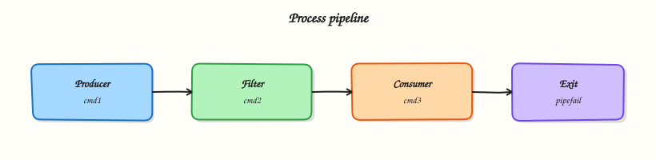

# Input, Output, Redirection, and Pipes

## Overview

Every Linux process speaks through three standard streams: **stdin** (file descriptor 0, input), **stdout** (1, normal output), and **stderr** (2, diagnostics). Shell scripting builds on that model with `echo` / `printf`, `read`, **redirection** operators that send streams to files, and **pipes** (`|`) that connect one command’s stdout to the next command’s stdin.

Ops scripts stay trustworthy when **data** and **diagnostics** stay separate. If you print progress on stdout, a downstream `grep` or `jq` may parse garbage. If you omit `pipefail`, a pipeline can look successful when an early stage failed and the last command exited zero — a classic false green in Continuous Integration (CI). Tools such as **`tee`** help you both save a log file and watch output live. **Here-documents** (`<<EOF`) feed multi-line input without creating temporary files by hand.

This is **Tutorial 4** in **Module 4: Input & Output** of the REBASH Academy **Shell Scripting for DevOps Engineers** series. It is written for Linux administrators, DevOps engineers, Site Reliability Engineering (SRE), and platform engineers. By the end you will redirect streams correctly, build a pipe with `tee`, and use a here-document in a small evidence pack.

## Prerequisites

- [Variables, Quoting, and Arithmetic](variables-quoting-and-arithmetic.md)
- Comfort with `set -euo pipefail` and quoted expansions
- Practice Ubuntu 22.04/24.04 with Bash

## Learning Objectives

By the end of this tutorial, you will be able to:

- [ ] Explain stdin, stdout, and stderr and choose where messages should go
- [ ] Redirect stdout and stderr to files (`>`, `>>`, `2>`, `&>` / `2>&1`)
- [ ] Build pipelines with `|` and use `tee` to capture output
- [ ] Enable `pipefail` and prove a failing stage fails the pipeline
- [ ] Feed multi-line input with a here-document (`<<`)

## Architecture

Streams connect commands, files, and humans. Redirection attaches streams to files; pipes attach stdout of one process to stdin of the next; `tee` splits a stream to a file and onward.




## Theory

### What it is

| Stream | FD | Typical use |
|--------|----|-------------|
| stdin | 0 | Input (`read`, piped data) |
| stdout | 1 | Data for the next tool or capture |
| stderr | 2 | Errors, usage, progress for humans/logs |

Common operators:

| Operator | Meaning |
|----------|---------|
| `> file` | Write stdout (truncate) |
| `>> file` | Append stdout |
| `2> file` | Write stderr |
| `2>&1` | Send stderr to the same place as stdout |
| `&> file` | Bash: redirect both (use carefully for portability) |
| `\|` | Pipe stdout to next stdin |
| `tee file` | Copy stdin to file and to stdout |
| `<< EOF` | Here-document body until `EOF` |

```bash
printf 'data\n'
printf 'progress\n' >&2
```

### Why it matters

Monitoring and CI often capture stdout as the artefact and treat a zero exit as health. Mixed streams create flaky parsers. Pipelines without `pipefail` hide broken producers. Here-documents keep config snippets next to the script so reviewers see the input in Git instead of chasing separate temp files on a jump server.

### How it works

1. **Write data** to stdout; write diagnostics to stderr (`>&2`).  
2. **Redirect** when you need files: `cmd >out.txt 2>err.txt`.  
3. **Pipe** to compose tools: `cmd1 | cmd2 | tee capture.txt`.  
4. **Fail honestly** with `set -o pipefail` (already in `set -euo pipefail`).  
5. **Feed blocks** with `<<'EOF'` (quoted marker = no expansion) or `<<EOF` (expansion on).  

Process substitution (`<(cmd)`) is a Bash feature that presents command output as a temporary file path — useful for `diff <(cmd1) <(cmd2)`. Prefer it when both sides are commands; use a here-document when you need literal multi-line text in the script.

```bash
diff -u <(printf 'a\n') <(printf 'b\n') || true
```

### Key concepts and comparisons

| Goal | Prefer | Avoid |
|------|--------|-------|
| Machine-readable data | stdout | Mixing progress on stdout |
| Human/CI diagnostics | stderr | Hiding errors only in stdout logs |
| Save and view | `tee` | Only `>` when you still need the pipe |
| Honest pipelines | `set -o pipefail` | Checking only the last command |
| Literal multi-line input | `<<'EOF'` | Unquoted `<<EOF` when `$vars` must stay literal |

### Common pitfalls

- Redirecting with `>` before testing, and truncating a good log by mistake.  
- Writing `cmd > file 2>&1` order wrong so stderr does not follow stdout.  
- Forgetting `pipefail`, so `false | true` exits 0.  
- Using unquoted `<<EOF` and expanding secrets accidentally.  
- Capturing passwords on stdout in “debug” redirects committed to tickets.

## Hands-on Lab

### Objective

Under `~/rebash-shell/lab04`, separate stdout/stderr, use `tee` and pipes, prove `pipefail`, and build a here-document based report for a change ticket.

### Prerequisites

- Ubuntu 22.04/24.04 with Bash  
- Modules 2–3 skills (strict mode, quoting)  
- No root required  

### Lab environment

Workspace: `~/rebash-shell/lab04`

```bash
mkdir -p ~/rebash-shell/lab04 && cd ~/rebash-shell/lab04
set -euo pipefail
whoami | tee lab-user.txt
```

**Expected output:** workspace exists; `lab-user.txt` written.

### Real-world scenario

A health-check job prints `OK` on stdout for a load balancer probe, but engineers also need a log file and clear errors on stderr. A previous pipeline reported green even when `grep` found nothing useful because `pipefail` was off. You rebuild the I/O pattern with proof.

### Step-by-step tasks

#### Task 1 – Split stdout and stderr

Create `streams.sh`:

```bash
#!/usr/bin/env bash
set -euo pipefail

printf 'RESULT=ok\n'
printf 'progress: starting checks\n' >&2
printf 'progress: checks done\n' >&2
```

Run:

```bash
cd ~/rebash-shell/lab04
set -euo pipefail

chmod +x streams.sh

./streams.sh >stdout.txt 2>stderr.txt
grep -q 'RESULT=ok' stdout.txt
grep -q 'progress: starting checks' stderr.txt
# stdout must not contain progress lines
grep -q 'progress' stdout.txt && exit 1 || true

# Merge for a single log when needed
./streams.sh >merged.txt 2>&1
grep -q 'RESULT=ok' merged.txt
grep -q 'progress: checks done' merged.txt
```


**Expected output:** `stdout.txt` has only the result line; `stderr.txt` has progress; `merged.txt` contains both.

#### Task 2 – Pipes, tee, and pipefail

```bash
cd ~/rebash-shell/lab04
set -euo pipefail

printf 'alpha\nbeta\ngamma\n' > sample.txt

# tee saves a copy while piping onward
grep -E 'a' sample.txt | tee grep-a.txt | wc -l | tee count-a.txt
grep -q 'alpha' grep-a.txt
grep -q 'gamma' grep-a.txt
test "$(cat count-a.txt | tr -d ' ')" = "2"

# Without pipefail, a failing producer can be masked
set +o pipefail
set +e
false | true
rc_masked=$?
set -e
set -o pipefail
echo "masked_exit=$rc_masked" | tee pipe-masked.txt
test "$rc_masked" -eq 0

# With pipefail, the pipeline fails
set +e
false | true
rc_pf=$?
set -e
echo "pipefail_exit=$rc_pf" | tee pipe-pipefail.txt
test "$rc_pf" -ne 0
```

**Expected output:** `count-a.txt` is `2`; masked exit is `0`; pipefail exit is non-zero.

#### Task 3 – Variable-expanded report (and optional process substitution)

Build `report.txt` from shell variables (same outcome as an unquoted here-document with expansion):

Run:

```bash
cd ~/rebash-shell/lab04
set -euo pipefail

host="$(hostname -s)"
ts="$(date -u +%Y-%m-%dT%H:%M:%SZ)"

{
  printf 'REBASH lab04 I/O report\n'
  printf 'host=%s\n' "$host"
  printf 'timestamp_utc=%s\n' "$ts"
  printf 'stdout_lines=%s\n' "$(wc -l < stdout.txt | tr -d ' ')"
  printf 'stderr_lines=%s\n' "$(wc -l < stderr.txt | tr -d ' ')"
} > report.txt

grep -q "host=${host}" report.txt
test -s report.txt

# Process substitution: compare two command outputs without temp files
diff -u <(printf 'alpha\nbeta\n') <(printf 'alpha\nbeta\n') | tee diff-same.txt
test ! -s diff-same.txt

diff -u <(printf 'alpha\n') <(printf 'beta\n') >diff-diff.txt 2>&1 || true
grep -E '^\+|^-' diff-diff.txt | tee diff-markers.txt
test -s diff-markers.txt

tar -czf io-evidence.tgz \
  lab-user.txt stdout.txt stderr.txt merged.txt \
  grep-a.txt count-a.txt pipe-masked.txt pipe-pipefail.txt \
  report.txt diff-markers.txt
ls -l io-evidence.tgz | tee evidence-ls.txt
```


**Expected output:** `report.txt` includes host and timestamp; identical process-substitution diff is empty; differing diff has markers; evidence archive exists.

### Validation steps

- [ ] stdout/stderr split proven with separate files  
- [ ] `tee` captured intermediate pipe output  
- [ ] `pipefail` changes pipeline exit status vs masked case  
- [ ] Here-document report exists and lists host/time  
- [ ] `io-evidence.tgz` exists under `~/rebash-shell/lab04`  

### Common errors and fixes

| Error | Cause | Fix |
|-------|-------|-----|
| Empty `stderr.txt` | Messages went to stdout | Use `printf ... >&2` |
| `pipefail` still 0 | `set -o pipefail` not active | Confirm with `set -o | grep pipefail` |
| Here-doc expanded secrets | Unquoted `EOF` with `$SECRET` in body | Use `<<'EOF'` for literal bodies |
| `tee: broken pipe` | Downstream closed early | Often OK; check pipeline design |

### Challenge exercise

Write `probe.sh` that prints `RESULT=ok` or `RESULT=fail` on stdout, writes a timestamped line to `probe.log` via `tee -a` on stderr progress, accepts an optional argument `ok|fail` (default `ok`), exits `0` for ok and `1` for fail, and builds `probe-report.txt` with a here-document summarising the last run. Keep `set -euo pipefail`.

### Learning outcomes

- Separated data (stdout) from diagnostics (stderr)  
- Used pipes and `tee` with honest `pipefail` behaviour  
- Built a here-document report and compared streams with process substitution  

### Cleanup

```bash
cd ~/rebash-shell/lab04
rm -f diff-same.txt
# Keep evidence archive and key logs, or:
# rm -rf ~/rebash-shell/lab04
```

## Validation

- [ ] Lab finished under `~/rebash-shell/lab04/` with evidence files  
- [ ] You can explain stdout vs stderr and common redirect operators  
- [ ] You can explain why `pipefail` matters in CI  
- [ ] You can write a here-document and know when to quote the delimiter  

## Code Walkthrough

Production I/O patterns usually follow this order:

1. **Decide the contract** — what is data (stdout) vs logs (stderr)  
2. **Redirect for artefacts** — `>out 2>err` or `tee` when you still need a pipe  
3. **Compose with pipes** — small tools, one job each  
4. **Keep `pipefail` on** — already part of `set -euo pipefail`  
5. **Embed templates** — here-documents for reports and unit file snippets  
6. **Compare command output** — process substitution when both sides are commands  

Order matters for merges: `cmd >file 2>&1` sends both to `file`. `cmd 2>&1 >file` does **not** do what most people expect for merging into `file`.

## Security Considerations

- Do not redirect secrets into world-readable files under `/tmp`  
- Prefer `<<'EOF'` when the body must not expand variables  
- Scrub logs before attaching them to tickets  
- Avoid `curl ... 2>&1` into logs that store tokens from verbose HTTP clients  
- Limit permissions on captured artefacts (`chmod 600` for sensitive outputs)  

## Common Mistakes

!!! warning "Progress messages on stdout"
    Parsers and probes break. **Fix:** `printf '...' >&2` for progress; keep stdout clean.

!!! warning "Missing `pipefail`"
    CI goes green when an early stage failed. **Fix:** `set -euo pipefail` and test with `false | true`.

!!! warning "Truncating logs with `>` during debug"
    Evidence disappears. **Fix:** use `>>` or a new timestamped file name.

!!! warning "Wrong redirect order when merging"
    stderr still hits the terminal. **Fix:** remember `cmd >file 2>&1`.

## Best Practices

- One clear stdout contract per script (data **or** `RESULT=` lines)  
- Always enable `pipefail` in ops scripts  
- Use `tee -a` for append-only run logs  
- Quote here-document delimiters unless you need expansion  
- Keep pipelines short enough to read; break into steps when debugging  

## Troubleshooting

| Symptom | Likely cause | Fix |
|---------|--------------|-----|
| Empty capture file | Redirected the wrong FD | Check `>` vs `2>` |
| Pipeline exit 0 but bad data | No `pipefail` | Enable it; assert on content |
| Here-doc includes unwanted values | Unquoted delimiter | Use `<<'EOF'` |
| `diff` noise in process substitution | Locale/newline differences | Normalise with `printf` / `sort` |
| Lost stderr in CI | Runner captures only stdout | Merge deliberately with `2>&1` when needed |

## Summary

Stdout carries data; stderr carries diagnostics; redirection and pipes connect tools; `tee` keeps a copy; `pipefail` keeps CI honest; here-documents embed multi-line input. Next, make decisions with tests and branches in [Control Flow — Conditionals](control-flow-conditionals.md).

## Interview Questions

**1. What is the difference between stdout and stderr, and where should a usage message go?**

??? success "Reveal answer"
    **stdout** (FD 1) is the normal data stream for capture and pipes. **stderr** (FD 2) is for diagnostics. A usage message should go to **stderr** so it does not corrupt data on stdout. In Bash, print with `printf 'Usage: ...\n' >&2`.

**2. Explain `cmd >out.txt 2>err.txt` versus `cmd >out.txt 2>&1`.**

??? success "Reveal answer"
    The first sends stdout to `out.txt` and stderr to `err.txt` separately. The second redirects stdout to `out.txt`, then points stderr at the same place stdout currently goes — so both end up in `out.txt`. Order matters: write the stdout redirect before `2>&1` when merging into a file.

**3. Why does `set -o pipefail` matter in CI pipelines?**

??? success "Reveal answer"
    Without `pipefail`, the exit status of a pipeline is the status of the **last** command. `false | true` can exit 0 even though `false` failed. With `pipefail`, any failed stage fails the pipeline. That prevents false-green builds when an early `grep` or `curl` fails.

**4. What does `tee` do, and when do you use `tee -a`?**

??? success "Reveal answer"
    **`tee`** reads stdin and writes it both to a file and to stdout, so you can save a log and still pipe onward. **`tee -a`** appends to the file instead of overwriting — useful for long-running job logs across multiple steps.

**5. When should you quote the here-document delimiter as `<<'EOF'`?**

??? success "Reveal answer"
    Quote the delimiter when the body must be **literal** — no parameter expansion, command substitution, or arithmetic. Use unquoted `<<EOF` only when you intentionally want `"$variables"` in the body expanded as the document is written.

**6. How is process substitution `<(cmd)` different from a pipe?**

??? success "Reveal answer"
    A **pipe** connects stdout of one command to stdin of the next in a linear chain. **Process substitution** presents command output as a file-like path, which helps commands that need a filename argument (for example `diff file1 file2`). Example: `diff -u <(cmd1) <(cmd2)`. It is a Bash feature, not portable POSIX `sh`.

**7. A health probe must print only `OK` on success for a load balancer. How do you log details without breaking the probe?**

??? success "Reveal answer"
    Print `OK` (or `RESULT=ok`) on **stdout**, and send detailed progress to **stderr** or to a log file with `tee`. The load balancer captures stdout; engineers still get diagnostics in logs. Do not mix free-form logs onto stdout.

## Related Tutorials

- [Shell Scripting for DevOps Engineers – Overview](index.md)
- [Variables, Quoting, and Arithmetic](variables-quoting-and-arithmetic.md) *(previous)*
- [Control Flow — Conditionals](control-flow-conditionals.md) *(next)*

## References

- [GNU Bash manual — Redirections](https://www.gnu.org/software/bash/manual/html_node/Redirections.html)  
- [GNU Bash manual — Pipelines](https://www.gnu.org/software/bash/manual/html_node/Pipelines.html)  
- [`tee(1)`](https://manpages.ubuntu.com/manpages/jammy/en/man1/tee.1.html) — Ubuntu man-pages  
- [ShellCheck](https://www.shellcheck.net/)  
- Track index: [Shell Scripting for DevOps Engineers](index.md)
