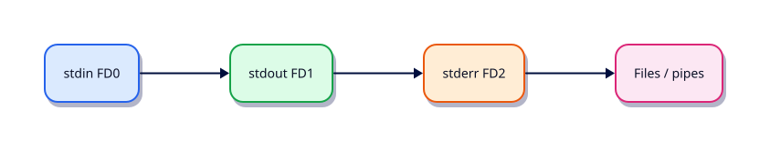

# Input, Output, Redirection, and Pipes

## Overview

Ops scripts speak through streams: data on stdout, diagnostics on stderr, and composition through pipes. Get the streams right and monitoring stays honest.

This is **Tutorial 4** in **Module 4: Input & Output** of the REBASH Academy **Shell Scripting for DevOps Engineers** series — written for Linux administrators, DevOps engineers, SREs, and platform engineers who automate production hosts with Bash.

## Prerequisites

- Variables, Quoting, and Arithmetic
- Bash 4.2+ on Linux (WSL2/VM/cloud)

## Learning Objectives

By the end of this tutorial, you will be able to:

- [ ] Apply the core ideas of “Input, Output, Redirection, and Pipes” in a real ops script
- [ ] Use `set -euo pipefail` as the production default
- [ ] Use quoted expansions and clear stderr diagnostics
- [ ] Produce meaningful exit codes for automation consumers
- [ ] Debug behaviour with `bash -x` when something fails
- [ ] Relate this topic to day-to-day Linux admin and DevOps work

## Architecture

Ops scripts sit between humans/automation and system tools. This topic’s control points are shown below.



## Theory

### echo

`echo` prints arguments with a trailing newline. Portable enough for simple messages; avoid relying on non-POSIX flags (`-e`, `-n` vary). Prefer `printf` when format matters.

### printf

```bash
printf 'host=%s status=%s\n' "$host" "$status" >&2
```

Use `printf` for structured logs and safe formatting.

### read

`read -r var` reads a line from stdin into `var`. `-r` disables backslash escapes. Combine with `IFS=` for raw lines: `while IFS= read -r line; do ...; done < file`.

### stdin, stdout, stderr

| Stream | FD | Role |
|--------|----|------|
| stdin | 0 | Input |
| stdout | 1 | Data / normal output |
| stderr | 2 | Diagnostics, progress, errors |

Keep machine-readable results on stdout and human diagnostics on stderr so pipes stay clean.

### Redirection

| Operator | Meaning |
|----------|---------|
| `>` | Truncate and write stdout |
| `>>` | Append stdout |
| `2>` | Redirect stderr |
| `&>` | Both streams (Bash) |
| `<` | Read stdin from file |
| `2>&1` | Merge stderr into stdout |

### Pipes

`cmd1 | cmd2` connects stdout of `cmd1` to stdin of `cmd2`. With `set -o pipefail`, any failing stage fails the pipeline — required for honest CI and health checks.

## Hands-on Lab

Create a workspace for this tutorial.

```bash
mkdir -p ~/rebash-shell/lab04 && cd ~/rebash-shell/lab04
```

**Focus:** printf/read; redirect logs; pipefail demo; stderr vs stdout

### Step 1 – Skeleton

```bash
cat > lab.sh << 'EOF'
#!/usr/bin/env bash
set -euo pipefail
echo "lab04 input-output-redirection-and-pipes on $(hostname -s)"
EOF
chmod +x lab.sh
./lab.sh
```

### Step 2 – Streams, redirect, pipefail

```bash
cat > io-demo.sh << 'EOF'
#!/usr/bin/env bash
set -euo pipefail
printf 'data-line\n'
printf 'diag-line\n' >&2
EOF
chmod +x io-demo.sh
./io-demo.sh >stdout.txt 2>stderr.txt
cat stdout.txt stderr.txt
# pipefail: false in a pipeline must fail
set -o pipefail
if false | true; then echo 'unexpected'; else echo 'pipefail ok'; fi
```

### Final step – Trace and cleanup note

```bash
bash -x ./lab.sh 2>&1 | tail -n 20 || true
# keep ~/rebash-shell for later labs
```

## Validation

- [ ] Lab commands run under `~/rebash-shell/lab04/`
- [ ] You can explain each Theory heading in your own words
- [ ] Failure path exits non-zero and prints diagnostics to stderr (where applicable)
- [ ] You can relate this topic to a real DevOps or Linux admin task

## Code Walkthrough

Production Bash for **Input, Output, Redirection, and Pipes** always combines:

1. A clear shebang (`#!/usr/bin/env bash`)
2. Strict mode near the top (`set -euo pipefail`) from Module 2 onward
3. Quoted expansions and explicit tests
4. Functions with `local` for reusable behaviour
5. Documented exit codes and stderr logging

Keep scripts short enough to review in a single merge request. When logic grows (complex JSON APIs, heavy state), hand off to Python and keep Bash as the launcher.

## Security Considerations

- Treat all external input (args, files, env) as untrusted until validated
- Never log secrets; prefer masked CI variables and secret stores
- Prefer least privilege — do not require root for file-local tasks
- Avoid `eval` and unquoted expansions in destructive commands
- Validate paths stay under an allow-listed root before `rm` or overwrite

## Common Mistakes

!!! warning "Skipping strict mode"
    Cron and CI hide failures that an interactive terminal would show. **Fix:** start with `set -euo pipefail` from Module 2 onward.

!!! warning "Unquoted path expansions"
    Spaces and globs rewrite your command line. **Fix:** always `"$path"` / `"$@"`.

!!! warning "Assuming interactive PATH"
    Aliases and fancy PATH entries disappear under schedulers. **Fix:** set `PATH` or use absolute paths.

## Best Practices

- One purpose per script; compose with functions or small binaries
- Log to stderr; reserve stdout for data or RESULT lines
- Idempotent behaviour where scheduling may overlap
- Pair every new script with a failing-path test you actually run
- Run ShellCheck in CI before merging automation

## Troubleshooting

| Symptom | Likely cause | Fix |
|---------|--------------|-----|
| Works in terminal, fails in cron | PATH / cwd / env | Fingerprint env; set PATH |
| `unbound variable` | `set -u` | Provide defaults or export vars |
| Pipeline “succeeds” incorrectly | Missing `pipefail` | `set -o pipefail` |
| `[[` unexpected operator | Running under `sh`/dash | Fix shebang to Bash |

## Summary

**Input, Output, Redirection, and Pipes** is a core skill for Linux admins and DevOps engineers automating real hosts and pipelines. Practise the lab until the failure path is as familiar as the happy path, then continue the track.

## Interview Questions

1. How does this topic show up in production Linux administration or CI?
2. What failure mode appears if you ignore quoting or strict mode here?
3. How would you test this behaviour under a minimal cron-like environment?
4. When would you move this logic out of Bash into Python or another tool?
5. What exit code contract would you document for teammates?

!!! tip "Sample answer — question 2"
    Unquoted expansions and missing `pipefail` create silent or partial failures — especially under cron — that look healthy in monitoring until data is wrong.

## Related Tutorials

- [Shell Scripting for DevOps Engineers – Category Overview](index.md)
- [Variables, Quoting, and Arithmetic](variables-quoting-and-arithmetic.md) *(previous)*
- [Control Flow — Conditionals](control-flow-conditionals.md) *(next)*
- [Learning Paths](../learning-paths/index.md)

## References

- [GNU Bash manual](https://www.gnu.org/software/bash/manual/)
- [POSIX shell command language](https://pubs.opengroup.org/onlinepubs/9699919799/utilities/V3_chap02.html)
- [ShellCheck](https://www.shellcheck.net/)
- Track index: [Shell Scripting for DevOps Engineers](index.md)
