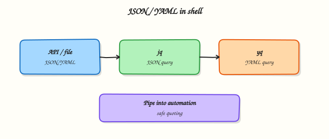

# JSON and YAML with jq and yq

## Overview

Cloud and DevOps tools speak **JSON** (JavaScript Object Notation) and **YAML** (YAML Ain’t Markup Language) everywhere: Kubernetes manifests, Terraform plan JSON, GitHub API responses, Ansible inventories, and app config files. Parsing them with `grep` is fragile. **`jq`** is the standard CLI for JSON. **`yq`** (the Mike Farah Go version is common) does similar work for YAML. In Bash you read a file, select fields, and **assert** values before a deploy continues.

This is **Tutorial 14** in **Module 14: JSON & YAML** of the REBASH Academy **Shell Scripting for DevOps Engineers** series. It is written for Linux administrators, DevOps engineers, Site Reliability Engineering (SRE), and platform engineers. By the end, you will parse sample documents under `~/rebash-shell/lab14` with `jq`, and with `yq` when it is installed (with a safe fallback when it is not).

In production, a missing field should fail the script early. Pretty-printing secrets into CI logs causes leaks. Prefer `jq`/`yq` over homemade parsers, pin tool versions in CI images, and keep assertions next to the deploy step.

## Prerequisites

- [Networking Automation with Shell](networking-automation-with-shell.md)
- Bash 4.2+ on Linux
- `jq` installed (`sudo apt-get install -y jq` on Ubuntu)
- Optional: `yq` (v4+) — the lab works with a fallback if `yq` is missing

## Learning Objectives

By the end of this tutorial, you will be able to:

- [ ] Explain when to use `jq` versus line-oriented tools like `grep`
- [ ] Select and assert JSON fields with `jq`
- [ ] Parse YAML with `yq` when available, or document a fallback path
- [ ] Fail a script when a required field is missing or wrong
- [ ] Avoid printing secrets while debugging structured config

## Architecture

Scripts receive JSON/YAML from APIs or files, select fields with `jq`/`yq`, assert contracts, then continue automation or fail fast.



## Theory

### What it is

**JSON** is a structured text format with objects, arrays, strings, numbers, booleans, and null. **YAML** is indentation-based and often used for Kubernetes and Ansible; many YAML files map cleanly to JSON data models. **`jq`** reads JSON from a file or stdin and applies a filter (for example `.name`, `.spec.replicas`). **`yq`** applies similar expressions to YAML documents.

``` {.bash .ra-terminal title="Terminal"}
jq -r '.name' app.json
yq -r '.metadata.name' app.yaml   # when yq v4 is installed
```

### Why it matters

APIs and cluster tools return structured data. If your script greps for a word, a harmless log line can fake success. Field asserts catch wrong environments, missing images, or zero replicas before you roll out. Platform teams use the same pattern in CI: fetch → parse → assert → deploy.

### How it works

1. **Validate JSON** — `jq empty file.json` or `jq . file.json` (fails on bad JSON).  
2. **Select** — `jq -r '.key'` raw string; `jq '.list | length'` for counts.  
3. **Assert** — compare to expected values; exit non-zero on mismatch.  
4. **YAML** — with `yq eval` / `yq -r` (syntax varies slightly by version); or convert carefully.  
5. **Fallback** — if `yq` is missing, convert a controlled sample with a small Python one-liner **only when Python is available**, or skip YAML asserts and record `yq=SKIP` — do not invent YAML parsing in pure Bash.

```bash
name=$(jq -r '.service.name' config.json)
[[ "$name" == "payments" ]] || { echo "bad name: $name" >&2; exit 1; }
```

### Key concepts and comparisons

| Tool | Best for | Notes |
|------|----------|-------|
| `jq` | JSON APIs, `kubectl -o json` | Ubiquitous in CI images |
| `yq` | Kubernetes/Ansible YAML | Confirm Mike Farah v4 vs older Python `yq` |
| `grep`/`sed` | Simple logs | Fragile for nested structure |
| Python `json`/`yaml` | Complex transforms | Heavier; good fallback in controlled images |

| Pattern | Prefer when | Avoid when |
|---------|-------------|------------|
| `jq -e` / explicit test | CI gates | Ignoring exit codes |
| `-r` for shell vars | Feeding next commands | Forgetting quotes around results |
| Pin `jq`/`yq` versions | Shared pipelines | Assuming every laptop matches CI |
| Redact secrets | Debug logs | `jq .` on files with tokens |

### Common pitfalls

- Using `grep` for nested JSON and matching the wrong line.
- Forgetting `jq` exits non-zero on invalid JSON — catch and explain it.
- Mixing `yq` v3 (Python) syntax with v4 (Go) syntax.
- Pretty-printing whole secrets objects in CI logs.
- Unquoted `$(jq …)` results that split on spaces.

## Hands-on Lab

### Objective

Create sample JSON and YAML, assert fields with `jq`, and parse YAML with `yq` when installed (or a documented fallback). Save evidence under `~/rebash-shell/lab14`.

### Prerequisites

- `jq` required
- `yq` optional (v4 preferred); Python 3 optional for fallback

### Lab environment

Workspace: `~/rebash-shell/lab14`

``` {.bash .ra-terminal title="Terminal"}
mkdir -p ~/rebash-shell/lab14 && cd ~/rebash-shell/lab14
set -euo pipefail
command -v jq | tee jq-path.txt
jq --version | tee jq-version.txt
if command -v yq >/dev/null 2>&1; then yq --version | tee yq-version.txt; else echo 'yq=not-installed' | tee yq-version.txt; fi
```

!!! example "Expected output"
    `jq` path and version recorded; `yq-version.txt` notes installed or not.


### Real-world scenario

A deploy job receives an app descriptor as JSON and a small Kubernetes-style YAML snippet. Before rollout, the pipeline must prove `service.name`, `service.port`, and `replicas` match the change ticket. If `yq` is missing on a laptop, the lab still proves JSON asserts and records how YAML was handled.

### Step-by-step tasks

#### Task 1 – Sample files and jq asserts

Create `app.json`:

```json title="app.json"
{
  "service": {
    "name": "payments",
    "port": 8080,
    "env": "lab"
  },
  "replicas": 2,
  "image": "ghcr.io/example/payments:1.4.2"
}
```

Create `app.yaml`:

```yaml title="app.yaml"
apiVersion: apps/v1
kind: Deployment
metadata:
  name: payments
  labels:
    app: payments
spec:
  replicas: 2
  template:
    spec:
      containers:
        - name: payments
          image: ghcr.io/example/payments:1.4.2
          ports:
            - containerPort: 8080
```

Run:

``` {.bash .ra-terminal title="Terminal"}
cd ~/rebash-shell/lab14
set -euo pipefail

jq empty app.json
name=$(jq -r '.service.name' app.json)
port=$(jq -r '.service.port' app.json)
replicas=$(jq -r '.replicas' app.json)
image=$(jq -r '.image' app.json)

{
  echo "json_name=${name}"
  echo "json_port=${port}"
  echo "json_replicas=${replicas}"
  echo "json_image=${image}"
} | tee jq-fields.txt

[[ "$name" == "payments" ]]
[[ "$port" == "8080" ]]
[[ "$replicas" == "2" ]]
[[ "$image" == "ghcr.io/example/payments:1.4.2" ]]
echo "jq_asserts=OK" | tee jq-asserts.txt
```


!!! example "Expected output"
    `jq-fields.txt` lists the four fields; `jq-asserts.txt` says `OK`.


#### Task 2 – Negative assert (must fail)

``` {.bash .ra-terminal title="Terminal"}
cd ~/rebash-shell/lab14
set -euo pipefail

set +e
bad=$(jq -r '.service.name' app.json)
[[ "$bad" == "wrong-name" ]]
ec=$?
set -e
echo "negative_test_exit=$ec" | tee jq-negative.txt
test "$ec" -ne 0
```

!!! example "Expected output"
    `negative_test_exit` is non-zero (assert correctly rejected the wrong name).


#### Task 3 – yq when installed, fallback otherwise

``` {.bash .ra-terminal title="Terminal"}
cd ~/rebash-shell/lab14
set -euo pipefail

parse_yaml() {
  if command -v yq >/dev/null 2>&1; then
    # Mike Farah yq v4 style; also works with many distro packages
    yq_name=$(yq -r '.metadata.name' app.yaml 2>/dev/null \
      || yq eval '.metadata.name' app.yaml -r)
    yq_replicas=$(yq -r '.spec.replicas' app.yaml 2>/dev/null \
      || yq eval '.spec.replicas' app.yaml -r)
    echo "yaml_tool=yq" | tee yaml-parse.txt
    echo "yaml_name=${yq_name}" | tee -a yaml-parse.txt
    echo "yaml_replicas=${yq_replicas}" | tee -a yaml-parse.txt
    [[ "$yq_name" == "payments" ]]
    [[ "$yq_replicas" == "2" ]]
    echo "yaml_asserts=OK" | tee yaml-asserts.txt
  elif command -v python3 >/dev/null 2>&1; then
    python3 - << 'PY' | tee yaml-parse.txt
import sys
try:
    import yaml
except ImportError:
    print("yaml_tool=skip")
    print("yaml_asserts=SKIP reason=no-yq-no-pyyaml")
    sys.exit(0)
with open("app.yaml", encoding="utf-8") as f:
    data = yaml.safe_load(f)
name = data["metadata"]["name"]
replicas = data["spec"]["replicas"]
print("yaml_tool=python3-pyyaml")
print(f"yaml_name={name}")
print(f"yaml_replicas={replicas}")
if name != "payments" or replicas != 2:
    sys.exit(1)
print("yaml_asserts=OK")
PY
    # Normalise assert file
    if grep -q 'yaml_asserts=OK' yaml-parse.txt; then
      echo "yaml_asserts=OK" | tee yaml-asserts.txt
    else
      echo "yaml_asserts=SKIP" | tee yaml-asserts.txt
    fi
  else
    echo "yaml_tool=skip" | tee yaml-parse.txt
    echo "yaml_asserts=SKIP reason=no-yq-no-python" | tee yaml-asserts.txt
  fi
}

parse_yaml
grep -Eq 'yaml_asserts=(OK|SKIP)' yaml-asserts.txt

tar -czf json-yaml-evidence.tgz \
  jq-path.txt jq-version.txt yq-version.txt \
  app.json app.yaml jq-fields.txt jq-asserts.txt jq-negative.txt \
  yaml-parse.txt yaml-asserts.txt
ls -l json-yaml-evidence.tgz | tee evidence-ls.txt
```

!!! example "Expected output"
    YAML path is `OK` (via `yq` or PyYAML) or honest `SKIP`; archive exists.


### Validation steps

- [ ] `jq empty app.json` succeeds
- [ ] Field asserts pass for name, port, replicas, image
- [ ] Negative name assert fails as expected
- [ ] `yaml-asserts.txt` is `OK` or documented `SKIP`
- [ ] `json-yaml-evidence.tgz` exists under `~/rebash-shell/lab14`

### Common errors and fixes

| Error | Cause | Fix |
|-------|-------|-----|
| `jq: command not found` | Not installed | `sudo apt-get install -y jq` |
| `yq` syntax error | v3 vs v4 | Try `yq eval '…' file -r` or install mikefarah/yq |
| `null` from jq | Wrong path | `jq '.' file` to explore; fix the filter |
| PyYAML missing | Fallback import fails | Install `yq`, or `pip install pyyaml` in a venv, or accept SKIP |
| Word-splitting | Unquoted `$(jq …)` | Always quote: `"$name"` |

### Challenge exercise

Write `assert-app.sh` that takes a JSON file path as `$1`, asserts `.replicas >= 1` and `.service.port == 8080` using `jq`, and exits `0`/`1` accordingly. Prove with `app.json` (pass) and a tiny bad fixture `bad.json` with `"replicas": 0` (fail). Keep both fixtures in the lab folder.

### Learning outcomes

- Parsed and asserted JSON fields with `jq`
- Proved a negative assertion fails
- Parsed YAML with `yq` or a documented fallback
- Packed evidence for a change ticket

### Cleanup

``` {.bash .ra-terminal title="Terminal"}
cd ~/rebash-shell/lab14
set -euo pipefail
# Keep samples/evidence if you want; otherwise:
# rm -f json-yaml-evidence.tgz *.txt bad.json assert-app.sh
# Optional: rm -f app.json app.yaml
```

## Validation

- [ ] Lab finished under `~/rebash-shell/lab14/` with evidence files
- [ ] You can explain why `jq` beats `grep` for nested JSON
- [ ] You can assert required fields and fail CI on mismatch
- [ ] You know how to handle missing `yq` honestly

## Code Walkthrough

In real pipelines, structured config checks usually follow this order:

1. **Validate parse** — reject broken JSON/YAML early  
2. **Select only needed fields** — do not dump whole secret objects  
3. **Assert contracts** — name, port, replicas, image tag  
4. **Fail non-zero** — blockers for deploy jobs  
5. **Pin tool versions** — same `jq`/`yq` in CI and docs  

Bash stays the glue; `jq`/`yq` do the structure work.

## Security Considerations

- Redact tokens, passwords, and private keys before logging `jq` output  
- Prefer pulling secrets from a secret store, not from committed JSON  
- Treat API JSON as untrusted until asserted  
- Do not `curl \| jq` sensitive admin APIs on shared screen shares without care  
- Keep write operations (`yq -i`) behind review — easy to rewrite manifests wrongly  

## Common Mistakes

!!! warning "Grepping JSON for success"
    A word in a comment or message can fake a pass. **Fix:** `jq` field asserts with exit codes.

!!! warning "Assuming every image has `yq`"
    Laptops and slim CI images differ. **Fix:** install in the image, or skip with an explicit `SKIP` reason.

!!! warning "Dumping full documents in CI"
    Secrets leak into log archives. **Fix:** print only the fields you assert.

!!! warning "Unquoted jq results in Bash"
    Paths and names with spaces break. **Fix:** `"$var"` always.

## Best Practices

- Check `jq empty` / parse before business asserts  
- Use `-r` when feeding shell variables  
- Keep sample fixtures next to the script for unit-style checks  
- Prefer mikefarah `yq` v4 syntax in new docs and pin it  
- Combine with ShellCheck for the surrounding Bash  

## Troubleshooting

| Symptom | Likely cause | Fix |
|---------|--------------|-----|
| `parse error` | Invalid JSON/YAML | Fix commas/indent; validate with `jq`/`yq` |
| `Cannot index` | Wrong type at path | Inspect with `jq '.'` / `yq '.'` |
| `yq` unexpected | Wrong major version | Check `yq --version`; align syntax |
| Assert always passes | Compared wrong variable | Tee fields before `[[ ]]` |
| CI-only failure | Tool missing in image | Install `jq`/`yq` in the CI image |

## Summary

JSON and YAML are the data plane of cloud automation. Use `jq` to select and assert JSON fields; use `yq` for YAML when available, with an honest fallback when it is not. Fail early on contract mismatches, and keep secrets out of logs. Next, run scripts on a schedule in [Scheduling — cron, at, and Timers](scheduling-cron-at-and-timers.md).

## Interview Questions

**1. Why is `jq` safer than `grep` for checking a field in API JSON?**

??? success "Reveal answer"
    `grep` matches text anywhere, including messages and unrelated keys. `jq` walks the structure and reads one field (for example `.service.name`). Invalid JSON fails the parse. That makes CI gates much more reliable.

**2. What does `jq -r` do, and when do you want it?**

??? success "Reveal answer"
    `-r` prints **raw** strings without JSON quotes. Use it when the value becomes a shell variable or a filename. Keep normal (non-raw) output when you need valid JSON for the next `jq` stage.

**3. How do you fail a deploy script if `.replicas` is missing or zero?**

??? success "Reveal answer"
    Read with `jq -r '.replicas'` (or `jq -e '.replicas > 0'`), then test in Bash or use `jq`’s exit status. Exit non-zero before any rollout command. Interviewers want a hard gate, not a warning-only log line.

**4. What is a practical difference between common `yq` versions?**

??? success "Reveal answer"
    The popular **Mike Farah Go `yq` (v4)** uses `yq '.path' file` / `yq eval` style filters similar to `jq`. Older **Python `yq`** wraps `jq` differently. Always check `yq --version` and pin the tool in CI so filters do not break.

**5. How should a script behave if `yq` is not installed?**

??? success "Reveal answer"
    Either install it in the platform image (preferred for YAML-heavy pipelines), or fail clearly / skip with an explicit reason when YAML checks are optional. Silent success without parsing YAML is the worst option.

**6. How do you avoid leaking secrets when debugging `jq` in CI?**

??? success "Reveal answer"
    Select only non-secret fields, mask values, and never archive full `jq .` dumps of credential objects. Prefer secret stores and short-lived tokens over committed JSON secrets.

**7. When would you switch from Bash+jq to Python for config processing?**

??? success "Reveal answer"
    Switch when transforms are multi-step, need YAML merge libraries, complex validation, or shared modules across tools. Keep Bash+jq for small asserts and glue. “Right-sized tooling” is a strong interview answer.

## Related Tutorials

- [Shell Scripting for DevOps Engineers – Overview](index.md)
- [Networking Automation with Shell](networking-automation-with-shell.md) *(previous)*
- [Scheduling — cron, at, and Timers](scheduling-cron-at-and-timers.md) *(next)*
- [Text Processing in Shell Scripts](text-processing-in-shell-scripts.md) *(related)*

## References

- [jq manual](https://jqlang.github.io/jq/manual/) — filters and invocation  
- [yq (mikefarah) documentation](https://mikefarah.gitbook.io/yq/) — YAML processing  
- [JSON RFC 8259](https://datatracker.ietf.org/doc/html/rfc8259) — JSON data interchange  
- Track index: [Shell Scripting for DevOps Engineers](index.md)
