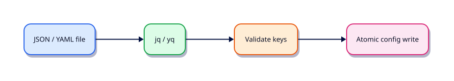

# JSON and YAML with jq and yq

## Overview

Cloud APIs and Kubernetes speak JSON/YAML. Shell stays useful when jq/yq shape data before the next tool runs.

This is **Tutorial 14** in **Module 14: JSON & YAML** of the REBASH Academy **Shell Scripting for DevOps Engineers** series — written for Linux administrators, DevOps engineers, SREs, and platform engineers who automate production hosts with Bash.

## Prerequisites

- Networking Automation with Shell
- Bash 4.2+ on Linux (WSL2/VM/cloud)

## Learning Objectives

By the end of this tutorial, you will be able to:

- [ ] Apply the core ideas of “JSON and YAML with jq and yq” in a real ops script
- [ ] Use `set -euo pipefail` as the production default
- [ ] Use quoted expansions and clear stderr diagnostics
- [ ] Produce meaningful exit codes for automation consumers
- [ ] Debug behaviour with `bash -x` when something fails
- [ ] Relate this topic to day-to-day Linux admin and DevOps work

## Architecture

Ops scripts sit between humans/automation and system tools. This topic’s control points are shown below.



## Theory

### jq

```bash
jq -r '.items[].metadata.name' < deploy.json
jq --arg env "$ENV" '.env = $env' config.json
```

Prefer `jq` over `grep`/`sed` for JSON. Fail fast on invalid input.

### yq

`yq` (Mike Farah / Python variants exist — pin one) reads and writes YAML. Convert, select keys, and merge overlays for config files.

### Parsing JSON and YAML

Validate before apply. Extract only the fields you need. Keep secrets out of shell history and debug dumps.

### Configuration Files

Treat config as data: version it, validate schema where possible, and rewrite atomically (`tmp` + `mv`). Document required keys in the script’s usage text.

## Hands-on Lab

Create a workspace for this tutorial.

```bash
mkdir -p ~/rebash-shell/lab14 && cd ~/rebash-shell/lab14
```

**Focus:** jq extract/transform; yq read YAML; validate config keys

### Step 1 – Skeleton

```bash
cat > lab.sh << 'EOF'
#!/usr/bin/env bash
set -euo pipefail
echo "lab14 json-and-yaml-with-jq-yq on $(hostname -s)"
EOF
chmod +x lab.sh
./lab.sh
```

### Step 2 – jq (and yq if present)

```bash
cat > sample.json << 'EOF'
{"env":"lab","items":[{"name":"web"},{"name":"db"}]}
EOF
cat > sample.yaml << 'EOF'
env: lab
replicas: 2
EOF
cat > parse.sh << 'EOF'
#!/usr/bin/env bash
set -euo pipefail
command -v jq >/dev/null || { echo "install jq" >&2; exit 3; }
jq -r '.items[].name' sample.json | tee names.txt
jq --arg e prod '.env=$e' sample.json > out.json
if command -v yq >/dev/null; then
  yq '.replicas' sample.yaml | tee replicas.txt
else
  echo 'yq not installed — skipped' | tee replicas.txt
fi
EOF
chmod +x parse.sh
./parse.sh
```

### Final step – Trace and cleanup note

```bash
bash -x ./lab.sh 2>&1 | tail -n 20 || true
# keep ~/rebash-shell for later labs
```

## Validation

- [ ] Lab commands run under `~/rebash-shell/lab14/`
- [ ] You can explain each Theory heading in your own words
- [ ] Failure path exits non-zero and prints diagnostics to stderr (where applicable)
- [ ] You can relate this topic to a real DevOps or Linux admin task

## Code Walkthrough

Production Bash for **JSON and YAML with jq and yq** always combines:

1. A clear shebang (`#!/usr/bin/env bash`)
2. Strict mode near the top (`set -euo pipefail`) from Module 2 onward
3. Quoted expansions and explicit tests
4. Functions with `local` for reusable behaviour
5. Documented exit codes and stderr logging

Keep scripts short enough to review in a single merge request. When logic grows (complex JSON APIs, heavy state), hand off to Python and keep Bash as the launcher.

## Security Considerations

- Treat all external input (args, files, env) as untrusted until validated
- Never log secrets; prefer masked CI variables and secret stores
- Prefer least privilege — do not require root for file-local tasks
- Avoid `eval` and unquoted expansions in destructive commands
- Validate paths stay under an allow-listed root before `rm` or overwrite

## Common Mistakes

!!! warning "Skipping strict mode"
    Cron and CI hide failures that an interactive terminal would show. **Fix:** start with `set -euo pipefail` from Module 2 onward.

!!! warning "Unquoted path expansions"
    Spaces and globs rewrite your command line. **Fix:** always `"$path"` / `"$@"`.

!!! warning "Assuming interactive PATH"
    Aliases and fancy PATH entries disappear under schedulers. **Fix:** set `PATH` or use absolute paths.

## Best Practices

- One purpose per script; compose with functions or small binaries
- Log to stderr; reserve stdout for data or RESULT lines
- Idempotent behaviour where scheduling may overlap
- Pair every new script with a failing-path test you actually run
- Run ShellCheck in CI before merging automation

## Troubleshooting

| Symptom | Likely cause | Fix |
|---------|--------------|-----|
| Works in terminal, fails in cron | PATH / cwd / env | Fingerprint env; set PATH |
| `unbound variable` | `set -u` | Provide defaults or export vars |
| Pipeline “succeeds” incorrectly | Missing `pipefail` | `set -o pipefail` |
| `[[` unexpected operator | Running under `sh`/dash | Fix shebang to Bash |

## Summary

**JSON and YAML with jq and yq** is a core skill for Linux admins and DevOps engineers automating real hosts and pipelines. Practise the lab until the failure path is as familiar as the happy path, then continue the track.

## Interview Questions

1. How does this topic show up in production Linux administration or CI?
2. What failure mode appears if you ignore quoting or strict mode here?
3. How would you test this behaviour under a minimal cron-like environment?
4. When would you move this logic out of Bash into Python or another tool?
5. What exit code contract would you document for teammates?

!!! tip "Sample answer — question 2"
    Unquoted expansions and missing `pipefail` create silent or partial failures — especially under cron — that look healthy in monitoring until data is wrong.

## Related Tutorials

- [Shell Scripting for DevOps Engineers – Category Overview](index.md)
- [Networking Automation with Shell](networking-automation-with-shell.md) *(previous)*
- [Scheduling — cron, at, and systemd Timers](scheduling-cron-at-and-timers.md) *(next)*
- [Learning Paths](../learning-paths/index.md)

## References

- [GNU Bash manual](https://www.gnu.org/software/bash/manual/)
- [POSIX shell command language](https://pubs.opengroup.org/onlinepubs/9699919799/utilities/V3_chap02.html)
- [ShellCheck](https://www.shellcheck.net/)
- Track index: [Shell Scripting for DevOps Engineers](index.md)
