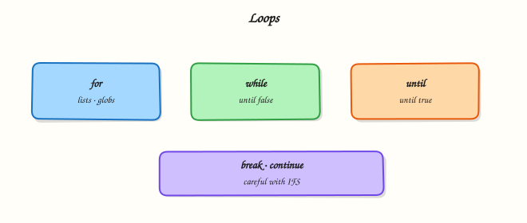

# Loops — for, while, and until

## Overview

When you need the same steps on many files, hosts, or log lines, you use a **loop**. A loop repeats a block of commands until a list ends or a condition changes. Bash gives you three common forms: **`for`** (walk a list or a count), **`while`** (repeat while a command succeeds), and **`until`** (repeat while a command fails). Inside any loop, **`break`** leaves early and **`continue`** skips to the next pass. In this tutorial you will loop over sample files, read lines safely, wait with a bounded `until`, and prove the results under `~/rebash-shell/lab06`.

Loops sit under almost every DevOps and Site Reliability Engineering (SRE) task: fleet health checks, log scans, retrying a readiness probe, pruning old backups, and Continuous Integration (CI) matrix steps. An unbounded wait can hang a deploy. An unquoted glob can expand to nothing or to the wrong paths. A `for line in $(cat file)` pattern splits on spaces and breaks paths with spaces. Good practice is: quote expansions, guard empty globs, use `while IFS= read -r`, and give every retry loop a maximum attempt count.

In production, loop mistakes look like “the job is still running” or “we processed the wrong files”. Teams expect scripts that fail loudly, leave evidence (counts, lists of processed paths), and stop cleanly when a counter expires. Prefer shallow loops and move nested work into functions (next module) when the body grows.

This is **Tutorial 6** in **Module 6: Loops** of the REBASH Academy **Shell Scripting for DevOps Engineers** series. It is written for Linux administrators, DevOps engineers, SRE, and platform engineers. By the end, you will have a small batch processor you can explain in an interview or a change ticket.

## Prerequisites

- [Control Flow — Conditionals](control-flow-conditionals.md)
- Bash 4.2+ on a practice Linux host (Ubuntu virtual machine, Windows Subsystem for Linux, or cloud VM)
- Comfort with `set -euo pipefail`, quoting, and redirection from earlier modules

## Learning Objectives

By the end of this tutorial, you will be able to:

- [ ] Choose `for`, `while`, or `until` for a given ops task and explain why
- [ ] Iterate files with a safe glob (`nullglob` / existence check) and quote each path
- [ ] Stream a file with `while IFS= read -r` without splitting on spaces
- [ ] Bound an `until` readiness loop with a counter and exit non-zero on timeout
- [ ] Use `break` and `continue` deliberately, and save loop evidence for a ticket

## Architecture

Loops sit between your script and the tools it calls. Input lists and streams enter the loop; each iteration runs commands; `break` / `continue` change control; evidence files record what happened.



## Theory

### What it is

A **`for`** loop walks a fixed list, a range, or a glob. A **`while`** loop repeats while a test or command returns success (exit status 0). An **`until`** loop repeats while the test fails — useful for “wait until ready”. **`break`** leaves the nearest loop; **`continue`** skips the rest of the current iteration.

```bash title="Terminal"
for host in web01 web02 web03; do
  printf 'check %s\n' "$host"
done

while IFS= read -r line; do
  printf '%s\n' "$line"
done <"$infile"
```

### Why it matters

Manual repetition does not scale. Checking twenty hosts or pruning a thousand log files by hand invites mistakes. Loops encode that repetition so CI, cron, and admin tooling apply the same steps every time. The cost of a wrong loop is high: an unbounded `until` can hang a deployment pipeline, and an unquoted glob can expand to a literal `*.log` string or to unexpected matches. Safe patterns — quoted paths, `read -r` line loops, and retry counters — keep automation both powerful and predictable.

### How it works

1. **`for item in list`** — expand the list once, then run the body for each item.
2. **Safe globs** — enable `shopt -s nullglob` or guard with `[[ -e "$f" ]] || continue` so a non-match does not become a literal filename.
3. **`while IFS= read -r`** — read one line at a time; `IFS=` keeps leading spaces; `-r` keeps backslashes literal.
4. **`until`** — run until the condition succeeds; always pair with `attempts` / `max` and a sleep.
5. **`break` / `continue`** — exit early or skip one item (for example skip empty files).

```bash
shopt -s nullglob
for f in ./samples/*.log; do
  [[ -f "$f" ]] || continue
  wc -l <"$f"
done

attempts=0
max=5
until [[ -f ./ready.flag ]]; do
  attempts=$((attempts + 1))
  (( attempts <= max )) || { echo "timeout" >&2; exit 1; }
  sleep 1
done
```

Prefer arrays and `"$@"` when the list is dynamic. Keep nested loops shallow; extract the inner body to a function when readability suffers.

### Key concepts and comparisons

| Loop | Prefer when | Avoid when |
|------|-------------|------------|
| `for item in list` | Hosts, files, arguments | Splitting lines with `for x in $(cat …)` |
| `while read -r` | Line-oriented files and pipelines | Binary data (use other tools) |
| `until` | Wait-until-ready with a bound | Infinite waits with no max attempts |
| `break` / `continue` | Skip bad items or stop early | Deep nesting where the target loop is unclear |
| Arrays / `"$@"` | Dynamic input from callers | Unquoted globs for untrusted paths |

| Pattern | Safer alternative |
|---------|-------------------|
| `for line in $(cat file)` | `while IFS= read -r line; do …; done <file` |
| Bare `*.log` with no guard | `nullglob` + `[[ -f "$f" ]]` |
| `until curl …; do sleep 1; done` | Same plus `attempts` / timeout exit |

### Common pitfalls

- Writing `for line in $(cat file)` and splitting on spaces inside lines.
- Forgetting an empty-glob guard so a non-matching pattern becomes a literal string.
- Infinite `until` readiness loops without a max-attempts counter.
- Deep nesting instead of a function, making `break` targets unclear.
- Ignoring non-zero status from loop bodies when `set -e` is active and a command is allowed to fail — use `|| true` only when you mean it.

## Hands-on Lab

### Objective

Build a small batch processor under `~/rebash-shell/lab06` that: (1) loops over sample `.log` files with safe globbing, (2) streams a list with `while read`, (3) waits with a bounded `until`, and (4) uses `break` / `continue` while saving evidence.

### Prerequisites

- Bash 4.2+ and coreutils (`wc`, `mkdir`, `sleep`, `date`)
- Write access under your home directory
- Do **not** point globs at production `/var/log` for this lab

### Lab environment

Workspace: `~/rebash-shell/lab06`

```bash title="Terminal"
mkdir -p ~/rebash-shell/lab06/samples ~/rebash-shell/lab06/out
cd ~/rebash-shell/lab06
set -euo pipefail
bash --version | head -n1 | tee out/bash-version.txt
```

!!! example "Expected output"
    `out/bash-version.txt` exists and mentions `bash`.


### Real-world scenario

Your team runs a nightly job that scans application log snippets on a jump server, skips empty files, waits briefly for a “ready” flag from another job, then writes a count report for the change ticket. You must prove the loop stops on timeout and never treats a missing glob as a real filename.

### Step-by-step tasks

#### Task 1 – Safe `for` over files with `continue`

Create sample logs (including one empty file), then count lines with a guarded glob.

Create `count-logs.sh`:

```bash title="count-logs.sh"
#!/usr/bin/env bash
set -euo pipefail
shopt -s nullglob

outdir="${1:-./out}"
mkdir -p "$outdir"
: > "$outdir/file-counts.txt"

for f in ./samples/*.log; do
  [[ -f "$f" ]] || continue
  # Skip empty files
  if [[ ! -s "$f" ]]; then
    printf 'skip empty: %s\n' "$f" >> "$outdir/skipped.txt"
    continue
  fi
  lines="$(wc -l <"$f" | tr -d ' ')"
  printf '%s %s\n' "$lines" "$f" | tee -a "$outdir/file-counts.txt"
done

test -s "$outdir/file-counts.txt"
```

Run:

```bash title="Terminal"
cd ~/rebash-shell/lab06
set -euo pipefail

printf 'error disk full\ninfo ok\n' > samples/app-a.log
printf 'warn retry\n' > samples/app-b.log
: > samples/empty.log
printf 'not-a-log\n' > samples/readme.txt

chmod +x count-logs.sh
./count-logs.sh ./out

grep -F 'app-a.log' out/file-counts.txt
grep -F 'empty' out/skipped.txt
```


!!! example "Expected output"
    `out/file-counts.txt` lists `app-a.log` and `app-b.log` with line counts; `out/skipped.txt` mentions the empty file; `readme.txt` is not counted.


#### Task 2 – `while read` stream and `break` on sentinel

Build a host list and process lines until a `STOP` marker.

Create `hosts.txt`:

```text title="hosts.txt"
web01
web02
STOP
web03
```

Create `read-hosts.sh`:

```bash title="read-hosts.sh"
#!/usr/bin/env bash
set -euo pipefail
outfile="${1:-./out/hosts-processed.txt}"
: > "$outfile"
while IFS= read -r host || [[ -n "${host:-}" ]]; do
  [[ -n "$host" ]] || continue
  if [[ "$host" == "STOP" ]]; then
    printf 'broke at STOP\n' | tee ./out/break-note.txt
    break
  fi
  printf 'host=%s\n' "$host" | tee -a "$outfile"
done < ./hosts.txt
grep -q 'web01' "$outfile"
grep -q 'web02' "$outfile"
! grep -q 'web03' "$outfile"
```

Run:

```bash title="Terminal"
cd ~/rebash-shell/lab06
set -euo pipefail

chmod +x read-hosts.sh
./read-hosts.sh
```


!!! example "Expected output"
    `out/hosts-processed.txt` has `web01` and `web02` only; `out/break-note.txt` records the break; `web03` is absent.


#### Task 3 – Bounded `until` wait and evidence pack

Simulate a late “ready” flag, then pack proof files.

Create `wait-ready.sh`:

```bash title="wait-ready.sh"
#!/usr/bin/env bash
set -euo pipefail
max=10
attempts=0
until [[ -f ./ready.flag ]]; do
  attempts=$((attempts + 1))
  if (( attempts > max )); then
    printf 'timeout after %s attempts\n' "$max" >&2
    exit 1
  fi
  sleep 1
done
printf 'ready attempts=%s\n' "$attempts" | tee ./out/until-ready.txt
test -s ./ready.flag
```

Run:

```bash title="Terminal"
cd ~/rebash-shell/lab06
set -euo pipefail

rm -f ./ready.flag
(
  sleep 2
  date -u +%Y-%m-%dT%H:%M:%SZ > ./ready.flag
) &

chmod +x wait-ready.sh
./wait-ready.sh

tar -czf out/loop-evidence.tgz \
  out/bash-version.txt out/file-counts.txt out/skipped.txt \
  out/hosts-processed.txt out/break-note.txt out/until-ready.txt \
  ready.flag
ls -l out/loop-evidence.tgz | tee out/evidence-ls.txt
```


!!! example "Expected output"
    `out/until-ready.txt` shows a small attempt count; `out/loop-evidence.tgz` is not empty.


### Validation steps

- [ ] `./count-logs.sh` lists only non-empty `*.log` files under `samples/`
- [ ] `./read-hosts.sh` stops at `STOP` and never processes `web03`
- [ ] `./wait-ready.sh` exits 0 after the flag appears (or would exit 1 on timeout)
- [ ] `out/loop-evidence.tgz` exists under `~/rebash-shell/lab06`

### Common errors and fixes

| Error | Cause | Fix |
|-------|-------|-----|
| Loop body runs once on literal `*.log` | Empty match without `nullglob` | `shopt -s nullglob` or `[[ -e "$f" ]] \|\| continue` |
| Paths with spaces break | Unquoted `$f` or `for x in $(…)` | Quote `"$f"`; use `while read -r` |
| `until` never ends | No max attempts | Add counter + `exit 1` on timeout |
| `set -e` aborts on `grep` miss | Expected “not found” check | Use `! grep -q …` or `grep -q … \|\| true` deliberately |
| Background ready job not finished | Script ends too early | Keep `wait-ready.sh` after starting the sleeper |

### Challenge exercise

Extend `count-logs.sh` into `count-logs-max.sh` that accepts a maximum line count as `$1` and **`break`s** out of the file loop once the **running total** of lines reaches that maximum. Write `out/total-stopped.txt` with the final total and prove with `./count-logs-max.sh 2` that processing stops early (total ≥ 2, and not every non-empty file is required). Keep the script executable under `~/rebash-shell/lab06`.

### Learning outcomes

- Used a safe `for` glob with `continue` for empty files
- Streamed lines with `while read` and stopped with `break`
- Bounded an `until` wait and packed evidence for a ticket

### Cleanup

```bash title="Terminal"
cd ~/rebash-shell/lab06
set -euo pipefail
rm -f ready.flag
# Keep out/ and scripts for review, or remove the lab tree:
# rm -rf ~/rebash-shell/lab06
```

## Validation

- [ ] Lab finished under `~/rebash-shell/lab06/` with evidence archive
- [ ] You can explain when to use `for` vs `while read` vs `until`
- [ ] You can describe why empty-glob guards matter in cron and CI
- [ ] You know one production failure mode: unbounded wait or bad glob

## Code Walkthrough

In real servers, loop-heavy automation for **for / while / until** usually follows this order:

1. **Define the input** — explicit file list, `"$@"`, or a guarded glob under a known directory  
2. **Choose the loop** — `for` for lists; `while read` for streams; `until` for waits  
3. **Fail safely** — quote paths; skip bad items with `continue`; bound retries  
4. **Prove results** — write counts or processed lists under an `out/` folder  
5. **Keep nesting shallow** — move complex bodies into functions (next module)  

Later you can wrap the same patterns in systemd timers or CI jobs. Reviewers still expect a timeout and clear evidence.

## Security Considerations

- Never expand untrusted user input as a glob without an allow-listed directory prefix  
- Do not `rm` or overwrite inside a loop until paths are validated  
- Treat log contents as sensitive — avoid printing secrets to world-readable evidence files  
- Prefer least privilege — this lab needs only home-directory write access  
- Cap retries so a hung dependency cannot keep a privileged agent busy forever  

## Common Mistakes

!!! warning "Using `for line in $(cat file)`"
    Word-splitting breaks lines with spaces. **Fix:** `while IFS= read -r line; do …; done <file`.

!!! warning "Leaving `until` unbounded"
    CI jobs hang until killed. **Fix:** max attempts + non-zero exit + message on stderr.

!!! warning "Unquoted glob results"
    Spaces and special characters rewrite the command line. **Fix:** always `"$f"` and test with `[[ -f "$f" ]]`.

!!! warning "Relying on a literal `*.log` when nothing matches"
    The loop runs once on the pattern string. **Fix:** `shopt -s nullglob` or existence checks.

## Best Practices

- One clear purpose per loop; log skips and timeouts to stderr  
- Prefer `nullglob` (or fail-if-empty) for batch file jobs  
- Write machine-readable evidence (`file-counts.txt`) for tickets and CI artefacts  
- Keep `sleep` intervals and max attempts configurable with variables  
- Run ShellCheck on scripts that use loops before merging  

## Troubleshooting

| Symptom | Likely cause | Fix |
|---------|--------------|-----|
| Loop runs once on `*.log` | No matches, no `nullglob` | Enable `nullglob` or guard with `[[ -e` |
| Script hangs | Unbounded `until` / wait | Add counter and timeout exit |
| Missing lines with spaces | `for x in $(…)` | Switch to `while read -r` |
| `set -e` exits mid-loop | Command returned non-zero | Handle expected failures explicitly |
| Background flag never appears | Sleeper not started / wrong cwd | Start sleeper from lab directory first |

## Summary

Loops repeat work over lists, streams, and wait conditions. Prefer safe globs, `while read -r` for lines, and bounded `until` waits — then prove results with evidence files. Next, package reusable loop bodies as functions in [Functions, Parameters, and Locals](functions-parameters-and-locals.md).

## Interview Questions

**1. When would you choose `while IFS= read -r` over `for item in $(cat file)`?**

??? success "Reveal answer"
    Use **`while IFS= read -r`** whenever input is line-oriented (logs, host lists, CSV-like rows). `for item in $(cat file)` performs word-splitting on spaces and globbing, so paths or messages with spaces break. `IFS=` preserves leading whitespace; `-r` keeps backslashes literal. Interviewers want the streaming pattern, not `cat` into `for`.

**2. A glob `./logs/*.log` matches nothing. What happens in a `for` loop by default, and how do you harden it?**

??? success "Reveal answer"
    By default Bash leaves the pattern as a **literal** string, so the loop may run once on `./logs/*.log`. Harden with `shopt -s nullglob` (zero iterations) or `[[ -e "$f" ]] || continue`, and fail the job if zero files are unexpected. Production scripts should treat “no files” as either success-with-skip or hard failure — never as a fake filename.

**3. How do you implement a readiness wait with `until` without hanging CI forever?**

??? success "Reveal answer"
    Pair `until` with an **attempt counter** (and optional timeout timestamp). On each failure, increment, sleep briefly, and if `attempts > max` print to stderr and `exit 1`. Optionally write the attempt count to an evidence file. Never ship bare `until curl …; do sleep 1; done` in shared pipelines.

**4. What is the difference between `break` and `continue` in a file-processing loop?**

??? success "Reveal answer"
    **`continue`** skips the rest of the **current** iteration (for example skip an empty file and move to the next). **`break`** leaves the loop entirely (for example stop when a `STOP` sentinel appears or a quota is reached). Prefer clear reasons logged to stderr so operators know why items were skipped or processing stopped.

**5. Why is `shopt -s nullglob` useful in cron batch jobs that delete or archive matching files?**

??? success "Reveal answer"
    Without `nullglob`, a non-matching pattern can become a literal argument to `rm` or `mv`, which is confusing or dangerous. With `nullglob`, the loop body simply does not run. Many teams also require an explicit “zero matches” log line so silent no-ops are visible in monitoring.

**6. How would you prove in a change ticket that your loop processed the right set of files?**

??? success "Reveal answer"
    Save a **manifest**: path + line count (or checksum) per processed file, a list of skipped paths, and a final archive (`tar`) of those evidence files. Show that non-matching extensions were ignored and that empty files were skipped if that was the rule. Evidence beats “it worked on my laptop”.

**7. When should nested loops be replaced with a function call?**

??? success "Reveal answer"
    When the inner body is more than a few lines, needs its own locals, or you need a clear `return` status per item. Nested `break`/`continue` become hard to review. Extract `process_one "$item"` (next module covers `local` and return codes) and keep the outer loop as a thin driver.

## Related Tutorials

- [Shell Scripting for DevOps Engineers – Overview](index.md)
- [Control Flow — Conditionals](control-flow-conditionals.md) *(previous)*
- [Functions, Parameters, and Locals](functions-parameters-and-locals.md) *(next)*
- [File Operations in Shell](file-operations-in-shell.md)

## References

- [Bash loops (GNU Bash manual)](https://www.gnu.org/software/bash/manual/html_node/Looping-Constructs.html)  
- [Bash `read` builtin](https://www.gnu.org/software/bash/manual/html_node/Bash-Builtins.html)  
- [ShellCheck](https://www.shellcheck.net/) — static checks for loop and quoting issues  
- Track index: [Shell Scripting for DevOps Engineers](index.md)
