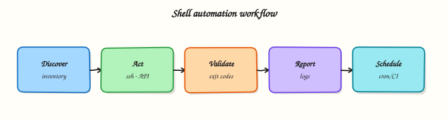

# Production Shell Scripting

## Overview

A script that works once on your laptop is not yet production-ready. Production Bash must survive **overlapping cron**, bad input, and operators who only read `--help` at 02:00. Continuous Integration (CI) also needs a clear contract: flags, exit codes, and one machine-readable **RESULT** line.

**Production shell scripting** means: **ShellCheck** in CI, **idempotent** re-runs, **secure** defaults (no `eval`, no secrets on argv), structured **logging**, **locking** so two jobs do not corrupt state, and flags such as `--help` and `--dry-run`. On cloud VMs and build agents, locks (`mkdir` or `flock`) stop double backups; a single `RESULT=status=ok;files=3` line on stdout keeps parsers simple while logs stay on stderr.

This is **Tutorial 17** in **Module 17: Production Shell Scripting** of the REBASH Academy **Shell Scripting for DevOps Engineers** series. It is written for Linux administrators, DevOps engineers, Site Reliability Engineering (SRE), and platform engineers. By the end, you will ship a small tool with help text, dry-run, locking, and a RESULT line you can show in an interview.

## Prerequisites

- [Error Handling, Logging, and Debugging](error-handling-logging-and-debugging.md)
- Bash 4.2+ on a practice Linux host (Ubuntu 22.04/24.04 VM, WSL2, or similar)
- Optional but useful: `shellcheck` package (`sudo apt-get install -y shellcheck` on Ubuntu)

## Learning Objectives

By the end of this tutorial, you will be able to:

- [ ] Structure a ShellCheck-friendly script with `set -euo pipefail`, quoting, and clear functions
- [ ] Implement `--help` and `--dry-run` flags with a documented exit-code table
- [ ] Prevent overlapping runs using `mkdir`-based locking or `flock`
- [ ] Emit a structured `RESULT=...` line on stdout while logging to stderr
- [ ] Explain idempotency and one secure scripting rule for production Bash

## Architecture

Production scripts sit between schedulers/CI and system tools. Flags, locks, and RESULT lines form the operator contract; ShellCheck and strict mode reduce defects before merge.



## Theory

### What it is

**ShellCheck** is a static analysis tool for shell scripts. It finds unquoted expansions, incorrect `cd` usage, and other bugs before runtime. An **idempotent** script can run twice and leave the system in the same intended state (for example `mkdir -p`, create a user only if missing). A **dry-run** flag prints actions without changing the system. A **lock** ensures only one instance runs critical work — commonly `flock` on a lock file, or `mkdir` as an atomic lock directory.

```bash title="Terminal"
# Atomic lock with mkdir (works without flock)
if ! mkdir /tmp/myjob.lock 2>/dev/null; then
  echo "another instance is running" >&2
  exit 4
fi
trap 'rmdir /tmp/myjob.lock' EXIT
```

### Why it matters

Cron does not care that the last run is still going. Two backups writing the same folder can corrupt archives. Scripts without `--help` or dry-run waste time in incidents. Teams that skip ShellCheck keep rediscovering the same quoting bugs. Production standards make Bash reviewable, safe under overlap, and clear to automation.

### How it works

1. **Shebang and strict mode** — `#!/usr/bin/env bash` then `set -euo pipefail`.
2. **Parse flags early** — `--help`, `--dry-run`, required args; exit `1` on bad usage.
3. **Acquire a lock** — `flock` or `mkdir`; release on `EXIT`.
4. **Log to stderr** — timestamps and levels; keep stdout for `RESULT=...`.
5. **Do work idempotently** — check before create; support dry-run.
6. **Gate in CI** — `shellcheck script.sh` must pass (disable rules only with a short comment).

```bash
usage() {
  cat <<'EOF'
Usage: rotate-logs.sh [--dry-run] --dir DIR
Exit codes: 0 ok, 1 usage, 2 missing tool, 3 work failed, 4 locked
EOF
}
```

Secure defaults: never `eval` user input, never `rm -rf` on unquoted paths, keep secrets out of the script body and RESULT lines.

### Key concepts and comparisons

| Concern | Mechanism | Operator signal |
|---------|-----------|-----------------|
| Static defects | ShellCheck in CI | Build fails before merge |
| Overlap | `flock` / `mkdir` lock | Exit `4` + clear stderr |
| Preview | `--dry-run` | Logs say `would ...` |
| Automation parse | `RESULT=key=value;...` | One stdout line |
| Re-runs | Idempotent steps | Second run exits `0` with `RESULT=status=noop` |

| Lock style | Prefer when | Avoid when |
|------------|-------------|------------|
| `flock` on a file | `flock` is available; long jobs | Minimal containers without `flock` |
| `mkdir` lock dir | Portable atomic create | Need waiting/queueing (mkdir is usually fail-fast) |
| No lock | Read-only checks | Any writer job on a schedule |

### Common pitfalls

- Parsing flags after side effects have already started.
- Lock file created but never removed on failure (missing EXIT trap).
- Dry-run that still deletes or moves files (“half dry-run”).
- ShellCheck disabled globally instead of one justified line.
- Putting secrets in the RESULT line or in world-readable logs.

## Hands-on Lab

### Objective

Build `rotate-demo.sh` under `~/rebash-shell/lab17`: ShellCheck-friendly, with `--help`, `--dry-run`, `mkdir` locking, stderr logs, and a structured `RESULT` line. Prove lock contention and dry-run behaviour with evidence files.

### Prerequisites

- Bash 4.2+
- Optional: `shellcheck` (lab still works without it; Task 1 skips the check if missing)
- No root required

### Lab environment

Workspace: `~/rebash-shell/lab17`

```bash title="Terminal"
mkdir -p ~/rebash-shell/lab17 && cd ~/rebash-shell/lab17
set -euo pipefail
bash --version | head -n1 | tee bash-version.txt
command -v shellcheck >/dev/null 2>&1 && shellcheck --version | head -n1 | tee shellcheck-version.txt || echo 'shellcheck not installed' | tee shellcheck-version.txt
```

!!! example "Expected output"
    version files exist; ShellCheck may be “not installed” — that is acceptable for the lab.


### Real-world scenario

Ops wants a tiny log-rotation helper for a practice app directory. Requirements: (1) `--help` for the on-call runbook, (2) `--dry-run` for change review, (3) only one rotation at a time (lock), and (4) a `RESULT=...` line so a wrapper script can alert on failure. You implement and prove it locally.

### Step-by-step tasks

#### Task 1 – Production script with help, dry-run, and mkdir lock

Create `rotate-demo.sh`:

```bash title="rotate-demo.sh"
#!/usr/bin/env bash
set -euo pipefail

readonly E_OK=0
readonly E_USAGE=1
readonly E_MISSING=2
readonly E_WORK=3
readonly E_LOCKED=4

DRY_RUN=0
TARGET_DIR=""
LOCK_DIR=""

log() {
  local level=$1; shift
  printf '[%s] %s: %s\n' "$(date '+%Y-%m-%dT%H:%M:%S%z')" "${level}" "$*" >&2
}

usage() {
  cat <<'USAGE'
Usage: rotate-demo.sh [--dry-run] --dir DIR

Rotate *.log files in DIR to *.log.1 (demo only).

Exit codes:
  0  ok
  1  usage error
  2  missing dependency
  3  work failed
  4  another instance holds the lock
USAGE
}

release_lock() {
  if [[ -n "${LOCK_DIR}" && -d "${LOCK_DIR}" ]]; then
    rmdir "${LOCK_DIR}" 2>/dev/null || true
  fi
}

acquire_lock() {
  LOCK_DIR="${TARGET_DIR}/.rotate-demo.lock"
  if ! mkdir "${LOCK_DIR}" 2>/dev/null; then
    log ERROR "locked: ${LOCK_DIR}"
    exit "${E_LOCKED}"
  fi
  trap release_lock EXIT
}

rotate_once() {
  local dir=$1
  local count=0
  local f base dest

  shopt -s nullglob
  for f in "${dir}"/*.log; do
    base=$(basename "${f}")
    dest="${dir}/${base}.1"
    if [[ -e "${dest}" ]]; then
      log INFO "skip already rotated: ${base}"
      continue
    fi
    if [[ "${DRY_RUN}" -eq 1 ]]; then
      log INFO "would rotate ${base} -> ${base}.1"
    else
      mv "${f}" "${dest}"
      log INFO "rotated ${base} -> ${base}.1"
    fi
    count=$((count + 1))
  done
  shopt -u nullglob

  if [[ "${DRY_RUN}" -eq 1 ]]; then
    printf 'RESULT=status=dry-run;rotated=%s;dir=%s\n' "${count}" "${dir}"
  elif [[ "${count}" -eq 0 ]]; then
    printf 'RESULT=status=noop;rotated=0;dir=%s\n' "${dir}"
  else
    printf 'RESULT=status=ok;rotated=%s;dir=%s\n' "${count}" "${dir}"
  fi
}

main() {
  while [[ $# -gt 0 ]]; do
    case "$1" in
      -h|--help) usage; exit "${E_OK}" ;;
      --dry-run) DRY_RUN=1; shift ;;
      --dir)
        [[ $# -ge 2 ]] || { usage; exit "${E_USAGE}"; }
        TARGET_DIR=$2
        shift 2
        ;;
      *) usage; exit "${E_USAGE}" ;;
    esac
  done

  [[ -n "${TARGET_DIR}" ]] || { usage; exit "${E_USAGE}"; }
  [[ -d "${TARGET_DIR}" ]] || { log ERROR "not a directory: ${TARGET_DIR}"; exit "${E_USAGE}"; }
  command -v mv >/dev/null || exit "${E_MISSING}"

  acquire_lock
  log INFO "start dry_run=${DRY_RUN} dir=${TARGET_DIR}"
  rotate_once "${TARGET_DIR}" || exit "${E_WORK}"
}

main "$@"
```

Run:

```bash title="Terminal"
cd ~/rebash-shell/lab17
set -euo pipefail

chmod +x rotate-demo.sh

if command -v shellcheck >/dev/null 2>&1; then
  shellcheck -x rotate-demo.sh | tee shellcheck-out.txt
  test ! -s shellcheck-out.txt
  echo 'shellcheck_ok' | tee shellcheck-status.txt
else
  echo 'shellcheck_skipped' | tee shellcheck-status.txt
fi

./rotate-demo.sh --help | tee help.txt
grep -F 'Exit codes:' help.txt
```


!!! example "Expected output"
    `help.txt` shows usage and exit codes; `shellcheck-status.txt` is `shellcheck_ok` or `shellcheck_skipped`.


#### Task 2 – Dry-run, real run, and RESULT line

```bash title="Terminal"
cd ~/rebash-shell/lab17
set -euo pipefail

DEMO=~/rebash-shell/lab17/demo-logs
rm -rf "${DEMO}"
mkdir -p "${DEMO}"
printf 'line1\n' >"${DEMO}/app.log"
printf 'line2\n' >"${DEMO}/api.log"

./rotate-demo.sh --dry-run --dir "${DEMO}" | tee dry-run-result.txt
grep -F 'RESULT=status=dry-run;rotated=2' dry-run-result.txt
test -f "${DEMO}/app.log"
test -f "${DEMO}/api.log"

./rotate-demo.sh --dir "${DEMO}" | tee real-run-result.txt
grep -F 'RESULT=status=ok;rotated=2' real-run-result.txt
test -f "${DEMO}/app.log.1"
test -f "${DEMO}/api.log.1"
test ! -f "${DEMO}/app.log"

./rotate-demo.sh --dir "${DEMO}" | tee second-run-result.txt
grep -F 'RESULT=status=noop;rotated=0' second-run-result.txt
```

!!! example "Expected output"
    dry-run leaves `.log` files in place; real run creates `.log.1`; second run reports `noop`.


#### Task 3 – Lock contention evidence

Hold the lock in the background and show the second instance exits `4`.

```bash title="Terminal"
cd ~/rebash-shell/lab17
set -euo pipefail

DEMO=~/rebash-shell/lab17/demo-logs
LOCK="${DEMO}/.rotate-demo.lock"
mkdir -p "${DEMO}"
mkdir "${LOCK}"

set +e
./rotate-demo.sh --dir "${DEMO}" >lock-stdout.txt 2>lock-stderr.txt
ec=$?
set -e
printf '%s\n' "${ec}" | tee lock-exit-code.txt
test "${ec}" -eq 4
grep -F 'locked' lock-stderr.txt | tee lock-stderr-snip.txt

rmdir "${LOCK}"

tar -czf production-shell-evidence.tgz \
  bash-version.txt shellcheck-version.txt shellcheck-status.txt \
  rotate-demo.sh help.txt \
  dry-run-result.txt real-run-result.txt second-run-result.txt \
  lock-exit-code.txt lock-stderr-snip.txt
ls -l production-shell-evidence.tgz | tee evidence-ls.txt
```

!!! example "Expected output"
    `lock-exit-code.txt` is `4`; evidence archive exists.


### Validation steps

- [ ] `./rotate-demo.sh --help` prints exit codes
- [ ] Dry-run does not rename files
- [ ] Real run emits `RESULT=status=ok;rotated=...`
- [ ] Second instance while lock held exits `4`
- [ ] `production-shell-evidence.tgz` exists under `~/rebash-shell/lab17`

### Common errors and fixes

| Error | Cause | Fix |
|-------|-------|-----|
| `locked` on every run | Stale lock dir after kill -9 | `rmdir` the `.rotate-demo.lock` after confirming no process holds it |
| ShellCheck SC2086 | Unquoted variable | Quote `"${var}"` expansions |
| Dry-run still moved files | Forgot to branch on `DRY_RUN` | Log `would ...` and skip `mv` |
| `RESULT` missing | Printed only logs | Keep `printf 'RESULT=...'` on stdout |
| Exit `1` with good args | `--dir` path wrong / missing | Pass an existing directory |

### Challenge exercise

Add an optional `--flock` mode that locks with `flock` on `${TARGET_DIR}/.rotate-demo.flock` instead of `mkdir` (keep `mkdir` as the default). Prove with a short background holder using `flock -n` / `flock -x`, save `challenge-flock-exit.txt` (expect `4` or your chosen busy code), and keep the script ShellCheck-clean.

### Learning outcomes

- Built a flag-driven, ShellCheck-friendly ops script
- Used `--dry-run` and a structured `RESULT` line
- Proved `mkdir` locking under contention
- Practised idempotent second-run behaviour (`noop`)

### Cleanup

```bash title="Terminal"
cd ~/rebash-shell/lab17
set -euo pipefail
rm -rf demo-logs
rm -f rotate-demo.sh help.txt dry-run-result.txt real-run-result.txt second-run-result.txt
rm -f lock-stdout.txt lock-stderr.txt lock-exit-code.txt lock-stderr-snip.txt
# Keep production-shell-evidence.tgz if you want proof; otherwise remove it
```

## Validation

- [ ] Lab finished under `~/rebash-shell/lab17/` with evidence files
- [ ] You can explain why production scripts need locks and dry-run
- [ ] You can describe a ShellCheck workflow in CI
- [ ] You know one failure mode: overlapping cron without a lock

## Code Walkthrough

In production Bash for this topic, use this order:

1. **Parse flags and validate inputs** before any mutation  
2. **Acquire the lock** and register EXIT cleanup  
3. **Log intent** (including dry-run) on stderr  
4. **Mutate idempotently** or print `would ...`  
5. **Print one RESULT line** and exit with a documented code  

Treat ShellCheck failures like unit-test failures.

## Security Considerations

- Never `eval` user input or remote curl output  
- Quote path expansions; refuse `rm -rf` on unchecked variables  
- Do not put secrets in argv, RESULT lines, or world-readable logs  
- Run scheduled jobs as a least-privilege user when possible  
- Prefer local lock/data dirs over world-writable shared paths  

## Common Mistakes

!!! warning "Skipping the lock on scheduled writers"
    Two cron ticks corrupt the same archive. **Fix:** `flock` or `mkdir` lock with EXIT cleanup; exit busy with a clear code.

!!! warning "Dry-run that still changes the system"
    Reviewers lose trust. **Fix:** every mutation path must check `DRY_RUN` first.

!!! warning "Ignoring ShellCheck in CI"
    Quoting bugs return in production. **Fix:** run `shellcheck` on every change; disable rules line-by-line with a reason.

!!! warning "Mixing logs into RESULT"
    Parsers break. **Fix:** stderr for humans, one RESULT line on stdout.

## Best Practices

- Document flags and exit codes in `--help`  
- Prefer idempotent operations and safe re-runs  
- Fail fast on lock contention (or document a wait/timeout)  
- Gate merges on ShellCheck  
- Keep scripts short; move complex logic elsewhere when needed  

## Troubleshooting

| Symptom | Likely cause | Fix |
|---------|--------------|-----|
| Always exit `4` | Stale lock directory | Remove lock after confirming no runner |
| RESULT parse fails | Extra lines on stdout | Print exactly one RESULT line |
| Dry-run differs from real run | Branch missing a mutation | Audit every `mv`/`cp`/`rm` for `DRY_RUN` |
| Works in shell, fails in cron | Short PATH / relative paths | Absolute paths; set `PATH` in the script |

## Summary

Production shell scripting is a **contract**: help text, dry-run, locks, ShellCheck, and a clear RESULT line. Build those properties on purpose — do not bolt them on after the first outage. Next, practise a methodical debug loop on a broken script in [Troubleshooting Shell Scripts](troubleshooting-shell-scripts.md).

## Interview Questions

**1. What makes a Bash script “production-ready” beyond “it worked on my laptop”?**

??? success "Reveal answer"
    Strict mode, quoted expansions, documented flags/exit codes, logging on stderr, idempotent behaviour, locking against overlap, dry-run for review, and static analysis (ShellCheck) in CI. Production also means safe secret handling and clear behaviour under cron’s minimal environment.

**2. Compare `flock` and `mkdir` for locking. When do you choose each?**

??? success "Reveal answer"
    **`flock`** is excellent when available: it can wait, and the kernel releases the lock when the process dies. **`mkdir`** is a portable atomic “create or fail” lock that works in minimal environments without `flock`, but stale directories can remain after a hard kill. Choose `flock` on normal Linux ops hosts; use `mkdir` when you need a tiny portable fail-fast lock and document stale-lock recovery.

**3. How should a script expose success to both humans and automation?**

??? success "Reveal answer"
    Humans read stderr logs with timestamps and levels. Automation reads a single structured stdout line such as `RESULT=status=ok;rotated=2` and the process exit code. Do not force tools to scrape free-text logs for the primary status.

**4. Why is `--dry-run` valuable in a change ticket or pull request?**

??? success "Reveal answer"
    Reviewers can see intended renames/deletes without touching production data. Dry-run reduces surprise and supports evidence (“this is what tonight’s job would do”). It must be honest — no mutations in dry-run paths.

**5. What is idempotency in shell automation, with a concrete example?**

??? success "Reveal answer"
    Running the script twice leaves the system in the same intended state. Example: create a directory with `mkdir -p`, or skip rotating a log when `file.log.1` already exists and report `RESULT=status=noop`. Idempotency makes retries and overlapping schedules safer.

**6. How do you use ShellCheck in a team workflow without drowning in noise?**

??? success "Reveal answer"
    Run ShellCheck in CI on every change, fix real issues (especially quoting), and disable a rule only on a specific line with a short comment explaining why. Do not disable ShellCheck globally. Treat new warnings as defects, same as failing tests.

**7. A nightly job sometimes corrupts backups. What production controls do you add first?**

??? success "Reveal answer"
    Add a lock so only one backup runs, ensure failures exit non-zero (strict mode + checks that output files exist), log to a file, and alert on non-zero exit. Then add dry-run for test restores and consider retries only for clear transient network errors — not for local disk failures.

## Related Tutorials

- [Shell Scripting for DevOps Engineers – Overview](index.md)
- [Error Handling, Logging, and Debugging](error-handling-logging-and-debugging.md) *(previous)*
- [Troubleshooting Shell Scripts](troubleshooting-shell-scripts.md) *(next)*
- [Scheduling — cron, at, and systemd Timers](scheduling-cron-at-and-timers.md) *(related)*

## References

- [ShellCheck documentation](https://www.shellcheck.net/wiki/) — static analysis  
- [`flock(1)`](https://manpages.ubuntu.com/manpages/jammy/en/man1/flock.1.html) — file locks  
- [Bash FAQ — Exit codes and traps](https://mywiki.wooledge.org/BashFAQ) — Wooledge BashFAQ  
- Track index: [Shell Scripting for DevOps Engineers](index.md)
