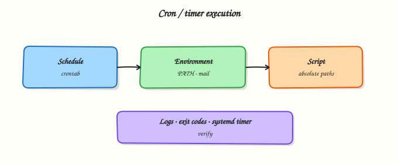

# Scheduling — cron, at, and Timers

## Overview

Many admin scripts should run **without you watching the terminal**: nightly backups, certificate checks, report generators, and cleanup jobs. Linux gives you three common tools: **`cron`** (repeating schedule), **`at`** (one-shot at a future time), and **systemd timers** (modern alternative with better logging). In this tutorial you schedule a small script that **writes a timestamp file**, list the job, then **remove the schedule** in cleanup.

This is **Tutorial 15** in **Module 15: Scheduling** of the REBASH Academy **Shell Scripting for DevOps Engineers** series. It is written for Linux administrators, DevOps engineers, Site Reliability Engineering (SRE), and platform engineers. By the end, you will have a working schedule under `~/rebash-shell/lab15` using a **user crontab** or a **systemd --user timer** when available.

In production, cron jobs fail silently when `PATH` is wrong or the script is not executable. systemd timers integrate with `journalctl` and dependency ordering. Prefer absolute paths, log files, and a cleanup plan so lab schedules do not linger on shared machines.

## Prerequisites

- [JSON and YAML with jq and yq](json-and-yaml-with-jq-yq.md)
- Bash 4.2+ on Linux (Ubuntu 22.04/24.04 practice VM preferred)
- Permission to edit **your** user crontab, **or** `systemctl --user` with lingering if needed for timers

## Learning Objectives

By the end of this tutorial, you will be able to:

- [ ] Explain cron versus `at` versus systemd timers at a high level
- [ ] Write a script that appends a UTC timestamp to a file
- [ ] Install a user crontab entry **or** a systemd --user timer
- [ ] List scheduled jobs and prove the script ran (or was triggered)
- [ ] Remove the lab schedule cleanly so nothing is left behind

## Architecture

Schedulers start your script on a timetable. The script writes evidence (a timestamp file). Operators list and remove jobs with `crontab` or `systemctl --user`.



## Theory

### What it is

**cron** runs commands on a repeating calendar (`minute hour day month weekday`). User crontabs are edited with `crontab -e` and listed with `crontab -l`. **`at`** runs a command once at a given time (`atq` lists, `atrm` removes). **systemd timers** pair a `.timer` unit with a `.service` unit; user timers live under `~/.config/systemd/user/`.

```bash
crontab -l
systemctl --user list-timers
atq
```

### Why it matters

Unattended jobs are how operations scale. A wrong schedule can miss backups or run too often and overload a system. Silent failures are common: cron uses a minimal environment, so `myscript` on your interactive `PATH` may not be found. Timers make status and logs easier on modern Ubuntu hosts. Either way, every lab schedule needs a **cleanup** step.

### How it works

1. **Script** — absolute paths; write logs under `$HOME`; `set -euo pipefail`.  
2. **cron** — five time fields + command; redirect stdout/stderr to a log.  
3. **at** — `echo /path/script | at now + 1 minute` for one-shot tests.  
4. **systemd --user** — `*.service` runs the script; `*.timer` sets `OnCalendar=` or `OnUnitActiveSec=`; `daemon-reload` + `enable --now`.  
5. **Prove** — timestamp file grows or appears; list the schedule; then remove it.

Example cron line (every minute — lab only):

```cron
* * * * * /home/YOU/rebash-shell/lab15/stamp.sh >> /home/YOU/rebash-shell/lab15/cron.log 2>&1
```

Example timer idea: `OnCalendar=*:0/1` (every minute) for a short lab, then disable.

### Key concepts and comparisons

| Tool | Repeats? | Good for | Watch out for |
|------|----------|----------|---------------|
| `cron` | Yes | Simple user/system schedules | Minimal `PATH`; mail on output |
| `at` | Once | Deferred one-shot work | `atd` must be running |
| systemd timer | Yes | Apps already on systemd; journal logs | User vs system scope; lingering |

| Pattern | Prefer when | Avoid when |
|---------|-------------|------------|
| User crontab | Per-engineer lab jobs | Needing root-only system paths without rights |
| systemd --user timer | Better unit status/logs | Environments without user systemd |
| Absolute paths | Always in schedules | Relying on interactive aliases |
| Cleanup removes unit/cron | Shared practice VMs | Leaving every-minute jobs forever |

### Common pitfalls

- Relative paths and missing `PATH` in cron.
- Forgetting to redirect output — some systems mail you on every run.
- Enabling a every-minute lab timer and never disabling it.
- Editing `/etc/crontab` when a user crontab was enough.
- Assuming `at` works when `atd` is not installed or running.

## Hands-on Lab

### Objective

Create `stamp.sh` that writes UTC timestamps, schedule it with a **user crontab** or a **systemd --user timer** (whichever works on your host), list the job, prove output, then remove the schedule. Workspace: `~/rebash-shell/lab15`.

### Prerequisites

- `bash`, `date`
- Either `crontab` **or** `systemctl --user`
- Ability to wait about one minute for a trigger (or run the script once manually as a proof fallback)

### Lab environment

Workspace: `~/rebash-shell/lab15`

```bash
mkdir -p ~/rebash-shell/lab15 && cd ~/rebash-shell/lab15
set -euo pipefail
whoami | tee runner.txt
echo "HOME=$HOME" | tee home.txt
command -v crontab >/dev/null && echo 'crontab=yes' | tee scheduler-tools.txt || echo 'crontab=no' | tee scheduler-tools.txt
systemctl --user status >/dev/null 2>&1 && echo 'user_systemd=yes' | tee -a scheduler-tools.txt || echo 'user_systemd=no' | tee -a scheduler-tools.txt
```

**Expected output:** `runner.txt`, `home.txt`, and `scheduler-tools.txt` exist.

### Real-world scenario

You need a tiny heartbeat file for a practice monitoring demo: every minute, append a UTC timestamp. You must show the schedule to a reviewer, prove the file updates, then remove the job so the practice VM stays clean.

### Step-by-step tasks

#### Task 1 – Timestamp script

```bash
cd ~/rebash-shell/lab15
set -euo pipefail

LAB="$HOME/rebash-shell/lab15"
cat > stamp.sh << EOF
#!/usr/bin/env bash
set -euo pipefail
LAB="$LAB"
mkdir -p "\$LAB"
date -u +%Y-%m-%dT%H:%M:%SZ >> "\$LAB/stamps.txt"
echo "stamped=yes" >> "\$LAB/stamp-run.log"
EOF
chmod +x stamp.sh

# Manual once (proof the script works even before the scheduler fires)
./stamp.sh
test -s stamps.txt
grep -E '^[0-9]{4}-' stamps.txt | tee stamps-manual.txt
```

**Expected output:** `stamps.txt` has at least one UTC timestamp line.

#### Task 2 – Schedule with crontab or systemd --user timer

```bash
cd ~/rebash-shell/lab15
set -euo pipefail
LAB="$HOME/rebash-shell/lab15"

schedule_with_cron() {
  # Keep any existing crontab lines that are not ours, then add lab line
  tmp="$(mktemp)"
  crontab -l 2>/dev/null | grep -v 'rebash-shell/lab15/stamp.sh' >"$tmp" || true
  echo "* * * * * $LAB/stamp.sh >> $LAB/cron.log 2>&1" >>"$tmp"
  crontab "$tmp"
  rm -f "$tmp"
  echo "scheduler=cron" | tee schedule-type.txt
  crontab -l | tee crontab-list.txt
  grep -F 'rebash-shell/lab15/stamp.sh' crontab-list.txt
}

schedule_with_user_timer() {
  mkdir -p "$HOME/.config/systemd/user"
  cat > "$HOME/.config/systemd/user/rebash-lab15-stamp.service" << EOF
[Unit]
Description=REBASH lab15 stamp script

[Service]
Type=oneshot
ExecStart=$LAB/stamp.sh
WorkingDirectory=$LAB
EOF

  cat > "$HOME/.config/systemd/user/rebash-lab15-stamp.timer" << 'EOF'
[Unit]
Description=REBASH lab15 stamp timer (every minute)

[Timer]
OnCalendar=*:0/1
Persistent=true
Unit=rebash-lab15-stamp.service

[Install]
WantedBy=timers.target
EOF

  systemctl --user daemon-reload
  systemctl --user enable --now rebash-lab15-stamp.timer
  echo "scheduler=systemd-user" | tee schedule-type.txt
  systemctl --user list-timers --all | tee timers-list.txt
  grep -F 'rebash-lab15-stamp' timers-list.txt
}

if systemctl --user status >/dev/null 2>&1; then
  schedule_with_user_timer
elif command -v crontab >/dev/null 2>&1; then
  schedule_with_cron
else
  echo "ERROR: need systemctl --user or crontab" >&2
  exit 1
fi
```

**Expected output:** `schedule-type.txt` is `cron` or `systemd-user`; list file shows the lab job.

#### Task 3 – Prove run, list jobs, prepare cleanup notes

```bash
cd ~/rebash-shell/lab15
set -euo pipefail

before=$(wc -l < stamps.txt | tr -d ' ')
echo "lines_before=$before" | tee prove.txt

# Wait for scheduler (up to ~75s). If the environment cannot fire timers/cron,
# run once more manually and note fallback — still keep the schedule list proof.
set +e
for i in 1 2 3 4 5 6 7 8 9 10 11 12 13 14 15; do
  after=$(wc -l < stamps.txt | tr -d ' ')
  if (( after > before )); then
    echo "lines_after=$after" | tee -a prove.txt
    echo "proof=scheduler_or_overlap" | tee -a prove.txt
    break
  fi
  sleep 5
done
set -e

after=$(wc -l < stamps.txt | tr -d ' ')
if (( after <= before )); then
  ./stamp.sh
  after=$(wc -l < stamps.txt | tr -d ' ')
  echo "lines_after=$after" | tee -a prove.txt
  echo "proof=manual_fallback_scheduler_installed" | tee -a prove.txt
fi
test "$after" -gt "$before"

# List jobs again for the ticket
if grep -q 'systemd-user' schedule-type.txt; then
  systemctl --user list-timers --all | tee timers-list.txt
else
  crontab -l | tee crontab-list.txt
fi

tar -czf schedule-evidence.tgz \
  runner.txt home.txt scheduler-tools.txt \
  stamp.sh stamps.txt stamps-manual.txt stamp-run.log \
  schedule-type.txt prove.txt \
  crontab-list.txt timers-list.txt cron.log 2>/dev/null || \
tar -czf schedule-evidence.tgz \
  runner.txt home.txt scheduler-tools.txt \
  stamp.sh stamps.txt stamps-manual.txt \
  schedule-type.txt prove.txt \
  $(ls crontab-list.txt timers-list.txt stamp-run.log cron.log 2>/dev/null || true)
ls -l schedule-evidence.tgz | tee evidence-ls.txt
```

**Expected output:** `stamps.txt` gained a line; `prove.txt` records proof; archive exists; schedule still listed until Cleanup.

### Validation steps

- [ ] `stamp.sh` is executable and appends UTC timestamps
- [ ] A user cron line **or** user timer is installed and listed
- [ ] `stamps.txt` grew (scheduler or documented manual fallback after install)
- [ ] Evidence archive exists under `~/rebash-shell/lab15`
- [ ] Cleanup (next) removes the schedule

### Common errors and fixes

| Error | Cause | Fix |
|-------|-------|-----|
| cron runs but no file | Wrong path / permissions | Use `$HOME/rebash-shell/lab15/stamp.sh` absolute path |
| `systemctl --user` fails | No user bus / lingering | Use crontab path instead; or enable lingering per your distro docs |
| Timer never fires | Forgot `enable --now` or `daemon-reload` | Reload, enable, check `list-timers` |
| `at: command not found` | `at` not installed | Optional for this lab — cron/timer is enough |
| Permission denied on crontab | Restricted environment | Ask for crontab allow, or use systemd --user |

### Challenge exercise

Add `stamp-once.sh` that uses `at` **if** `atd`/`at` works: schedule one run one minute ahead that appends a line `at_job=yes` to `stamps.txt`. List with `atq`, then remove with `atrm` in Cleanup. If `at` is unavailable, write `at=SKIP` to `at-status.txt` instead — do not fail the challenge for a missing daemon.

### Learning outcomes

- Built a stamp script suitable for unattended runs
- Scheduled it with user cron or a systemd user timer
- Listed jobs and proved timestamp output
- Prepared to remove the schedule completely

### Cleanup

```bash
cd ~/rebash-shell/lab15
set -euo pipefail
LAB="$HOME/rebash-shell/lab15"

# Remove cron line if present
if command -v crontab >/dev/null 2>&1; then
  tmp="$(mktemp)"
  crontab -l 2>/dev/null | grep -v 'rebash-shell/lab15/stamp.sh' >"$tmp" || true
  if [[ -s "$tmp" ]]; then crontab "$tmp"; else crontab -r 2>/dev/null || true; fi
  rm -f "$tmp"
fi

# Remove systemd --user units if present
if systemctl --user status >/dev/null 2>&1; then
  systemctl --user disable --now rebash-lab15-stamp.timer 2>/dev/null || true
  rm -f "$HOME/.config/systemd/user/rebash-lab15-stamp.timer"
  rm -f "$HOME/.config/systemd/user/rebash-lab15-stamp.service"
  systemctl --user daemon-reload 2>/dev/null || true
fi

# Optional at jobs
if command -v atq >/dev/null 2>&1; then
  atq | awk '{print $1}' | while read -r id; do atrm "$id" 2>/dev/null || true; done
fi

echo "cleanup=schedule_removed" | tee cleanup-done.txt
# Keep stamps/evidence if you want; otherwise remove lab files manually
```

## Validation

- [ ] Lab finished under `~/rebash-shell/lab15/` with evidence files
- [ ] You can explain cron vs `at` vs systemd timers
- [ ] You use absolute paths and logs in scheduled jobs
- [ ] You removed the lab schedule so it does not keep firing

## Code Walkthrough

In real operations, scheduling work usually follows this order:

1. **Make the script safe alone** — absolute paths, logs, exit codes  
2. **Choose the scheduler** — cron for simple repeats; timers for systemd hosts; `at` for one-shot  
3. **Install and list** — prove the job exists before you walk away  
4. **Prove a run** — output file or journal  
5. **Remove lab/test schedules** — never leave every-minute jobs on shared VMs  

Production jobs also need monitoring (alert if `stamps.txt` goes stale).

## Security Considerations

- Do not put secrets on cron command lines — they show in `crontab -l`  
- Prefer user timers/cron over root when root is not required  
- Lock down write access to scripts that cron executes (avoid world-writable)  
- Review `/etc/cron.*` and user crontabs in audits  
- Remember scheduled jobs inherit less environment — do not rely on interactive secrets  

## Common Mistakes

!!! warning "Relying on interactive PATH in cron"
    Commands “not found” with no obvious error. **Fix:** absolute paths; set `PATH` at the top of the crontab if needed.

!!! warning "Every-minute lab job left forever"
    Wastes CPU and fills disks. **Fix:** Cleanup disables/removes the schedule the same day.

!!! warning "No log redirection"
    Output may be mailed or discarded. **Fix:** `>> "$LAB/cron.log" 2>&1`.

!!! warning "Editing the wrong crontab"
    Root vs user confusion. **Fix:** know whether you used `crontab -e` or `/etc/crontab` fields (user column).

## Best Practices

- One script, one purpose; schedule calls the script  
- Log with timestamps; rotate logs when jobs are permanent  
- Prefer systemd timers when you already operate with journald  
- Document the schedule in the change ticket (`crontab -l` or `list-timers`)  
- Monitor “last success” time for critical jobs  

## Troubleshooting

| Symptom | Likely cause | Fix |
|---------|--------------|-----|
| No stamp file growth | Scheduler not firing / wrong path | Check list; run script manually; fix path |
| `permission denied` | Script not executable | `chmod +x stamp.sh` |
| User timer inactive after logout | No lingering | `loginctl enable-linger "$USER"` (where policy allows) or use cron |
| `at` rejects job | `atd` down / allowed users | Start `atd` or use cron/timer |
| Duplicate stamps | Overlapping schedules | Ensure Cleanup removed old lines/units |

## Summary

Scheduling runs your Bash work unattended. Use **cron** or **systemd user timers** for repeats, and **`at`** for one-shot jobs. Always use absolute paths, prove output with a timestamp file, list the job for the ticket, and remove lab schedules when finished. Next, harden failure behaviour in [Error Handling, Logging, and Debugging](error-handling-logging-and-debugging.md).

## Interview Questions

**1. What is the main difference between `cron` and `at`?**

??? success "Reveal answer"
    **`cron`** runs on a **repeating** schedule (calendar fields). **`at`** runs a command **once** at a future time. Use cron for nightly work; use `at` for “run this after the change window” one-shots. Both need a daemon (`cron`/`crond`, `atd`).

**2. Why do cron jobs often fail with “command not found” when the same command works in your SSH session?**

??? success "Reveal answer"
    Cron starts with a **minimal environment** and a short `PATH`. Interactive aliases and custom PATH entries are missing. Fix with absolute paths to binaries and scripts, or set `PATH` explicitly in the crontab.

**3. When would you choose a systemd timer over cron?**

??? success "Reveal answer"
    Choose timers when you want **unit dependencies**, unified **journal** logs, `systemctl status`, and calendar expressions integrated with systemd. Cron remains fine for simple user schedules and hosts where user systemd is awkward.

**4. How do you prove a scheduled job actually ran?**

??? success "Reveal answer"
    Show an artefact with a fresh timestamp (log line, `stamps.txt`), plus the schedule listing (`crontab -l` or `systemctl --user list-timers`). For systemd, `journalctl --user -u name.service` helps. Interviewers want evidence, not “I enabled it”.

**5. What is dangerous about leaving an every-minute lab timer on a shared practice VM?**

??? success "Reveal answer"
    It creates noise, fills disks with logs, and can confuse other learners’ monitoring. Always disable/remove lab schedules in Cleanup the same day you install them.

**6. Where should secrets live for scheduled jobs?**

??? success "Reveal answer"
    Not in the crontab line. Prefer restricted files with tight permissions, systemd `EnvironmentFile=` with locked-down mode, or a secret manager the script calls at runtime. Cron listings are often readable by the user and in backups.

**7. How does a user systemd timer differ from a system timer?**

??? success "Reveal answer"
    **User timers** live under `~/.config/systemd/user/` and are managed with `systemctl --user`. They typically run in the user session (linger may be needed after logout). **System timers** are machine-wide under `/etc/systemd/system/` and usually need root to install. Labs should prefer user scope when possible.

## Related Tutorials

- [Shell Scripting for DevOps Engineers – Overview](index.md)
- [JSON and YAML with jq and yq](json-and-yaml-with-jq-yq.md) *(previous)*
- [Error Handling, Logging, and Debugging](error-handling-logging-and-debugging.md) *(next)*
- [Production Shell Scripting](production-shell-scripting.md) *(related)*

## References

- [`crontab(5)`](https://manpages.ubuntu.com/manpages/jammy/en/man5/crontab.5.html) — crontab format  
- [systemd.timer](https://www.freedesktop.org/software/systemd/man/systemd.timer.html) — timer unit settings  
- [`at(1)`](https://manpages.ubuntu.com/manpages/jammy/en/man1/at.1.html) — queue, examine, or delete jobs for later execution  
- Track index: [Shell Scripting for DevOps Engineers](index.md)
