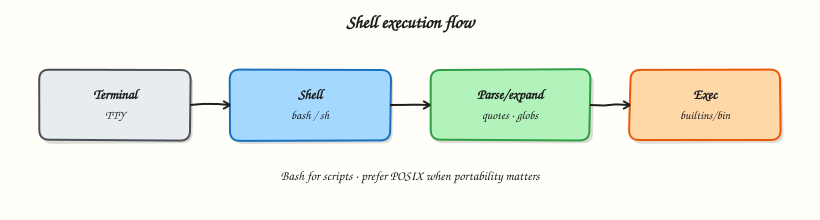

# Shell Fundamentals — Bash vs sh and Execution

## Overview

Every Linux admin and DevOps engineer lives in a shell. This tutorial builds the mental model for how Bash starts, what it inherits, and why cron and CI behave differently from your terminal.

This is **Tutorial 1** in **Module 1: Shell Fundamentals** of the REBASH Academy **Shell Scripting for DevOps Engineers** series — written for Linux administrators, DevOps engineers, SREs, and platform engineers who automate production hosts with Bash.

## Prerequisites

- Linux Fundamentals (files, permissions, processes)
- Bash 4.2+ on Linux (WSL2/VM/cloud)

## Learning Objectives

By the end of this tutorial, you will be able to:

- [ ] Apply the core ideas of “Shell Fundamentals — Bash vs sh and Execution” in a real ops script
- [ ] Use quoted expansions and clear stderr diagnostics
- [ ] Produce meaningful exit codes for automation consumers
- [ ] Debug behaviour with `bash -x` when something fails
- [ ] Relate this topic to day-to-day Linux admin and DevOps work

## Architecture

Ops scripts sit between humans/automation and system tools. This topic’s control points are shown below.



## Theory

### What it is

A **shell** is a command interpreter: it reads text (interactive lines or a script), expands variables and globs, runs programs, and reports an exit status. On Linux you will meet **Bash** (Bourne Again SHell), **dash**, **zsh**, and others. For DevOps work the shell glues humans, schedulers, Continuous Integration (CI) jobs, and tools such as `systemctl`, `curl`, and `kubectl`. How the shell starts — and what it inherits — underpins every later scripting topic.

### Why it matters

Scripts that “work in my terminal” often fail under cron, systemd, or CI because the environment is thinner: a short `PATH`, no aliases, and different startup files. Bash versus POSIX `sh` also matters: Debian and Ubuntu commonly point `/bin/sh` at **dash**, which rejects Bash-only features. Fingerprinting the interpreter and environment early saves hours of false debugging later.

### How it works

When you run `./script.sh` or `bash script.sh`, the kernel loads the interpreter from the shebang (or the explicit `bash` binary). The new shell inherits the caller’s environment unless started with something like `env -i`. The script body runs as a separate process unless you `source` it. The exit status of the last command — or an explicit `exit N` — becomes the process exit code that CI and monitoring consume.

`source script.sh` (or `. script.sh`) runs in the **current** shell. That is useful for loading shared functions, but dangerous when the file calls `exit` or `cd`, because those side effects alter your live session.

A **login shell** typically reads `/etc/profile` and `~/.profile` (Bash may also read `~/.bash_profile`). SSH sessions are often login shells; `bash script.sh` usually is not. Prefer setting `PATH`, umask, and required variables **inside the script** so non-interactive jobs stay reliable.

```bash
echo "$PATH"
printenv | sort | head
export OPS_ENV=lab
env -i PATH=/usr/bin:/bin HOME="$HOME" bash -c 'echo PATH=$PATH'
```

### Key concepts

| Idea | What to remember |
|------|------------------|
| Bash | `/bin/bash` or via `env` — arrays, `[[ ]]`, Bashisms |
| POSIX `sh` | Often **dash** on Debian/Ubuntu — not Bash |
| Interactive | Prompt, history, aliases; often reads `~/.bashrc` |
| Non-interactive | Cron, CI, `bash script.sh` — leaner startup, aliases usually off |
| Environment | Exported key/value pairs (`PATH`, `HOME`, CI secrets) inherited by children |

Prefer `#!/usr/bin/env bash` for this course unless a tool requires strict POSIX `sh`. Ops scripts must not depend on interactive aliases or a fancy `PS1`.

### Common pitfalls

- Writing Bashisms under `#!/bin/sh` and wondering why dash rejects `[[` or arrays
- Assuming cron or CI has the same `PATH` as your SSH session
- Using `source` for jobs that should run as a clean child process
- Relying on aliases or functions defined only in interactive `~/.bashrc`
- Leaving required settings in profile files that non-interactive shells never read

## Hands-on Lab

Create a workspace for this tutorial.

```bash
mkdir -p ~/rebash-shell/lab01 && cd ~/rebash-shell/lab01
```

**Focus:** fingerprint shell/bash/sh; compare interactive vs script env; inspect PATH

### Step 1 – Fingerprint shells and environment

```bash
cat > fingerprint.sh << 'EOF'
#!/usr/bin/env bash
echo "bash=$BASH_VERSION"
echo "sh=$(readlink -f /bin/sh 2>/dev/null || echo /bin/sh)"
echo "interactive=$([[ $- == *i* ]] && echo yes || echo no)"
echo "PATH=$PATH"
printenv | sort | head -n 20
EOF
chmod +x fingerprint.sh
./fingerprint.sh | tee fingerprint.txt
env -i PATH=/usr/bin:/bin HOME="$HOME" bash ./fingerprint.sh | tee fingerprint-min.txt
```

### Final step – Cleanup note

```bash
# Keep ~/rebash-shell/ for later tutorials; destroy disposable cloud resources from this lab
```

## Validation

- [ ] Lab commands run under `~/rebash-shell/lab01/`
- [ ] You can explain each Theory heading in your own words
- [ ] Failure path exits non-zero and prints diagnostics to stderr (where applicable)
- [ ] You can relate this topic to a real DevOps or Linux admin task

## Code Walkthrough

Production Bash for **Shell Fundamentals — Bash vs sh and Execution** always combines:

1. A clear shebang (`#!/usr/bin/env bash`)
2. Strict mode near the top (`set -euo pipefail`) from Module 2 onward
3. Quoted expansions and explicit tests
4. Functions with `local` for reusable behaviour
5. Documented exit codes and stderr logging

Keep scripts short enough to review in a single merge request. When logic grows (complex JSON APIs, heavy state), hand off to Python and keep Bash as the launcher.

## Security Considerations

- Treat all external input (args, files, env) as untrusted until validated
- Never log secrets; prefer masked CI variables and secret stores
- Prefer least privilege — do not require root for file-local tasks
- Avoid `eval` and unquoted expansions in destructive commands
- Validate paths stay under an allow-listed root before `rm` or overwrite

## Common Mistakes

!!! warning "Skipping strict mode"
    Cron and CI hide failures that an interactive terminal would show. **Fix:** start with `set -euo pipefail` from Module 2 onward.

!!! warning "Unquoted path expansions"
    Spaces and globs rewrite your command line. **Fix:** always `"$path"` / `"$@"`.

!!! warning "Assuming interactive PATH"
    Aliases and fancy PATH entries disappear under schedulers. **Fix:** set `PATH` or use absolute paths.

## Best Practices

- One purpose per script; compose with functions or small binaries
- Log to stderr; reserve stdout for data or RESULT lines
- Idempotent behaviour where scheduling may overlap
- Pair every new script with a failing-path test you actually run
- Run ShellCheck in CI before merging automation

## Troubleshooting

| Symptom | Likely cause | Fix |
|---------|--------------|-----|
| Works in terminal, fails in cron | PATH / cwd / env | Fingerprint env; set PATH |
| `unbound variable` | `set -u` | Provide defaults or export vars |
| Pipeline “succeeds” incorrectly | Missing `pipefail` | `set -o pipefail` |
| `[[` unexpected operator | Running under `sh`/dash | Fix shebang to Bash |

## Summary

**Shell Fundamentals — Bash vs sh and Execution** is a core skill for Linux admins and DevOps engineers automating real hosts and pipelines. Practise the lab until the failure path is as familiar as the happy path, then continue the track.

## Interview Questions

1. How does this topic show up in production Linux administration or CI?
2. What failure mode appears if you ignore quoting or strict mode here?
3. How would you test this behaviour under a minimal cron-like environment?
4. When would you move this logic out of Bash into Python or another tool?
5. What exit code contract would you document for teammates?

!!! tip "Sample answer — question 2"
    Unquoted expansions and missing `pipefail` create silent or partial failures — especially under cron — that look healthy in monitoring until data is wrong.

## Related Tutorials

- [Shell Scripting for DevOps Engineers – Category Overview](index.md)
- [Writing Your First Script](writing-your-first-script.md) *(next)*
- [Learning Paths](../learning-paths/index.md)

## References

- [GNU Bash manual](https://www.gnu.org/software/bash/manual/)
- [POSIX shell command language](https://pubs.opengroup.org/onlinepubs/9699919799/utilities/V3_chap02.html)
- [ShellCheck](https://www.shellcheck.net/)
- Track index: [Shell Scripting for DevOps Engineers](index.md)
