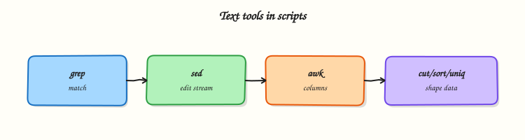

# Text Processing in Shell Scripts

## Overview

Logs and reports are **text**. In shell scripts you combine **`grep`** (select lines), **`sed`** (edit streams), and **`awk`** (split fields and compute) into pipelines that turn raw logs into clear answers: how many errors, which service failed, what was the last status. You wrap those tools in Bash with `set -euo pipefail`, write outputs to files, and **assert** results with `grep -q` / `test` so Continuous Integration (CI) can trust the script. In this tutorial you will process sample application logs under `~/rebash-shell/lab10` end to end.

DevOps, Site Reliability Engineering (SRE), and platform engineers live in text: build logs, Nginx access lines, `journalctl` exports, and CSV-like metrics. Python or `jq` are better for heavy structured data, but a small `grep | awk` pipeline is still the fastest way to answer “how many 5xx since the last deploy?” on a jump server.

In production, pipelines must be **reproducible** and **bounded**: work on a copied sample or a time-sliced file, not on a live multi-gigabyte log without limits. Prefer explicit field separators in `awk`, avoid destructive `sed -i` without a backup in shared trees, and keep machine-readable summaries for tickets.

This is **Tutorial 10** in **Module 10: Text Processing** of the REBASH Academy **Shell Scripting for DevOps Engineers** series. It is written for Linux administrators, DevOps engineers, SRE, and platform engineers. By the end, you will ship a small log report script with asserts and evidence.

## Prerequisites

- [File Operations in Shell](file-operations-in-shell.md)
- Bash 4.2+ with `grep`, `sed`, `awk`, `sort`, `uniq` (normal Linux userland)
- Comfort with pipes and redirection from Module 4

## Learning Objectives

By the end of this tutorial, you will be able to:

- [ ] Filter log lines with `grep -E` and count matches in a script
- [ ] Normalise or rewrite fields with `sed` in a pipeline
- [ ] Extract columns and aggregate with `awk`
- [ ] Chain `grep | sed | awk` (plus `sort`/`uniq` when needed) inside a Bash script
- [ ] Assert expected counts/strings so the script fails when data is wrong

## Architecture

Raw text enters a pipeline: select (`grep`) → transform (`sed`) → field logic (`awk`) → evidence files and asserts in Bash.



## Theory

### What it is

- **`grep`** — print lines that match a pattern (`-E` extended regex, `-c` count, `-v` invert).
- **`sed`** — stream editor; common ops are substitute (`s/old/new/`) and delete lines.
- **`awk`** — split each line into fields (`$1`, `$2`, …), filter, and print summaries.

``` {.bash .ra-terminal title="Terminal"}
grep -E 'ERROR|FATAL' app.log
sed -E 's/Prod/prod/g' app.log
awk -F' ' '/ERROR/ { print $1, $3 }' app.log
```

### Why it matters

Manual scrolling does not scale in an incident. A scripted pipeline gives the same answer every time and can run in CI against fixture logs. Wrong field separators silently produce empty columns; missing `pipefail` can hide a failed `grep` in the middle of a pipeline. Learning a small, correct toolchain prevents both slow human searches and false-green jobs.

### How it works

1. **Select** — `grep -E` narrows to interesting lines (errors, status codes).
2. **Transform** — `sed` normalises tokens (environment names, strips noise prefixes).
3. **Extract / aggregate** — `awk` prints fields, counts per key, or computes totals.
4. **Compose in Bash** — redirect to `out/*.txt`, then assert with `test` / `grep -q`.
5. **Fail loudly** — `set -euo pipefail` so a broken stage fails the script.

``` {.bash .ra-terminal title="Terminal"}
set -euo pipefail
grep -E 'ERROR' sample.log \
  | sed -E 's/[[:space:]]+/ /g' \
  | awk '{ print $2 }' \
  | sort | uniq -c | sort -nr
```

Related tools: `cut` (simple columns), `tr` (character translate), `sort`/`uniq` (frequency). Use them when they keep the pipeline clearer than a large `awk` program.

### Key concepts and comparisons

| Tool | Best at | Weak at |
|------|---------|---------|
| `grep` | Line selection | Multi-field joins |
| `sed` | Small substitutions | Complex record logic |
| `awk` | Fields, counts, reports | Full JSON/YAML (use `jq`/`yq`) |
| `cut` | Single delimiter columns | Regex-heavy lines |
| `sort`/`uniq` | Frequencies | Unsorted unique without `sort` |

| Pattern | Prefer |
|---------|--------|
| Fixture logs in the repo/lab | Parsing live `/var/log` without a copy |
| Assert counts in CI | “Looks fine” visual checks |
| `awk -F','` explicit FS | Guessing columns by eyeballing spaces |

### Common pitfalls

- Forgetting `set -o pipefail` so a failed `grep` still yields exit 0 from `awk`.
- Using `grep` patterns that match too much (`error` inside `terror`).
- In-place `sed -i` on the only copy of a file.
- Assuming one space between fields when logs use variable whitespace — prefer `awk` default splitting or tidy with `sed` first.
- Trying to parse JSON with `sed` alone — use `jq` in the JSON module.

## Hands-on Lab

### Objective

Under `~/rebash-shell/lab10`, create sample logs, write `report.sh` that runs a `grep | sed | awk` pipeline with asserts, produce a severity summary, and pack evidence.

### Prerequisites

- `grep`, `sed`, `awk`, `sort`, `uniq`, Bash
- Write access under your home directory

### Lab environment

Workspace: `~/rebash-shell/lab10`

``` {.bash .ra-terminal title="Terminal"}
mkdir -p ~/rebash-shell/lab10/out ~/rebash-shell/lab10/fixtures
cd ~/rebash-shell/lab10
set -euo pipefail
bash --version | head -n1 | tee out/bash-version.txt
```

!!! example "Expected output"
    `out/bash-version.txt` mentions `bash`.


### Real-world scenario

After a deploy, on-call wants a one-page summary from the app log: count of `ERROR` and `WARN` lines, a list of services that logged errors, and proof the parser still works in CI against a fixture file. You build `report.sh` that fails if the fixture counts drift.

### Step-by-step tasks

#### Task 1 – Create fixture logs

Create `fixtures/app.log`:

```text title="app.log"
2026-08-02T10:00:01Z INFO billing payment ok
2026-08-02T10:00:02Z WARN catalog cache miss
2026-08-02T10:00:03Z ERROR billing db timeout
2026-08-02T10:00:04Z INFO auth login ok
2026-08-02T10:00:05Z ERROR auth token expired
2026-08-02T10:00:06Z WARN billing retry scheduled
2026-08-02T10:00:07Z ERROR catalog upstream 503
2026-08-02T10:00:08Z INFO catalog refresh ok
```

Run:

``` {.bash .ra-terminal title="Terminal"}
cd ~/rebash-shell/lab10
set -euo pipefail

wc -l fixtures/app.log | tee out/fixture-wc.txt
test "$(wc -l <fixtures/app.log | tr -d ' ')" -eq 8
```


!!! example "Expected output"
    `out/fixture-wc.txt` shows 8 lines.


#### Task 2 – `grep` + `sed` + `awk` report script with asserts

Create `report.sh`:

```bash title="report.sh"
#!/usr/bin/env bash
set -euo pipefail

root="$(cd "$(dirname "$0")" && pwd)"
cd "$root"
mkdir -p out

logfile="${1:-fixtures/app.log}"
[[ -f "$logfile" ]] || { printf 'missing log: %s\n' "$logfile" >&2; exit 1; }

# Select ERROR/WARN, normalise whitespace, emit severity and service
grep -E ' (ERROR|WARN) ' "$logfile" \
  | sed -E 's/[[:space:]]+/ /g' \
  | awk '{ print $2, $3 }' \
  | tee out/sev-service.txt

# Counts by severity
awk '{ c[$1]++ } END { for (k in c) print k, c[k] }' out/sev-service.txt \
  | sort | tee out/severity-counts.txt

# Unique services that logged ERROR
awk '$1 == "ERROR" { print $2 }' out/sev-service.txt \
  | sort -u | tee out/error-services.txt

# --- asserts (fixture expectations) ---
grep -qx 'ERROR 3' <(grep '^ERROR ' out/severity-counts.txt)
grep -qx 'WARN 2' <(grep '^WARN ' out/severity-counts.txt)
grep -qx 'auth' out/error-services.txt
grep -qx 'billing' out/error-services.txt
grep -qx 'catalog' out/error-services.txt
test "$(wc -l <out/error-services.txt | tr -d ' ')" -eq 3

printf 'report_ok=1\n' | tee out/report-ok.txt
```

Run:

``` {.bash .ra-terminal title="Terminal"}
cd ~/rebash-shell/lab10
set -euo pipefail

chmod +x report.sh
./report.sh fixtures/app.log
```


!!! example "Expected output"
    `severity-counts.txt` has `ERROR 3` and `WARN 2`; `error-services.txt` lists `auth`, `billing`, `catalog`; `report-ok=1`.


#### Task 3 – Extra pipeline view and evidence pack

``` {.bash .ra-terminal title="Terminal"}
cd ~/rebash-shell/lab10
set -euo pipefail

# Frequency of all services in ERROR/WARN lines
awk '{ print $2 }' out/sev-service.txt | sort | uniq -c | sort -nr | tee out/service-freq.txt
grep -E 'billing' out/service-freq.txt

tar -czf out/textproc-evidence.tgz \
  out/bash-version.txt out/fixture-wc.txt \
  out/sev-service.txt out/severity-counts.txt \
  out/error-services.txt out/service-freq.txt out/report-ok.txt \
  fixtures/app.log report.sh
ls -l out/textproc-evidence.tgz | tee out/evidence-ls.txt
```

!!! example "Expected output"
    `service-freq.txt` shows counts; evidence archive is not empty.


### Validation steps

- [ ] `./report.sh` exits 0 against `fixtures/app.log`
- [ ] Asserts confirm ERROR=3 and WARN=2
- [ ] Three services appear in `error-services.txt`
- [ ] `out/textproc-evidence.tgz` exists

### Common errors and fixes

| Error | Cause | Fix |
|-------|-------|-----|
| Pipeline exits 0 despite failed `grep` | Missing `pipefail` | `set -euo pipefail` |
| Counts wrong | Pattern too loose / tight | Include spaces as in ` (ERROR\|WARN) ` |
| `awk` fields shifted | Irregular whitespace | `sed` to squeeze spaces first |
| Assert fails after log edit | Fixture drift | Update fixture and expected counts together |
| `grep -qx` fails on Windows line endings | CRLF in fixture | Use LF; `sed -i 's/\r$//'` if needed |

### Challenge exercise

Extend `report.sh` into `report-window.sh` that accepts an optional ISO-ish prefix filter as `$2` (example `2026-08-02T10:00:0`) and only analyses lines whose timestamp starts with that prefix. Against the fixture, `./report-window.sh fixtures/app.log 2026-08-02T10:00:0` should still see multiple lines; prove with `out/window-count.txt` containing the filtered line count, and keep asserts for ERROR/WARN on that windowed set (recalculate expected counts for the window you choose).

### Learning outcomes

- Built a fixture-driven `grep`/`sed`/`awk` pipeline
- Asserted severity counts and error services
- Packed text-processing evidence for CI or a ticket

### Cleanup

``` {.bash .ra-terminal title="Terminal"}
cd ~/rebash-shell/lab10
# Keep fixtures/ and out/ for review, or:
# rm -rf ~/rebash-shell/lab10
```

## Validation

- [ ] Lab finished under `~/rebash-shell/lab10/` with evidence archive
- [ ] You can explain the role of `grep` vs `sed` vs `awk` in one pipeline
- [ ] You know why `pipefail` matters for text pipelines in CI
- [ ] You can describe when to switch from `awk` to `jq` for JSON

## Code Walkthrough

Production **text processing** scripts usually follow this order:

1. **Copy or fixture the input** — do not parse the only live log in place  
2. **Select early** — `grep` reduces volume before heavier stages  
3. **Normalise** — `sed`/`tr` for whitespace or simple tokens  
4. **Aggregate** — `awk` + `sort`/`uniq` for summaries  
5. **Assert + archive** — fail on drift; attach `out/` artefacts to the ticket  

Keep the Bash wrapper thin; put non-trivial field logic in `awk` programs or move to Python when rules grow.

## Security Considerations

- Logs may contain tokens and personal data — restrict who can read evidence archives  
- Do not run untrusted regexes from user input without review (ReDoS / unexpected matches)  
- Avoid `sed -i` on shared config without backup and change control  
- Prefer reading copies under your lab/CI workspace, not world-writable temp scraps  
- Least privilege: this lab only needs home-directory access  

## Common Mistakes

!!! warning "Missing `pipefail`"
    A failed `grep` can hide behind a successful `awk`. **Fix:** `set -euo pipefail` at the top of the script.

!!! warning "Over-broad `grep ERROR`"
    Matches substrings inside unrelated words. **Fix:** tighter patterns (field-aware `awk`, or spaced tokens).

!!! warning "Editing the only copy with `sed -i`"
    A bad expression destroys the file. **Fix:** work on a copy; keep fixtures immutable in CI.

!!! warning "Parsing JSON with only `sed`"
    Nested quotes break. **Fix:** use `jq` (later module) for JSON.

## Best Practices

- Store fixture logs next to the script for CI  
- Write human summaries **and** machine-readable count files  
- Comment the expected field layout above the `awk` program  
- Prefer `grep -E` / `sed -E` for clearer extended regex  
- Run the report script in CI on every change to the parser  

## Troubleshooting

| Symptom | Likely cause | Fix |
|---------|--------------|-----|
| Empty `sev-service.txt` | Pattern does not match fixture | `grep` manually; fix spaces/case |
| Wrong field in `awk` | Extra spaces / columns | Squeeze whitespace; print `NF` while debugging |
| CI green but counts wrong | Asserts missing | Add `grep -qx` / `test` checks |
| Script exits 1 on no matches | `grep` returns 1 | Handle “zero matches” explicitly if allowed |
| Locale surprises | Collation in `sort` | Set `LC_ALL=C` for stable byte sorts |

## Summary

Text processing in shell is a disciplined pipeline: **select with `grep`**, **transform with `sed`**, **report with `awk`**, then **assert** in Bash. Practise on fixtures, keep evidence, and move to specialised tools when the data is structured. Next, manage long-running work with [Process Automation — Signals and Traps](process-automation-signals-and-traps.md).

## Interview Questions

**1. What is a clean division of labour between `grep`, `sed`, and `awk` in one log pipeline?**

??? success "Reveal answer"
    **`grep`** selects relevant lines; **`sed`** performs small stream edits (normalise whitespace, simple substitutions); **`awk`** splits fields and aggregates (counts, unique keys, reports). Keeping each stage focused makes the script easier to test and faster to fix during an incident.

**2. Why does `set -o pipefail` matter for `grep … | awk …` in CI?**

??? success "Reveal answer"
    Without **`pipefail`**, the pipeline’s exit status is usually the status of the **last** command. If `grep` fails (or errors) but `awk` still exits 0, CI can go green incorrectly. With `pipefail`, any failed stage fails the script — the behaviour you want for automation.

**3. How do you make a log parser safe to run in CI every day?**

??? success "Reveal answer"
    Keep an immutable **fixture** log, run the parser in a script with **asserts** on expected counts, and store the summary as an artefact. Do not depend on live production logs for the unit-like check. Update fixture and asserts in the same change when log format evolves.

**4. When would you choose `awk` over `cut`?**

??? success "Reveal answer"
    Use **`cut`** for simple single-delimiter columns. Prefer **`awk`** when you need pattern filters (`/ERROR/`), computed counts, multi-field logic, or default whitespace splitting that collapses repeated spaces. For CSV with quoted commas, neither is ideal — use a proper CSV tool or Python.

**5. A junior engineer wants to run `sed -i` on `/var/log/app.log` to “clean” it. What do you advise?**

??? success "Reveal answer"
    Do **not** edit the live log in place for cleanup. Copy a slice to a work directory, process the copy, and leave rotation to `logrotate` or the application. In-place edits risk data loss, break shipping agents, and complicate forensics. Prefer read-only pipelines that emit reports.

**6. How would you extract the service name from lines like `TIMESTAMP SEVERITY SERVICE message…`?**

??? success "Reveal answer"
    After selecting severity lines, use **`awk '{ print $2, $3 }'`** (severity and service) if whitespace is normalised, or print `$3` alone for the service field. Prove with a fixture that known services appear, and assert the count of unique error services as in the lab.

**7. When should you stop extending an `awk` one-liner and switch tools?**

??? success "Reveal answer"
    Switch when the input is **JSON/YAML**, when field rules need unit tests and modules, or when the one-liner becomes longer than a short function. Use **`jq`/`yq`** for structured text and Python for complex business rules; keep Bash as the orchestrator that calls those tools.

**8. How do you prove a text-processing change did not break error counting?**

??? success "Reveal answer"
    Run the report script against the **fixture**, show assert output (`ERROR 3`, `WARN 2` or the new agreed counts), and attach `severity-counts.txt` plus the script in the merge request. If counts change intentionally, update fixture and asserts in the same commit and explain why in the ticket.

## Related Tutorials

- [Shell Scripting for DevOps Engineers – Overview](index.md)
- [File Operations in Shell](file-operations-in-shell.md) *(previous)*
- [Process Automation — Signals and Traps](process-automation-signals-and-traps.md) *(next)*
- [JSON and YAML with jq and yq](json-and-yaml-with-jq-yq.md)

## References

- [`grep(1)`](https://manpages.ubuntu.com/manpages/jammy/en/man1/grep.1.html) — Ubuntu man-pages  
- [`sed(1)`](https://manpages.ubuntu.com/manpages/jammy/en/man1/sed.1.html)  
- [`awk(1)`](https://www.gnu.org/software/gawk/manual/gawk.html) — GNU Awk manual  
- Track index: [Shell Scripting for DevOps Engineers](index.md)
