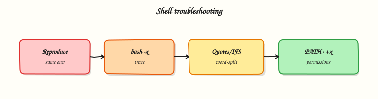

# Troubleshooting Shell Scripts

## Overview

When a script works on your laptop and fails in Continuous Integration (CI) or cron, guessing wastes time. You need a **method**: reproduce with the same interpreter and a minimal environment, read the error carefully, isolate the bad expansion or pipeline, fix it, and keep **before/after evidence**.

Common real failures are not mysterious. They are usually **quoting** bugs (spaces in paths), missing **`pipefail`** (pipelines look successful), wrong **exit codes** (CI stays green), short **PATH** under cron, Windows **CRLF** line endings, or permission bits. This tutorial gives you a broken script on purpose, then you repair quoting, pipefail, and exit handling — and prove the fix with captured output.

In Cloud and DevOps work, the same pattern shows up on build agents, jump servers, and container entrypoint scripts. Site Reliability Engineering (SRE) teams expect you to show the failing command, the root cause in one sentence, and a regression check so the bug does not return. That is also what interviewers want.

This is **Tutorial 18** in **Module 18: Troubleshooting** of the REBASH Academy **Shell Scripting for DevOps Engineers** series. It is written for Linux administrators, DevOps engineers, SRE, and platform engineers. By the end, you will have a fixed script plus before/after evidence you can discuss in a ticket or interview. For the wider learning path after this course, see the [Shell roadmap](roadmap.md) and [course overview](index.md).

## Prerequisites

- [Production Shell Scripting](production-shell-scripting.md)
- Bash 4.2+ on a practice Linux host (Ubuntu 22.04/24.04 VM, WSL2, or similar)
- Comfort with `bash -x`, exit codes, and basic redirection

## Learning Objectives

By the end of this tutorial, you will be able to:

- [ ] Reproduce a script failure under a controlled environment and capture evidence
- [ ] Recognise quoting, `pipefail`, and exit-code bugs from symptoms
- [ ] Repair a broken script so pipelines and paths with spaces behave correctly
- [ ] Prove the fix with before/after exit codes and output files
- [ ] Apply a short checklist for cron/CI environment mismatches

## Architecture

Troubleshooting is a loop: reproduce → isolate → fix → verify. Traces (`bash -x`), exit codes, and log files are the feedback signals.



## Theory

### What it is

**Troubleshooting shell scripts** means finding why Bash did not do what you expected, then proving a fix. You align the **interpreter** (`bash` vs `sh`), the **environment** (`PATH`, cwd, env vars), and the **data** (paths with spaces, empty inputs). You use tools such as `bash -x`, `declare -p`, `type`, `file`, and `sed -n l` (to spot CRLF). You map error messages to likely causes instead of editing random lines.

### Why it matters

“Works on my machine” is the default state of unfinished automation. CI runners and cron users see a short `PATH`, no aliases, and often a different cwd. Without a method, people disable `set -u` or add `|| true` until the symptom moves — and leave a landmine for the next on-call. A repeatable approach protects production and builds trust in your scripts.

### How it works

1. **Reproduce** — same script path, same args; prefer `env -i PATH=/usr/bin:/bin HOME="$HOME" bash ./script.sh`.
2. **Observe** — full stderr, `echo $?`, and optionally `bash -x` with a clear `PS4`.
3. **Hypothesise** — quoting? pipefail? wrong shebang? CRLF? permissions?
4. **Isolate** — shrink input; wrap one block with `set -x` / `set +x`.
5. **Fix** — smallest correct change; keep strict mode.
6. **Verify** — before/after evidence; add a regression assert when useful.

``` {.bash .ra-terminal title="Terminal"}
export PS4='+${BASH_SOURCE[0]}:${LINENO}: '
env -i PATH=/usr/bin:/bin HOME="$HOME" bash -x ./script.sh args
```

Classic symptom map:

| Symptom | Likely cause |
|---------|--------------|
| `command not found` in cron | Short `PATH` — use absolute paths |
| `too many arguments` / odd splits | Missing quotes around `"$var"` |
| Exit `0` after a failed filter | Missing `set -o pipefail` |
| `$'\r': command not found` | Windows CRLF line endings |
| Permission denied | Missing `+x` or directory `x` bit |

### Key concepts and comparisons

| Technique | Use for | Caution |
|-----------|---------|---------|
| `bash -x` | See expansions and order | May leak secrets; use temporarily |
| `env -i ...` | Cron-like minimal env | Must supply needed `PATH`/`HOME` |
| `declare -p var` | Exact value/type of a variable | Do not print secrets in tickets |
| `file` / `sed -n l` | CRLF and special chars | Fix with `sed -i 's/\r$//'` when needed |
| Negative test | Prove bad input still fails closed | Keep intentional failures |

### Common pitfalls

- Fixing the symptom with `|| true` instead of the root cause.
- Debugging only interactively (full `PATH`) while production is cron.
- Forgetting that `grep` exit `1` (no match) fails under `set -e` — handle it on purpose.
- Editing the script on Windows and reintroducing CRLF.
- Changing many things at once so you cannot explain what fixed it.

## Hands-on Lab

### Objective

Start from a **broken** inventory script under `~/rebash-shell/lab18`, capture its bad behaviour (before), fix quoting / `pipefail` / exit handling, and capture the good behaviour (after) with evidence files.

### Prerequisites

- Bash 4.2+
- Standard tools: `grep`, `wc`, `tee`, `env`
- No root required

### Lab environment

Workspace: `~/rebash-shell/lab18`

``` {.bash .ra-terminal title="Terminal"}
mkdir -p ~/rebash-shell/lab18 && cd ~/rebash-shell/lab18
set -euo pipefail
bash --version | head -n1 | tee bash-version.txt
```

!!! example "Expected output"
    `bash-version.txt` exists.


### Real-world scenario

A junior engineer’s “service inventory” script is used in CI. It should list matching unit names from a text file and exit non-zero when the pipeline’s `grep` stage fails — but today CI stays green even when nothing matches, and paths with spaces break the script. You reproduce, fix, and attach before/after proof to the ticket.

### Step-by-step tasks

#### Task 1 – Install the broken script and capture “before” evidence

The script below is intentionally wrong: weak quoting, no `pipefail`, and it forces exit `0` at the end.

Create `sample data/services.txt`:

```text title="services.txt"
nginx.service
ssh.service
cron.service
redis.service
```

Create `inventory-broken.sh`:

```bash title="inventory-broken.sh"
#!/usr/bin/env bash
# BROKEN on purpose — do not use in production
set -euo

PATTERN=${1:-}
FILE=$2

# Bug 1: unquoted expansions break on spaces in paths
# Bug 2: no pipefail — pipeline status ignores earlier failures
matches=$(grep $PATTERN $FILE | wc -l)

echo "matches=$matches"
# Bug 3: always exit success for "CI calm"
exit 0
```

Run:

``` {.bash .ra-terminal title="Terminal"}
cd ~/rebash-shell/lab18
set -euo pipefail

mkdir -p "sample data"
# Copy without spaces so the exit-code bug can be shown separately from quoting
cp "sample data/services.txt" ./services.txt

chmod +x inventory-broken.sh

# Before A: path with spaces — unquoted $FILE splits the path (expect non-zero / errors)
set +e
./inventory-broken.sh service "sample data/services.txt" >before-spaces-out.txt 2>before-spaces-err.txt
ec_spaces=$?
set -e
printf '%s\n' "${ec_spaces}" | tee before-spaces-exit.txt
# Keep stderr evidence (grep often reports a missing "sample" file fragment)
test -s before-spaces-err.txt || test "${ec_spaces}" -ne 0

# Before B: no spaces — grep finds nothing, wc still succeeds, forced exit 0 (CI stays green)
set +e
./inventory-broken.sh 'nomatch-xyz' ./services.txt >before-nomatch-out.txt 2>before-nomatch-err.txt
ec_nomatch=$?
set -e
printf '%s\n' "${ec_nomatch}" | tee before-nomatch-exit.txt

test "${ec_nomatch}" -eq 0
grep -F 'matches=0' before-nomatch-out.txt | tee before-nomatch-snip.txt
```


!!! example "Expected output"
    spaces path fails or errors (`before-spaces-err.txt` / non-zero exit). No-match on `./services.txt` still exits `0` with `matches=0` — that is the CI bug.


#### Task 2 – Fix quoting, pipefail, and exit codes

Write `inventory-fixed.sh` with correct quoting, `set -euo pipefail`, and honest exits (`0` when matches ≥ 1, `3` when no matches, `1` on usage).

Create `inventory-fixed.sh`:

```bash title="inventory-fixed.sh"
#!/usr/bin/env bash
set -euo pipefail

readonly E_OK=0
readonly E_USAGE=1
readonly E_NOMATCH=3

usage() {
  cat >&2 <<'USAGE'
Usage: inventory-fixed.sh PATTERN FILE
  Exit 0 if at least one match, 3 if none, 1 on usage error.
USAGE
}

main() {
  if [[ $# -ne 2 ]]; then
    usage
    exit "${E_USAGE}"
  fi
  local pattern=$1
  local file=$2

  if [[ ! -f "${file}" ]]; then
    printf 'ERROR: file not found: %s\n' "${file}" >&2
    exit "${E_USAGE}"
  fi

  local matches
  # grep exit 1 = no match; handle explicitly under set -e
  if ! matches=$(grep -E -- "${pattern}" "${file}" | wc -l); then
    matches=0
  fi
  # Normalise whitespace from wc
  matches=${matches//[[:space:]]/}

  printf 'matches=%s\n' "${matches}"
  if [[ "${matches}" -eq 0 ]]; then
    printf 'RESULT=status=nomatch;matches=0\n'
    exit "${E_NOMATCH}"
  fi
  printf 'RESULT=status=ok;matches=%s\n' "${matches}"
  exit "${E_OK}"
}

main "$@"
```

Run:

``` {.bash .ra-terminal title="Terminal"}
cd ~/rebash-shell/lab18
set -euo pipefail

chmod +x inventory-fixed.sh

# After: path with spaces works
./inventory-fixed.sh 'service' "sample data/services.txt" | tee after-spaces-out.txt
grep -F 'RESULT=status=ok' after-spaces-out.txt
grep -E '^matches=[1-9]' after-spaces-out.txt

# After: no match fails closed
set +e
./inventory-fixed.sh 'nomatch-xyz' "sample data/services.txt" >after-nomatch-out.txt 2>after-nomatch-err.txt
ec=$?
set -e
printf '%s\n' "${ec}" | tee after-nomatch-exit.txt
test "${ec}" -eq 3
grep -F 'RESULT=status=nomatch' after-nomatch-out.txt | tee after-nomatch-snip.txt
```


!!! example "Expected output"
    spaces path succeeds with `RESULT=status=ok`; no-match path exits `3`.


#### Task 3 – Minimal-env reproduce and evidence pack

Prove the fixed script still works under a cron-like environment, then pack before/after proof.

``` {.bash .ra-terminal title="Terminal"}
cd ~/rebash-shell/lab18
set -euo pipefail

export PS4='+${BASH_SOURCE[0]}:${LINENO}: '
env -i PATH=/usr/bin:/bin HOME="$HOME" \
  bash ./inventory-fixed.sh 'nginx|redis' "sample data/services.txt" \
  | tee after-minenv-out.txt
grep -F 'RESULT=status=ok' after-minenv-out.txt

# Optional xtrace of the fixed path (stderr only)
env -i PATH=/usr/bin:/bin HOME="$HOME" \
  bash -x ./inventory-fixed.sh 'ssh' "sample data/services.txt" \
  >after-xtrace-stdout.txt 2>after-xtrace.txt
grep -F 'RESULT=status=ok' after-xtrace-stdout.txt
grep -F 'pipefail' after-xtrace.txt | head -n 5 | tee after-xtrace-snip.txt || true

tar -czf troubleshooting-evidence.tgz \
  bash-version.txt inventory-broken.sh inventory-fixed.sh services.txt \
  before-spaces-exit.txt before-spaces-err.txt before-nomatch-exit.txt before-nomatch-snip.txt \
  after-spaces-out.txt after-nomatch-exit.txt after-nomatch-snip.txt after-minenv-out.txt \
  "sample data/services.txt"
ls -l troubleshooting-evidence.tgz | tee evidence-ls.txt
```

!!! example "Expected output"
    minimal-env run prints `RESULT=status=ok`; `troubleshooting-evidence.tgz` exists.


### Validation steps

- [ ] Before evidence shows no-match exiting `0` with the broken script
- [ ] Fixed script handles `"sample data/services.txt"` (spaces)
- [ ] Fixed script exits `3` on no match
- [ ] Fixed script works under `env -i PATH=/usr/bin:/bin`
- [ ] `troubleshooting-evidence.tgz` exists under `~/rebash-shell/lab18`

### Common errors and fixes

| Error | Cause | Fix |
|-------|-------|-----|
| `grep: sample: No such file` | Unquoted path with spaces | Quote `"${file}"` and `"${pattern}"` |
| Exit `0` on no matches | Forced `exit 0` / ignored grep status | Map no match to exit `3`; enable `pipefail` |
| `set -e` aborts on grep no-match | grep returns `1` | Use `if ! matches=$(grep ...); then matches=0; fi` or `grep ... \|\| true` only when setting a zero count on purpose |
| Works in interactive shell, fails in `env -i` | Relied on extra PATH entries | Use `/usr/bin` tools only or set `PATH` in the script |
| `$'\r': command not found` | CRLF endings | `sed -i 's/\r$//' script.sh` |

### Challenge exercise

Add `inventory-fixed.sh` support for a `--pipefail-demo` flag that runs `false | true` **without** then **with** `set -o pipefail` in two tiny subshells, printing both exit codes, so you can show why pipefail matters. Save output as `challenge-pipefail-demo.txt`. Keep the default inventory behaviour unchanged when the flag is absent.

### Learning outcomes

- Captured before/after evidence for a real class of Bash bugs
- Fixed quoting for paths with spaces
- Made no-match a non-zero exit for CI
- Reproduced success under a minimal `PATH` like cron/CI

### Cleanup

``` {.bash .ra-terminal title="Terminal"}
cd ~/rebash-shell/lab18
set -euo pipefail
rm -rf "sample data"
rm -f inventory-broken.sh inventory-fixed.sh services.txt
rm -f before-*.txt after-*.txt
# Keep troubleshooting-evidence.tgz if you want ticket proof
```

## Validation

- [ ] Lab finished under `~/rebash-shell/lab18/` with before/after evidence
- [ ] You can explain a four-step debug loop: reproduce, isolate, fix, verify
- [ ] You can describe why cron needs absolute paths or an explicit `PATH`
- [ ] You know one production failure mode: green CI on `matches=0`

## Code Walkthrough

When troubleshooting production Bash:

1. **Freeze the scene** — save stderr, exit code, script version, and args  
2. **Reproduce cold** — `env -i` with a minimal `PATH`  
3. **Trace once** — `bash -x` around the failing region only  
4. **Fix the contract** — quoting, `pipefail`, honest exit codes  
5. **Keep evidence** — before/after files in the change ticket  

Do not disable strict mode to “make it pass”.

## Security Considerations

- Redact secrets from xtrace and ticket attachments  
- Do not chmod `777` to “fix permissions” on shared hosts  
- Be careful pasting full `env` output into chat systems  
- Validate file arguments so a path cannot escape the intended directory  
- Prefer read-only reproduction against copies of production data  

## Common Mistakes

!!! warning "Silencing failures with `|| true` to get a green build"
    The bug remains for the next deploy. **Fix:** fix grep/pipe/exit logic; keep non-zero for real failures.

!!! warning "Debugging only in an interactive shell"
    Cron/CI will still fail. **Fix:** reproduce with `env -i PATH=/usr/bin:/bin` before you declare victory.

!!! warning "Unquoted variables around paths"
    Spaces and glob characters split arguments. **Fix:** `"${file}"`, `"${pattern}"`, and ShellCheck in CI.

!!! warning "Changing five things at once"
    You cannot explain the root cause. **Fix:** one hypothesis per experiment; keep before/after files.

## Best Practices

- Keep a personal checklist: shebang, `+x`, CRLF, `PATH`, quotes, `pipefail`, exit codes  
- Store failing command lines in the ticket  
- Add a regression assert when a bug was subtle  
- Prefer absolute paths in scheduled jobs  
- Use ShellCheck so quoting bugs never return  

## Troubleshooting

| Symptom | Likely cause | Fix |
|---------|--------------|-----|
| Green CI, empty results | Forced `exit 0` / ignored grep | Exit non-zero on no match when that is an error |
| `No such file` with a visible file | Spaces / unquoted path | Quote expansions |
| Pipeline success after `false` | No `pipefail` | `set -o pipefail` |
| Works locally, fails in cron | Environment mismatch | Absolute paths; set `PATH`; log env once |
| Syntax error at end of line | CRLF | Strip `\r` |

## Summary

Troubleshooting is a **discipline**: reproduce cold, isolate one cause, fix the contract (quotes, `pipefail`, exits), and keep before/after proof. You have finished the core **Shell Scripting for DevOps Engineers** tutorial track — review the [course overview](index.md) or plan next steps on the [roadmap](roadmap.md).

## Interview Questions

**1. A script works in your SSH session but fails in cron with `command not found`. What is your first check?**

??? success "Reveal answer"
    Cron often has a **short PATH**. Check whether the command is invoked by absolute path, whether the script sets `PATH` explicitly, and reproduce with `env -i PATH=/usr/bin:/bin`. Do not assume interactive aliases or `~/.bashrc` settings are available.

**2. How do you explain a missing `pipefail` bug to a junior engineer?**

??? success "Reveal answer"
    In a pipeline, Bash’s default exit status is from the **last** command only. So `false | true` returns success. **`set -o pipefail`** makes the pipeline fail if any stage fails, which is what CI and ops almost always want for filters and processors.

**3. What before/after evidence would you attach to a ticket for a scripting bugfix?**

??? success "Reveal answer"
    The failing command line, exit code, stderr snip, script revision (or diff), and the same commands after the fix showing the new exit code and key stdout (`RESULT=...`). Bonus: a minimal `env -i` reproduction so reviewers trust it is not “works on my laptop”.

**4. `grep` returns exit status `1` when there is no match. How do you handle that under `set -e`?**

??? success "Reveal answer"
    Treat “no match” as a first-class outcome: run grep in an `if ! ...; then` branch, or capture status deliberately. Decide whether no match is exit `0` (informational) or non-zero (gate failed). Do not accidentally abort the script — and do not hide real grep errors (exit `2`).

**5. How do quoting bugs show up with paths like `sample data/file.txt`?**

??? success "Reveal answer"
    Unquoted `$file` becomes two words: `sample` and `data/file.txt`. Commands look for the wrong paths and may process unexpected files. The fix is `"${file}"` everywhere, plus ShellCheck to catch regressions.

**6. When is `bash -x` the wrong first tool?**

??? success "Reveal answer"
    When the failure is already clear from stderr (typo’d path, missing `+x`, obvious `permission denied`), or when tracing would print secrets. Start with reproduce + read the error; use xtrace when you need expansion order or a silent wrong branch.

**7. How would you systematically debug “exit 0 but work did not happen”?**

??? success "Reveal answer"
    Confirm the process exit code and whether a wrapper swallowed status. Check for trailing `exit 0`, `|| true`, missing `pipefail`, and missing asserts on output files. Add a final check that required artefacts exist before success, and log RESULT on stdout for automation.

**8. What cron-specific issues would you mention in a senior interview answer?**

??? success "Reveal answer"
    Minimal environment, unexpected cwd, no tty, mailed stderr that nobody reads, overlapping runs without locks, and permissions of the cron user. Fixes: wrapper script with strict mode, explicit `PATH`, absolute paths, file logging, and locking — then test under `env -i`.

## Related Tutorials

- [Shell Scripting for DevOps Engineers – Overview](index.md) *(course hub / next)*
- [Production Shell Scripting](production-shell-scripting.md) *(previous)*
- [Error Handling, Logging, and Debugging](error-handling-logging-and-debugging.md) *(related)*
- [Shell Learning Roadmap](roadmap.md) *(what to study next)*

## References

- [Bash Debugging (Bash Guide)](https://mywiki.wooledge.org/BashGuide/Practices) — Wooledge practices  
- [Bash FAQ 105 — Why doesn’t set -e do what I expected?](https://mywiki.wooledge.org/BashFAQ/105) — `set -e` pitfalls  
- [`bash(1)`](https://manpages.ubuntu.com/manpages/jammy/en/man1/bash.1.html) — Ubuntu man-page  
- Track index: [Shell Scripting for DevOps Engineers](index.md)
